# BCBChain V1.1 Program Reference

**V1.1.6**


<div STYLE="page-break-after: always;"></div>

# 修订历史

| 版本&日期          | 修订内容                                                     |
| ------------------ | ------------------------------------------------------------ |
| V1.0.1：2018-07-21 | 定稿——针对BCBChain V1.0.2发行版。                            |
| V1.0.2：2018-07-21 | 勘误，将地址前缀全部修正为bcb。                              |
| V1.0.3：2018-08-17 | 完成集成指南的编写。                                         |
| V1.0.4：2018-09-01 | 勘误：将第2章“概要说明”中的“babchain”修正为“bcbchain”        |
| V1.0.5：2018-09-13 | 将原始文档从Word格式转换为Markdown格式                       |
| V1.1.6：2018-10-08 | 1. 将文档中原消息改名为交易，原交易改名为消息<br>2. 添加V1.1相关的章节，"5.2 版本v2"，"9.5 交易构造（交易格式-v2）" |


<div STYLE="page-break-after: always;"></div>

[TOC]
<script src="./github/ltview.js"></script>

<div STYLE="page-break-after: always;"></div>
# 1 引言


## 1.1 什么是BCBChain

BCBChain是以Tendermint为基础开发的区块链体系，以系统安全性为依归，进行技术创新，实现物与物、人与物之间高效的价值信息传递，打造快速应用，具备高性能及高扩展性的平台。


<div STYLE="page-break-after: always;"></div>
## 1.2 什么是Tendermint

对什么是Tendermint的描述参见[Tendermint][1]官方文档。

[1]: https://tendermint.readthedocs.io/projects/tools/en/v0.21.0/introduction.html


下图为Tendermint官方发布的概览图：

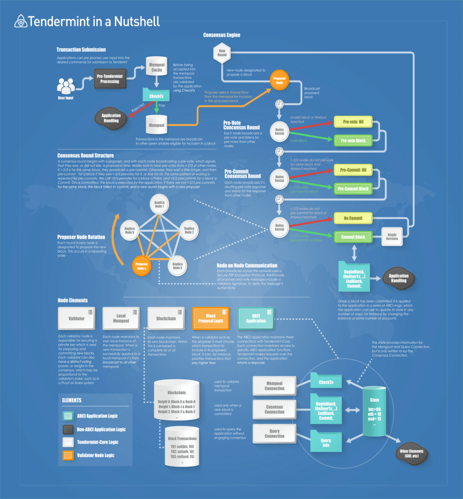


<div STYLE="page-break-after: always;"></div>

# 2 概要说明


BCBChain自带很多程序，基于BCBChain进行应用开发将会用到的主要程序如下：

* bcbnode_follower

  BCBChain 核心节点程序，被配置为运行于观察者模式，实际上由两个进程组成，一个是 “bcbchain”， “bcbchain” 作为 tendermint 架构的 ABCI 应用提供 BCBChain 的世界状态运行逻辑，另一个是 “tendermint”， “tendermint” 是节点对外提供区块链访问API的服务，同时 “tendermint” 通过 P2P 网络连接到 BCBChain 网络，从 BCBChain 网络同步最新区块，并向 BCBChain 网络广播本地签署的交易。

* bcbwallet_rpc 

  BCBChain核心钱包服务程序，是一个提供安全生成钱包私钥并输出安全加密的密文私钥，同时提供数字资产交易类简便访问API接口的服务。

* bcbwallet

  BCBChain提供的通过命令行与区块链和钱包服务交互的客户端程序。

上述组件之间的基本关系由下图进行描绘。

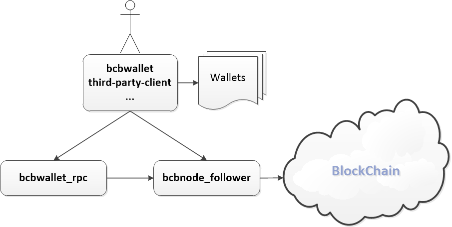


<div STYLE="page-break-after: always;"></div>
# 3 模型说明


## 3.1 模型概览

BCBChain参考了Ethereum、Fabric、Tendermint、Cosmos等开源区块链方案，借鉴了其中一些优秀思想。

BCBChain在本质上是一个基于交易的状态机(transaction-based state machine)。在计算机科学中，状态机是一个包含一组状态集（states）、一个起始状态（start state）、一组输入符号集（alphabet）、一个映射输入符号和当前状态到下一状态的转换函数（transition function）的计算模型。

在BCBChain其中状态集由状态数据库进行表达，起始状态被称为创世状态（genesis state），输入的符号集就是在区块链领域常说的交易（transaction，简称tx），状态转换函数就是智能合约。

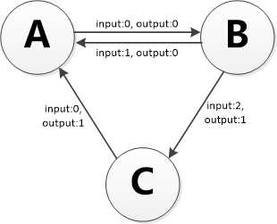

根据BCBChain的状态机，我们从创世状态(genesis state)开始。这差不多类似于一片空白的石板，在网络中还没有任何交易产生的状态。当交易被执行后，这个创世纪状态就会转变成最终状态。在任何时刻，这个最终状态都代表着BCBChain当前的状态。

BCBChain的状态由成千上万个交易达成。这些交易都被“组团”到一个个区块中。一个区块包含了一系列的交易，每个区块都与它的前一个区块链接起来，每一个区块都会导致状态机达到一个新的状态。

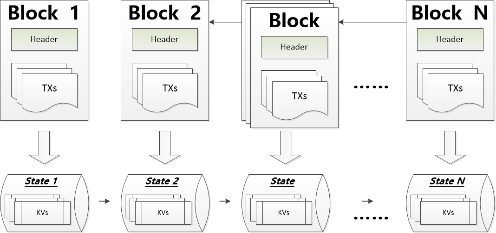

为了让一个状态转换成下一个状态，交易必须是有效的（也就是促使采用区块链技术的不可抵赖特性需求）。为了让一个交易被认为是有效的，它必须要经过一个验证过程，每一个交易都必须由交易发起人通过自己的私钥进行签名，并且在BCBChain的智能合约中校验满足一定的条件，才能被认为是有效的。


<div STYLE="page-break-after: always;"></div>
## 3.2 账户说明

BCBChain的全局“共享状态”是由很多小对象（账户）来组成的，这些账户可以通过消息传递架构来与对方进行交互。BCBChain的账户概念借鉴了Ethereum的账户概念，每个账户都有一个与之关联的状态(state)和一个编码的地址(address)。BCBChain拥有两种类型的账户：

* **外部账户**，被私钥控制且没有任何代码与之关联；

* **合约账户**，被它们的合约代码控制且有代码与之关联；合约账户只与合约的名称相关，与合约的版本及所有者等信息无关，合约升级以后，新版本合约将会启用新的合约地址，但是合约的账户地址保持不变。


<div STYLE="page-break-after: always;"></div>
## 3.3 BCBChain通证

BCBChain在创世时定义了基础通证，同时在内置的基础合约当中实现了基于基础通证的业务逻辑，我们把它命名为BCB。

BCB的计量单位参照比特币的概念，定义如下：

| **单位**  | **Cong值**           |
| --------- | -------------------- |
| **cong**  | 1 cong               |
| **Kcong** | 1,000   cong         |
| **Mcong** | 1,000,000   cong     |
| **BCB**   | 1,000,000,000   cong |


## 3.4 BCBChain链ID

BCBChain在创世时定义了链ID，取值为“bcb”，与BCBChain对应的测试链（用于试验BUG修正、新特性等）的链ID，取值为“bcbtest”。

BCBChain代码开源以后，如果部署私有链或测试链，链ID除“bcb”与“bcbtest”以外可以任意选取。

本文档后续只采用链ID“bcb”进行描述，当你需要和测试链或私有链进行交互时，需要将链ID替换为正确的取值。


<div STYLE="page-break-after: always;"></div>
# 4 相关算法说明

BCBChain使用了多种安全算法，我们将在本章进行详细说明。


## 4.1 签名算法Ed25519

BCBChain签名算法采用Ed25519。

Curve25519/Ed25519/X25519 是著名密码学家 Daniel J. Bernstein 在 2006 年独立设计的椭圆曲线加密 / 签名 /密钥交换算法，和现有的任何椭圆曲线算法都完全独立，其中Ed25519用于签名。

Daniel J. Bernstein 是世界著名的密码学家，目前另一个非常火的高性能安全流密码 ChaCha20 也是出自 Bernstein 之手。

25519 系列曲线自 2006 年发表以来，除了学术界无人问津， 2013 年爱德华·斯诺登曝光棱镜计划后，该算法突然大火，大量软件，如 OpenSSH 都迅速增加了对 25519 系列的支持，如今 25519 已经是大势所趋，可疑的 NIST 曲线迟早要退出椭圆曲线的历史舞台，目前， RFC 增加了 SSL/TLS 对 X25519 密钥交换协议的支持，而新版 OpenSSL 1.1 也加入支持，是摆脱老大哥的第一步，下一步是将 Ed25519 做为可选的 TLS 证书签名算法，彻底摆脱 NIST 。

根据其网站介绍，Ed25519算法具有以下优势：

* **完全开放的设计**，算法各参数的选择直截了当，非常明确，没有任何可疑之处，相比之下目前广泛使用的椭圆曲线是 NIST 系列标准，方程的系数是使用来历不明的随机种子 c49d3608 86e70493 6a6678e1 139d26b7 819f7e90 生成的，至于这个种子的来历没有资料介绍；
* **安全性高**，一个椭圆曲线加密算法就算在数学上是安全的，在实用上也并不一定安全，有很大的概率通过缓存、时间、恶意输入摧毁安全性，而 25519 系列椭圆曲线经过特别设计，尽可能的将出错的概率降到了最低，可以说是实践上最安全的加密算法。例如，任何一个 32 位随机数都是一个合法的 X25519 公钥，因此通过恶意数值攻击是不可能的，算法在设计的时候刻意避免的某些分支操作，这样在编程的时候可以不使用 if ，减少了不同 if 分支代码执行时间不同的时序攻击概率，相反， NIST 系列椭圆曲线算法在实际应用中出错的可能性非常大，而且对于某些理论攻击的免疫能力不高， Bernstein 对市面上所有的加密算法使用 12 个标准进行了考察， 25519 是几乎唯一满足这些标准的。
* **速度快**， 25519 系列曲线是目前最快的椭圆曲线加密算法，性能远远超过 NIST 系列，而且具有比 P-256 更高的安全性。

以下为其网站的描述原文：

* **Fast single-signature verification**.The softwaretakes only 273364 cycles to verify a signature on Intel's widely deployed Nehalem/Westmere lines of CPUs. (This performance measurement is for short messages; for very long messages, verification time is dominated by hashing time.) Nehalem and Westmere include all Core i7, i5, and i3 CPUs released between 2008 and 2010, and most Xeon CPUs released in the same period.
* **Even faster batch verification**.The software performs a batch of 64 separate signature verifications (verifying 64 signatures of 64 messages under 64 public keys) in only 8.55 million cycles, i.e., under 134000 cycles per signature. The software fits easily into L1 cache, so contention between cores is negligible: a quad-core 2.4GHz Westmere verifies 71000 signatures per second, while keeping the maximum verification latency below 4 milliseconds.
* **Very fast signing**.The software takes only 87548 cycles to sign a message. A quad-core 2.4GHz Westmere signs 109000 messages per second.
* **Fast key generation**.Key generation is almost as fast as signing. There is a slight penalty for key generation to obtain a secure random number from the operating system;/dev/urandomunder Linux costs about 6000 cycles.
* **High security level**.This system has a 2^128 security target; breaking it has similar difficulty to breaking NIST P-256, RSA with ~3000-bit keys, strong 128-bit block ciphers, etc. The best attacks known actually cost more than 2^140 bit operations on average, and degrade quadratically in success probability as the number of bit operations drops.
* **Foolproof session keys**.Signatures are generated deterministically; key generation consumes new randomness but new signatures do not. This is not only a speed feature but also a security feature, directly relevant to the recent collapse of the Sony PlayStation 3 security system.
* **Collision resilience**.Hash-function collisions do not break this system. This adds a layer of defense against the possibility of weakness in the selected hash function.
* **No secret array indices**.The software never reads or writes data from secret addresses in RAM; the pattern of addresses is completely predictable. The software is therefore immune to cache-timing attacks, hyperthreading attacks, and other side-channel attacks that rely on leakage of addresses through the CPU cache.
* **No secret branch conditions**.The software never performs conditional branches based on secret data; the pattern of jumps is completely predictable. The software is therefore immune to side-channel attacks that rely on leakage of information through the branch-prediction unit.
* **Small signatures**.Signatures fit into 64 bytes. These signatures are actually compressed versions of longer signatures; the times for compression and decompression are included in the cycle counts reported above.
* **Small keys**.Public keys consume only 32 bytes. The times for compression and decompression are again included.


<div STYLE="page-break-after: always;"></div>
## 4.2 散列算法SHA3-256

BCBChain的主要散列算法采用SHA3-256。

由于近年来对传统常用Hash 函数如MD4、MD5、SHA0、SHA1、RIPEMD 等的成功攻击，尤其2005年，中国密码学专家王小云教授，联手姚期智夫妇，提出了一种破解方法，将破解SHA-1的时间从269步降低到263步，让美国国家标准技术局(NIST)不得不着手选择新的安全哈希函数。NIST在2005年、2006年分别举行了2届密码Hash 研讨会；于2007年正式宣布在全球范围内征集新的下一代密码Hash算法，举行SHA-3竞赛。新的Hash算法将被称为SHA-3，并且作为新的安全Hash标准，增强现有的FIPS 180-2标准。算法提交已于2008年10月结束，NIST分别于2009年和2010年举行2轮会议，通过2轮的筛选选出进入最终轮（final round）的算法，最后在2012年公布获胜算法。公开竞赛的整个进程仿照高级加密标准AES 的征集过程。2012年10月2日，Keccak算法被选为NIST竞赛的胜利者，成为SHA-3。

Keccak具有同SHA-2相同的四个散列大小(224bit、256bit、384bit或512bit)。

Keccak采用区别于经典Merkle-Damgard结构的独特设计理念，具有兼容性好、实现代价低、拥有良好的加密性能以及抗解密能力等诸多优良的性质。Keccak一经提出便受到了密码学界的高度关注，被宣布为SHA-3标准后更成为当前Hash函数研究的热点。

Keccak采用了创新的的“海绵引擎”散列消息文本。它是快速的，在英特尔酷睿2处理器下的平均速度为12.5周期每字节。它设计简单，方便硬件实现。

Keccak已可以抵御最小的复杂度为2n的攻击，其中n为散列的大小。它具有广泛的安全边际。至目前为止，第三方密码分析已经显示出Keccak没有严重的弱点。


<div STYLE="page-break-after: always;"></div>
## 4.3 散列算法RIPEMD160

BCBChain账户地址生算法成借鉴比特币的模式，需要使用散列算法RIPEMD160输出20字节的地址。

RIPEMD（RACE Integrity Primitives Evaluation Message Digest），中文译为“RACE原始完整性校验消息摘要”，是比利时鲁汶大学COSIC研究小组开发的散列函数算法。RIPEMD使用MD4的设计原理，并针对MD4的算法缺陷进行改进，1996年首次发布RIPEMD-128版本，在性能上与较受欢迎的SHA-1相似。

160位版本RIPEMD-160是对RIPEMD-128的改进，并且是RIPEMD家族中最常见的版本。相比于美国国家安全局设计的SHA-1和SHA-2算法，RIPEMD-160的设计原理是开放的。

除了128位和160位版本，RIPEMD算法也存在256位和320位版本，构成RIPEMD家族的四个成员：RIPEMD-128、RIPEMD-160、RIPEMD-256、RIPEMD-320。其中128位版本的安全性已经被质疑，256和320位版本减少了意外碰撞的可能性，但是相比于RIPEMD-128和RIPEMD-160，它们不具有较高水平的安全性，因为他们只是在128位和160位的基础上，修改了初始参数和s-box来达到输出为256和320位的目的。


<div STYLE="page-break-after: always;"></div>
## 4.4 序列化算法RLP

RLP(recursive length prefix)：递归长度前缀。

RLP编码是BCBChain中交易数据的序列化格式。详细描述参见附录RLP。

RLP旨在成为高度简化的序列化格式，它唯一的目的是存储嵌套的字节数组。不同于 protobuf、BSON 等现有的解决方案，RLP 并不定义任何指定的数据类型，如Boolean、float、double 或者 integer。它仅仅是以嵌套数组的形式存储结构，并将其留给协议来确定数组的含义。RLP 也没有明确支持map集合，半官方的建议是采用 [[k1, v1], [k2, v2], ...] 形式的嵌套数组来表示键值对集合，k1, k2 ... 按照字符串的标准排序。


<div STYLE="page-break-after: always;"></div>
## 4.5 序列化算法JSON

JSON编码是BCBChain中状态数据库中Value的序列化格式，主要是为了方便客户端查询时的解码操作。


<div STYLE="page-break-after: always;"></div>
## 4.6 编码算法Base58

BCBChain采用Base58编码格式将某些二进制数据转换成可读并不容易产生混淆的字符串。

Base58是用于Bitcoin中使用的一种独特的编码方式，主要用于产生Bitcoin的钱包地址。

Base58可以理解为一种58进制。Base58包含了阿拉伯数字、小写英文字母，大写英文字母。但是去掉了一些容易混淆的数字和字母：0（数字0）、O（o的大写字母）、l（ L的小写字母）、I（i的大写字母）。


BCBChain采用的Base58字母表与比特币一致：

&nbsp;&nbsp;&nbsp;&nbsp;&nbsp;&nbsp;&nbsp;&nbsp;&nbsp;&nbsp;&nbsp;**123456789ABCDEFGHJKLMNPQRSTUVWXYZabcdefghijkmnopqrstuvwxyz**


<div STYLE="page-break-after: always;"></div>
## 4.7 方法ID

BCBChain中对智能合约的调用模式借鉴了以太坊的智能合约调用模式，在智能合约调用交易中智能合约中的方法以方法ID（MethodId）的方式体现，本小节详细定义方法ID的生成算法。

* **方法原型示例**

  ```
      func Transfer(
          to smc.Address,
          value big.Int
      ) smc.Error
  ```

* **SETUP-1**

  | 方法原型处理算法                                             |
  | ------------------------------------------------------------ |
  | 1、删除注释；<br>2、删除关键字func，保留方法名称；<br>3、删除参数名称，为每个参数保留参数类型；<br>4、删除返回值名称，为每个返回值保留参数类型；<br>5、删除换行符与空白符，保留原型中的括弧与逗号；<br>6、处理结果示例：<br>        `Transfer(smc.Address,big.Int)smc.Error` |

* **SETUP-2**

  | 方法ID计算算法                                               |
  | ------------------------------------------------------------ |
  | 1、计算：A1 = SHA3-256(方法原型处理算法输出的字符串)；<br>2、取值：MethodID = get_first_FOUR_bytes( A1 )；<br>3、示例：0xAF0228BC (网络字节序)。 |

<div STYLE="page-break-after: always;"></div>
## 4.8 账户地址

| 外部账户地址计算算法                                         |
| ------------------------------------------------------------ |
| 1、采用链ID（例如“bcb”）作为待计算数据的前缀；<br>2、之后拼接上32字节公钥作为原始数据；<br>3、计算散列值：A1 = RIPEMD160( SHA3-256(原始数据) )；<br>4、计算校验码：A2 = get_first_FOUR_bytes( RIPEMD160( A1 ) )；<br>5、计算账户地址：Address = 链ID \|\| Base58( A1 \|\| A2 )。 |

| 合约账户地址计算算法                                         |
| ------------------------------------------------------------ |
| 1、采用链ID（例如“bcb”）作为待计算数据的前缀；<br>2、之后拼接上合约的名称（唯一识别字符串）作为原始数据；<br>3、计算散列值：A1 = RIPEMD160( SHA3-256(原始数据) )；<br>4、计算校验码：A2 = get_first_FOUR_bytes( RIPEMD160( A1 ) )；<br>5、计算合约的账户地址：Address = 链ID \|\| Base58( A1 \|\| A2 )。 |

下图描述了私钥、公钥与账户地址的关系：

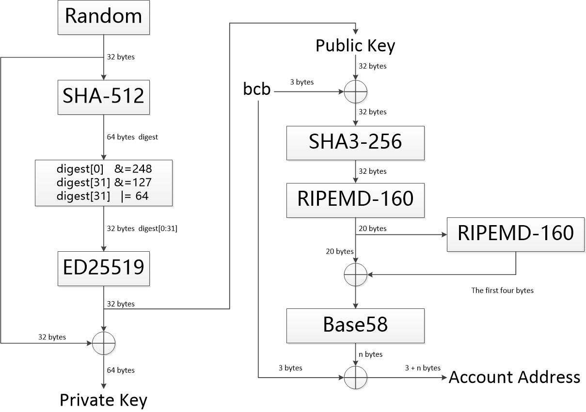


<div STYLE="page-break-after: always;"></div>
## 4.9 合约地址

| 合约地址计算算法                                             |
| ------------------------------------------------------------ |
| 1、采用链ID（例如“bcb”）作为待计算数据的前缀；<br>2、之后拼接上由合约的提供唯一识别字符串（合约名称 \|\| 合约版本）；<br>3、之后拼接上合约创建者的外部账户地址作为原始数据；<br>4、计算散列值：A1 = RIPEMD160( SHA3-256(原始数据) )；<br>5、计算校验码：A2 = get_first_FOUR_bytes( RIPEMD160( A1 ) )；<br>6、计算合约地址：Address = 链ID \|\| Base58( A1 \|\| A2 )。 |


<div STYLE="page-break-after: always;"></div>
# 5 交易格式

## 5.1 版本v1

下面描述BCBChain最基本的交易格式（交易格式版本为“v1”），本版交易格式从BCBChain 1.0开始支持。


### 5.1.1 框架格式

BCBChain的交易格式定义如下（两种格式）：


​	**bcb\<tx\>.v1.**Payload.\<SignNumber>.Signature.….Signature
​	**bcb\<qy\>.v1.**Payload.\<SignNumber>.Signature


交易格式被“.”分隔成多段，下面分别描述每一段的含义（注意大小写敏感）：

| 语法          |     类型      | 注释                                                         |
| :------------ | :-----------: | :----------------------------------------------------------- |
| **bcb\<tx>**  |    String     | 采用链ID作为交易前缀识别字符串,表明这是区块链上执行智能合约的一笔交易，这笔交易将对区块链世界状态进行修改。 |
| **bcb\<qy>**  |    String     | 采用链ID作为交易前缀识别字符串,表明这是针对区块链世界状态进行查询操作。 |
| **v1**        |    String     | 交易版本，当前版本定义为：“v1”。                             |
| Payload       | Base58 String | 交易的净荷，定义为一个Base58编码格式的字符串，具体定义参见本章后续小节。 |
| \<SignNumber> |    \<Int>     | 签名个数，注意是表达为字符串形式的10进制整数，必须为1，也就意味着BCBChain上的所有交易都必须签名，例如：“<1>”。根据签名个数，最后Signature要重复相同次数。 |
| Signature     | Base58 String | 描述一个签名人的签名,是一个Base58编码格式的字符串，具体定义参见本章后续小节。根据签名个数，最后要重复相同次数签名。 |


<div STYLE="page-break-after: always;"></div>
### 5.1.2 净荷格式

本小节详细定义交易净荷数据格式。表格中所有被定义的字段全部采用RLP编码。然后由这些字段的RLP编码按递归层次顺序输出拼接到一起，并在最前面补上RLP编码格式的净荷长度字段，作为交易净荷的裸数据，签名是基于净荷的裸数据进行的。

最后输出到交易框架格式包中的净荷需要在裸数据的基础上编码为Base58字符串。


#### 5.1.2.1 智能合约调用

智能合约调用只在类型“bcb\<tx\>”中出现，功能是调用智能合约提供的方法对区块链世界的状态进行修改，例如调用代币转账合约实现从A账户向B账户进行转账，这些方法的业务逻辑由智能合约代码独立提供。

智能合约调用请求的数据结构定义如下：

| **语法** | **类型** | **注释**                                                     |
| ------------------ | :------: | :----------------------------------------------------------- |
| nonce              |  Uint64  | Number  used once或Number once的缩写。交易发起者发起交易的计数<br/>值，从1开始，必须单调增长，增长步长为1。 |
| gasLimit |  Uint64  | 交易发起者愿意为执行此次交易支付的GAS数量的最大值。          |
| note        |  String  | UTF-8编码的备注信息，最大为256个字符。                       |
| to          | Address  | 合约地址（注意，不是合约的账户地址）。                       |
| data:  {       |    | 调用智能合约所需要的参数。                                   |
| &nbsp;&nbsp;methodId |  Uint32  | 调用的智能合约方法ID。【必须参数】。                         |
| &nbsp;&nbsp;items:   [ |          |                                                              |
| &nbsp;&nbsp;&nbsp;&nbsp;item-0 |  []Byte  | 智能合约方法的参数0。                                        |
| &nbsp;&nbsp;&nbsp;&nbsp;item-1  |  []Byte  | 智能合约方法的参数1。                                        |
| &nbsp;&nbsp;&nbsp;&nbsp;…              |    …     | …                                                            |
| &nbsp;&nbsp;&nbsp;&nbsp;item-n  |  []Byte  | 智能合约方法的参数n。                                        |
| &nbsp;&nbsp;]                |          |                                                              |
| }                  |          |                                                              |


<div STYLE="page-break-after: always;"></div>
#### 5.1.2.2 世界状态查询

世界状态查询只在类型“bcb\<qy>”中出现，功能是BCBChain的查询接口直接对区块链世界的状态进行查询，例如查询A账户所拥有的代币余额。

世界状态查询请求的数据结构定义如下：

| **语法** | **类型** | **注释**                                                     |
| -------- | :------: | ------------------------------------------------------------ |
| key      |  string  | 世界状态数据库中的KEY值。  &nbsp; &nbsp;&nbsp;&nbsp;&nbsp;&nbsp;&nbsp;&nbsp;&nbsp;&nbsp;&nbsp;&nbsp;&nbsp;&nbsp;&nbsp;&nbsp;&nbsp;&nbsp;&nbsp;&nbsp;&nbsp;&nbsp;&nbsp;&nbsp;&nbsp;&nbsp;&nbsp;&nbsp;&nbsp;&nbsp;&nbsp;&nbsp;&nbsp;&nbsp; |

​    

<div STYLE="page-break-after: always;"></div>
### 5.1.3 签名格式

本小节详细定义签名数据格式。表格中所有被定义的字段全部采用RLP编码。然后由这些字段的RLP编码按顺序输出拼接到一起，并在最前面补上RLP编码格式的签名长度字段，作为签名的裸数据。

最后输出到交易框架格式包中的签名需要在裸数据的基础上编码为Base58字符串。

交易框架层签名定义(Signature)数据定义如下：

| **语法**  | **类型** | **注释**                                                     |
| --------- | -------- | ------------------------------------------------------------ |
| type      | String   | 签名类型，目前仅支持ed25519。                                |
| pubkey    | [32]byte | 签名人的32字节公钥。                                         |
| signature | [64]byte | 64字节的签名结果。待签名数据为交易净荷（Payload）在进行Base58编码之前的裸数据。 |


## 5.2 版本v2

下面描述BCBChain的交易格式（交易格式版本为“v2”），本版交易格式从BCBChain 1.1开始支持。

此版本的交易格式支持在一笔交易中连续提交多次对不同智能合约方法的调用，每一次对智能合约方法的调用称为一个消息，一笔交易中的多次调用称为级联消息。

级联消息中一个消息输出的收据是作为后一个消息的输入，后一个消息调用的智能合约方法中需要使用上一个消息的输出收据。

级联消息的典型应用场景一描述如下（使用BCBChain通证）：

* 在第一个消息中向智能合约地址A转账x数量的BCB；
* 在第二个消息中调用智能合约地址A的合约方法，在该方法中使用x数量的BCB为用户购买游戏道具。

级联消息的典型应用场景二描述如下（使用BCBChain上发行的某种代币，比如“USDX”）：

* 在第一个消息中向智能合约地址B转账y数量的USDX；
* 在第二个消息中调用智能合约地址B的合约方法，在该方法中使用y数量的USDX为用户购买游戏道具。


### 5.2.1 框架格式

BCBChain的交易格式定义如下（两种格式）：


​	**bcb\<tx\>.v2.**Payload.\<SignNumber>.Signature.….Signature


交易格式被“.”分隔成多段，下面分别描述每一段的含义（注意大小写敏感）：

| 语法          |     类型      | 注释                                                         |
| :------------ | :-----------: | :----------------------------------------------------------- |
| **bcb\<tx>**  |    String     | 采用链ID作为交易前缀识别字符串,表明这是区块链上执行智能合约的一笔交易，这笔交易将对区块链世界状态进行修改。 |
| **v2**        |    String     | 交易版本，当前版本定义为：“v2”。                             |
| Payload       | Base58 String | 交易的净荷，定义为一个Base58编码格式的字符串，具体定义参见本章后续小节。 |
| \<SignNumber> |    \<Int>     | 签名个数，注意是表达为字符串形式的10进制整数，必须为1，也就意味着BCBChain上的所有交易都必须签名，例如：“<1>”。根据签名个数，最后Signature要重复相同次数。 |
| Signature     | Base58 String | 描述一个签名人的签名,是一个Base58编码格式的字符串，具体定义参见本章后续小节。根据签名个数，最后要重复相同次数签名。 |


<div STYLE="page-break-after: always;"></div>

### 5.2.2 净荷格式

本小节详细定义交易净荷数据格式。表格中所有被定义的字段全部采用RLP编码。然后由这些字段的RLP编码按递归层次顺序输出拼接到一起，并在最前面补上RLP编码格式的净荷长度字段，作为交易净荷的裸数据，签名是基于净荷的裸数据进行的。

最后输出到交易框架格式包中的净荷需要在裸数据的基础上编码为Base58字符串。


#### 5.2.2.1 智能合约调用

智能合约调用只在类型“bcb\<tx\>”中出现，功能是调用智能合约提供的方法对区块链世界的状态进行修改，例如调用代币转账合约实现从A账户向B账户进行转账，这些方法的业务逻辑由智能合约代码独立提供。

智能合约调用请求的数据结构定义如下：

| **语法**                       | **类型** | **注释**                                                     |
| ------------------------------ | :------: | :----------------------------------------------------------- |
| nonce                          |  Uint64  | Number  used once或Number once的缩写。交易发起者发起交易的计数<br/>值，从1开始，必须单调增长，增长步长为1。 |
| gasLimit                       |  Uint64  | 交易发起者愿意为执行此次交易支付的GAS数量的最大值。          |
| note                           |  String  | UTF-8编码的备注信息，最大为256个字符。                       |
| msgs: [                        |  Array   | 级联消息列表。                                               |
| &nbsp;{                        |          | 一个消息。                                                   |
| &nbsp;&nbsp;to                 | Address  | 合约地址（注意，不是合约的账户地址）。                       |
| &nbsp;&nbsp;methodId           |  Uint32  | 调用的智能合约方法ID。【必须参数】。                         |
| &nbsp;&nbsp;items:   [         |          |                                                              |
| &nbsp;&nbsp;&nbsp;&nbsp;item-0 | RlpBytes | 智能合约方法的参数0按RLP编码后的字节序列。                   |
| &nbsp;&nbsp;&nbsp;&nbsp;item-1 | RlpBytes | 智能合约方法的参数1按RLP编码后的字节序列。                   |
| &nbsp;&nbsp;&nbsp;&nbsp;…      |    …     | …                                                            |
| &nbsp;&nbsp;&nbsp;&nbsp;item-n | RlpBytes | 智能合约方法的参数n按RLP编码后的字节序列。                   |
| &nbsp;&nbsp;]                  |          |                                                              |
| &nbsp;}                        |          |                                                              |
| ]                              |          |                                                              |

   

<div STYLE="page-break-after: always;"></div>

### 5.2.3 签名格式

本小节详细定义签名数据格式。表格中所有被定义的字段全部采用RLP编码。然后由这些字段的RLP编码按顺序输出拼接到一起，并在最前面补上RLP编码格式的签名长度字段，作为签名的裸数据。

最后输出到交易框架格式包中的签名需要在裸数据的基础上编码为Base58字符串。

交易框架层签名定义(Signature)数据定义如下：

| **语法**  | **类型** | **注释**                                                     |
| --------- | -------- | ------------------------------------------------------------ |
| type      | String   | 签名类型，目前仅支持ed25519。                                |
| pubkey    | [32]byte | 签名人的32字节公钥。                                         |
| signature | [64]byte | 64字节的签名结果。待签名数据为交易净荷（Payload）在进行Base58编码之前的裸数据。 |

注：交易格式-v2的签名格式与v1相同。


<div STYLE="page-break-after: always;"></div>
# 6 通讯协议


## 6.1 协议概览

BCBChain支持如下所示的RPC通讯协议：

* URI over HTTP or HTTPS
* JSONRPC over HTTP or HTTPS

BCBChain所支持的所有RPC接口及其参数可通过URL：http://ip:port 或https://ip:port获取，也可以通过知名节点的域名进行访问，例如：https://earth.bcbchain.io。

bcbnode_follower（tendermint）提供的RPC接口列表如下所示（支持HTTP或HTTPS，默认端口为46657）： 

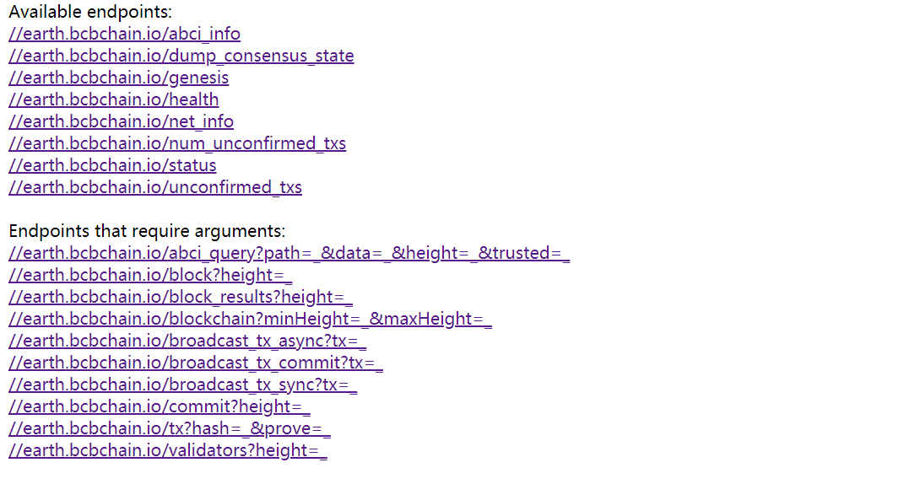


<div STYLE="page-break-after: always;"></div>
bcbwallet_rpc提供的RPC接口列表如下所示（只支持HTTPS，默认端口为37653）：

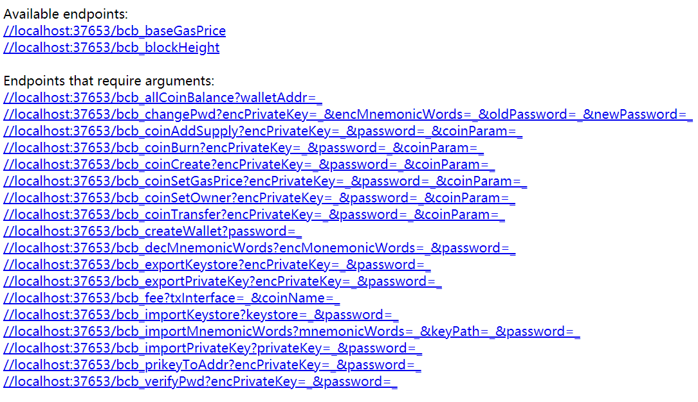


<div STYLE="page-break-after: always;"></div>
## 6.2 URI over HTTP

采用HTTP协议GET方法进行RPC请求时，参数必须采用URI编码，所有RPC调用的URL格式参见上表，具体业务及参数描述参见本章后续小节。


## 6.3 JSONRPC over HTTP

采用HTTP协议POST方法进行RPC请求时，使用JSONRPC应用协议，请求的HTTP数据体的格式如下所示：

```
Example：
{
  "jsonrpc": "2.0",
  "id": "dontcare/anything",
  "method": " broadcast_tx_commit",
  "params": {
    "tx": "bcb<tx>.v1.xxxxxx.<1>.xxxxxx"
  }
}
```

具体通讯接口业务及参数描述参见后续章节。


接口执行成功返回的通用数据结构定义如下：

```
{
  "jsonrpc": "2.0",
  "id": "",
  "result": {
    …		//不同API返回的JSON结构都是定制化的
  }
}
```


执行失败返回的通用数据结构定义如下（所有接口的失败返回的数据结构相同）：

```
{
  "jsonrpc": "2.0",
  "id": "",
  "error": {
    "code": -32603,
    "message": "Internal error",
    "data": "Error on broadcastTxCommit: Tx already exists in cache"
  }
}
```


<div STYLE="page-break-after: always;"></div>
# 7. bcbnode_follower接口

本章详细描述BCBChain节点所提供的RPC接口，这些RPC接口的可以是BCBChain的验证者节点，也可以是观察者节点，也可以是BCBChain提供的全节点钱包中内置的观察者节点。


## 7.1 网络接口说明


### 7.1.1 abci_info

向BCBChain的节点查询“bcbchain”世界状态信息。


* **Request URI over HTTP/HTTPS**

  ```
  http://localhost:46657/abci_info
  or
  https://localhost:46657/abci_info
  ```

* **Request JSONRPC over HTTP/HTTPS**

  ```
  {
    "jsonrpc": "2.0",
    "id": "dontcare/anything",
    "method": "abci_info"
  }
  ```

* **Request Parameters**

  | **语法** | **类型** | **注释**&nbsp;&nbsp;&nbsp;&nbsp;&nbsp;&nbsp;&nbsp;&nbsp;&nbsp;&nbsp;&nbsp;&nbsp;&nbsp;&nbsp;&nbsp;&nbsp;&nbsp;&nbsp;&nbsp;&nbsp;&nbsp;&nbsp;&nbsp;&nbsp;&nbsp;&nbsp;&nbsp;&nbsp;&nbsp;&nbsp;&nbsp;&nbsp;&nbsp;&nbsp;&nbsp;&nbsp;&nbsp;&nbsp;&nbsp;&nbsp;&nbsp;&nbsp;&nbsp;&nbsp;&nbsp;&nbsp;&nbsp;&nbsp;&nbsp;&nbsp;&nbsp;&nbsp;&nbsp;&nbsp;&nbsp;&nbsp;&nbsp;&nbsp;&nbsp;&nbsp;&nbsp;&nbsp;&nbsp;&nbsp;&nbsp;&nbsp;&nbsp;&nbsp;&nbsp;&nbsp;&nbsp;&nbsp;&nbsp;&nbsp; |
  | -------- | -------- | -------- |
  | ——       | ——       | 无参数。 |


- **Response SUCCESS Example【参见：[abci_info.json](./json/abci_info.json)】**

  ```
  {
    "jsonrpc": "2.0",
    "id": "",
    "result": {
      "response": {
        "version": "1.0.2.3233",
        "last_block_height": 23032,
        "last_app_state": "eyJibG9ja19oZWlnaHQiOjIzMDMyLCJhcHBfaGFzaCI6IkFFQ0U2REQzRDlBQUQzQkIxNzQ5RTg2MkE4MjdCMzY2ODk4MEY1QTRCMDIyMjNFQjk3Rjg3NUE0QzA1QzMxQ0MiLCJ0eHNfaGFzaF9saXN0IjpbIkEwQzU1OTRBNkYzQjI0MDY0RTJGQkFGNjYyRjlCNEEyIl0sInJld2FyZHMiOlt7ImtleSI6IlltTmlNMHBwZG5SVlYybEVSelE0WkdKWFJIWkdRbFZJUkV3NGRtVkNOMHAyVVhaVCIsInZhbHVlIjoiQUFBQUFBQ1lsb0E9In0seyJrZXkiOiJZbU5pUzNVMllsaHJUamRpWmpGM1VUaHFlSGR4WlhWcFRXOVZXVloxVTFaRmFHUlgiLCJ2YWx1ZSI6IkFBQUFBQURrNGNBPSJ9LHsia2V5IjoiWW1OaVVUSk1TMUJuVlVweE9HVTVORlJCYmpOeU9FSTRaRFphZWpGRVRtcElhSGw0IiwidmFsdWUiOiJBQUFBQUFDWWxvQT0ifSx7ImtleSI6IlltTmlOMHQ0ZUZwTmQxTjBXVWRIYmt0cE0zaE9UbTA1Ylc1dE4zQmtWM1JHT1dkRSIsInZhbHVlIjoiQUFBQUFBRGs0Y0E9In1dLCJmZWUiOjUwMDAwMDAwfQ=="
      }
    }
  }
  ```

- **Response SUCCESS Parameters**

  | **语法**                |   **类型**    | **注释**&nbsp;&nbsp;&nbsp;&nbsp;&nbsp;&nbsp;&nbsp;&nbsp;&nbsp;&nbsp;&nbsp;&nbsp;&nbsp;&nbsp;&nbsp;&nbsp;&nbsp;&nbsp;&nbsp;&nbsp;&nbsp;&nbsp;&nbsp;&nbsp;&nbsp;&nbsp;&nbsp;&nbsp;&nbsp;&nbsp;&nbsp;&nbsp;&nbsp;&nbsp;&nbsp;&nbsp;&nbsp;&nbsp;&nbsp;&nbsp;&nbsp;&nbsp;&nbsp;&nbsp;&nbsp;&nbsp;&nbsp;&nbsp;&nbsp;&nbsp;&nbsp;&nbsp;&nbsp;&nbsp;&nbsp;&nbsp;&nbsp;&nbsp;&nbsp;&nbsp;&nbsp;&nbsp;&nbsp;&nbsp;&nbsp;&nbsp;&nbsp;&nbsp;&nbsp;&nbsp;&nbsp;&nbsp;&nbsp;&nbsp; |
  | ----------------------- | :-----------: | ------------------------------------------------------------ |
  | response:   {           |    Object     | “bcbchain”返回的查询结果。                                   |
  | &nbsp;&nbsp;version           |    String     | "bcbchain"程序的发行版本。                                   |
  | &nbsp;&nbsp;last_block_height |    Uint64     | “bcbchain”世界状态最后一个确认区块的高度。                   |
  | &nbsp;&nbsp;last_app_state    | Base64 String | “bcbchain”世界状态在最后一个确认区块时的世界状态详细数据（其中包含一个防止篡改的ABCI应用层哈希值），采用Base64进行编码。 |
  | }                       |               |                                                              |


- **世界状态数据格式定义为JSON格式的字符串，具体定义如下表所示：**

  | **语法**                                  |       **类型**       | **注释**&nbsp;&nbsp;&nbsp;&nbsp;&nbsp;&nbsp;&nbsp;&nbsp;&nbsp;&nbsp;&nbsp;&nbsp;&nbsp;&nbsp;&nbsp;&nbsp;&nbsp;&nbsp;&nbsp;&nbsp;&nbsp;&nbsp;&nbsp;&nbsp;&nbsp;&nbsp;&nbsp;&nbsp;&nbsp;&nbsp;&nbsp;&nbsp;&nbsp;&nbsp;&nbsp;&nbsp;&nbsp;&nbsp;&nbsp;&nbsp;&nbsp;&nbsp;&nbsp;&nbsp;&nbsp;&nbsp;&nbsp;&nbsp;&nbsp;&nbsp;&nbsp;&nbsp;&nbsp;&nbsp;&nbsp;&nbsp;&nbsp;&nbsp;&nbsp;&nbsp;&nbsp;&nbsp;&nbsp;&nbsp;&nbsp;&nbsp;&nbsp;&nbsp;&nbsp;&nbsp;&nbsp;&nbsp;&nbsp;&nbsp;&nbsp;&nbsp;&nbsp;&nbsp;&nbsp;&nbsp;&nbsp;&nbsp; |
  | ----------------------------------------- | :------------------: | ------------------------------------------------------------ |
  | {                                         |        Object        |                                                              |
  | &nbsp;&nbsp;block_height                  |        Uint64        | “bcbchain”世界状态最后一个确认区块的高度。                   |
  | &nbsp;&nbsp;app_hash                      |      HexString       | “bcbchain”世界状态最后一个确认区块的ABCI应用层根哈希。       |
  | &nbsp;&nbsp;txs_hash_list                 | Arrayof<br>HexString | 最后一个确认区块的交易的哈希列表（此处哈希算法采用MD5）。     |
  | &nbsp;&nbsp;rewards: [                    |  Arrayof<br>Object   | 最后一个确认区块奖励分配。                                   |
  | &nbsp;&nbsp;&nbsp;&nbsp;{                 |        Object        |                                                              |
  | &nbsp;&nbsp;&nbsp;&nbsp;&nbsp;&nbsp;key   |    Base64 String     | Base64编码的奖励地址。                                       |
  | &nbsp;&nbsp;&nbsp;&nbsp;&nbsp;&nbsp;value |    Base64 String     | Base64编码的奖励金额（单位为Cong）                           |
  | &nbsp;&nbsp;&nbsp;&nbsp;}                 |                      |                                                              |
  | &nbsp;&nbsp;]                             |                      |                                                              |
  | &nbsp;&nbsp;fee                           |        Uint64        | 最后一个确认区块的交易费用（单位为Cong）。                   |
  | }                                         |                      |                                                              |
  | beginBlock: {            | Object                     | 区块开始数据。                                               |
  | &nbsp;&nbsp;hash | Base64 String | Base64编码的当前区块的哈希。 |
  | &nbsp;&nbsp;header: {                 | Object                     | 区块头信息。                                                 |
  | &nbsp;&nbsp;&nbsp;&nbsp;chain_id                  | String                     | 链ID。                                                       |
  | &nbsp;&nbsp;&nbsp;&nbsp;height                    | Uint64                     | 当前区块的区块高度。                                         |
  | &nbsp;&nbsp;&nbsp;&nbsp;time                      |        Int64         | 当前区块的出块时间戳（相对于1970-1-1 0:0:0过去的秒数）。 |
  | &nbsp;&nbsp;&nbsp;&nbsp;last_block_id: {          | Object                     | 上一个区块的区块ID。                                         |
  | &nbsp;&nbsp;&nbsp;&nbsp;&nbsp;&nbsp;hash                      | Base64 String           | Base64编码的上一个区块的区块哈希。                              |
  | &nbsp;&nbsp;&nbsp;&nbsp;&nbsp;&nbsp;parts                     | Object                     | BCBChain内部使用，在此不进行描述。                           |
  | &nbsp;&nbsp;&nbsp;&nbsp;}                         |                            |                                                              |
  | &nbsp;&nbsp;&nbsp;&nbsp;last_commit_hash          | Base64 String | Base64编码的上一个区块确认数据的哈希。                          |
  | &nbsp;&nbsp;&nbsp;&nbsp;last_app_hash             | Base64 String     | Base64编码的上一个区块的“bcbchain”世界状态应用层哈希。          |
  | &nbsp;&nbsp;&nbsp;&nbsp;last_fee                  | Int64                      | 上一个区块的交易所发生的所有手续费（单位为Cong）。           |
  | &nbsp;&nbsp;&nbsp;&nbsp;last_allocation: [        | Arrayof Object             | 上一个区块所收的手续费的分配结果表。                         |
  | &nbsp;&nbsp;&nbsp;&nbsp;&nbsp;&nbsp;{                         | Object | 手续费的分配信息。 |
  | &nbsp;&nbsp;&nbsp;&nbsp;&nbsp;&nbsp;&nbsp;&nbsp;addr                      | Address                 | 接收手续费的地址。                                           |
  | &nbsp;&nbsp;&nbsp;&nbsp;&nbsp;&nbsp;&nbsp;&nbsp;fee                       | Int64                      | 接收到的手续费（单位为Cong）。                               |
  | &nbsp;&nbsp;&nbsp;&nbsp;&nbsp;&nbsp;}                         |                            |                                                              |
  | &nbsp;&nbsp;&nbsp;&nbsp;]                         |                            |                                                              |
  | &nbsp;&nbsp;&nbsp;&nbsp;proposer_address          | Address          | 区块提案者地址。                                             |
  | &nbsp;&nbsp;&nbsp;&nbsp;reward_address            | Address          | 区块提案者的奖励地址                                         |
  | &nbsp;&nbsp;&nbsp;&nbsp;random_of_block | Base64 String | Base64编码的区块随机数。 |
  | &nbsp;&nbsp;}                         |                            |                                                              |

     

<div STYLE="page-break-after: always;"></div>
### 7.1.2 dump_consensus_state

向BCBChain的节点查询BCBChain当前共识状态。


- **Request URI over HTTP/HTTPS**

  ```
  http://localhost:46657/dump_consensus_state
  or
  https://localhost:46657/dump_consensus_state
  ```

- **Request JSONRPC over HTTP/HTTPS**

  ```
  {
    "jsonrpc": "2.0",
    "id": "dontcare/anything",
    "method": "dump_consensus_state"
  }
  ```

- **Request Parameters**

  | **语法** | **类型** | **注释**&nbsp;&nbsp;&nbsp;&nbsp;&nbsp;&nbsp;&nbsp;&nbsp;&nbsp;&nbsp;&nbsp;&nbsp;&nbsp;&nbsp;&nbsp;&nbsp;&nbsp;&nbsp;&nbsp;&nbsp;&nbsp;&nbsp;&nbsp;&nbsp;&nbsp;&nbsp;&nbsp;&nbsp;&nbsp;&nbsp;&nbsp;&nbsp;&nbsp;&nbsp;&nbsp;&nbsp;&nbsp;&nbsp;&nbsp;&nbsp;&nbsp;&nbsp;&nbsp;&nbsp;&nbsp;&nbsp;&nbsp;&nbsp;&nbsp;&nbsp;&nbsp;&nbsp;&nbsp;&nbsp;&nbsp;&nbsp;&nbsp;&nbsp;&nbsp;&nbsp;&nbsp;&nbsp;&nbsp;&nbsp;&nbsp;&nbsp;&nbsp;&nbsp;&nbsp;&nbsp;&nbsp;&nbsp;&nbsp;&nbsp; |
  | -------- | -------- | ------------------------------------------------------------ |
  | ——       | ——       | 无参数。                                                     |


- **Response SUCCESS Example【参见：[dump_consensus_state.json](./json/dump_consensus_state.json)】**

  ```
  {
    "jsonrpc": "2.0",
    "id": "",
    "result": {
      "round_state": {
        "height": 299272,
        "round": 0,
        "step": 2,
        "start_time": "2018-10-17T23:13:48.311608186-04:00",
        "commit_time": "2018-10-17T23:13:47.311608186-04:00",
        "validators": {
          "validators": [
            {
              "address": "bcbASX7yURtV7yTRHjF6HMtef5SdverDw1ee",
              "pub_key": {
                "type": "AC26791624DE60",
                "value": "mGQPP0w2BBoZSwwJLvA/EVmu3nJvcWdv+7vi8rfxV0Y="
              },
              "voting_power": 10,
              "reward_addr": "bcb85DQBafrtMwkiXq2kgwxwAWnsf3hmRinX",
              "name": "moon",
              "accum": 40
            },
            {
              "address": "bcbCUh7Zsb7PBgLwHJVok2QaMhbW64HNK4FU",
              "pub_key": {
                "type": "AC26791624DE60",
                "value": "ZBOerhcnAVySTmbsXv3B0qVmJVy75aLyq5eGvU86y0s="
              },
              "voting_power": 10,
              "reward_addr": "bcbDYZbi3b8kfAYJepGVu8GuBTbiDPGe5T9G",
              "name": "vaga",
              "accum": -30
            },
            {
              "address": "bcbG6WixauSd9RZ6iLCygSYZdZ7bttmhQ2zh",
              "pub_key": {
                "type": "AC26791624DE60",
                "value": "AOHXEMLtWLyq7jPNkiZ2hdG9KZwxHUwBF9Tyll8RFoE="
              },
              "voting_power": 10,
              "reward_addr": "bcb5rzgE1tSJbJuegEj4vbAkotmwRkxwiSyV",
              "name": "venus",
              "accum": -40
            },
            {
              "address": "bcbGMKrue1tabboHwokE2WDshAhVD98XbJjH",
              "pub_key": {
                "type": "AC26791624DE60",
                "value": "0AvM3BXo6sZmxc3Br566T2G/KBKJiTl2kcZqAcICM80="
              },
              "voting_power": 10,
              "reward_addr": "bcb5xjCpYJrKkyM3kgo5Jk8Pge7XDTwuvSUm",
              "name": "earth",
              "accum": 50
            },
            {
              "address": "bcbHS2RUcXpKVLSK4djJzzXmX25mdskgxpes",
              "pub_key": {
                "type": "AC26791624DE60",
                "value": "2KKGQ0wIa9j+zr/yg73RYmwMM73cwkvG067eE+Ndeo0="
              },
              "voting_power": 10,
              "reward_addr": "bcb8CGg4LxELkwxuK1z9GfjLJGy3NqueqGLa",
              "name": "saturn",
              "accum": -10
            },
            {
              "address": "bcbJofNo2NYSv1wZA2dwQa59MCGxaBSEkRgh",
              "pub_key": {
                "type": "AC26791624DE60",
                "value": "XJiVuLIlA/K29i6htCIAI/YsrcOepVADr4KqZG8wUK4="
              },
              "voting_power": 10,
              "reward_addr": "bcbKG7Y7hWLhjxiBNZ8UBgja4ocLcSHKW4b4",
              "name": "mercury",
              "accum": 50
            },
            {
              "address": "bcbK1gpGpeWcydGM3Lpure4JiYjnwa7xj5Bm",
              "pub_key": {
                "type": "AC26791624DE60",
                "value": "1vcMBnBBbcGj3DXrdqX6Wi9nIW68kQjWlwUzA2hCg+I="
              },
              "voting_power": 10,
              "reward_addr": "bcbJJvGCZaZ1YgSCMAKipL1s4jRhnkujGb4w",
              "name": "sirius",
              "accum": 40
            },
            {
              "address": "bcbKVNSGbPEC6PULyJDAc2s4aUQ6oDPAArNX",
              "pub_key": {
                "type": "AC26791624DE60",
                "value": "FxWAGICI+N6jLFXWB838YAYFkA9ef/YLVwaRU/X+fmI="
              },
              "voting_power": 10,
              "reward_addr": "bcbAcaXUTwhVH8kFEVg3RU7ySSEd7Uspd11d",
              "name": "altair",
              "accum": -40
            },
            {
              "address": "bcbNUjCm1i8RcoW2kVTbDw4vKW6jzfMxewJH",
              "pub_key": {
                "type": "AC26791624DE60",
                "value": "hzOstmpgwv4UcA/nc/OFsc7mdv8B5T6XpBiZLlq6OgE="
              },
              "voting_power": 10,
              "reward_addr": "bcb3JivtUWiDG48dbWDvFBUHDL8veB7JvQvS",
              "name": "jupiter",
              "accum": 30
            },
            {
              "address": "bcbNt6gNp1C6mSZzkCspqnu99wD7TAbtS7Ug",
              "pub_key": {
                "type": "AC26791624DE60",
                "value": "dX5u+aaEBARI6/Jh8MCe0FPNChPjqtT7JViwIbBoVOI="
              },
              "voting_power": 10,
              "reward_addr": "bcbAb65XuCz8bWHB1ittqMQSRyLvDmb74KRB",
              "name": "mars",
              "accum": 30
            }
          ],
          "proposer": {
            "address": "bcbKVNSGbPEC6PULyJDAc2s4aUQ6oDPAArNX",
            "pub_key": {
              "type": "AC26791624DE60",
              "value": "FxWAGICI+N6jLFXWB838YAYFkA9ef/YLVwaRU/X+fmI="
            },
            "voting_power": 10,
            "reward_addr": "bcbAcaXUTwhVH8kFEVg3RU7ySSEd7Uspd11d",
            "name": "altair",
            "accum": -40
          }
        },
        "proposal": null,
        "proposal_block": null,
        "proposal_block_parts": null,
        "locked_round": 0,
        "locked_block": null,
        "locked_block_parts": null,
        "valid_round": 0,
        "valid_block": null,
        "valid_block_parts": null,
        "votes": [
          {
            "round": 0,
            "prevotes": "__________",
            "precommits": "__________"
          },
          {
            "round": 1,
            "prevotes": "__________",
            "precommits": "__________"
          }
        ],
        "commit_round": -1,
        "last_commit": {
          "votes": [
            "Vote{0:5452486A4636 299271/00/2(Precommit) 96DD31906843 /717813DF4930.../ @ 2018-10-18T03:13:47.031Z}",
            "Vote{1:4C77484A566F 299271/00/2(Precommit) 96DD31906843 /85DB0DCCB274.../ @ 2018-10-18T03:13:47.031Z}",
            "Vote{2:5A36694C4379 299271/00/2(Precommit) 96DD31906843 /36145780B8F5.../ @ 2018-10-18T03:13:47.030Z}",
            "Vote{3:6F48776F6B45 299271/00/2(Precommit) 96DD31906843 /83895753FD27.../ @ 2018-10-18T03:13:47.109Z}",
            "Vote{4:534B34646A4A 299271/00/2(Precommit) 96DD31906843 /6AB72A137429.../ @ 2018-10-18T03:13:47.038Z}",
            "Vote{5:775A41326477 299271/00/2(Precommit) 96DD31906843 /BD8458648B9A.../ @ 2018-10-18T03:13:47.022Z}",
            "Vote{6:474D334C7075 299271/00/2(Precommit) 96DD31906843 /05DA25B4E553.../ @ 2018-10-18T03:13:47.035Z}",
            "Vote{7:554C794A4441 299271/00/2(Precommit) 96DD31906843 /E89DA00E076E.../ @ 2018-10-18T03:13:47.122Z}",
            "Vote{8:57326B565462 299271/00/2(Precommit) 96DD31906843 /9AB4FF53A863.../ @ 2018-10-18T03:13:47.067Z}",
            "Vote{9:5A7A6B437370 299271/00/2(Precommit) 96DD31906843 /524825FED0C4.../ @ 2018-10-18T03:13:47.137Z}"
          ],
          "votes_bit_array": "xxxxxxxxxx",
          "peer_maj_23s": {}
        },
        "last_validators": {
          "validators": [
            {
              "address": "bcbASX7yURtV7yTRHjF6HMtef5SdverDw1ee",
              "pub_key": {
                "type": "AC26791624DE60",
                "value": "mGQPP0w2BBoZSwwJLvA/EVmu3nJvcWdv+7vi8rfxV0Y="
              },
              "voting_power": 10,
              "reward_addr": "bcb85DQBafrtMwkiXq2kgwxwAWnsf3hmRinX",
              "name": "moon",
              "accum": 30
            },
            {
              "address": "bcbCUh7Zsb7PBgLwHJVok2QaMhbW64HNK4FU",
              "pub_key": {
                "type": "AC26791624DE60",
                "value": "ZBOerhcnAVySTmbsXv3B0qVmJVy75aLyq5eGvU86y0s="
              },
              "voting_power": 10,
              "reward_addr": "bcbDYZbi3b8kfAYJepGVu8GuBTbiDPGe5T9G",
              "name": "vaga",
              "accum": -40
            },
            {
              "address": "bcbG6WixauSd9RZ6iLCygSYZdZ7bttmhQ2zh",
              "pub_key": {
                "type": "AC26791624DE60",
                "value": "AOHXEMLtWLyq7jPNkiZ2hdG9KZwxHUwBF9Tyll8RFoE="
              },
              "voting_power": 10,
              "reward_addr": "bcb5rzgE1tSJbJuegEj4vbAkotmwRkxwiSyV",
              "name": "venus",
              "accum": -50
            },
            {
              "address": "bcbGMKrue1tabboHwokE2WDshAhVD98XbJjH",
              "pub_key": {
                "type": "AC26791624DE60",
                "value": "0AvM3BXo6sZmxc3Br566T2G/KBKJiTl2kcZqAcICM80="
              },
              "voting_power": 10,
              "reward_addr": "bcb5xjCpYJrKkyM3kgo5Jk8Pge7XDTwuvSUm",
              "name": "earth",
              "accum": 40
            },
            {
              "address": "bcbHS2RUcXpKVLSK4djJzzXmX25mdskgxpes",
              "pub_key": {
                "type": "AC26791624DE60",
                "value": "2KKGQ0wIa9j+zr/yg73RYmwMM73cwkvG067eE+Ndeo0="
              },
              "voting_power": 10,
              "reward_addr": "bcb8CGg4LxELkwxuK1z9GfjLJGy3NqueqGLa",
              "name": "saturn",
              "accum": -20
            },
            {
              "address": "bcbJofNo2NYSv1wZA2dwQa59MCGxaBSEkRgh",
              "pub_key": {
                "type": "AC26791624DE60",
                "value": "XJiVuLIlA/K29i6htCIAI/YsrcOepVADr4KqZG8wUK4="
              },
              "voting_power": 10,
              "reward_addr": "bcbKG7Y7hWLhjxiBNZ8UBgja4ocLcSHKW4b4",
              "name": "mercury",
              "accum": 40
            },
            {
              "address": "bcbK1gpGpeWcydGM3Lpure4JiYjnwa7xj5Bm",
              "pub_key": {
                "type": "AC26791624DE60",
                "value": "1vcMBnBBbcGj3DXrdqX6Wi9nIW68kQjWlwUzA2hCg+I="
              },
              "voting_power": 10,
              "reward_addr": "bcbJJvGCZaZ1YgSCMAKipL1s4jRhnkujGb4w",
              "name": "sirius",
              "accum": 30
            },
            {
              "address": "bcbKVNSGbPEC6PULyJDAc2s4aUQ6oDPAArNX",
              "pub_key": {
                "type": "AC26791624DE60",
                "value": "FxWAGICI+N6jLFXWB838YAYFkA9ef/YLVwaRU/X+fmI="
              },
              "voting_power": 10,
              "reward_addr": "bcbAcaXUTwhVH8kFEVg3RU7ySSEd7Uspd11d",
              "name": "altair",
              "accum": 50
            },
            {
              "address": "bcbNUjCm1i8RcoW2kVTbDw4vKW6jzfMxewJH",
              "pub_key": {
                "type": "AC26791624DE60",
                "value": "hzOstmpgwv4UcA/nc/OFsc7mdv8B5T6XpBiZLlq6OgE="
              },
              "voting_power": 10,
              "reward_addr": "bcb3JivtUWiDG48dbWDvFBUHDL8veB7JvQvS",
              "name": "jupiter",
              "accum": 20
            },
            {
              "address": "bcbNt6gNp1C6mSZzkCspqnu99wD7TAbtS7Ug",
              "pub_key": {
                "type": "AC26791624DE60",
                "value": "dX5u+aaEBARI6/Jh8MCe0FPNChPjqtT7JViwIbBoVOI="
              },
              "voting_power": 10,
              "reward_addr": "bcbAb65XuCz8bWHB1ittqMQSRyLvDmb74KRB",
              "name": "mars",
              "accum": 20
            }
          ],
          "proposer": {
            "address": "bcbG6WixauSd9RZ6iLCygSYZdZ7bttmhQ2zh",
            "pub_key": {
              "type": "AC26791624DE60",
              "value": "AOHXEMLtWLyq7jPNkiZ2hdG9KZwxHUwBF9Tyll8RFoE="
            },
            "voting_power": 10,
            "reward_addr": "bcb5rzgE1tSJbJuegEj4vbAkotmwRkxwiSyV",
            "name": "venus",
            "accum": -50
          }
        }
      },
      "peer_round_states": [
        {
          "node_address": "bcb4xjc2PKdCeZLdYpsL5BgeUT9WiKRi2Bzp@altair-p2p.bcbchain.io:46656",
          "peer_round_state": {
            "height": 299272,
            "round": 0,
            "step": 1,
            "start_time": "2018-10-17T23:13:47.421309398-04:00",
            "proposal": false,
            "proposal_block_parts_header": {
              "total": 0,
              "hash": ""
            },
            "proposal_block_parts": null,
            "proposal_pol_round": -1,
            "proposal_pol": "__________",
            "prevotes": "__________",
            "precommits": "__________",
            "last_commit_round": 0,
            "last_commit": "xxxxxxxxxx",
            "catchup_commit_round": -1,
            "catchup_commit": "__________"
          }
        }
      ]
    }
  }
  ```

- **Response SUCCESS Parameters**

  共识状态信息由BCBChain内部使用，在此不进行描述。


<div STYLE="page-break-after: always;"></div>
### 7.1.3 health

向BCBChain的节点查询节点的健康状态。


- **Request URI over HTTP/HTTPS**

  ```
  http://localhost:46657/health
  or
  https://localhost:46657/health
  ```

- **Request JSONRPC over HTTP/HTTPS**

  ```
  {
    "jsonrpc": "2.0",
    "id": "dontcare/anything",
    "method": "health"
  }  
  ```

- **Request Parameters**

  | **语法** | **类型** | **注释**&nbsp;&nbsp;&nbsp;&nbsp;&nbsp;&nbsp;&nbsp;&nbsp;&nbsp;&nbsp;&nbsp;&nbsp;&nbsp;&nbsp;&nbsp;&nbsp;&nbsp;&nbsp;&nbsp;&nbsp;&nbsp;&nbsp;&nbsp;&nbsp;&nbsp;&nbsp;&nbsp;&nbsp;&nbsp;&nbsp;&nbsp;&nbsp;&nbsp;&nbsp;&nbsp;&nbsp;&nbsp;&nbsp;&nbsp;&nbsp;&nbsp;&nbsp;&nbsp;&nbsp;&nbsp;&nbsp;&nbsp;&nbsp;&nbsp;&nbsp;&nbsp;&nbsp;&nbsp;&nbsp;&nbsp;&nbsp;&nbsp;&nbsp;&nbsp;&nbsp;&nbsp;&nbsp;&nbsp;&nbsp;&nbsp;&nbsp;&nbsp;&nbsp;&nbsp;&nbsp;&nbsp;&nbsp;&nbsp;&nbsp; |
  | -------- | -------- | ------------------------------------------------------------ |
  | ——       | ——       | 无参数。                                                     |


- **Response SUCCESS Example【参见：[health.json](./json/health.json)】**

  ```
  {
    "jsonrpc": "2.0",
    "id": "",
    "result": {/*To Do*/}
  }
  ```

- **Response SUCCESS Parameters**

  | **语法** | **类型** | **注释**&nbsp;&nbsp;&nbsp;&nbsp;&nbsp;&nbsp;&nbsp;&nbsp;&nbsp;&nbsp;&nbsp;&nbsp;&nbsp;&nbsp;&nbsp;&nbsp;&nbsp;&nbsp;&nbsp;&nbsp;&nbsp;&nbsp;&nbsp;&nbsp;&nbsp;&nbsp;&nbsp;&nbsp;&nbsp;&nbsp;&nbsp;&nbsp;&nbsp;&nbsp;&nbsp;&nbsp;&nbsp;&nbsp;&nbsp;&nbsp;&nbsp;&nbsp;&nbsp;&nbsp;&nbsp;&nbsp;&nbsp;&nbsp;&nbsp;&nbsp;&nbsp;&nbsp;&nbsp;&nbsp;&nbsp;&nbsp;&nbsp;&nbsp;&nbsp;&nbsp;&nbsp;&nbsp;&nbsp;&nbsp;&nbsp;&nbsp;&nbsp;&nbsp;&nbsp;&nbsp;&nbsp;&nbsp;&nbsp;&nbsp; |
  | -------- | :------: | ------------------------------------------------------------ |
  | To Do    |          |                                                              |


<div STYLE="page-break-after: always;"></div>
### 7.1.4 net_info

向BCBChain的节点查询其与所有其它节点之间的P2P连接状态。


- **Request URI over HTTP/HTTPS**

  ```
  http://localhost:46657/net_info
  or
  https://localhost:46657/net_info
  ```

- **Request JSONRPC over HTTP/HTTPS**

  ```
  {
    "jsonrpc": "2.0",
    "id": "dontcare/anything",
    "method": "net_info"
  }
  ```

- **Request Parameters**

  | **语法** | **类型** | **注释**&nbsp;&nbsp;&nbsp;&nbsp;&nbsp;&nbsp;&nbsp;&nbsp;&nbsp;&nbsp;&nbsp;&nbsp;&nbsp;&nbsp;&nbsp;&nbsp;&nbsp;&nbsp;&nbsp;&nbsp;&nbsp;&nbsp;&nbsp;&nbsp;&nbsp;&nbsp;&nbsp;&nbsp;&nbsp;&nbsp;&nbsp;&nbsp;&nbsp;&nbsp;&nbsp;&nbsp;&nbsp;&nbsp;&nbsp;&nbsp;&nbsp;&nbsp;&nbsp;&nbsp;&nbsp;&nbsp;&nbsp;&nbsp;&nbsp;&nbsp;&nbsp;&nbsp;&nbsp;&nbsp;&nbsp;&nbsp;&nbsp;&nbsp;&nbsp;&nbsp;&nbsp;&nbsp;&nbsp;&nbsp;&nbsp;&nbsp;&nbsp;&nbsp;&nbsp;&nbsp;&nbsp;&nbsp;&nbsp;&nbsp; |
  | -------- | -------- | ------------------------------------------------------------ |
  | ——       | ——       | 无参数。                                                     |


- **Response SUCCESS Example【参见：[net_info.json](./json/net_info.json)】**

  ```
  {
    "jsonrpc": "2.0",
    "id": "",
    "result": {
      "listening": true,
      "listeners": [
        "earth-p2p.bcbchain.io:46656"
      ],
      "peers": [
        {
          "node_info": {
            "id": "bcb4xjc2PKdCeZLdYpsL5BgeUT9WiKRi2Bzp",
            "listen_addr": "altair-p2p.bcbchain.io:46656",
            "network": "bcb",
            "channels": "4020212223303800",
            "version": "1.0.6.6078",
            "base_version": "0.19.1",
            "moniker": "tmcore02",
            "other": [
              "amino_version=0.9.7",
              "p2p_version=0.5.0",
              "consensus_version=v1/0.2.2",
              "rpc_version=0.7.0/3",
              "tx_index=on",
              "rpc_addr=tcp://0.0.0.0:37827"
            ]
          },
          "is_outbound": true,
          "connection_status": {
            "Duration": 9223372036854775807,
            "SendMonitor": {
              "Active": true,
              "Start": "2018-10-17T13:22:04.8-04:00",
              "Duration": 35557780000000,
              "Idle": 260000000,
              "Bytes": 8114951,
              "Samples": 23646,
              "InstRate": 554,
              "CurRate": 182,
              "AvgRate": 228,
              "PeakRate": 51900,
              "BytesRem": 0,
              "TimeRem": 0,
              "Progress": 0
            },
            "RecvMonitor": {
              "Active": true,
              "Start": "2018-10-17T13:22:04.8-04:00",
              "Duration": 35557780000000,
              "Idle": 120000000,
              "Bytes": 7934624,
              "Samples": 22358,
              "InstRate": 0,
              "CurRate": 64,
              "AvgRate": 223,
              "PeakRate": 74550,
              "BytesRem": 0,
              "TimeRem": 0,
              "Progress": 0
            },
            "Channels": [
              {
                "ID": 48,
                "SendQueueCapacity": 1,
                "SendQueueSize": 0,
                "Priority": 5,
                "RecentlySent": 0
              },
              {
                "ID": 64,
                "SendQueueCapacity": 1000,
                "SendQueueSize": 0,
                "Priority": 10,
                "RecentlySent": 0
              },
              {
                "ID": 32,
                "SendQueueCapacity": 100,
                "SendQueueSize": 0,
                "Priority": 5,
                "RecentlySent": 720
              },
              {
                "ID": 33,
                "SendQueueCapacity": 100,
                "SendQueueSize": 0,
                "Priority": 10,
                "RecentlySent": 4
              },
              {
                "ID": 34,
                "SendQueueCapacity": 100,
                "SendQueueSize": 0,
                "Priority": 5,
                "RecentlySent": 11
              },
              {
                "ID": 35,
                "SendQueueCapacity": 2,
                "SendQueueSize": 0,
                "Priority": 1,
                "RecentlySent": 0
              },
              {
                "ID": 56,
                "SendQueueCapacity": 1,
                "SendQueueSize": 0,
                "Priority": 5,
                "RecentlySent": 6
              },
              {
                "ID": 0,
                "SendQueueCapacity": 10,
                "SendQueueSize": 0,
                "Priority": 1,
                "RecentlySent": 0
              }
            ]
          }
        }
      ]
    }
  }
  ```

- **Response SUCCESS Parameters**

  P2P网络信息由BCBChain内部使用，在此不进行描述。


<div STYLE="page-break-after: always;"></div>
### 7.1.5 status

向BCBChain的节点查询区块链当前状态。


- **Request URI over HTTP/HTTPS**

  ```
  http://localhost:46657/status
  or
  https://localhost:46657/status
  ```

- **Request JSONRPC over HTTP/HTTPS**

  ```
  {
    "jsonrpc": "2.0",
    "id": "dontcare/anything",
    "method": "status"
  }
  ```

- **Request Parameters**

  | **语法** | **类型** | **注释**&nbsp;&nbsp;&nbsp;&nbsp;&nbsp;&nbsp;&nbsp;&nbsp;&nbsp;&nbsp;&nbsp;&nbsp;&nbsp;&nbsp;&nbsp;&nbsp;&nbsp;&nbsp;&nbsp;&nbsp;&nbsp;&nbsp;&nbsp;&nbsp;&nbsp;&nbsp;&nbsp;&nbsp;&nbsp;&nbsp;&nbsp;&nbsp;&nbsp;&nbsp;&nbsp;&nbsp;&nbsp;&nbsp;&nbsp;&nbsp;&nbsp;&nbsp;&nbsp;&nbsp;&nbsp;&nbsp;&nbsp;&nbsp;&nbsp;&nbsp;&nbsp;&nbsp;&nbsp;&nbsp;&nbsp;&nbsp;&nbsp;&nbsp;&nbsp;&nbsp;&nbsp;&nbsp;&nbsp;&nbsp;&nbsp;&nbsp;&nbsp;&nbsp;&nbsp;&nbsp;&nbsp;&nbsp;&nbsp;&nbsp; |
  | -------- | -------- | ------------------------------------------------------------ |
  | ——       | ——       | 无参数。                                                     |


- **Response SUCCESS Example【参见：[status.json](./json/status.json)】**

  ```
  {
    "jsonrpc": "2.0",
    "id": "",
    "result": {
      "node_info": {
        "id": "bcbEg1qrJ8vobRn8vMG2n8WdrqvH5g1fhmCr",
        "listen_addr": "earth-p2p.bcbchain.io:46656",
        "network": "bcb",
        "channels": "4020212223303800",
        "version": "1.0.6.6078",
        "base_version": "0.19.1",
        "moniker": "tmcore02",
        "other": [
          "amino_version=0.9.7",
          "p2p_version=0.5.0",
          "consensus_version=v1/0.2.2",
          "rpc_version=0.7.0/3",
          "tx_index=on",
          "rpc_addr=tcp://0.0.0.0:37827"
        ]
      },
      "sync_info": {
        "latest_block_hash": "54CBE1374807ED5F76C03851548F4BB90FDCC00F",
        "latest_app_hash": "FC3F02F4219788B7EA67CA9F14CD840E9C8BB2EA5EE6E2E7912D6EBBC80DA002",
        "latest_block_height": 299305,
        "latest_block_time": "2018-10-17T23:37:33.038958573-04:00",
        "syncing": false
      },
      "validator_info": {
        "address": "bcbNVDh8ZPgshTJ7U21ZGFpUxwMvAmXqkHKB",
        "pub_key": {
          "type": "AC26791624DE60",
          "value": "lz67BUTnfSZlsFEN8OsXBmzi1Qm7Kb5PUlZ3Fgi8Etk="
        },
        "voting_power": 0,
        "reward_addr": "",
        "name": ""
      }
    }
  }
  ```

- **Response SUCCESS Parameters**

  | **语法**                | **类型** | **注释**&nbsp;&nbsp;&nbsp;&nbsp;&nbsp;&nbsp;&nbsp;&nbsp;&nbsp;&nbsp;&nbsp;&nbsp;&nbsp;&nbsp;&nbsp;&nbsp;&nbsp;&nbsp;&nbsp;&nbsp;&nbsp;&nbsp;&nbsp;&nbsp;&nbsp;&nbsp;&nbsp;&nbsp;&nbsp;&nbsp;&nbsp;&nbsp;&nbsp;&nbsp;&nbsp;&nbsp;&nbsp;&nbsp;&nbsp;&nbsp;&nbsp;&nbsp;&nbsp;&nbsp;&nbsp;&nbsp;&nbsp;&nbsp;&nbsp;&nbsp;&nbsp;&nbsp;&nbsp;&nbsp;&nbsp;&nbsp;&nbsp;&nbsp;&nbsp;&nbsp;&nbsp;&nbsp;&nbsp;&nbsp;&nbsp;&nbsp;&nbsp;&nbsp;&nbsp;&nbsp;&nbsp;&nbsp;&nbsp;&nbsp; |
  | ----------------------- | :------: | ------------------------------------------------------------ |
  | node_info:   {          |  Object  | 节点信息。                                                   |
  | &nbsp;&nbsp;id          | Address  | 节点ID。                                                     |
  | &nbsp;&nbsp;listen_addr |  String  | P2P网络监听地址，格式为：ip:port。                           |
  | &nbsp;&nbsp;network     |  String  | 取BCBChain的链ID作为网络名称。                               |
  | &nbsp;&nbsp;channels         | String            | 通道，BCBChain内部使用。                                     |
  | &nbsp;&nbsp;version                | String            | BCBChain的发行版本。                                         |
  | &nbsp;&nbsp;base_version           | String            | BCBChain集成的tendermint版本。                               |
  | &nbsp;&nbsp;moniker                | String            | 内部名称。                                                   |
  | &nbsp;&nbsp;others               | Arrayof<br>String | 支持tendermint的内部模块版本信息，以及一些内部特性的信息，例如RPC服务的监听地址。 |
  | }                            |                   |                                                              |
  | sync_info:   {             | Object            | 同步信息。                                                   |
  | &nbsp;&nbsp;latest_block_hash      | Address        | 最后一个区块的区块哈希。                                     |
  | &nbsp;&nbsp;latest_app_hash        | HexString         | 最后一个区块的“bcbchain”世界状态应用哈希。                   |
  | &nbsp;&nbsp;latest_block_height | Uint64            | 最后一个区块高度。                                           |
  | &nbsp;&nbsp;latest_block_time      | String            | 最后一个区块的出块时间。                                     |
  | &nbsp;&nbsp;syncing             | String            | 节点是否正在同步区块。                                       |
  | }                            |                   |                                                              |
  | validator_info:   {        | Object            | 节点的验证者信息。                                           |
  | &nbsp;&nbsp;address                | Address        | 节点地址。                                                   |
  | &nbsp;&nbsp;pub_key: {                 | Object            | 公钥对象。                                                   |
  | &nbsp;&nbsp;&nbsp;&nbsp;type                   | Base64 String   | 签名类型，Base64解码以后为固定字符串“ED25519”。             |
  | &nbsp;&nbsp;&nbsp;&nbsp;value                  | Base64 String   | 公钥数据，Base64解码以后为32字节二进制数据。                 |
  | &nbsp;&nbsp;}                            |                   |                                                              |
  | &nbsp;&nbsp;voting_power            | Int               | 投票权重，观察者节点为0。                                    |
  | &nbsp;&nbsp;reward_address         | Address        | 验证者节点接收手续费奖励的地址，观察者节点为空。             |
  | &nbsp;&nbsp;name                   | String            | 验证者节点名称。                                             |
  | }                            |                   |                                                              |


<div STYLE="page-break-after: always;"></div>
### 7.1.6 num_unconfirmed_txs

向BCBChain的节点查询未确认交易笔数。


- **Request URI over HTTP/HTTPS**

  ```
  http://localhost:46657/num_unconfirmed_txs
  or
  https://localhost:46657/num_unconfirmed_txs
  ```

- **Request JSONRPC over HTTP/HTTPS**

  ```
  {
    "jsonrpc": "2.0",
    "id": "dontcare/anything",
    "method": "num_unconfirmed_txs"
  }
  ```

- **Request Parameters**

  | **语法** | **类型** | **注释**&nbsp;&nbsp;&nbsp;&nbsp;&nbsp;&nbsp;&nbsp;&nbsp;&nbsp;&nbsp;&nbsp;&nbsp;&nbsp;&nbsp;&nbsp;&nbsp;&nbsp;&nbsp;&nbsp;&nbsp;&nbsp;&nbsp;&nbsp;&nbsp;&nbsp;&nbsp;&nbsp;&nbsp;&nbsp;&nbsp;&nbsp;&nbsp;&nbsp;&nbsp;&nbsp;&nbsp;&nbsp;&nbsp;&nbsp;&nbsp;&nbsp;&nbsp;&nbsp;&nbsp;&nbsp;&nbsp;&nbsp;&nbsp;&nbsp;&nbsp;&nbsp;&nbsp;&nbsp;&nbsp;&nbsp;&nbsp;&nbsp;&nbsp;&nbsp;&nbsp;&nbsp;&nbsp;&nbsp;&nbsp;&nbsp;&nbsp;&nbsp;&nbsp;&nbsp;&nbsp;&nbsp;&nbsp;&nbsp;&nbsp; |
  | -------- | -------- | ------------------------------------------------------------ |
  | ——       | ——       | 无参数。                                                     |


- **Response SUCCESS Example【参见：[num_unconfirmed_txs.json](./json/num_unconfirmed_txs.json)】**

  ```
  {
    "jsonrpc": "2.0",
    "id": "",
    "result": {
      "n_txs": 5,
      "txs": null
    }
  }
  ```

- **Response SUCCESS Parameters**

  | **语法** | **类型** | **注释**&nbsp;&nbsp;&nbsp;&nbsp;&nbsp;&nbsp;&nbsp;&nbsp;&nbsp;&nbsp;&nbsp;&nbsp;&nbsp;&nbsp;&nbsp;&nbsp;&nbsp;&nbsp;&nbsp;&nbsp;&nbsp;&nbsp;&nbsp;&nbsp;&nbsp;&nbsp;&nbsp;&nbsp;&nbsp;&nbsp;&nbsp;&nbsp;&nbsp;&nbsp;&nbsp;&nbsp;&nbsp;&nbsp;&nbsp;&nbsp;&nbsp;&nbsp;&nbsp;&nbsp;&nbsp;&nbsp;&nbsp;&nbsp;&nbsp;&nbsp;&nbsp;&nbsp;&nbsp;&nbsp;&nbsp;&nbsp;&nbsp;&nbsp;&nbsp;&nbsp;&nbsp;&nbsp;&nbsp;&nbsp;&nbsp;&nbsp;&nbsp;&nbsp;&nbsp;&nbsp;&nbsp;&nbsp;&nbsp;&nbsp; |
  | -------- | :------: | ------------------------------------------------------------ |
  | n_txs    |   Int    | 未确认交易笔数。                                             |
  | txs      |   null   | 保留。                                                       |


<div STYLE="page-break-after: always;"></div>
### 7.1.7 unconfirmed_txs

向BCBChain的节点查询未确认交易详细信息。


- **Request URI over HTTP/HTTPS**

  ```
  http://localhost:46657/unconfirmed_txs
  or
  https://localhost:46657/unconfirmed_txs
  ```

- **Request JSONRPC over HTTP/HTTPS**

  ```
  {
    "jsonrpc": "2.0",
    "id": "dontcare/anything",
    "method": "unconfirmed_txs"
  }
  ```

- **Request Parameters**

  | **语法** | **类型** | **注释**&nbsp;&nbsp;&nbsp;&nbsp;&nbsp;&nbsp;&nbsp;&nbsp;&nbsp;&nbsp;&nbsp;&nbsp;&nbsp;&nbsp;&nbsp;&nbsp;&nbsp;&nbsp;&nbsp;&nbsp;&nbsp;&nbsp;&nbsp;&nbsp;&nbsp;&nbsp;&nbsp;&nbsp;&nbsp;&nbsp;&nbsp;&nbsp;&nbsp;&nbsp;&nbsp;&nbsp;&nbsp;&nbsp;&nbsp;&nbsp;&nbsp;&nbsp;&nbsp;&nbsp;&nbsp;&nbsp;&nbsp;&nbsp;&nbsp;&nbsp;&nbsp;&nbsp;&nbsp;&nbsp;&nbsp;&nbsp;&nbsp;&nbsp;&nbsp;&nbsp;&nbsp;&nbsp;&nbsp;&nbsp;&nbsp;&nbsp;&nbsp;&nbsp;&nbsp;&nbsp;&nbsp;&nbsp;&nbsp;&nbsp; |
  | -------- | :------: | ------------------------------------------------------------ |
  | n_txs    |   Int    | 未确认交易笔数。                                             |
  | txs      |   null   | 保留。                                                       |


- **Response SUCCESS Example【参见：[unconfirmed_txs.json](./json/unconfirmed_txs.json)】**

  ```
  {
    "jsonrpc": "2.0",
    "id": "",
    "result": {
      "n_txs": 5,
      "txs": [
        "YmNiJTNDdHglM0UudjEuVmpwa0dqcFcxcDVwekNmVFMyZUFabVc5RGJZOHdmaWRyMWl0OWlKWHE0VetNUX
  E1Rm9jcVRjdWVhMmJwOXU3elcxOUNNY3g0UEh4TkxOdzdqNUZuanFiREI5Uk50ZFd1WG83VGpEYnY0NjN0QWlDRUp
  SRXJQYmhEbjNiNXc4MXBuYndITW0uJTNDMSUzRS5ZVGdpQTFnZERHaTJMOGhwZ1dEMkJCTWgzSlYyNXByd0x6OEdK
  N1Eya0RuN0RvWHhuM3plU1pDVGpxV1F3dG10TVpRUGVSSzRFYlBOeFNYblBuemR6NzZCVEN4M3ZkZTRVMkJ2a0Q5Y
  WhkNEtuYjkxOFY2NWs4N29adXF0cDFlRmMzY1FMYnRuVHoyWmtuWTZzRzhLUw==",
        "YmNiJTNDdHglM0UudjEuVmpwaXRwVXlNdHhaZWFWc0V3Vzdqbk1kNENBQnN1UEJuRENzTFMyNm5HNURiY3
  Y1dm5EcXBHOVFKbmNRcnZBZ0pkUzRTc2lXbjRzVHlLWUo4UjlYaWVzdEF0cTVxeE5aOWk5eUh0YUNwWks5Unk5dXN
  pa1d2M3k4TDNxVlFtTkpFcEFEeDcuJTNDMSUzRS5ZVGdpQTFnZERHaTJMOGhwZ1dEMkJCTWgzSlYyNXByd0x6OEdK
  N1Eya0RuN0RvWHhuM3plU1pDVGpxV1F3eThoejl2WHBEQ1Jhb3ZoZ1JRdm15WkplWGc0TDdWWHkzcnpDVVFDbndwU
  HZIamthbW40VEZaY1M5RVluY0pUYkNZc0xLTXptWnpIMTh2aEhFZW80UVFhNw==",
        "YmNiJTNDdHglM0UudjEuVmpwakVvS01YTmpzeXozR0hpSGRTbjlGYllXQjlMeTNvQUxOWUZiRDNUZmszN
  HRxRzM1NkU2cVRzYmNHQmZRV01VTXF2WlhRQk5lQzRhdFcyYWc2VVQ0RFJUVWY3OEE5RkVQcXVEcThkU1ZxN2V1el
  V0c2JuU1E5aDNtdFlNWGdObTZ6SlguJTNDMSUzRS5ZVGdpQTFnZERHaTJMOGhwZ1dEMkJCTWgzSlYyNXByd0x6OEd
  KN1Eya0RuN0RvWHhuM3plU1pDVGpxV1F3eG9pNVZ6UWtBNFhmbjJCNWJjRGpYZHZESFQzNFdISld3YVdIdVdONFg1
  UzRYV1ROMmh6dVZYQkNOQXdjdFFyUmlybm93a3VBQVRZMWJQbXdvNG9EbnFKWA==",
        "YmNiJTNDdHglM0UudjEuVmpwamFuOWpnclhDS1BhZkxWNTk5bXZ0OHRyQVFuWXVwN1RzazVBS0pmR0dVV
  3NhYkh2TGR3WFhTUWM3V1FlTFFLSGRRRkxIYWdRdjlyRWh2a0NmRUZFWWcyOEVOSHdqTGtkaVdaNjRTS2dXb0xnNT
  Y0emdlcHFCNDNpSGZ3aDRXaTNrZXcuJTNDMSUzRS5ZVGdpQTFnZERHaTJMOGhwZ1dEMkJCTWgzSlYyNXByd0x6OEd
  KN1Eya0RuN0RvWHhuM3plU1pDVGpxV1F3eTkxNFp3VzdrVFBuV0VZWTkxVVR4U2V5RFVva0JjRWhhNnNNUEtzNHN0
  Ykxnd0NKZVNBdnVEQkhmUlVqZ1dSeFFKOVlKUTVqRVVQS0Y0eE5LOVBZY0xyUw==",
        "YmNiJTNDdHglM0UudjEuVmpwanZrejdyTEpXZW84NFBGcmVybWlXZ0ZDOWdFOG1xNGJOd3RqUlpycm51eH
  JLdlltYjNuRGIxRGJ4cTl0QVRBRFFzdzlBeXpCZUY3YXVwdWpEejNRc3ZhbW9kVGpLU0dzYjd0THpGQ3NDVjJTOWh
  GN21YREdDUjNlZ29YclNlZXpYMU0uJTNDMSUzRS5ZVGdpQTFnZERHaTJMOGhwZ1dEMkJCTWgzSlYyNXByd0x6OEdK
  N1Eya0RuN0RvWHhuM3plU1pDVGpxV1F3eUFtZjV2ZDM4NFN2Z0JkbmFqSmNrVkdxaU5iUDlRZlRBSnpYb0pvZllrV
  21ZMlZ6eUI5QTZMeERyR0FQdVdDTVF4VGcxUEFpaDYxU1RlaENzS3BnMmM4TQ=="
      ]
    }
  }
  ```

- **Response SUCCESS Parameters**

  | **语法** |       **类型**       | **注释**&nbsp;&nbsp;&nbsp;&nbsp;&nbsp;&nbsp;&nbsp;&nbsp;&nbsp;&nbsp;&nbsp;&nbsp;&nbsp;&nbsp;&nbsp;&nbsp;&nbsp;&nbsp;&nbsp;&nbsp;&nbsp;&nbsp;&nbsp;&nbsp;&nbsp;&nbsp;&nbsp;&nbsp;&nbsp;&nbsp;&nbsp;&nbsp;&nbsp;&nbsp;&nbsp;&nbsp;&nbsp;&nbsp;&nbsp;&nbsp;&nbsp;&nbsp;&nbsp;&nbsp;&nbsp;&nbsp;&nbsp;&nbsp;&nbsp;&nbsp;&nbsp;&nbsp;&nbsp;&nbsp;&nbsp;&nbsp;&nbsp;&nbsp;&nbsp;&nbsp;&nbsp;&nbsp;&nbsp;&nbsp;&nbsp;&nbsp;&nbsp;&nbsp;&nbsp;&nbsp;&nbsp;&nbsp;&nbsp;&nbsp; |
  | -------- | :------------------: | ------------------------------------------------------------ |
  | n_txs    |         Int          | 未确认交易笔数。                                             |
  | txs      | Arrayof Base64String | 未确认的交易数据表，表中每一个Base64的字符串对应的原始数据为一条遵循本文第5章定义的消息格式的字符串，消息类型限定为“bcb\<tx>” |


<div STYLE="page-break-after: always;"></div>
### 7.1.8 validators

向BCBChain的节点查询指定区块高度时BCBChain中所有有效的验证者节点的详细信息。


- **Request URI over HTTP/HTTPS**

  ```
  http://localhost:46657/validators?height=20000
  or
  https://localhost:46657/validators?height=20000
  ```

- **Request JSONRPC over HTTP/HTTPS**

  ```
  {
    "jsonrpc": "2.0",
    "id": "dontcare/anything",
    "method": "validators"
  }
  ```

- **Request Parameters**

  | **语法** | **类型** | **注释**&nbsp;&nbsp;&nbsp;&nbsp;&nbsp;&nbsp;&nbsp;&nbsp;&nbsp;&nbsp;&nbsp;&nbsp;&nbsp;&nbsp;&nbsp;&nbsp;&nbsp;&nbsp;&nbsp;&nbsp;&nbsp;&nbsp;&nbsp;&nbsp;&nbsp;&nbsp;&nbsp;&nbsp;&nbsp;&nbsp;&nbsp;&nbsp;&nbsp;&nbsp;&nbsp;&nbsp;&nbsp;&nbsp;&nbsp;&nbsp;&nbsp;&nbsp;&nbsp;&nbsp;&nbsp;&nbsp;&nbsp;&nbsp;&nbsp;&nbsp;&nbsp;&nbsp;&nbsp;&nbsp;&nbsp;&nbsp;&nbsp;&nbsp;&nbsp;&nbsp;&nbsp;&nbsp;&nbsp;&nbsp;&nbsp;&nbsp;&nbsp;&nbsp;&nbsp;&nbsp;&nbsp;&nbsp;&nbsp;&nbsp; |
  | -------- | -------- | ------------------------------------------------------------ |
  | height   | Uint64   | 指定区块高度，可选参数，默认为查询最新区块高度。             |


- **Response SUCCESS Example【参见：[validators.json](./json/validators.json)】**

  ```
  {
    "jsonrpc": "2.0",
    "id": "",
    "result": {
      "block_height": 20000,
      "validators": [
        {
          "address": "bcbG6WixauSd9RZ6iLCygSYZdZ7bttmhQ2zh",
          "pub_key": {
            "type": "AC26791624DE60",
            "value": "AOHXEMLtWLyq7jPNkiZ2hdG9KZwxHUwBF9Tyll8RFoE="
          },
          "voting_power": 10,
          "reward_addr": "bcb5rzgE1tSJbJuegEj4vbAkotmwRkxwiSyV",
          "name": "venus",
          "accum": -50
        },
        {
          "address": "bcbGMKrue1tabboHwokE2WDshAhVD98XbJjH",
          "pub_key": {
            "type": "AC26791624DE60",
            "value": "0AvM3BXo6sZmxc3Br566T2G/KBKJiTl2kcZqAcICM80="
          },
          "voting_power": 10,
          "reward_addr": "bcb5xjCpYJrKkyM3kgo5Jk8Pge7XDTwuvSUm",
          "name": "earth",
          "accum": 10
        },
        {
          "address": "bcbJofNo2NYSv1wZA2dwQa59MCGxaBSEkRgh",
          "pub_key": {
            "type": "AC26791624DE60",
            "value": "XJiVuLIlA/K29i6htCIAI/YsrcOepVADr4KqZG8wUK4="
          },
          "voting_power": 10,
          "reward_addr": "bcbKG7Y7hWLhjxiBNZ8UBgja4ocLcSHKW4b4",
          "name": "mercury",
          "accum": 10
        },
        {
          "address": "bcbNUjCm1i8RcoW2kVTbDw4vKW6jzfMxewJH",
          "pub_key": {
            "type": "AC26791624DE60",
            "value": "hzOstmpgwv4UcA/nc/OFsc7mdv8B5T6XpBiZLlq6OgE="
          },
          "voting_power": 10,
          "reward_addr": "bcb3JivtUWiDG48dbWDvFBUHDL8veB7JvQvS",
          "name": "jupiter",
          "accum": 10
        },
        {
          "address": "bcbNt6gNp1C6mSZzkCspqnu99wD7TAbtS7Ug",
          "pub_key": {
            "type": "AC26791624DE60",
            "value": "dX5u+aaEBARI6/Jh8MCe0FPNChPjqtT7JViwIbBoVOI="
          },
          "voting_power": 10,
          "reward_addr": "bcbAb65XuCz8bWHB1ittqMQSRyLvDmb74KRB",
          "name": "mars",
          "accum": 10
        },
        {
          "address": "bcbP2gPSpJkm4RXevJdAXr2cdoXbiZdRg9t7",
          "pub_key": {
            "type": "AC26791624DE60",
            "value": "N/wpx9qzyDrR/Vsy/saZMW2gXnEsamNn57VMAOZN5UE="
          },
          "voting_power": 10,
          "reward_addr": "bcbCfciTQNLQGwRWadxXg6ms8dBguP5sooX8",
          "name": "pluto",
          "accum": 10
        }
      ]
    }
  }
  ```

- **Response SUCCESS Parameters**

  | **语法**                      |   **类型**    | **注释**&nbsp;&nbsp;&nbsp;&nbsp;&nbsp;&nbsp;&nbsp;&nbsp;&nbsp;&nbsp;&nbsp;&nbsp;&nbsp;&nbsp;&nbsp;&nbsp;&nbsp;&nbsp;&nbsp;&nbsp;&nbsp;&nbsp;&nbsp;&nbsp;&nbsp;&nbsp;&nbsp;&nbsp;&nbsp;&nbsp;&nbsp;&nbsp;&nbsp;&nbsp;&nbsp;&nbsp;&nbsp;&nbsp;&nbsp;&nbsp;&nbsp;&nbsp;&nbsp;&nbsp;&nbsp;&nbsp;&nbsp;&nbsp;&nbsp;&nbsp;&nbsp;&nbsp;&nbsp;&nbsp;&nbsp;&nbsp;&nbsp;&nbsp;&nbsp;&nbsp;&nbsp;&nbsp;&nbsp;&nbsp;&nbsp;&nbsp;&nbsp;&nbsp;&nbsp;&nbsp;&nbsp;&nbsp;&nbsp;&nbsp;&nbsp;&nbsp;&nbsp;&nbsp;&nbsp;&nbsp;&nbsp;&nbsp;&nbsp;&nbsp;&nbsp;&nbsp; |
  | ----------------------------- | :-----------: | ------------------------------------------------------------ |
  | height                 |  Uint64 | 区块高度。                              |
  | validators: [               | Arrayof<br>Object | 验证者节点列表。 |
  | &nbsp;&nbsp;{        | Object            | 节点的验证者信息。                                           |
  | &nbsp;&nbsp;&nbsp;&nbsp;address                | Address        | 节点地址。                                                   |
  | &nbsp;&nbsp;&nbsp;&nbsp;pub_key: {                 | Object            | 公钥对象。                                                   |
  | &nbsp;&nbsp;&nbsp;&nbsp;&nbsp;&nbsp;type                   | Base64<br>String | 签名类型，Base64解码以后为固定字符串“ED25519”。             |
  | &nbsp;&nbsp;&nbsp;&nbsp;&nbsp;&nbsp;value                  | Base64<br>String | 公钥数据，Base64解码以后为32字节二进制数据。                 |
  | &nbsp;&nbsp;&nbsp;&nbsp;}                            |                   |                                                              |
  | &nbsp;&nbsp;&nbsp;&nbsp;voting_power            | Int               | 投票权重，观察者节点为0。                                    |
  | &nbsp;&nbsp;&nbsp;&nbsp;reward_address         | Address        | 验证者节点接收手续费奖励的地址。             |
  | &nbsp;&nbsp;&nbsp;&nbsp;name                   | String            | 验证者节点名称。                                             |
  | &nbsp;&nbsp;&nbsp;&nbsp;accum | Int | 用于计算下一轮提案者的动态参数，区块链内部使用。 |
  | &nbsp;&nbsp;}                            |                   |                                                              |
  | ] | | |


<div STYLE="page-break-after: always;"></div>
## 7.2 区块接口说明


### 7.2.1 genesis

向BCBChain的节点查询区块链创世信息。


- **Request URI over HTTP/HTTPS**

  ```
  http://localhost:46657/genesis
  or
  https://localhost:46657/genesis
  ```

- **Request JSONRPC over HTTP/HTTPS**

  ```
  {
    "jsonrpc": "2.0",
    "id": "dontcare/anything",
    "method": "genesis"
  }
  ```

- **Request Parameters**

  | **语法** | **类型** | **注释**&nbsp;&nbsp;&nbsp;&nbsp;&nbsp;&nbsp;&nbsp;&nbsp;&nbsp;&nbsp;&nbsp;&nbsp;&nbsp;&nbsp;&nbsp;&nbsp;&nbsp;&nbsp;&nbsp;&nbsp;&nbsp;&nbsp;&nbsp;&nbsp;&nbsp;&nbsp;&nbsp;&nbsp;&nbsp;&nbsp;&nbsp;&nbsp;&nbsp;&nbsp;&nbsp;&nbsp;&nbsp;&nbsp;&nbsp;&nbsp;&nbsp;&nbsp;&nbsp;&nbsp;&nbsp;&nbsp;&nbsp;&nbsp;&nbsp;&nbsp;&nbsp;&nbsp;&nbsp;&nbsp;&nbsp;&nbsp;&nbsp;&nbsp;&nbsp;&nbsp;&nbsp;&nbsp;&nbsp;&nbsp;&nbsp;&nbsp;&nbsp;&nbsp;&nbsp;&nbsp;&nbsp;&nbsp;&nbsp;&nbsp; |
  | -------- | -------- | ------------------------------------------------------------ |
  | ——       | ——       | 无参数。                                                     |


- **Response SUCCESS Example【参见：[genesis.json](./json/genesis.json)】**

  ```
  {
    "jsonrpc": "2.0",
    "id": "",
    "result": {
      "genesis": {
        "genesis_time": "2018-07-15T11:25:08.0515146+08:00",
        "chain_id": "bcb",
        "consensus_params": {
          "block_size_params": {
            "max_bytes": 22020096,
            "max_txs": 100000,
            "max_gas": -1
          },
          "tx_size_params": {
            "max_bytes": 10240,
            "max_gas": -1
          },
          "block_gossip_params": {
            "block_part_size_bytes": 65536
          },
          "evidence_params": {
            "max_age": 100000
          }
        },
        "validators": [
          {
            "reward_addr": "bcbAb65XuCz8bWHB1ittqMQSRyLvDmb74KRB",
            "pub_key": {
              "type": "AC26791624DE60",
              "value": "dX5u+aaEBARI6/Jh8MCe0FPNChPjqtT7JViwIbBoVOI="
            },
            "power": 10,
            "name": "mars"
          },
          {
            "reward_addr": "bcb5xjCpYJrKkyM3kgo5Jk8Pge7XDTwuvSUm",
            "pub_key": {
              "type": "AC26791624DE60",
              "value": "0AvM3BXo6sZmxc3Br566T2G/KBKJiTl2kcZqAcICM80="
            },
            "power": 10,
            "name": "earth"
          },
          {
            "reward_addr": "bcb5rzgE1tSJbJuegEj4vbAkotmwRkxwiSyV",
            "pub_key": {
              "type": "AC26791624DE60",
              "value": "AOHXEMLtWLyq7jPNkiZ2hdG9KZwxHUwBF9Tyll8RFoE="
            },
            "power": 10,
            "name": "venus"
          },
          {
            "reward_addr": "bcb3JivtUWiDG48dbWDvFBUHDL8veB7JvQvS",
            "pub_key": {
              "type": "AC26791624DE60",
              "value": "hzOstmpgwv4UcA/nc/OFsc7mdv8B5T6XpBiZLlq6OgE="
            },
            "power": 10,
            "name": "jupiter"
          },
          {
            "reward_addr": "bcbKG7Y7hWLhjxiBNZ8UBgja4ocLcSHKW4b4",
            "pub_key": {
              "type": "AC26791624DE60",
              "value": "XJiVuLIlA/K29i6htCIAI/YsrcOepVADr4KqZG8wUK4="
            },
            "power": 10,
            "name": "mercury"
          },
          {
            "reward_addr": "bcbCfciTQNLQGwRWadxXg6ms8dBguP5sooX8",
            "pub_key": {
              "type": "AC26791624DE60",
              "value": "N/wpx9qzyDrR/Vsy/saZMW2gXnEsamNn57VMAOZN5UE="
            },
            "power": 10,
            "name": "pluto"
          }
        ],
        "app_hash": "",
        "app_state": {
          "token": {
            "address": "bcbLVgb3odTfKC9Y9GeFnNWL9wmR4pwWiqwe",
            "owner": "bcb8yNeqAixZ7DDQx1fHSvQdA3kKDQ48gci7",
            "version": "",
            "name": "BCB",
            "symbol": "BCB",
            "totalSupply": 5000000000000000000,
            "addSupplyEnabled": false,
            "burnEnabled": false,
            "gasPrice": 2500
          },
          "rewardStrategy": [
            {
              "name": "validators",
              "rewardPercent": "20.00",
              "address": ""
            },
            {
              "name": "r_d_team",
              "rewardPercent": "30.00",
              "address": "bcbKu6bXkN7bf1wQ8jxwqeuiMoUYVuSVEhdW"
            },
            {
              "name": "bonus_bcb",
              "rewardPercent": "20.00",
              "address": "bcbQ2LKPgUJq8e94TAn3r8B8d6Zz1DNjHhyx"
            },
            {
              "name": "bonus_token",
              "rewardPercent": "30.00",
              "address": "bcb7KxxZMwStYGGnKi3xNNm9mnm7pdWtF9gD"
            }
          ],
          "contracts": [
            {
              "name": "system",
              "address": "bcbBpZgwh9KbjXeXVDmHT9Tj1vnH1VcKtDEU",
              "owner": "bcb8yNeqAixZ7DDQx1fHSvQdA3kKDQ48gci7",
              "version": "",
              "codeHash": "B37E7627431FEB18123B81BCF1F41FFD37EFDB90513D48FF2C7F8A0C27A9D06C
  ",
              "effectHeight": 1,
              "loseHeight": 0,
              "methods": [
                {
                  "methodId": "1b0b7ce1",
                  "prototype": "NewValidator(string,smc.PubKey,smc.Address,uint64)smc.Error
  ",
                  "gas": 50000
                },
                {
                  "methodId": "bcc890f0",
                  "prototype": "SetPower(smc.PubKey,uint64)smc.Error",
                  "gas": 20000
                },
                {
                  "methodId": "757a5721",
                  "prototype": "SetRewardAddr(smc.PubKey,smc.Address)smc.Error",
                  "gas": 20000
                },
                {
                  "methodId": "52d1c625",
                  "prototype": "ForbidInternalContract(smc.Address,uint64)smc.Error",
                  "gas": 50000
                },
                {
                  "methodId": "48c26f01",
                  "prototype": "DeployInternalContract(string,string,[]string,[]uint64,smc.
  Hash,uint64)(smc.Address,smc.Error)",
                  "gas": 50000
                },
                {
                  "methodId": "92622878",
                  "prototype": "SetRewardStrategy(string,uint64)smc.Error",
                  "gas": 50000
                }
              ]
            },
            {
              "name": "token-basic",
              "address": "bcbLVgb3odTfKC9Y9GeFnNWL9wmR4pwWiqwe",
              "owner": "bcb8yNeqAixZ7DDQx1fHSvQdA3kKDQ48gci7",
              "version": "",
              "codeHash": "F81574FFFACF4E3B401D9054B7BD082F42DF45B9DBFE2653811B18F507F56BDF
  ",
              "effectHeight": 1,
              "loseHeight": 0,
              "methods": [
                {
                  "methodId": "af0228bc",
                  "prototype": "Transfer(smc.Address,big.Int)smc.Error",
                  "gas": 500
                },
                {
                  "methodId": "cc50053d",
                  "prototype": "SetGasPrice(uint64)smc.Error",
                  "gas": 2000
                },
                {
                  "methodId": "adcf5578",
                  "prototype": "SetGasBasePrice(uint64)smc.Error",
                  "gas": 2000
                }
              ]
            },
            {
              "name": "token-issue",
              "address": "bcbALw9SqmqUWVjkB1bJUQyCKfnxDPhuN5Ej",
              "owner": "bcb8yNeqAixZ7DDQx1fHSvQdA3kKDQ48gci7",
              "version": "",
              "codeHash": "AA4A7218FE6AEFF137898E055BBA4E0EA78F9D9E8289463CFCD1BEAE42EBB595
  ",
              "effectHeight": 1,
              "loseHeight": 0,
              "methods": [
                {
                  "methodId": "825b55bb",
                  "prototype": "NewToken(string,string,big.Int,bool,bool,uint64)(smc.Addres
  s,smc.Error)",
                  "gas": 20000
                }
              ]
            },
            {
              "name": "token-templet",
              "address": "bcb9uDW7LLu5xuqvavcRbVCAr4f9eD4YnMaP",
              "owner": "bcb8yNeqAixZ7DDQx1fHSvQdA3kKDQ48gci7",
              "version": "",
              "codeHash": "DA9B15ACF6F4013B6FC6296E1C6694658CCFF9AFA6BF24D1C18ECC6DAAC12F55
  ",
              "effectHeight": 1,
              "loseHeight": 0,
              "methods": [
                {
                  "methodId": "af0228bc",
                  "prototype": "Transfer(smc.Address,big.Int)smc.Error",
                  "gas": 600
                },
                {
                  "methodId": "b8f4b0d8",
                  "prototype": "BatchTransfer([]smc.Address,big.Int)smc.Error",
                  "gas": 6000
                },
                {
                  "methodId": "4a439c44",
                  "prototype": "AddSupply(big.Int)smc.Error",
                  "gas": 2400
                },
                {
                  "methodId": "5a0e0fa3",
                  "prototype": "Burn(big.Int)smc.Error",
                  "gas": 2400
                },
                {
                  "methodId": "a6be2c35",
                  "prototype": "SetOwner(smc.Address)smc.Error",
                  "gas": 2400
                },
                {
                  "methodId": "cc50053d",
                  "prototype": "SetGasPrice(uint64)smc.Error",
                  "gas": 2400
                },
                {
                  "methodId": "54868e97",
                  "prototype": "UdcCreate(smc.Address,big.Int,string)(smc.Hash,smc.Error)",
                  "gas": 2400
                },
                {
                  "methodId": "d0ef0ff4",
                  "prototype": "UdcTransfer(smc.Hash,smc.Address,big.Int)(smc.Hash,smc.Hash,
  smc.Error)",
                  "gas": 2400
                },
                {
                  "methodId": "1a14fbcd",
                  "prototype": "UdcMature(smc.Hash)smc.Error",
                  "gas": 2400
                }
              ]
            },
            {
              "name": "token-trade",
              "address": "bcbAY6bGvscNUG4oXTiASYuoVTHB5LNdhFLh",
              "owner": "bcb8yNeqAixZ7DDQx1fHSvQdA3kKDQ48gci7",
              "version": "",
              "codeHash": "C67BD0296DDF597FAF3C1957336360006F8E37B54F1F80B4BC8001934BAC9C96
  ",
              "effectHeight": 1,
              "loseHeight": 0,
              "methods": [
                {
                  "methodId": "4b041bab",
                  "prototype": "DealExchange(string,string)smc.Error",
                  "gas": 2000
                }
              ]
            }
          ]
        }
      }
    }
  }
  ```

- **Response SUCCESS Parameters**

  | **语法**                      |   **类型**    | **注释**&nbsp;&nbsp;&nbsp;&nbsp;&nbsp;&nbsp;&nbsp;&nbsp;&nbsp;&nbsp;&nbsp;&nbsp;&nbsp;&nbsp;&nbsp;&nbsp;&nbsp;&nbsp;&nbsp;&nbsp;&nbsp;&nbsp;&nbsp;&nbsp;&nbsp;&nbsp;&nbsp;&nbsp;&nbsp;&nbsp;&nbsp;&nbsp;&nbsp;&nbsp;&nbsp;&nbsp;&nbsp;&nbsp;&nbsp;&nbsp;&nbsp;&nbsp;&nbsp;&nbsp;&nbsp;&nbsp;&nbsp;&nbsp;&nbsp;&nbsp;&nbsp;&nbsp;&nbsp;&nbsp;&nbsp;&nbsp;&nbsp;&nbsp;&nbsp;&nbsp;&nbsp;&nbsp;&nbsp;&nbsp;&nbsp;&nbsp;&nbsp;&nbsp;&nbsp;&nbsp;&nbsp;&nbsp;&nbsp;&nbsp;&nbsp;&nbsp;&nbsp;&nbsp;&nbsp;&nbsp;&nbsp;&nbsp;&nbsp;&nbsp;&nbsp;&nbsp;&nbsp;&nbsp;&nbsp;&nbsp;&nbsp;&nbsp;&nbsp;&nbsp;&nbsp; |
  | ----------------------------- | :-----------: | ------------------------------------------------------------ |
  | genesis: { | Object | 创世信息。 |
  | &nbsp;&nbsp;genesis_time | String | 创世时间，示例如下：   **2018-07-15T11:25:08.0515146+08:00** |
  | &nbsp;&nbsp;chain_id | String | BCBChain的链ID。 |
  | &nbsp;&nbsp;consensus_params | Object | 共识参数对象，区块链内部使用，在此不进行详细描述。     |
  | &nbsp;&nbsp;validators: [               | Arrayof<br>Object | 创世验证者节点列表。 |
  | &nbsp;&nbsp;&nbsp;&nbsp;{        | Object            | 节点的验证者信息。                                           |
  | &nbsp;&nbsp;&nbsp;&nbsp;&nbsp;&nbsp;address                | Address        | 节点地址。                                                   |
  | &nbsp;&nbsp;&nbsp;&nbsp;&nbsp;&nbsp;pub_key: {                 | Object            | 公钥对象。                                                   |
  | &nbsp;&nbsp;&nbsp;&nbsp;&nbsp;&nbsp;&nbsp;&nbsp;type                   | Base64<br>String | 签名类型，Base64解码以后为固定字符串“ED25519”。             |
  | &nbsp;&nbsp;&nbsp;&nbsp;&nbsp;&nbsp;&nbsp;&nbsp;value                  | Base64<br>String | 公钥数据，Base64解码以后为32字节二进制数据。                 |
  | &nbsp;&nbsp;&nbsp;&nbsp;&nbsp;&nbsp;}                            |                   |                                                              |
  | &nbsp;&nbsp;&nbsp;&nbsp;&nbsp;&nbsp;voting_power            | Int               | 验证者节点的投票权重。                         |
  | &nbsp;&nbsp;&nbsp;&nbsp;&nbsp;&nbsp;reward_address         | Address        | 验证者节点接收手续费奖励的地址。             |
  | &nbsp;&nbsp;&nbsp;&nbsp;&nbsp;&nbsp;name                   | String            | 验证者节点名称。                                             |
  | &nbsp;&nbsp;&nbsp;&nbsp;}                            |                   |                                                              |
  | &nbsp;&nbsp;] | | |
  | &nbsp;&nbsp;app_hash            | String            | 创世时的应用哈希必须为空。                    |
  | &nbsp;&nbsp;app_state: {            | Object            | 创世时的应用状态。                            |
  | &nbsp;&nbsp;&nbsp;&nbsp;token: {                | Object            | BCBChain创世时定义的基础通证“BCB”的详细参数。 |
  | &nbsp;&nbsp;&nbsp;&nbsp;&nbsp;&nbsp;address             | Address | 通证“BCB”的合约地址。                         |
  | &nbsp;&nbsp;&nbsp;&nbsp;&nbsp;&nbsp;owner               | Address | 通证“BCB”所有者的地址。                       |
  | &nbsp;&nbsp;&nbsp;&nbsp;&nbsp;&nbsp;version             | String            | 合约版本。                                    |
  | &nbsp;&nbsp;&nbsp;&nbsp;&nbsp;&nbsp;name             | String            | 通证名称。                                    |
  | &nbsp;&nbsp;&nbsp;&nbsp;&nbsp;&nbsp;symbol           | String            | 通证符号。                                    |
  | &nbsp;&nbsp;&nbsp;&nbsp;&nbsp;&nbsp;totalSupply   | Uint64            | 通证总的供应量（单位为Cong）。                |
  | &nbsp;&nbsp;&nbsp;&nbsp;&nbsp;&nbsp;addSupplyEnabled | Bool              | 通证是否支持增发。                            |
  | &nbsp;&nbsp;&nbsp;&nbsp;&nbsp;&nbsp;burnEnabled      | String            | 通知是否支持燃烧。                            |
  | &nbsp;&nbsp;&nbsp;&nbsp;&nbsp;&nbsp;gasPrice          | Int               | 基准燃料价格。                                |
  | &nbsp;&nbsp;&nbsp;&nbsp;}                         |                   |                                               |
  | &nbsp;&nbsp;&nbsp;&nbsp;rewardStrategy: [       | Arrayof <br> Object | 奖励策略表。                                  |
  | &nbsp;&nbsp;&nbsp;&nbsp;&nbsp;&nbsp;{                         | Object |                                               |
  | &nbsp;&nbsp;&nbsp;&nbsp;&nbsp;&nbsp;&nbsp;&nbsp;name        | String            | 奖励名称。                                    |
  | &nbsp;&nbsp;&nbsp;&nbsp;&nbsp;&nbsp;&nbsp;&nbsp;rewardPercent  | String            | 分配奖励的百分比，精度为小数点后两位。        |
  | &nbsp;&nbsp;&nbsp;&nbsp;&nbsp;&nbsp;&nbsp;&nbsp;address             | Address | 接收奖励的地址。                              |
  | &nbsp;&nbsp;&nbsp;&nbsp;&nbsp;&nbsp;}                         |                   |                                               |
  | &nbsp;&nbsp;&nbsp;&nbsp;]                         |                   |                                               |
  | &nbsp;&nbsp;&nbsp;&nbsp;contracts: [            | Arrayof<br>Object | 内置合约表。                                  |
  | &nbsp;&nbsp;&nbsp;&nbsp;&nbsp;&nbsp;{                         | Object |                                               |
  | &nbsp;&nbsp;&nbsp;&nbsp;&nbsp;&nbsp;&nbsp;&nbsp;name          | String            | 合约名称。                                    |
  | &nbsp;&nbsp;&nbsp;&nbsp;&nbsp;&nbsp;&nbsp;&nbsp;address             | Address | 合约地址。                                    |
  | &nbsp;&nbsp;&nbsp;&nbsp;&nbsp;&nbsp;&nbsp;&nbsp;owner               | Address | 合约所有者的地址。                            |
  | &nbsp;&nbsp;&nbsp;&nbsp;&nbsp;&nbsp;&nbsp;&nbsp;version             | String            | 合约版本。                                    |
  | &nbsp;&nbsp;&nbsp;&nbsp;&nbsp;&nbsp;&nbsp;&nbsp;codeHash            | HexString         | 合约代码哈希。                                |
  | &nbsp;&nbsp;&nbsp;&nbsp;&nbsp;&nbsp;&nbsp;&nbsp;effectHeight         | Uint64            | 合约生效的区块高度。                          |
  | &nbsp;&nbsp;&nbsp;&nbsp;&nbsp;&nbsp;&nbsp;&nbsp;loseHeight           | Uint64            | 合约失效的区块高度，0表示不失效。             |
  | &nbsp;&nbsp;&nbsp;&nbsp;&nbsp;&nbsp;&nbsp;&nbsp;methods: [              | Arrayof<br> Object | 合约定义的方法表。                            |
  | &nbsp;&nbsp;&nbsp;&nbsp;&nbsp;&nbsp;&nbsp;&nbsp;&nbsp;&nbsp;methodId    | HexString         | 方法ID。                                      |
  | &nbsp;&nbsp;&nbsp;&nbsp;&nbsp;&nbsp;&nbsp;&nbsp;&nbsp;&nbsp;prototype           | String            | 方法原型，直接参与methodId的计算过程。        |
  | &nbsp;&nbsp;&nbsp;&nbsp;&nbsp;&nbsp;&nbsp;&nbsp;&nbsp;&nbsp;gas              | Int               | 方法需要消耗的燃料数。                        |
  | &nbsp;&nbsp;&nbsp;&nbsp;&nbsp;&nbsp;&nbsp;&nbsp;]                         |                   |                                               |
  | &nbsp;&nbsp;&nbsp;&nbsp;&nbsp;&nbsp;}                         |                   |                                               |
  | &nbsp;&nbsp;&nbsp;&nbsp;]                         |                   |                                               |
  | &nbsp;&nbsp;}                         |                   |                                               |
  | }                         |                   |                                               |


<div STYLE="page-break-after: always;"></div>
### 7.2.2 block

向BCBChain的接单查询指定高度区块数据（包括元数据与交易数据）。


- **Request URI over HTTP/HTTPS**

  ```
  http://localhost:46657/block?height=10002
  or
  https://localhost:46657/block?height=10002
  ```

- **Request JSONRPC over HTTP/HTTPS**

  ```
  {
    "jsonrpc": "2.0",
    "id": "dontcare/anything",
    "method": "block",
    "params": {
      "height": 10002
    }
  }
  ```

- **Request Parameters**

  | **语法** | **类型** | **注释**&nbsp;&nbsp;&nbsp;&nbsp;&nbsp;&nbsp;&nbsp;&nbsp;&nbsp;&nbsp;&nbsp;&nbsp;&nbsp;&nbsp;&nbsp;&nbsp;&nbsp;&nbsp;&nbsp;&nbsp;&nbsp;&nbsp;&nbsp;&nbsp;&nbsp;&nbsp;&nbsp;&nbsp;&nbsp;&nbsp;&nbsp;&nbsp;&nbsp;&nbsp;&nbsp;&nbsp;&nbsp;&nbsp;&nbsp;&nbsp;&nbsp;&nbsp;&nbsp;&nbsp;&nbsp;&nbsp;&nbsp;&nbsp;&nbsp;&nbsp;&nbsp;&nbsp;&nbsp;&nbsp;&nbsp;&nbsp;&nbsp;&nbsp;&nbsp;&nbsp;&nbsp;&nbsp;&nbsp;&nbsp;&nbsp;&nbsp;&nbsp;&nbsp;&nbsp;&nbsp;&nbsp;&nbsp;&nbsp;&nbsp; |
  | -------- | -------- | ------------------------------------------------------------ |
  | height   | Uint64   | 指定区块高度，可选参数，默认为查询最新区块高度。             |


- **Response SUCCESS Example【参见：[block.json](./json/block.json)】**

  ```
  {
    "jsonrpc": "2.0",
    "id": "",
    "result": {
      "block_meta": {
        "block_id": {
          "hash": "7A94A1F0F415EC980CDF02ECBF9DA3FD696A49B8",
          "parts": {
            "total": 1,
            "hash": "4929AB4A19538959CA94B2DAFE06B695B6843F1E"
          }
        },
        "header": {
          "chain_id": "bcb",
          "height": 10002,
          "time": "2018-07-17T01:34:47.385918218Z",
          "num_txs": 1,
          "last_block_id": {
            "hash": "359525AD496DE771597B3503ADAF7D89A1976058",
            "parts": {
              "total": 1,
              "hash": "A8FCDACD3F3186A58F6343828FE247BE542C3E61"
            }
          },
          "total_txs": 5096,
          "last_commit_hash": "5F3130B12F4897A2FD2BD287B486C82C95C79248",
          "data_hash": "6FD150D2A7715BE45C69653B64BA9E963528BCD8",
          "validators_hash": "26D659FF2053EE752F747B4483AF4B0FCE096A00",
          "consensus_hash": "F66EF1DF8BA6DAC7A1ECCE40CC84E54A1CEBC6A5",
          "last_app_hash": "C0173105DD21D4DE70B6AF3D2FA4EE8EE8081B1C5CC8A4A6E0B3004949DDAC6F
  ",
          "last_results_hash": "71DE9575B3B55EF064BDBF9446324E9E3FFD95F3",
          "evidence_hash": "",
          "last_fee": 1250000,
          "last_allocation": [
            {
              "addr": "bcbQ2LKPgUJq8e94TAn3r8B8d6Zz1DNjHhyx",
              "fee": 250000
            },
            {
              "addr": "bcb7KxxZMwStYGGnKi3xNNm9mnm7pdWtF9gD",
              "fee": 375000
            },
            {
              "addr": "bcbAb65XuCz8bWHB1ittqMQSRyLvDmb74KRB",
              "fee": 250000
            },
            {
              "addr": "bcbKu6bXkN7bf1wQ8jxwqeuiMoUYVuSVEhdW",
              "fee": 375000
            }
          ],
          "proposer_address": "bcbP2gPSpJkm4RXevJdAXr2cdoXbiZdRg9t7",
          "reward_address": "bcbCfciTQNLQGwRWadxXg6ms8dBguP5sooX8"
        }
      },
      "block": {
        "header": {
          "chain_id": "bcb",
          "height": 10002,
          "time": "2018-07-17T01:34:47.385918218Z",
          "num_txs": 1,
          "last_block_id": {
            "hash": "359525AD496DE771597B3503ADAF7D89A1976058",
            "parts": {
              "total": 1,
              "hash": "A8FCDACD3F3186A58F6343828FE247BE542C3E61"
            }
          },
          "total_txs": 5096,
          "last_commit_hash": "5F3130B12F4897A2FD2BD287B486C82C95C79248",
          "data_hash": "6FD150D2A7715BE45C69653B64BA9E963528BCD8",
          "validators_hash": "26D659FF2053EE752F747B4483AF4B0FCE096A00",
          "consensus_hash": "F66EF1DF8BA6DAC7A1ECCE40CC84E54A1CEBC6A5",
          "last_app_hash": "C0173105DD21D4DE70B6AF3D2FA4EE8EE8081B1C5CC8A4A6E0B3004949DDAC6F
  ",
          "last_results_hash": "71DE9575B3B55EF064BDBF9446324E9E3FFD95F3",
          "evidence_hash": "",
          "last_fee": 1250000,
          "last_allocation": [
            {
              "addr": "bcbQ2LKPgUJq8e94TAn3r8B8d6Zz1DNjHhyx",
              "fee": 250000
            },
            {
              "addr": "bcb7KxxZMwStYGGnKi3xNNm9mnm7pdWtF9gD",
              "fee": 375000
            },
            {
              "addr": "bcbAb65XuCz8bWHB1ittqMQSRyLvDmb74KRB",
              "fee": 250000
            },
            {
              "addr": "bcbKu6bXkN7bf1wQ8jxwqeuiMoUYVuSVEhdW",
              "fee": 375000
            }
          ],
          "proposer_address": "bcbP2gPSpJkm4RXevJdAXr2cdoXbiZdRg9t7",
          "reward_address": "bcbCfciTQNLQGwRWadxXg6ms8dBguP5sooX8"
        },
        "data": {
          "txs": [
            "YmNiPHR4Pi52MS4zZDFiemlDUFR3TkdaQmVQMkQ5NXluSFhXcVM5c01udDRyS2VnblEzNkxNZ FppU2
  QycXVhc28zclFTbll1SFlVcjh1VU1Ta0FKRjRkVXpmOFpjemhnR3ZFM2JUeldFNzFFZlFBNFdzczhNd0dMdWZvNXdw
  cmM0djJyYnlZYkhmYjFUZlQ0cG14NmVhcGNyUDlFUjJkd1ZEZHFTbVpLZmRMam9jNzJQLjwxPi5ZVGdpQTFnZERHaT
  JMOGh5Q2tMMnk2WDZpY0xTWnUxZUExeVRMWjhSQ3FSdnVBcE1tNTh0NEJHckpkbTR3cml6RmF0cjhpNThpTGFiRkwz
  NU5ZRm9BS3hUdnJBa0Q2VkxndUh3Q21tVzVFTmZFQ04xU3p1OWFrZFQyblFEdEx1TVA4UkNVSmFkMlRNZmpOU3lUaF
  d3Uw=="
          ],
          "lastTxsHashList": [
            "OBw14pNJvDRTeuSxGmfl2g=="
          ]
        },
        "evidence": {
          "evidence": null
        },
        "last_commit": {
          "block_id": {
            "hash": "359525AD496DE771597B3503ADAF7D89A1976058",
            "parts": {
              "total": 1,
              "hash": "A8FCDACD3F3186A58F6343828FE247BE542C3E61"
            }
          },
          "precommits": [
            {
              "validator_address": "bcbG6WixauSd9RZ6iLCygSYZdZ7bttmhQ2zh",
              "validator_index": 0,
              "height": 10001,
              "round": 0,
              "timestamp": "2018-07-17T01:34:46.838435188Z",
              "type": 2,
              "block_id": {
                "hash": "359525AD496DE771597B3503ADAF7D89A1976058",
                "parts": {
                  "total": 1,
                  "hash": "A8FCDACD3F3186A58F6343828FE247BE542C3E61"
                }
              },
              "signature": {
                "type": "6BF5903DA1DB28",
                "value": "IVEqjWBCb961ReXhTC5n9d754eyfb9rF6GuoHG+KtUx+7hJAl7eNH34mOoLMlXNVew
  2CHVlD8yfXL0Wu6pcqCw=="
              }
            },
            {
              "validator_address": "bcbGMKrue1tabboHwokE2WDshAhVD98XbJjH",
              "validator_index": 1,
              "height": 10001,
              "round": 0,
              "timestamp": "2018-07-17T01:34:46.94837662Z",
              "type": 2,
              "block_id": {
                "hash": "359525AD496DE771597B3503ADAF7D89A1976058",
                "parts": {
                  "total": 1,
                  "hash": "A8FCDACD3F3186A58F6343828FE247BE542C3E61"
                }
              },
              "signature": {
                "type": "6BF5903DA1DB28",
                "value": "5rAFEU3vKG4K6jDHxWKuG7BkZ1ZV4X+W2aQv4LGfQYJTd99BBSboGwfMSyvnjFq3KE
  wMIkh4rc0AYyRoTkoYDQ=="
              }
            },
            {
              "validator_address": "bcbJofNo2NYSv1wZA2dwQa59MCGxaBSEkRgh",
              "validator_index": 2,
              "height": 10001,
              "round": 0,
              "timestamp": "2018-07-17T01:34:46.936831339Z",
              "type": 2,
              "block_id": {
                "hash": "359525AD496DE771597B3503ADAF7D89A1976058",
                "parts": {
                  "total": 1,
                  "hash": "A8FCDACD3F3186A58F6343828FE247BE542C3E61"
                }
              },
              "signature": {
                "type": "6BF5903DA1DB28",
                "value": "wSkGgktrQujBvY11DXzItwFNDbgyZemlE81WXl2cfwlvG6miOO4ttYUNEBN0syFaZp
  WcF2NBrBPiJqhNQSPaDQ=="
              }
            },
            {
              "validator_address": "bcbNUjCm1i8RcoW2kVTbDw4vKW6jzfMxewJH",
              "validator_index": 3,
              "height": 10001,
              "round": 0,
              "timestamp": "2018-07-17T01:34:46.936181401Z",
              "type": 2,
              "block_id": {
                "hash": "359525AD496DE771597B3503ADAF7D89A1976058",
                "parts": {
                  "total": 1,
                  "hash": "A8FCDACD3F3186A58F6343828FE247BE542C3E61"
                }
              },
              "signature": {
                "type": "6BF5903DA1DB28",
                "value": "wB3OZUDDee0JS4MB33F+KEboqMBUcMTyFFic8l2XvvWbmQaM6ARMGw5ZepeRi5HymD
  eZY2jmR1QJr8TzVZvBAw=="
              }
            },
            {
              "validator_address": "bcbNt6gNp1C6mSZzkCspqnu99wD7TAbtS7Ug",
              "validator_index": 4,
              "height": 10001,
              "round": 0,
              "timestamp": "2018-07-17T01:34:46.867706206Z",
              "type": 2,
              "block_id": {
                "hash": "359525AD496DE771597B3503ADAF7D89A1976058",
                "parts": {
                  "total": 1,
                  "hash": "A8FCDACD3F3186A58F6343828FE247BE542C3E61"
                }
              },
              "signature": {
                "type": "6BF5903DA1DB28",
                "value": "ewpT4o/8yGfnai2eb3mexiaO0v8f11kK1ku5CY2HpdiUeBfNY0aiFxb3qntFNDBbxE
  xUcWLjsQCikCij0c29CQ=="
              }
            },
            {
              "validator_address": "bcbP2gPSpJkm4RXevJdAXr2cdoXbiZdRg9t7",
              "validator_index": 5,
              "height": 10001,
              "round": 0,
              "timestamp": "2018-07-17T01:34:46.862565618Z",
              "type": 2,
              "block_id": {
                "hash": "359525AD496DE771597B3503ADAF7D89A1976058",
                "parts": {
                  "total": 1,
                  "hash": "A8FCDACD3F3186A58F6343828FE247BE542C3E61"
                }
              },
              "signature": {
                "type": "6BF5903DA1DB28",
                "value": "CJ217rhzMGdMv5DpcwM9TQ19FVyHKbcpsEf5ZB6451r6OC3z8iIEdrydYLqWapp7Dc
  Z7SophjsPlnCnjMDhODQ=="
              }
            }
          ]
        }
      },
      "block_size": 2090
    }
  }
  ```

- **Response SUCCESS Parameters**

  | **语法**                  | **类型**                   | **注释**&nbsp;&nbsp;&nbsp;&nbsp;&nbsp;&nbsp;&nbsp;&nbsp;&nbsp;&nbsp;&nbsp;&nbsp;&nbsp;&nbsp;&nbsp;&nbsp;&nbsp;&nbsp;&nbsp;&nbsp;&nbsp;&nbsp;&nbsp;&nbsp;&nbsp;&nbsp;&nbsp;&nbsp;&nbsp;&nbsp;&nbsp;&nbsp;&nbsp;&nbsp;&nbsp;&nbsp;&nbsp;&nbsp;&nbsp;&nbsp;&nbsp;&nbsp;&nbsp;&nbsp;&nbsp;&nbsp;&nbsp;&nbsp;&nbsp;&nbsp;&nbsp;&nbsp;&nbsp;&nbsp;&nbsp;&nbsp;&nbsp;&nbsp;&nbsp;&nbsp;&nbsp;&nbsp;&nbsp;&nbsp;&nbsp;&nbsp;&nbsp;&nbsp;&nbsp;&nbsp;&nbsp;&nbsp;&nbsp;&nbsp; |
  | ------------------------- | :------------------------: | ------------------------------------------------------------ |
  | block_meta: {             | Object                     | 区块的元数据。                                               |
  | &nbsp;&nbsp;block_id: {               | Address          | 区块ID。                                                     |
  | &nbsp;&nbsp;&nbsp;&nbsp;hash                      | HexString                  | 当前区块的区块哈希。                                         |
  | &nbsp;&nbsp;&nbsp;&nbsp;parts                     | Object                     | BCBChain内部使用，在此不进行描述。                           |
  | &nbsp;&nbsp;}                         |                            |                                                              |
  | &nbsp;&nbsp;header                    | Object                     | 区块头，参见下面区块描述中对区块头的描述。                   |
  | }                         |                            |                                                              |
  | block: {                  | Object                     | 区块数据。                                                   |
  | &nbsp;&nbsp;header: {                 | Object                     | 区块头信息。                                                 |
  | &nbsp;&nbsp;&nbsp;&nbsp;chain_id                  | String                     | 链ID。                                                       |
  | &nbsp;&nbsp;&nbsp;&nbsp;height                    | Uint64                     | 当前区块的区块高度。                                         |
  | &nbsp;&nbsp;&nbsp;&nbsp;time                      | String                     | 当前区块的出块时间，示例如下：   **2018-07-17T01:34:47.385918218Z** |
  | &nbsp;&nbsp;&nbsp;&nbsp;num_txs                   | Int                        | 当前区块包含的交易数。                                       |
  | &nbsp;&nbsp;&nbsp;&nbsp;last_block_id: {          | Object                     | 上一个区块的区块ID。                                         |
  | &nbsp;&nbsp;&nbsp;&nbsp;&nbsp;&nbsp;hash                      | HexString                  | 上一个区块的区块哈希。                                       |
  | &nbsp;&nbsp;&nbsp;&nbsp;&nbsp;&nbsp;parts                     | Object                     | BCBChain内部使用，在此不进行描述。                           |
  | &nbsp;&nbsp;&nbsp;&nbsp;}                         |                            |                                                              |
  | &nbsp;&nbsp;&nbsp;&nbsp;total_txs                 | Int64                      | BCBChain累计已发生的总交易数。                               |
  | &nbsp;&nbsp;&nbsp;&nbsp;data_hash                 | HexString                  | 区块中“data”字段数据的哈希。                                 |
  | &nbsp;&nbsp;&nbsp;&nbsp;validators_hash           | HexString                  | 验证者数据的哈希。                                           |
  | &nbsp;&nbsp;&nbsp;&nbsp;consensus_hash            | HexString                  | 共识数据的哈希                                               |
  | &nbsp;&nbsp;&nbsp;&nbsp;evidence_hash             | HexString                  | 证据数据的哈希。                                             |
  | &nbsp;&nbsp;&nbsp;&nbsp;proposer_address          | Address          | 区块提案者地址。                                             |
  | &nbsp;&nbsp;&nbsp;&nbsp;reward_address            | Address          | 区块提案者的奖励地址                                         |
  | &nbsp;&nbsp;&nbsp;&nbsp;last_commit_hash          | HexString                  | 上一个区块确认数据的哈希。                                   |
  | &nbsp;&nbsp;&nbsp;&nbsp;last_app_hash             | HexString                  | 上一个区块的“bcbchain”世界状态应用层哈希。                   |
  | &nbsp;&nbsp;&nbsp;&nbsp;last_results_hash         | HexString                  | 上一个区块的交易执行结果数据的哈希。                         |
  | &nbsp;&nbsp;&nbsp;&nbsp;last_fee                  | Int64                      | 上一个区块的交易所发生的所有手续费（单位为Cong）。           |
  | &nbsp;&nbsp;&nbsp;&nbsp;last_allocation: [        | Arrayof Object             | 上一个区块所收的手续费的分配结果表。                         |
  | &nbsp;&nbsp;&nbsp;&nbsp;&nbsp;&nbsp;{                         | Object | 手续费的分配信息。 |
  | &nbsp;&nbsp;&nbsp;&nbsp;&nbsp;&nbsp;&nbsp;&nbsp;addr                      | Address                 | 接收手续费的地址。                                           |
  | &nbsp;&nbsp;&nbsp;&nbsp;&nbsp;&nbsp;&nbsp;&nbsp;fee                       | Int64                      | 接收到的手续费（单位为Cong）。                               |
  | &nbsp;&nbsp;&nbsp;&nbsp;&nbsp;&nbsp;}                         |                            |                                                              |
  | &nbsp;&nbsp;&nbsp;&nbsp;]                         |                            |                                                              |
  | &nbsp;&nbsp;}                         |                            |                                                              |
  | &nbsp;&nbsp;data: {                   | Object                     | 区块数据。                                                   |
  | &nbsp;&nbsp;&nbsp;&nbsp;txs                       | Arrayof<br>Base64<br>String | 交易列表，每一笔交易都是用Base64进行的编码。                 |
  | &nbsp;&nbsp;&nbsp;&nbsp;lastTxsHashList           | Arrayof<br> HexString      | 上一个区块中所有交易执行结果的哈希列表，此处采用MD5进行哈希计算。 |
  | &nbsp;&nbsp;}                         |                            |                                                              |
  | &nbsp;&nbsp;evidence                  | Object                     | 证据数据，BCBChain内部使用，在此不进行描述。                 |
  | &nbsp;&nbsp;last_commit               | Object                     | 上一个区块的确认数据，BCBChain内部使用，在此不进行描述。     |
  | }                         |                            |                                                              |
  | block_size                | Int                        | 区块大小。                                                   |


<div STYLE="page-break-after: always;"></div>
### 7.2.3 block_results

向BCBChain的节点查询指定高度区块中所有交易的执行结果。


- **Request URI over HTTP/HTTPS**

  ```
  http://localhost:46657/block_results?height=10002
  or
  https://localhost:46657/block_results?height=10002
  ```

- **Request JSONRPC over HTTP/HTTPS**

  ```
  {
    "jsonrpc": "2.0",
    "id": "dontcare/anything",
    "method": "block_results",
    "params": {
      "height": 10002
    }
  }
  ```

- **Request Parameters**

  | **语法** | **类型** | **注释**&nbsp;&nbsp;&nbsp;&nbsp;&nbsp;&nbsp;&nbsp;&nbsp;&nbsp;&nbsp;&nbsp;&nbsp;&nbsp;&nbsp;&nbsp;&nbsp;&nbsp;&nbsp;&nbsp;&nbsp;&nbsp;&nbsp;&nbsp;&nbsp;&nbsp;&nbsp;&nbsp;&nbsp;&nbsp;&nbsp;&nbsp;&nbsp;&nbsp;&nbsp;&nbsp;&nbsp;&nbsp;&nbsp;&nbsp;&nbsp;&nbsp;&nbsp;&nbsp;&nbsp;&nbsp;&nbsp;&nbsp;&nbsp;&nbsp;&nbsp;&nbsp;&nbsp;&nbsp;&nbsp;&nbsp;&nbsp;&nbsp;&nbsp;&nbsp;&nbsp;&nbsp;&nbsp;&nbsp;&nbsp;&nbsp;&nbsp;&nbsp;&nbsp;&nbsp;&nbsp;&nbsp;&nbsp;&nbsp;&nbsp; |
  | -------- | :------: | ------------------------------------------------------------ |
  | height   |  Uint64  | 指定区块高度，可选参数，默认为查询最新区块高度。             |


- **Response SUCCESS for Empty Block Example【参见：[block_results.json](./json/block_results_0.json)】**

  ```
  {
    "jsonrpc": "2.0",
    "id": "",
    "result": {
      "height": 10002,
      "results": {
        "DeliverTx": null,
        "EndBlock": {
          "validator_updates": null
        }
      }
    }
  }
  ```

- **Response SUCCESS for Block with Txs Example【参见：[block_results.json](./json/block_results_1.json)】**

  ```
  {
    "jsonrpc": "2.0",
    "id": "",
    "result": {
      "height": 10002,
      "results": {
        "DeliverTx": [
          {
            "code": 200,
            "log": "Deliver tx succeed",
            "gas_limit": 2500,
            "gas_used": 500,
            "fee": 1250000,
            "tx_hash": "CCE7C784CDBD86116E3B85B83167153F2D65D61CD79C0BC4851C99F7BAA5A41D"
          }
        ],
        "EndBlock": {
          "validator_updates": null
        }
      }
    }
  }
  ```

- **Response SUCCESS Parameters**

  | **语法**          | **类型**          | **注释**&nbsp;&nbsp;&nbsp;&nbsp;&nbsp;&nbsp;&nbsp;&nbsp;&nbsp;&nbsp;&nbsp;&nbsp;&nbsp;&nbsp;&nbsp;&nbsp;&nbsp;&nbsp;&nbsp;&nbsp;&nbsp;&nbsp;&nbsp;&nbsp;&nbsp;&nbsp;&nbsp;&nbsp;&nbsp;&nbsp;&nbsp;&nbsp;&nbsp;&nbsp;&nbsp;&nbsp;&nbsp;&nbsp;&nbsp;&nbsp;&nbsp;&nbsp;&nbsp;&nbsp;&nbsp;&nbsp;&nbsp;&nbsp;&nbsp;&nbsp;&nbsp;&nbsp;&nbsp;&nbsp;&nbsp;&nbsp;&nbsp;&nbsp;&nbsp;&nbsp;&nbsp;&nbsp;&nbsp;&nbsp;&nbsp;&nbsp;&nbsp;&nbsp;&nbsp;&nbsp;&nbsp;&nbsp;&nbsp;&nbsp; |
  | ----------------- | :---------------: | ------------------------------------------------------------ |
  | height            | Uint64            | 区块高度。                                                   |
  | results: {        | Object            | 执行结果。                                                   |
  | &nbsp;&nbsp;DeliverTx: [      | Arrayof Object | 交易的执行结果列表。                                         |
  | &nbsp;&nbsp;&nbsp;&nbsp;{                 | Object            | 一笔交易的执行结果。                                         |
  | &nbsp;&nbsp;&nbsp;&nbsp;&nbsp;&nbsp;code              | Int               | 交易执行结果代码，200表示成功。                              |
  | &nbsp;&nbsp;&nbsp;&nbsp;&nbsp;&nbsp;log               | String            | 对交易结果进行的文字描述，当code不等于200时描述具体的错误信息。 |
  | &nbsp;&nbsp;&nbsp;&nbsp;&nbsp;&nbsp;gas_limit         | Int64             | 交易发起人指定的交易消耗的燃料极限。                         |
  | &nbsp;&nbsp;&nbsp;&nbsp;&nbsp;&nbsp;gas_used          | Int64             | 交易执行实际消耗的燃料极限。                                 |
  | &nbsp;&nbsp;&nbsp;&nbsp;&nbsp;&nbsp;fee               | Int64             | 交易收取的手续费用（单位为Cong）。                           |
  | &nbsp;&nbsp;&nbsp;&nbsp;&nbsp;&nbsp;tx_hash           | HexString         | 交易的哈希。                                                 |
  | &nbsp;&nbsp;&nbsp;&nbsp;}                 |                   |                                                              |
  | &nbsp;&nbsp;]                 |                   |                                                              |
  | &nbsp;&nbsp;EndBlock          | Object            | BCBChain内部使用（例如：添加或移除验证者节点），在此不进行描述。。 |
  | }                 |                   |                                                              |


<div STYLE="page-break-after: always;"></div>
### 7.2.4 blockchain

向BCBChain的节点查询指定高度范围的区块元数据的请求（一次最多返回21个区块的元数据）。


- **Request URI over HTTP/HTTPS**

  ```
  http://localhost:46657/blockchain?minHeight=10000&maxHeight=10020
  or
  https://localhost:46657/blockchain?minHeight=10000&maxHeight=10020
  ```

- **Request JSONRPC over HTTP/HTTPS**

  ```
  {
    "jsonrpc": "2.0",
    "id": "dontcare/anything",
    "method": "blockchain",
    "params": {
      "minHeight": 10000,
      "maxHeight": 10020
    }
  }
  ```

- **Request Parameters**

  | **语法**  | **类型** | **注释**&nbsp;&nbsp;&nbsp;&nbsp;&nbsp;&nbsp;&nbsp;&nbsp;&nbsp;&nbsp;&nbsp;&nbsp;&nbsp;&nbsp;&nbsp;&nbsp;&nbsp;&nbsp;&nbsp;&nbsp;&nbsp;&nbsp;&nbsp;&nbsp;&nbsp;&nbsp;&nbsp;&nbsp;&nbsp;&nbsp;&nbsp;&nbsp;&nbsp;&nbsp;&nbsp;&nbsp;&nbsp;&nbsp;&nbsp;&nbsp;&nbsp;&nbsp;&nbsp;&nbsp;&nbsp;&nbsp;&nbsp;&nbsp;&nbsp;&nbsp;&nbsp;&nbsp;&nbsp;&nbsp;&nbsp;&nbsp;&nbsp;&nbsp;&nbsp;&nbsp;&nbsp;&nbsp;&nbsp;&nbsp;&nbsp;&nbsp;&nbsp;&nbsp;&nbsp;&nbsp;&nbsp;&nbsp;&nbsp;&nbsp; |
  | --------- | :------: | ------------------------------------------------------------ |
  | minHeight |  Uint64  | 指定最小区块高度。                                           |
  | maxHeight |  Uint64  | 指定最大区块高度。                                           |

* 注：
  * 以参数maxHeight为基准，最多返回21个区块；
  * 没有任何参数、或只指定minHeight参数时返回最后21个区块。


- **Response SUCCESS Example【参见：[blockchain.json](./json/blockchain.json)】**

  ```
  {
    "jsonrpc": "2.0",
    "id": "",
    "result": {
      "last_height": 24064,
      "block_metas": [
        {
          "block_id": {
            "hash": "2220D3F1DCA5BF12A11EDE90D887B5DF5AC886DD",
            "parts": {
              "total": 1,
              "hash": "7593339CF7F8F47FB37C4AB3530BC4A534D35444"
            }
          },
          "header": {
            "chain_id": "bcb",
            "height": 10020,
            "time": "2018-07-17T01:35:01.719681218Z",
            "num_txs": 1,
            "last_block_id": {
              "hash": "D03844AAAF48652AC9DA73764976F11F1C2C2745",
              "parts": {
                "total": 1,
                "hash": "CCB1708C44345E8FD9C169FB28F23DDC5DBCC7BA"
              }
            },
            "total_txs": 5114,
            "last_commit_hash": "F90BB8E0FAB0BEA63C69F194D861159BEFBDE5BC",
            "data_hash": "59FE33CAAF0C77E0846E1619D92DA7B720EE4A02",
            "validators_hash": "26D659FF2053EE752F747B4483AF4B0FCE096A00",
            "consensus_hash": "F66EF1DF8BA6DAC7A1ECCE40CC84E54A1CEBC6A5",
            "last_app_hash": "0A5E60D7F1B99D7D7346E4EE2BB6B6E52C79B7F2CF56D45156EA5DAB94718911",
            "last_results_hash": "71DE9575B3B55EF064BDBF9446324E9E3FFD95F3",
            "evidence_hash": "",
            "last_fee": 1250000,
            "last_allocation": [
              {
                "addr": "bcbAb65XuCz8bWHB1ittqMQSRyLvDmb74KRB",
                "fee": 250000
              },
              {
                "addr": "bcbKu6bXkN7bf1wQ8jxwqeuiMoUYVuSVEhdW",
                "fee": 375000
              },
              {
                "addr": "bcbQ2LKPgUJq8e94TAn3r8B8d6Zz1DNjHhyx",
                "fee": 250000
              },
              {
                "addr": "bcb7KxxZMwStYGGnKi3xNNm9mnm7pdWtF9gD",
                "fee": 375000
              }
            ],
            "proposer_address": "bcbP2gPSpJkm4RXevJdAXr2cdoXbiZdRg9t7",
            "reward_address": "bcbCfciTQNLQGwRWadxXg6ms8dBguP5sooX8"
          }
        },
        {
          "block_id": {
            "hash": "D03844AAAF48652AC9DA73764976F11F1C2C2745",
            "parts": {
              "total": 1,
              "hash": "CCB1708C44345E8FD9C169FB28F23DDC5DBCC7BA"
            }
          },
          "header": {
            "chain_id": "bcb",
            "height": 10019,
            "time": "2018-07-17T01:35:00.918255252Z",
            "num_txs": 1,
            "last_block_id": {
              "hash": "AF28C86DBD61C7A25D41DD6EE2BFD94DCB1B83BF",
              "parts": {
                "total": 1,
                "hash": "6031A283BFFFBC60055FC5718FF2A8E9703CF13E"
              }
            },
            "total_txs": 5113,
            "last_commit_hash": "C453980F41D65A7086C8F03D7D6923BD5BF77D98",
            "data_hash": "C2C9BF0A869338EAB1A89298E9A1A74F934B7D58",
            "validators_hash": "26D659FF2053EE752F747B4483AF4B0FCE096A00",
            "consensus_hash": "F66EF1DF8BA6DAC7A1ECCE40CC84E54A1CEBC6A5",
            "last_app_hash": "F25A09CC2B0F1B305341A977DD66567E235AC480FBBCDF86724666DA358A6C92",
            "last_results_hash": "71DE9575B3B55EF064BDBF9446324E9E3FFD95F3",
            "evidence_hash": "",
            "last_fee": 1250000,
            "last_allocation": [
              {
                "addr": "bcb7KxxZMwStYGGnKi3xNNm9mnm7pdWtF9gD",
                "fee": 375000
              },
              {
                "addr": "bcb3JivtUWiDG48dbWDvFBUHDL8veB7JvQvS",
                "fee": 250000
              },
              {
                "addr": "bcbKu6bXkN7bf1wQ8jxwqeuiMoUYVuSVEhdW",
                "fee": 375000
              },
              {
                "addr": "bcbQ2LKPgUJq8e94TAn3r8B8d6Zz1DNjHhyx",
                "fee": 250000
              }
            ],
            "proposer_address": "bcbNt6gNp1C6mSZzkCspqnu99wD7TAbtS7Ug",
            "reward_address": "bcbAb65XuCz8bWHB1ittqMQSRyLvDmb74KRB"
          }
        },
        {
          "block_id": {
            "hash": "AF28C86DBD61C7A25D41DD6EE2BFD94DCB1B83BF",
            "parts": {
              "total": 1,
              "hash": "6031A283BFFFBC60055FC5718FF2A8E9703CF13E"
            }
          },
          "header": {
            "chain_id": "bcb",
            "height": 10018,
            "time": "2018-07-17T01:35:00.159601728Z",
            "num_txs": 1,
            "last_block_id": {
              "hash": "BCF92FC810E3BB0360589935155F0EA71B03714C",
              "parts": {
                "total": 1,
                "hash": "EB8D6760711A705AA55B80A8052ABCCD0A89CEB0"
              }
            },
            "total_txs": 5112,
            "last_commit_hash": "EA6826C0797703C7358011EFD58B2EE36627C168",
            "data_hash": "D8A2FB2211651E574B1DD702C583F61C8DBAC0BC",
            "validators_hash": "26D659FF2053EE752F747B4483AF4B0FCE096A00",
            "consensus_hash": "F66EF1DF8BA6DAC7A1ECCE40CC84E54A1CEBC6A5",
            "last_app_hash": "994DCE0FE7928CACE1E27BD39519D4EBA0A9B75C94901D8682E8CA8F49E8AAFF",
            "last_results_hash": "71DE9575B3B55EF064BDBF9446324E9E3FFD95F3",
            "evidence_hash": "",
            "last_fee": 1250000,
            "last_allocation": [
              {
                "addr": "bcb7KxxZMwStYGGnKi3xNNm9mnm7pdWtF9gD",
                "fee": 375000
              },
              {
                "addr": "bcbKG7Y7hWLhjxiBNZ8UBgja4ocLcSHKW4b4",
                "fee": 250000
              },
              {
                "addr": "bcbKu6bXkN7bf1wQ8jxwqeuiMoUYVuSVEhdW",
                "fee": 375000
              },
              {
                "addr": "bcbQ2LKPgUJq8e94TAn3r8B8d6Zz1DNjHhyx",
                "fee": 250000
              }
            ],
            "proposer_address": "bcbNUjCm1i8RcoW2kVTbDw4vKW6jzfMxewJH",
            "reward_address": "bcb3JivtUWiDG48dbWDvFBUHDL8veB7JvQvS"
          }
        },
        {
          "block_id": {
            "hash": "BCF92FC810E3BB0360589935155F0EA71B03714C",
            "parts": {
              "total": 1,
              "hash": "EB8D6760711A705AA55B80A8052ABCCD0A89CEB0"
            }
          },
          "header": {
            "chain_id": "bcb",
            "height": 10017,
            "time": "2018-07-17T01:34:59.293967272Z",
            "num_txs": 1,
            "last_block_id": {
              "hash": "FCEC447F756BE0A13D4A3FA8348CABA7E3CB217F",
              "parts": {
                "total": 1,
                "hash": "21BFEB20A297B91C2A517A2EC72B812488FB3D31"
              }
            },
            "total_txs": 5111,
            "last_commit_hash": "3A1E4F084575BF589CBBCAD72131C105E55DE29C",
            "data_hash": "5849E10BA61E664BA14555DD9CCD7EC84C61CC92",
            "validators_hash": "26D659FF2053EE752F747B4483AF4B0FCE096A00",
            "consensus_hash": "F66EF1DF8BA6DAC7A1ECCE40CC84E54A1CEBC6A5",
            "last_app_hash": "6470E0874D0C3D8C7D4539DB3E61EDC6EB7CEC08F8BA84FD9872B06C6FDCBBAB",
            "last_results_hash": "71DE9575B3B55EF064BDBF9446324E9E3FFD95F3",
            "evidence_hash": "",
            "last_fee": 1250000,
            "last_allocation": [
              {
                "addr": "bcb7KxxZMwStYGGnKi3xNNm9mnm7pdWtF9gD",
                "fee": 375000
              },
              {
                "addr": "bcb5xjCpYJrKkyM3kgo5Jk8Pge7XDTwuvSUm",
                "fee": 250000
              },
              {
                "addr": "bcbKu6bXkN7bf1wQ8jxwqeuiMoUYVuSVEhdW",
                "fee": 375000
              },
              {
                "addr": "bcbQ2LKPgUJq8e94TAn3r8B8d6Zz1DNjHhyx",
                "fee": 250000
              }
            ],
            "proposer_address": "bcbJofNo2NYSv1wZA2dwQa59MCGxaBSEkRgh",
            "reward_address": "bcbKG7Y7hWLhjxiBNZ8UBgja4ocLcSHKW4b4"
          }
        },
        {
          "block_id": {
            "hash": "FCEC447F756BE0A13D4A3FA8348CABA7E3CB217F",
            "parts": {
              "total": 1,
              "hash": "21BFEB20A297B91C2A517A2EC72B812488FB3D31"
            }
          },
          "header": {
            "chain_id": "bcb",
            "height": 10016,
            "time": "2018-07-17T01:34:58.65538342Z",
            "num_txs": 1,
            "last_block_id": {
              "hash": "22BD6E3035F0F52EA3DD949D1AED795E20B59BD6",
              "parts": {
                "total": 1,
                "hash": "092838BD0C018970394275E6337D37BACA776284"
              }
            },
            "total_txs": 5110,
            "last_commit_hash": "2D7EC8F7ACF7DEBCF8A74AF0FEFE15EB448643A6",
            "data_hash": "A89A7F72E8A9AA6A1759287586029AA3D1C85D3B",
            "validators_hash": "26D659FF2053EE752F747B4483AF4B0FCE096A00",
            "consensus_hash": "F66EF1DF8BA6DAC7A1ECCE40CC84E54A1CEBC6A5",
            "last_app_hash": "882B1AE5464B35E9B7316B19C0E334514DA05CA81011123BF69B9071841BC1B2",
            "last_results_hash": "71DE9575B3B55EF064BDBF9446324E9E3FFD95F3",
            "evidence_hash": "",
            "last_fee": 1250000,
            "last_allocation": [
              {
                "addr": "bcbKu6bXkN7bf1wQ8jxwqeuiMoUYVuSVEhdW",
                "fee": 375000
              },
              {
                "addr": "bcbQ2LKPgUJq8e94TAn3r8B8d6Zz1DNjHhyx",
                "fee": 250000
              },
              {
                "addr": "bcb7KxxZMwStYGGnKi3xNNm9mnm7pdWtF9gD",
                "fee": 375000
              },
              {
                "addr": "bcb5rzgE1tSJbJuegEj4vbAkotmwRkxwiSyV",
                "fee": 250000
              }
            ],
            "proposer_address": "bcbGMKrue1tabboHwokE2WDshAhVD98XbJjH",
            "reward_address": "bcb5xjCpYJrKkyM3kgo5Jk8Pge7XDTwuvSUm"
          }
        },
        {
          "block_id": {
            "hash": "C10A13157F7BEA30A90EDDF2DD2D1C409F83B52D",
            "parts": {
              "total": 1,
              "hash": "24EB53F598A24CDEACC425E86AE3F4FF37163254"
            }
          },
          "header": {
            "chain_id": "bcb",
            "height": 10000,
            "time": "2018-07-17T01:34:45.758835702Z",
            "num_txs": 1,
            "last_block_id": {
              "hash": "56FD2475DBE833FCC29ECBABBF3B321B26DABBA7",
              "parts": {
                "total": 1,
                "hash": "DD79B09ABF3DB1D6E5067A9400C0A7BD0A69B80E"
              }
            },
            "total_txs": 5094,
            "last_commit_hash": "8B607619755FC1A1C0FC8AB53FE9A5B718C9EA1A",
            "data_hash": "F7A08368E48889217DEBE35792655D67331AD945",
            "validators_hash": "26D659FF2053EE752F747B4483AF4B0FCE096A00",
            "consensus_hash": "F66EF1DF8BA6DAC7A1ECCE40CC84E54A1CEBC6A5",
            "last_app_hash": "5EF194A8CB207E8ED108D55447F3E645AD62AD61471461FC0FC09C35670FD909",
            "last_results_hash": "71DE9575B3B55EF064BDBF9446324E9E3FFD95F3",
            "evidence_hash": "",
            "last_fee": 1250000,
            "last_allocation": [
              {
                "addr": "bcbKG7Y7hWLhjxiBNZ8UBgja4ocLcSHKW4b4",
                "fee": 250000
              },
              {
                "addr": "bcbKu6bXkN7bf1wQ8jxwqeuiMoUYVuSVEhdW",
                "fee": 375000
              },
              {
                "addr": "bcbQ2LKPgUJq8e94TAn3r8B8d6Zz1DNjHhyx",
                "fee": 250000
              },
              {
                "addr": "bcb7KxxZMwStYGGnKi3xNNm9mnm7pdWtF9gD",
                "fee": 375000
              }
            ],
            "proposer_address": "bcbNUjCm1i8RcoW2kVTbDw4vKW6jzfMxewJH",
            "reward_address": "bcb3JivtUWiDG48dbWDvFBUHDL8veB7JvQvS"
          }
        }
      ]
    }
  }
  ```

- **Response SUCCESS Parameters**

  | **语法**                  | **类型**          | **注释**&nbsp;&nbsp;&nbsp;&nbsp;&nbsp;&nbsp;&nbsp;&nbsp;&nbsp;&nbsp;&nbsp;&nbsp;&nbsp;&nbsp;&nbsp;&nbsp;&nbsp;&nbsp;&nbsp;&nbsp;&nbsp;&nbsp;&nbsp;&nbsp;&nbsp;&nbsp;&nbsp;&nbsp;&nbsp;&nbsp;&nbsp;&nbsp;&nbsp;&nbsp;&nbsp;&nbsp;&nbsp;&nbsp;&nbsp;&nbsp;&nbsp;&nbsp;&nbsp;&nbsp;&nbsp;&nbsp;&nbsp;&nbsp;&nbsp;&nbsp;&nbsp;&nbsp;&nbsp;&nbsp;&nbsp;&nbsp;&nbsp;&nbsp;&nbsp;&nbsp;&nbsp;&nbsp;&nbsp;&nbsp;&nbsp;&nbsp;&nbsp;&nbsp;&nbsp;&nbsp;&nbsp;&nbsp;&nbsp;&nbsp; |
  | ------------------------- | :---------------: | ------------------------------------------------------------ |
  | last_height       | Uint64            | 最后一个区块的区块高度。                                     |
  | block_metas: [        | Arrayof<br>Object | 区块的元数据列表。                                           |
  | &nbsp;&nbsp;{                         | Object            | 区块的元数据。                                               |
  | &nbsp;&nbsp;&nbsp;&nbsp;block_id: {           | Address        | 区块ID。                                                     |
  | &nbsp;&nbsp;&nbsp;&nbsp;&nbsp;&nbsp;hash                 | HexString         | 当前区块的区块哈希。                                         |
  | &nbsp;&nbsp;&nbsp;&nbsp;&nbsp;&nbsp;parts            | Object            | BCBChain内部使用，在此不进行描述。                           |
  | &nbsp;&nbsp;&nbsp;&nbsp;}                         |                   |                                                              |
  | &nbsp;&nbsp;&nbsp;&nbsp;header: {             | Object            | 区块头信息。                                                 |
  | &nbsp;&nbsp;&nbsp;&nbsp;&nbsp;&nbsp;chain_id         | String            | 链ID。                                                       |
  | &nbsp;&nbsp;&nbsp;&nbsp;&nbsp;&nbsp;height         | Uint64            | 当前区块的区块高度。                                         |
  | &nbsp;&nbsp;&nbsp;&nbsp;&nbsp;&nbsp;time                 | String            | 当前区块的出块时间，示例如下：   **2018-07-17T01:34:47.385918218Z** |
  | &nbsp;&nbsp;&nbsp;&nbsp;&nbsp;&nbsp;num_txs               | Int               | 当前区块包含的交易数。                                       |
  | &nbsp;&nbsp;&nbsp;&nbsp;&nbsp;&nbsp;last_block_id: {      | Object            | 上一个区块的区块ID。                                         |
  | &nbsp;&nbsp;&nbsp;&nbsp;&nbsp;&nbsp;&nbsp;&nbsp;hash                 | HexString         | 上一个区块的区块哈希。                                       |
  | &nbsp;&nbsp;&nbsp;&nbsp;&nbsp;&nbsp;&nbsp;&nbsp;parts               | Object            | BCBChain内部使用，在此不进行描述。                           |
  | &nbsp;&nbsp;&nbsp;&nbsp;&nbsp;&nbsp;}                         |                   |                                                              |
  | &nbsp;&nbsp;&nbsp;&nbsp;&nbsp;&nbsp;total_txs          | Int64             | BCBChain累计已发生的总交易数。                               |
  | &nbsp;&nbsp;&nbsp;&nbsp;&nbsp;&nbsp;data_hash            | HexString         | 区块中“data”字段数据的哈希。                                 |
  | &nbsp;&nbsp;&nbsp;&nbsp;&nbsp;&nbsp;validators_hash      | HexString         | 验证者数据的哈希。                                           |
  | &nbsp;&nbsp;&nbsp;&nbsp;&nbsp;&nbsp;consensus_hash       | HexString         | 共识数据的哈希                                               |
  | &nbsp;&nbsp;&nbsp;&nbsp;&nbsp;&nbsp;evidence_hash        | HexString         | 证据数据的哈希。                                             |
  | &nbsp;&nbsp;&nbsp;&nbsp;&nbsp;&nbsp;proposer_address     | Address        | 区块提案者地址。                                             |
  | &nbsp;&nbsp;&nbsp;&nbsp;&nbsp;&nbsp;reward_address       | Address        | 区块提案者的奖励地址                                         |
  | &nbsp;&nbsp;&nbsp;&nbsp;&nbsp;&nbsp;last_commit_hash     | HexString         | 上一个区块确认数据的哈希。                                   |
  | &nbsp;&nbsp;&nbsp;&nbsp;&nbsp;&nbsp;last_app_hash        | HexString         | 上一个区块的“bcbchain”世界状态应用层哈希。                   |
  | &nbsp;&nbsp;&nbsp;&nbsp;&nbsp;&nbsp;last_results_hash    | HexString         | 上一个区块的交易执行结果数据的哈希。                         |
  | &nbsp;&nbsp;&nbsp;&nbsp;&nbsp;&nbsp;last_fee             | Int64             | 上一个区块的交易所发生的所有手续费（单位为Cong）。           |
  | &nbsp;&nbsp;&nbsp;&nbsp;&nbsp;&nbsp;last_allocation: [    | Arrayof<br>Object | 上一个区块所收的手续费的分配结果表。                         |
  | &nbsp;&nbsp;&nbsp;&nbsp;&nbsp;&nbsp;&nbsp;&nbsp;{                         |                   |                                                              |
  | &nbsp;&nbsp;&nbsp;&nbsp;&nbsp;&nbsp;&nbsp;&nbsp;&nbsp;&nbsp;addr                 | Address        | 接收手续费的地址。                                           |
  | &nbsp;&nbsp;&nbsp;&nbsp;&nbsp;&nbsp;&nbsp;&nbsp;&nbsp;&nbsp;fee                  | Int64             | 接收到的手续费（单位为Cong）。                               |
  | &nbsp;&nbsp;&nbsp;&nbsp;&nbsp;&nbsp;&nbsp;&nbsp;}                         |                   |                                                              |
  | &nbsp;&nbsp;&nbsp;&nbsp;&nbsp;&nbsp;]                         |                   |                                                              |
  | &nbsp;&nbsp;&nbsp;&nbsp;}                         |                   |                                                              |
  | &nbsp;&nbsp;}                         |                   |                                                              |
  | ]                         |                   |                                                              |


<div STYLE="page-break-after: always;"></div>
### 7.2.5 commit

向BCBChain的节点查询指定区块的确认信息。


- **Request URI over HTTP/HTTPS**

  ```
  http://localhost:46657/commit?height=24103
  or
  https://localhost:46657/commit?height=24103
  ```

- **Request JSONRPC over HTTP/HTTPS**

  ```
  {
    "jsonrpc": "2.0",
    "id": "dontcare/anything",
    "method": "commit",
    "params": {
      "height": 24103
    }
  }
  ```

- **Request Parameters**

  | **语法** | **类型** | **注释**&nbsp;&nbsp;&nbsp;&nbsp;&nbsp;&nbsp;&nbsp;&nbsp;&nbsp;&nbsp;&nbsp;&nbsp;&nbsp;&nbsp;&nbsp;&nbsp;&nbsp;&nbsp;&nbsp;&nbsp;&nbsp;&nbsp;&nbsp;&nbsp;&nbsp;&nbsp;&nbsp;&nbsp;&nbsp;&nbsp;&nbsp;&nbsp;&nbsp;&nbsp;&nbsp;&nbsp;&nbsp;&nbsp;&nbsp;&nbsp;&nbsp;&nbsp;&nbsp;&nbsp;&nbsp;&nbsp;&nbsp;&nbsp;&nbsp;&nbsp;&nbsp;&nbsp;&nbsp;&nbsp;&nbsp;&nbsp;&nbsp;&nbsp;&nbsp;&nbsp;&nbsp;&nbsp;&nbsp;&nbsp;&nbsp;&nbsp;&nbsp;&nbsp;&nbsp;&nbsp;&nbsp;&nbsp;&nbsp;&nbsp; |
  | -------- | :------: | ------------------------------------------------------------ |
  | height   |  Uint64  | 指定区块高度，可选参数，默认为查询最新区块高度。             |


- **Response SUCCESS Example【参见：[commit.json](./json/commit.json)】**

  ```
  {
    "jsonrpc": "2.0",
    "id": "",
    "result": {
      "SignedHeader": {
        "header": {
          "chain_id": "bcb",
          "height": 24103,
          "time": "2018-07-19T10:52:46.522487761Z",
          "num_txs": 0,
          "last_block_id": {
            "hash": "BC547EF2C00CD6FFC12924F1FD8AF71F21F8E194",
            "parts": {
              "total": 1,
              "hash": "A880FB0FDFE01F73AEBBC8F467BCC292C566EE29"
            }
          },
          "total_txs": 17461,
          "last_commit_hash": "F3713D4C6B6E844A845DE4C12ADDE4DF5D713C5F",
          "data_hash": "",
          "validators_hash": "26D659FF2053EE752F747B4483AF4B0FCE096A00",
          "consensus_hash": "F66EF1DF8BA6DAC7A1ECCE40CC84E54A1CEBC6A5",
          "last_app_hash": "9DE509567ACE6D6571C0DB93183E765B5FBB80B592C868AE4C1FE1A6BA457671
  ",
          "last_results_hash": "",
          "evidence_hash": "",
          "last_fee": 0,
          "last_allocation": null,
          "proposer_address": "bcbG6WixauSd9RZ6iLCygSYZdZ7bttmhQ2zh",
          "reward_address": "bcb5rzgE1tSJbJuegEj4vbAkotmwRkxwiSyV"
        },
        "commit": {
          "block_id": {
            "hash": "70FA9EC62ED66BCDBB342BCC12BCE508E1EF9A4C",
            "parts": {
              "total": 1,
              "hash": "7270083A5B368812216D87E287E184D88ED1B4DE"
            }
          },
          "precommits": [
            {
              "validator_address": "bcbG6WixauSd9RZ6iLCygSYZdZ7bttmhQ2zh",
              "validator_index": 0,
              "height": 24103,
              "round": 0,
              "timestamp": "2018-07-19T10:52:46.795353861Z",
              "type": 2,
              "block_id": {
                "hash": "70FA9EC62ED66BCDBB342BCC12BCE508E1EF9A4C",
                "parts": {
                  "total": 1,
                  "hash": "7270083A5B368812216D87E287E184D88ED1B4DE"
                }
              },
              "signature": {
                "type": "6BF5903DA1DB28",
                "value": "fBcgTLsasQwaOmU2LTlkZ4r9LRL0pYVj6c4Hn1DCS7Bbm2wmn6nycqx1YWZ7Mn8IQ
  VpiUBVdfQUQAjoYdPyhAA=="
              }
            },
            {
              "validator_address": "bcbGMKrue1tabboHwokE2WDshAhVD98XbJjH",
              "validator_index": 1,
              "height": 24103,
              "round": 0,
              "timestamp": "2018-07-19T10:52:46.791398762Z",
              "type": 2,
              "block_id": {
                "hash": "70FA9EC62ED66BCDBB342BCC12BCE508E1EF9A4C",
                "parts": {
                  "total": 1,
                  "hash": "7270083A5B368812216D87E287E184D88ED1B4DE"
                }
              },
              "signature": {
                "type": "6BF5903DA1DB28",
                "value": "SAuYty3UaSIivpsKXNg0UaXlVCYdI5G0dxp5J+NAGsVcls4gkHjrLhfSpFSaUM6ZT
  1gDT3+FvyEEAAIiRg3GCg=="
              }
            },
            {
              "validator_address": "bcbJofNo2NYSv1wZA2dwQa59MCGxaBSEkRgh",
              "validator_index": 2,
              "height": 24103,
              "round": 0,
              "timestamp": "2018-07-19T10:52:46.782043166Z",
              "type": 2,
              "block_id": {
                "hash": "70FA9EC62ED66BCDBB342BCC12BCE508E1EF9A4C",
                "parts": {
                  "total": 1,
                  "hash": "7270083A5B368812216D87E287E184D88ED1B4DE"
                }
              },
              "signature": {
                "type": "6BF5903DA1DB28",
                "value": "pHcPPfdwf2BMN4q/+n7ejnCW2TyMduNtpQM67EVpPe4PTebXLFX0gu5JorMcwQCw63
  MWjXYeIsGOxHrPUsPJBg=="
              }
            },
            {
              "validator_address": "bcbNUjCm1i8RcoW2kVTbDw4vKW6jzfMxewJH",
              "validator_index": 3,
              "height": 24103,
              "round": 0,
              "timestamp": "2018-07-19T10:52:46.778048334Z",
              "type": 2,
              "block_id": {
                "hash": "70FA9EC62ED66BCDBB342BCC12BCE508E1EF9A4C",
                "parts": {
                  "total": 1,
                  "hash": "7270083A5B368812216D87E287E184D88ED1B4DE"
                }
              },
              "signature": {
                "type": "6BF5903DA1DB28",
                "value": "K1FBZjhJGfnaI0l1L6VKBRkNibjYTzWQg/2KtzSJLLw98SSnQUAKZKQt945NxKGdkq
  cbLfuc4j6KpE3ZFOZ7CQ=="
              }
            },
            {
              "validator_address": "bcbNt6gNp1C6mSZzkCspqnu99wD7TAbtS7Ug",
              "validator_index": 4,
              "height": 24103,
              "round": 0,
              "timestamp": "2018-07-19T10:52:46.768854258Z",
              "type": 2,
              "block_id": {
                "hash": "70FA9EC62ED66BCDBB342BCC12BCE508E1EF9A4C",
                "parts": {
                  "total": 1,
                  "hash": "7270083A5B368812216D87E287E184D88ED1B4DE"
                }
              },
              "signature": {
                "type": "6BF5903DA1DB28",
                "value": "sbmv37exmUPJUdpQomINnKFTkI1nKgZyQ7ioku9XMPgTtsaZengm6A+nm/+l9u1nDo
  5mKIbhRruRbWbbxvAbBg=="
              }
            },
            {
              "validator_address": "bcbP2gPSpJkm4RXevJdAXr2cdoXbiZdRg9t7",
              "validator_index": 5,
              "height": 24103,
              "round": 0,
              "timestamp": "2018-07-19T10:52:46.790148859Z",
              "type": 2,
              "block_id": {
                "hash": "70FA9EC62ED66BCDBB342BCC12BCE508E1EF9A4C",
                "parts": {
                  "total": 1,
                  "hash": "7270083A5B368812216D87E287E184D88ED1B4DE"
                }
              },
              "signature": {
                "type": "6BF5903DA1DB28",
                "value": "MQQrcd38fWRF8vAPYQDHA/ZiNmGn30k2tCc+fS8levpB6GBgNVRv1a+zuADGLVa52
  0x3GtR2kt7w8TdWhNL+BQ=="
              }
            }
          ]
        }
      },
      "canonical": true
    }
  }
  ```

- **Response SUCCESS Parameters**

  确认信息由BCBChain内部使用，在此不进行描述。


<div STYLE="page-break-after: always;"></div>
## 7.3 交易接口说明


### 7.3.1 broadcast_tx_commit

向BCBChain的节点提交一笔交易，该交易调用智能合约的方法。消息类型必须是“bcb\<tx>”，该消息包含的交易允许智能合约修改“bcbchain”世界状态，该接口会阻塞直到失败或者DeliverTx执行完成、执行结果已经写到最新区块才会返回。


- **Request URI over HTTP/HTTPS**

  ```
  http://localhost:46657/broadcast_tx_commit?tx="bcb<tx>.v1.7WdkMdsrsp4EnzahhYRKs…"
  or
  https://localhost:46657/broadcast_tx_commit?tx="bcb<tx>.v1.7WdkMdsrsp4EnzahhYRKs…"
  ```

- **Request JSONRPC over HTTP/HTTPS**

  ```
  {
    "jsonrpc": "2.0",
    "id": "dontcare/anything",
    "method": "broadcast_tx_commit",
    "params": {
      "tx": "bcb<tx>.v1.7WdkMdsrsp4EnzahhYRKsjZt3hYSx1U9zJS8qeggZuc62fYrDpLanrKj…"
    }
  }
  ```

- **Request Parameters**

  | **语法** | **类型** | **注释**&nbsp;&nbsp;&nbsp;&nbsp;&nbsp;&nbsp;&nbsp;&nbsp;&nbsp;&nbsp;&nbsp;&nbsp;&nbsp;&nbsp;&nbsp;&nbsp;&nbsp;&nbsp;&nbsp;&nbsp;&nbsp;&nbsp;&nbsp;&nbsp;&nbsp;&nbsp;&nbsp;&nbsp;&nbsp;&nbsp;&nbsp;&nbsp;&nbsp;&nbsp;&nbsp;&nbsp;&nbsp;&nbsp;&nbsp;&nbsp;&nbsp;&nbsp;&nbsp;&nbsp;&nbsp;&nbsp;&nbsp;&nbsp;&nbsp;&nbsp;&nbsp;&nbsp;&nbsp;&nbsp;&nbsp;&nbsp;&nbsp;&nbsp;&nbsp;&nbsp;&nbsp;&nbsp;&nbsp;&nbsp;&nbsp;&nbsp;&nbsp;&nbsp;&nbsp;&nbsp;&nbsp;&nbsp;&nbsp;&nbsp; |
  | -------- | :------: | ------------------------------------------------------------ |
  | tx       |  String  | 遵循本文第5章定义的消息格式的字符串，消息类型限定为“bcb\<tx>”。 |


- **Response SUCCESS Example【参见：[broadcast_tx_commit.json](./json/broadcast_tx_commit.json)】**

  ```
  {
    "jsonrpc": "2.0",
    "id": "",
    "result": {
      "check_tx": {
        "code": 200,
        "log": "Check tx succeed",
        "tx_hash": "6D38DE85B6FAE2B0B74AE33D8F34A7BAB0CCA19F7A90AFE8EA341B975656D111"
      },
      "deliver_tx": {
        "code": 200,
        "log": "Deliver tx succeed",
        "gas_limit": 5555,
        "gas_used": 500,
        "fee": 1250000,
        "tx_hash": "6D38DE85B6FAE2B0B74AE33D8F34A7BAB0CCA19F7A90AFE8EA341B975656D111",
        "height": 1881
      },
      "hash": "6D38DE85B6FAE2B0B74AE33D8F34A7BAB0CCA19F7A90AFE8EA341B975656D111",
      "height": 1881
    }
  }
  ```

- **Response SUCCESS Parameters**

  | **语法**&nbsp;&nbsp;&nbsp;&nbsp;&nbsp;&nbsp;&nbsp;&nbsp;&nbsp; |   **类型**    | **注释**&nbsp;&nbsp;&nbsp;&nbsp;&nbsp;&nbsp;&nbsp;&nbsp;&nbsp;&nbsp;&nbsp;&nbsp;&nbsp;&nbsp;&nbsp;&nbsp;&nbsp;&nbsp;&nbsp;&nbsp;&nbsp;&nbsp;&nbsp;&nbsp;&nbsp;&nbsp;&nbsp;&nbsp;&nbsp;&nbsp;&nbsp; |
  | ----------------------------- | :-----------: | ------------------------------------------------------------ |
  | check_tx: {   | Object    | 交易在校验/背书阶段的执行结果。                              |
  | &nbsp;&nbsp;code        | Int       | 交易校验/背书结果代码，200表示成功。                         |
  | &nbsp;&nbsp;log          | String    | 对交易校验/背书结果进行的文字描述，当code不等于200时描述具体<br>的错误信息。 |
  | &nbsp;&nbsp;tx_hash      | HexString | 交易的哈希。                                                 |
  | }                 |           |                                                              |
  | deliver_tx: { |           | 交易在确认阶段的执行结果。                                   |
  | &nbsp;&nbsp;code        | Int       | 交易执行结果代码，200表示成功。                              |
  | &nbsp;&nbsp;log          | String    | 对交易执行结果进行的文字描述，当code不等于200时描述具体的错<br>误信息。 |
  | &nbsp;&nbsp;gas_limit  | Int64     | 交易发起人指定的交易消耗的燃料极限。                         |
  | &nbsp;&nbsp;gas_used    | Int64     | 交易执行实际消耗的燃料极限。                                 |
  | &nbsp;&nbsp;fee     | Int64     | 交易收取的手续费用（单位为Cong）。                           |
  | &nbsp;&nbsp;tx_hash      | HexString | 交易的哈希。                                                 |
  | &nbsp;&nbsp;height     | Uint64    | 交易在哪个高度的区块被确认。                                 |
  | }                 |           |                                                              |
  | hash         | HexString | 交易的哈希。                                                 |
  | height     | Uint64    | 交易在哪个高度的区块被确认。                                 |


<div STYLE="page-break-after: always;"></div>
### 7.3.2 broadcast_tx_sync

向BCBChain的节点提交一笔交易，该交易调用智能合约的方法。消息类型必须是“bcb\<tx>”，该消息包含的交易允许智能合约修改“bcbchain”世界状态，该接口会阻塞直到失败或者接收交易的节点校验/背书阶段完成（单个节点CheckTx完成）才会返回，之后客户端可以用返回的交易的哈希去查询交易的最终执行结果。


- **Request URI over HTTP/HTTPS**

  ```
  http://localhost:46657/broadcast_tx_sync?tx="bcb<tx>.v1.7WdkMdsrsp4EnzahhYRKsj…"
  or
  https://localhost:46657/broadcast_tx_sync?tx="bcb<tx>.v1.7WdkMdsrsp4EnzahhYRKsj…"
  ```

- **Request JSONRPC over HTTP/HTTPS**

  ```
  {
    "jsonrpc": "2.0",
    "id": "dontcare/anything",
    "method": "broadcast_tx_sync",
    "params": {
      "tx": "bcb<tx>.v1.7WdkMdsrsp4EnzahhYRKsjZt3hYS x1U9zJS8qeggZuc62fYrDpLanrKjnRL Wdr…"
    }
  }
  ```

- **Request Parameters**

  | **语法** | **类型** | **注释**&nbsp;&nbsp;&nbsp;&nbsp;&nbsp;&nbsp;&nbsp;&nbsp;&nbsp;&nbsp;&nbsp;&nbsp;&nbsp;&nbsp;&nbsp;&nbsp;&nbsp;&nbsp;&nbsp;&nbsp;&nbsp;&nbsp;&nbsp;&nbsp;&nbsp;&nbsp;&nbsp;&nbsp;&nbsp;&nbsp;&nbsp;&nbsp;&nbsp;&nbsp;&nbsp;&nbsp;&nbsp;&nbsp;&nbsp;&nbsp;&nbsp;&nbsp;&nbsp;&nbsp;&nbsp;&nbsp;&nbsp;&nbsp;&nbsp;&nbsp;&nbsp;&nbsp;&nbsp;&nbsp;&nbsp;&nbsp;&nbsp;&nbsp;&nbsp;&nbsp;&nbsp;&nbsp;&nbsp;&nbsp;&nbsp;&nbsp;&nbsp;&nbsp;&nbsp;&nbsp;&nbsp;&nbsp;&nbsp;&nbsp; |
  | -------- | :------: | ------------------------------------------------------------ |
  | tx       |  String  | 遵循本文第5章定义的消息格式的字符串，消息类型限定为“bcb\<tx>”。 |


- **Response SUCCESS Example【参见：[broadcast_tx_sync.json](./json/broadcast_tx_sync.json)】**

  ```
  {
    "jsonrpc": "2.0",
    "id": "",
    "result": {
      "code": 200,
      "data": "",
      "log": "Check tx succeed",
      "hash": "5922CE2100413ED96C9D481CB0A0340F75D0AAD900B317C4C2A9A7200D48003F"
    }
  }
  ```

- **Response SUCCESS Parameters**

  | **语法**                      |   **类型**    | **注释**&nbsp;&nbsp;&nbsp;&nbsp;&nbsp;&nbsp;&nbsp;&nbsp;&nbsp;&nbsp;&nbsp;&nbsp;&nbsp;&nbsp;&nbsp;&nbsp;&nbsp;&nbsp;&nbsp;&nbsp;&nbsp;&nbsp;&nbsp;&nbsp;&nbsp;&nbsp;&nbsp;&nbsp;&nbsp;&nbsp;&nbsp;&nbsp;&nbsp;&nbsp;&nbsp;&nbsp;&nbsp;&nbsp;&nbsp;&nbsp;&nbsp;&nbsp;&nbsp;&nbsp;&nbsp;&nbsp;&nbsp;&nbsp;&nbsp;&nbsp;&nbsp;&nbsp;&nbsp;&nbsp;&nbsp;&nbsp;&nbsp;&nbsp;&nbsp;&nbsp;&nbsp;&nbsp;&nbsp;&nbsp;&nbsp;&nbsp;&nbsp;&nbsp;&nbsp;&nbsp;&nbsp;&nbsp;&nbsp;&nbsp; |
  | ----------------------------- | :-----------: | ------------------------------------------------------------ |
  | code | Int | 交易校验/背书结果代码，200表示成功。 |
  | data |  String | 保留。                                |
  | log |  String | 对交易结果进行的文字描述，当code不等于200时描述具体的错误信息。 |
  | hash | HexString | 交易的哈希。 |


<div STYLE="page-break-after: always;"></div>
### 7.3.3 broadcast_tx_async

向BCBChain的节点提交一笔交易，该交易调用智能合约的方法。消息类型必须是“bcb\<tx>”，该消息包含的交易允许智能合约修改“bcbchain”世界状态，区块链在收到该接口的请求，并对请求URL参数进行检查后，计算交易Hash，并立即向客户端返回，之后客户端可以用返回的交易的哈希去查询交易的最终执行结果。


- **Request URI over HTTP/HTTPS**

  ```
  http://localhost:46657/broadcast_tx_async?tx="bcb<tx>.v1.7WdkMdsrsp4EnzahhYRKsj…"
  or
  https://localhost:46657/broadcast_tx_async?tx="bcb<tx>.v1.7WdkMdsrsp4EnzahhYRKsj…"
  ```

- **Request JSONRPC over HTTP/HTTPS**

  ```
  {
    "jsonrpc": "2.0",
    "id": "dontcare/anything",
    "method": "broadcast_tx_async",
    "params": {
      "tx": "bcb<tx>.v1.7WdkMdsrsp4EnzahhYRKsjZt3hYSx1U9zJS8qeggZuc62fYrDpLanrKjnR…"
    }
  }
  ```

- **Request Parameters**

  | **语法** | **类型** | **注释**&nbsp;&nbsp;&nbsp;&nbsp;&nbsp;&nbsp;&nbsp;&nbsp;&nbsp;&nbsp;&nbsp;&nbsp;&nbsp;&nbsp;&nbsp;&nbsp;&nbsp;&nbsp;&nbsp;&nbsp;&nbsp;&nbsp;&nbsp;&nbsp;&nbsp;&nbsp;&nbsp;&nbsp;&nbsp;&nbsp;&nbsp;&nbsp;&nbsp;&nbsp;&nbsp;&nbsp;&nbsp;&nbsp;&nbsp;&nbsp;&nbsp;&nbsp;&nbsp;&nbsp;&nbsp;&nbsp;&nbsp;&nbsp;&nbsp;&nbsp;&nbsp;&nbsp;&nbsp;&nbsp;&nbsp;&nbsp;&nbsp;&nbsp;&nbsp;&nbsp;&nbsp;&nbsp;&nbsp;&nbsp;&nbsp;&nbsp;&nbsp;&nbsp;&nbsp;&nbsp;&nbsp;&nbsp;&nbsp;&nbsp; |
  | -------- | :------: | ------------------------------------------------------------ |
  | tx       |  String  | 遵循本文第5章定义的消息格式的字符串，消息类型限定为“bcb\<tx>”。 |


- **Response SUCCESS Example【参见：[broadcast_tx_async.json](./json/broadcast_tx_async.json)】**

  ```
  {
    "jsonrpc": "2.0",
    "id": "",
    "result": {
      "code": 200,
      "data": "",
      "log": "",
      "hash": "24AA2BC623C37A91E2A39C9BFA88F916EFC8D5E55C6FFD6AAD8B2CE287D82A5D"
    }
  }
  ```

- **Response SUCCESS Parameters**

  | **语法**                      |   **类型**    | **注释**&nbsp;&nbsp;&nbsp;&nbsp;&nbsp;&nbsp;&nbsp;&nbsp;&nbsp;&nbsp;&nbsp;&nbsp;&nbsp;&nbsp;&nbsp;&nbsp;&nbsp;&nbsp;&nbsp;&nbsp;&nbsp;&nbsp;&nbsp;&nbsp;&nbsp;&nbsp;&nbsp;&nbsp;&nbsp;&nbsp;&nbsp;&nbsp;&nbsp;&nbsp;&nbsp;&nbsp;&nbsp;&nbsp;&nbsp;&nbsp;&nbsp;&nbsp;&nbsp;&nbsp;&nbsp;&nbsp;&nbsp;&nbsp;&nbsp;&nbsp;&nbsp;&nbsp;&nbsp;&nbsp;&nbsp;&nbsp;&nbsp;&nbsp;&nbsp;&nbsp;&nbsp;&nbsp;&nbsp;&nbsp;&nbsp;&nbsp;&nbsp;&nbsp;&nbsp;&nbsp;&nbsp;&nbsp;&nbsp;&nbsp; |
  | ----------------------------- | :-----------: | ------------------------------------------------------------ |
  | code | Int | 交易执行结果代码，200表示成功。 |
  | data |  String | 保留。                                |
  | log |  String | 对交易结果进行的文字描述，当code不等于200时描述具体的错误信息。 |
  | hash | HexString | 交易的哈希。 |


<div STYLE="page-break-after: always;"></div>
### 7.3.4 tx

向BCBChain的节点提交查询指定交易的执行结果。


- **Request URI over HTTP/HTTPS**

  ```
  http://localhost:46657/tx?hash="CCE7C784CDBD86116E3B85B83167153F2D65D61..."
  or
  https://localhost:46657/tx?hash="CCE7C784CDBD86116E3B85B83167153F2D65D61..."
  ```

- **Request JSONRPC over HTTP/HTTPS**

  ```
  {
    "jsonrpc": "2.0",
    "id": "dontcare/anything",
    "method": "tx",
    "params": {
      "hash": "CCE7C784CDBD86116E3B85B83167153F2D65D61CD79C0BC4851C99F7BAA5A41D"
    }
  }
  ```

- **Request Parameters**

  | **语法** | **类型**  | **注释**&nbsp;&nbsp;&nbsp;&nbsp;&nbsp;&nbsp;&nbsp;&nbsp;&nbsp;&nbsp;&nbsp;&nbsp;&nbsp;&nbsp;&nbsp;&nbsp;&nbsp;&nbsp;&nbsp;&nbsp;&nbsp;&nbsp;&nbsp;&nbsp;&nbsp;&nbsp;&nbsp;&nbsp;&nbsp;&nbsp;&nbsp;&nbsp;&nbsp;&nbsp;&nbsp;&nbsp;&nbsp;&nbsp;&nbsp;&nbsp;&nbsp;&nbsp;&nbsp;&nbsp;&nbsp;&nbsp;&nbsp;&nbsp;&nbsp;&nbsp;&nbsp;&nbsp;&nbsp;&nbsp;&nbsp;&nbsp;&nbsp;&nbsp;&nbsp;&nbsp;&nbsp;&nbsp;&nbsp;&nbsp;&nbsp;&nbsp;&nbsp;&nbsp;&nbsp;&nbsp;&nbsp;&nbsp;&nbsp;&nbsp; |
  | -------- | :-------: | ------------------------------------------------------------ |
  | hash     | HexString | 交易的哈希。                                                 |


- **Response SUCCESS Example【参见：[tx.json](./json/tx.json)】**

  ```
  {
    "jsonrpc": "2.0",
    "id": "",
    "result": {
      "hash": "CCE7C784CDBD86116E3B85B83167153F2D65D61CD79C0BC4851C99F7BAA5A41D",
      "height": 10002,
      "index": 0,
      "deliver_tx": {
        "code": 200,
        "log": "Deliver tx succeed",
        "gas_limit": 2500,
        "gas_used": 500,
        "fee": 1250000,
        "tx_hash": "CCE7C784CDBD86116E3B85B83167153F2D65D61CD79C0BC4851C99F7BAA5A41D",
        "height": 10002
      },
      "check_tx": {},
      "tx": null,
      "state_code": 3
    }
  }
  ```

- **Response SUCCESS Parameters**

  | **语法**                      |   **类型**    | **注释**&nbsp;&nbsp;&nbsp;&nbsp;&nbsp;&nbsp;&nbsp;&nbsp;&nbsp;&nbsp;&nbsp;&nbsp;&nbsp;&nbsp;&nbsp;&nbsp;&nbsp;&nbsp;&nbsp;&nbsp;&nbsp;&nbsp;&nbsp;&nbsp;&nbsp;&nbsp;&nbsp;&nbsp;&nbsp;&nbsp;&nbsp;&nbsp;&nbsp;&nbsp;&nbsp;&nbsp;&nbsp;&nbsp;&nbsp;&nbsp;&nbsp;&nbsp;&nbsp;&nbsp;&nbsp;&nbsp;&nbsp;&nbsp;&nbsp;&nbsp;&nbsp;&nbsp;&nbsp;&nbsp;&nbsp;&nbsp;&nbsp;&nbsp;&nbsp;&nbsp;&nbsp;&nbsp;&nbsp;&nbsp;&nbsp;&nbsp;&nbsp;&nbsp;&nbsp;&nbsp;&nbsp;&nbsp;&nbsp;&nbsp; |
  | ----------------------------- | :-----------: | ------------------------------------------------------------ |
  | hash         | String    | 交易的哈希。                                                 |
  | height    | Uint64    | 交易所在区块的区块高度，当交易尚未落到区块中时为0。          |
  | index         | Uint32    | 交易在区块中的索引（从0开始编码）。                          |
  | deliver_tx: {   | Object    | 交易的确认执行结果。                                         |
  | &nbsp;&nbsp;code        | Int       | 交易执行结果代码，200表示成功。                              |
  | &nbsp;&nbsp;log          | String    | 对交易结果进行的文字描述，当code不等于200时描述具体的错误信息。 |
  | &nbsp;&nbsp;gas_limit  | Int64     | 交易发起人指定的交易消耗的燃料极限。                         |
  | &nbsp;&nbsp;gas_used    | Int64     | 交易执行实际消耗的燃料极限。                                 |
  | &nbsp;&nbsp;fee     | Int64     | 交易收取的手续费用（单位为Cong）。                           |
  | &nbsp;&nbsp;tx_hash      | HexString | 交易的哈希。                                                 |
  | &nbsp;&nbsp;height    | Uint64    | 交易所在区块的区块高度。                                     |
  | }                 |           |                                                              |
  | check_tx  | Object    | 交易的校验/背书执行结果，结构与“deliver_tx”相同。            |
  | tx        | Object    | 保留。                                                       |
  | state_code | Uint32    | 状态码：   <br>&nbsp;&nbsp;1:  checking中；   <br>&nbsp;&nbsp;2:  check完成（check的结果可能是成功或者失败）；   <br>&nbsp;&nbsp;3:  deliver完成（deliver的结果可能是成功或者失败）；   <br>&nbsp;&nbsp;4:  check 和 deliver都查询到（交易在同一节点上提交与查询，<br>&nbsp;&nbsp;&nbsp;&nbsp;&nbsp;&nbsp;&nbsp;并且是在未超时之前进行查询）。 |


<div STYLE="page-break-after: always;"></div>
## 7.4 世界接口说明


### 7.4.1 abci_query

向BCBChain节点查询“bcbchain”世界状态。


- **Request URI over HTTP/HTTPS**

  ```
  http://localhost:46657/abci_query?data="bcb<qy>.v1.xxxxxx.<1>.xxxxxx"
  or
  https://localhost:46657/abci_query?data="bcb<qy>.v1.xxxxxx.<1>.xxxxxx"
  
  
  http://localhost:46657/abci_query?path="/genesis/token"
  or
  https://localhost:46657/abci_query?path="/genesis/token"
  ```

- **Request JSONRPC over HTTP/HTTPS**

  ```
  {
    "jsonrpc": "2.0",
    "id": "dontcare/anything",
    "method": "abci_query",
    "params": {
      "data": "bcb<qy>.v1.xxxxxx.<1>.xxxxxx"
    }
  }
  
  
  {
    "jsonrpc": "2.0",
    "id": "dontcare/anything",
    "method": "abci_query",
    "params": {
      "path": "/genesis/token "
    }
  }
  ```

- **Request Parameters**

  | **语法** | **类型** | **注释**&nbsp;&nbsp;&nbsp;&nbsp;&nbsp;&nbsp;&nbsp;&nbsp;&nbsp;&nbsp;&nbsp;&nbsp;&nbsp;&nbsp;&nbsp;&nbsp;&nbsp;&nbsp;&nbsp;&nbsp;&nbsp;&nbsp;&nbsp;&nbsp;&nbsp;&nbsp;&nbsp;&nbsp;&nbsp;&nbsp;&nbsp;&nbsp;&nbsp;&nbsp;&nbsp;&nbsp;&nbsp;&nbsp;&nbsp;&nbsp;&nbsp;&nbsp;&nbsp;&nbsp;&nbsp;&nbsp;&nbsp;&nbsp;&nbsp;&nbsp;&nbsp;&nbsp;&nbsp;&nbsp;&nbsp;&nbsp;&nbsp;&nbsp;&nbsp;&nbsp;&nbsp;&nbsp;&nbsp;&nbsp;&nbsp;&nbsp;&nbsp;&nbsp;&nbsp;&nbsp;&nbsp;&nbsp;&nbsp;&nbsp; |
  | -------- | :------: | ------------------------------------------------------------ |
  | path     |  String  | 欲查询的KEY值，与data字段互斥。                              |
  | data     |  String  | 遵循本文第5章定义的消息格式的字符串，消息类型限定为“bcb\<qy>”，与path字段互斥。 |
  | height   |          | 忽略。                                                       |
  | prove    |          | 忽略。                                                       |


- **Response SUCCESS Example【参见：[abci_query.json](./json/abci_query.json)】**

  ```
  {
    "jsonrpc": "2.0",
    "id": "",
    "result": {
      "response": {
        "code": 200,
        "key": "L2dlbmVzaXMvdG9rZW4=",
        "value": "eyJhZGRyZXNzIjoiYmNiTFZnYjNvZFRmS0M5WTlHZUZuTldMOXdtUjRwd1dpcXdlIiwib3duZXIiOiJiY2I4eU5lcUFpeFo3RERReDFmSFN2UWRBM2tLRFE0OGdjaTciLCJ2ZXJzaW9uIjoiIiwibmFtZSI6IkJDQiIsInN5bWJvbCI6IkJDQiIsInRvdGFsU3VwcGx5Ijo1MDAwMDAwMDAwMDAwMDAwMDAwLCJhZGRTdXBwbHlFbmFibGVkIjpmYWxzZSwiYnVybkVuYWJsZWQiOmZhbHNlLCJnYXNwcmljZSI6MjUwMH0="
      }
    }
  }
  ```

- **Response SUCCESS Parameters**

  | **语法**         |   **类型**    | **注释**&nbsp;&nbsp;&nbsp;&nbsp;&nbsp;&nbsp;&nbsp;&nbsp;&nbsp;&nbsp;&nbsp;&nbsp;&nbsp;&nbsp;&nbsp;&nbsp;&nbsp;&nbsp;&nbsp;&nbsp;&nbsp;&nbsp;&nbsp;&nbsp;&nbsp;&nbsp;&nbsp;&nbsp;&nbsp;&nbsp;&nbsp;&nbsp;&nbsp;&nbsp;&nbsp;&nbsp;&nbsp;&nbsp;&nbsp;&nbsp;&nbsp;&nbsp;&nbsp;&nbsp;&nbsp;&nbsp;&nbsp;&nbsp;&nbsp;&nbsp;&nbsp;&nbsp;&nbsp;&nbsp;&nbsp;&nbsp;&nbsp;&nbsp;&nbsp;&nbsp;&nbsp;&nbsp;&nbsp;&nbsp;&nbsp;&nbsp;&nbsp;&nbsp;&nbsp;&nbsp;&nbsp;&nbsp;&nbsp;&nbsp; |
  | ---------------- | :-----------: | ------------------------------------------------------------ |
  | response: {   |         |        |
  | &nbsp;&nbsp;code |    Int  | bcbchain程序对此操作的执行结果，200表示成功。 |
  | &nbsp;&nbsp;log  | String | 对执行结果进行的文字描述，当code不等于200时描述具体的<br/>错误信息。 |
  | &nbsp;&nbsp;key  | Base64 String | 请求查询的KEY值按Base64编码的字符串。 |
  | &nbsp;&nbsp;value      | Base64 String | 查询成功以后返回区块链状态数据库中对应KEY值的VALUE数<br/>据，按Base64编码输出的字符串，编码的原始数据为JSON格<br/>式字符串。KEY值不存在时，返回结果中没有“value”字段。 |
  | }                |               |                                                              |


<div STYLE="page-break-after: always;"></div>
# 8. bcbwallet_rpc接口

本章详细描述BCBChain核心钱包服务所提供的RPC接口，BCBChain默认的知名节点（不管是验证者节点还是观察者节点）不提供核心钱包服务，必须在本地安装BCBChain核心钱包服务程序。


## 8.1 钱包管理接口说明


### 8.1.1 bcb_createWallet

向“bcbwallet_rpc”服务提交一次创建钱包请求。


- **Request URI over HTTPS**

  ```
  https://localhost:37653/bcb_createWallet?password=_
  ```

- **Request JSONRPC over HTTPS**

  ```
  {
    "jsonrpc": "2.0",
    "id": "dontcare/anything",
    "method": "bcb_createWallet",
    "params": {
      "password": "8717$326819019"
    }
  }
  ```

- **Request Parameters**

  | **语法** | **类型** | **注释**&nbsp;&nbsp;&nbsp;&nbsp;&nbsp;&nbsp;&nbsp;&nbsp;&nbsp;&nbsp;&nbsp;&nbsp;&nbsp;&nbsp;&nbsp;&nbsp;&nbsp;&nbsp;&nbsp;&nbsp;&nbsp;&nbsp;&nbsp;&nbsp;&nbsp;&nbsp;&nbsp;&nbsp;&nbsp;&nbsp;&nbsp;&nbsp;&nbsp;&nbsp;&nbsp;&nbsp;&nbsp;&nbsp;&nbsp;&nbsp;&nbsp;&nbsp;&nbsp;&nbsp;&nbsp;&nbsp;&nbsp;&nbsp;&nbsp;&nbsp;&nbsp;&nbsp;&nbsp;&nbsp;&nbsp;&nbsp;&nbsp;&nbsp;&nbsp;&nbsp;&nbsp;&nbsp;&nbsp;&nbsp;&nbsp;&nbsp;&nbsp;&nbsp;&nbsp;&nbsp;&nbsp;&nbsp;&nbsp;&nbsp; |
  | -------- | :------: | ------------------------------------------------------------ |
  | password |  String  | 钱包创建以后，设置钱包账户的密码。                           |


- **Response SUCCESS Example**

  ```
  {
    "jsonrpc": "2.0",
    "id": "1",
    "result": {
      "encMnemonicWords": "0x45D7869BF07DE2EFF2ABA86DCB1AA84170EE734381E5FFA2F126C5EC9F37D7
  B7165CF0DAE0E118078D4B263ADE155B9278862AB8344E9D37E7C6867FD0A1FD147388250C804F897BE935F4F
  02B24E913",
  "encPrivateKey":     "0x67056B78FAB4C9DFA52F3A570F64E6526E54E381A5F5A99A6DB3C81AEE30D6192120A95385D53861D037F3
  6C730FA88C",
      "walletAddr": "bcbGkrBhyssgCHGZYhqnfUpAbwK9YU6fVqtM"
    }
  }
  ```

- **Response SUCCESS Parameters**

  | **语法**         | **类型** | **注释**&nbsp;&nbsp;&nbsp;&nbsp;&nbsp;&nbsp;&nbsp;&nbsp;&nbsp;&nbsp;&nbsp;&nbsp;&nbsp;&nbsp;&nbsp;&nbsp;&nbsp;&nbsp;&nbsp;&nbsp;&nbsp;&nbsp;&nbsp;&nbsp;&nbsp;&nbsp;&nbsp;&nbsp;&nbsp;&nbsp;&nbsp;&nbsp;&nbsp;&nbsp;&nbsp;&nbsp;&nbsp;&nbsp;&nbsp;&nbsp;&nbsp;&nbsp;&nbsp;&nbsp;&nbsp;&nbsp;&nbsp;&nbsp;&nbsp;&nbsp;&nbsp;&nbsp;&nbsp;&nbsp;&nbsp;&nbsp;&nbsp;&nbsp;&nbsp;&nbsp;&nbsp;&nbsp;&nbsp;&nbsp;&nbsp;&nbsp;&nbsp;&nbsp;&nbsp;&nbsp;&nbsp;&nbsp;&nbsp;&nbsp; |
  | ---------------- | :------: | ------------------------------------------------------------ |
  | encMnemonicWords | HexString | 加密的助记词数据（以0x开头）。 |
  | encPrivateKey | HexString | 加密的私钥数据（以0x开头）。 |
  | walleAddr |  Address  | 钱包地址。 |


<div STYLE="page-break-after: always;"></div>
### 8.1.2 bcb_importMnemonicWords

向“bcbwallet_rpc”服务提交一次导入一组明文助记词请求。


- **Request URI over HTTPS**

  ```
  https://localhost:37653/bcb_importMnemonicWords?mnemonicWords=_&password=_
  ```

- **Request JSONRPC over HTTPS**

  ```
  {
    "jsonrpc": "2.0",
    "id": "dontcare/anything",
    "method": "bcb_importMnemonicWords",
    "params": {
      "mnemonicWords": "time bubble brass empower arm toy jungle reward fury kidney",
      "keyPath": "m/44'/60'/0'/0/0",
      "password": "8717$326819019"
    }
  }
  ```

- **Request Parameters**

  | **语法**      | **类型** | **注释**&nbsp;&nbsp;&nbsp;&nbsp;&nbsp;&nbsp;&nbsp;&nbsp;&nbsp;&nbsp;&nbsp;&nbsp;&nbsp;&nbsp;&nbsp;&nbsp;&nbsp;&nbsp;&nbsp;&nbsp;&nbsp;&nbsp;&nbsp;&nbsp;&nbsp;&nbsp;&nbsp;&nbsp;&nbsp;&nbsp;&nbsp;&nbsp;&nbsp;&nbsp;&nbsp;&nbsp;&nbsp;&nbsp;&nbsp;&nbsp;&nbsp;&nbsp;&nbsp;&nbsp;&nbsp;&nbsp;&nbsp;&nbsp;&nbsp;&nbsp;&nbsp;&nbsp;&nbsp;&nbsp;&nbsp;&nbsp;&nbsp;&nbsp;&nbsp;&nbsp;&nbsp;&nbsp;&nbsp;&nbsp;&nbsp;&nbsp;&nbsp;&nbsp;&nbsp;&nbsp;&nbsp;&nbsp;&nbsp;&nbsp; |
  | ------------- | :------: | ------------------------------------------------------------ |
  | mnemonicWords |  String  | 导入的助记词明文。                                           |
  | keyPath       |  String  | 分层密钥的路径。                                             |
  | password      |  String  | 导入助记词以后，设置钱包账户的密码。                         |


- **Response SUCCESS Example**

  ```
  {
    "jsonrpc": "2.0",
    "id": "1",
    "result": {
      "encPrivateKey": "0x5B4CBCDB3029FCF72AC9CF74EE2C336B2F9051FCA57E33713D6C663B0EC4BD263
  25A9C9CB3B710FDDC85D829234660F9",
      "walletAddr": "bcbEJH48FbHwfbH9E4zv5V4gfQptpCxtGpW7"
    }
  }
  ```

- **Response SUCCESS Parameters**

  | **语法**         | **类型** | **注释**&nbsp;&nbsp;&nbsp;&nbsp;&nbsp;&nbsp;&nbsp;&nbsp;&nbsp;&nbsp;&nbsp;&nbsp;&nbsp;&nbsp;&nbsp;&nbsp;&nbsp;&nbsp;&nbsp;&nbsp;&nbsp;&nbsp;&nbsp;&nbsp;&nbsp;&nbsp;&nbsp;&nbsp;&nbsp;&nbsp;&nbsp;&nbsp;&nbsp;&nbsp;&nbsp;&nbsp;&nbsp;&nbsp;&nbsp;&nbsp;&nbsp;&nbsp;&nbsp;&nbsp;&nbsp;&nbsp;&nbsp;&nbsp;&nbsp;&nbsp;&nbsp;&nbsp;&nbsp;&nbsp;&nbsp;&nbsp;&nbsp;&nbsp;&nbsp;&nbsp;&nbsp;&nbsp;&nbsp;&nbsp;&nbsp;&nbsp;&nbsp;&nbsp;&nbsp;&nbsp;&nbsp;&nbsp;&nbsp;&nbsp; |
  | ---------------- | :------: | ------------------------------------------------------------ |
  | encPrivateKey | HexString | 钱包账户的私钥密文（以0x开头）。 |
  | walleAddr |  Address  | 钱包地址。 |


<div STYLE="page-break-after: always;"></div>
### 8.1.3 bcb_decMnemonicWords

向“bcbwallet_rpc”服务提交一次解密助记词请求（本接口在用户导出助记词的时候使用，将本地保存的加密助记词解密后返回给用户）。


- **Request URI over HTTPS**

  ```
  https://localhost:37653/bcb_decMnemonicWords?encMnemonicWords&password=_
  ```

- **Request JSONRPC over HTTPS**

  ```
  {
    "jsonrpc": "2.0",
    "id": "dontcare/anything",
    "method": "bcb_decMnemonicWords",
    "params": {
      "encMnemonicWords": "0x45D7869BF07DE2EFF2ABA86DCB1AA84170EE734381E5FFA2F126C5EC9F37D7B7165CF0DAE0E118078D4B263ADE155B9278862AB8344E9D37E7C6867FD0A1FD147388250C804F897BE935F4F02B24E913",
      "password": "8717$326819019"
    }
  }
  ```

- **Request Parameters**

  | **语法**         | **类型**  | **注释**&nbsp;&nbsp;&nbsp;&nbsp;&nbsp;&nbsp;&nbsp;&nbsp;&nbsp;&nbsp;&nbsp;&nbsp;&nbsp;&nbsp;&nbsp;&nbsp;&nbsp;&nbsp;&nbsp;&nbsp;&nbsp;&nbsp;&nbsp;&nbsp;&nbsp;&nbsp;&nbsp;&nbsp;&nbsp;&nbsp;&nbsp;&nbsp;&nbsp;&nbsp;&nbsp;&nbsp;&nbsp;&nbsp;&nbsp;&nbsp;&nbsp;&nbsp;&nbsp;&nbsp;&nbsp;&nbsp;&nbsp;&nbsp;&nbsp;&nbsp;&nbsp;&nbsp;&nbsp;&nbsp;&nbsp;&nbsp;&nbsp;&nbsp;&nbsp;&nbsp;&nbsp;&nbsp;&nbsp;&nbsp;&nbsp;&nbsp;&nbsp;&nbsp;&nbsp;&nbsp;&nbsp;&nbsp;&nbsp;&nbsp; |
  | ---------------- | :-------: | ------------------------------------------------------------ |
  | encMnemonicWords | HexString | 加密的助记词（以0x开头），创建钱包接口会返回加密的助记词。   |
  | password         |  String   | 钱包账户的密码。                                             |


- **Response SUCCESS Example**

  ```
  {
    "jsonrpc": "2.0",
    "id": "",
    "result": {
      "mnemonicWords": "time bubble brass empower arm toy jungle reward fury kidney"
    }
  }
  ```

- **Response SUCCESS Parameters**

  | **语法**         | **类型** | **注释**&nbsp;&nbsp;&nbsp;&nbsp;&nbsp;&nbsp;&nbsp;&nbsp;&nbsp;&nbsp;&nbsp;&nbsp;&nbsp;&nbsp;&nbsp;&nbsp;&nbsp;&nbsp;&nbsp;&nbsp;&nbsp;&nbsp;&nbsp;&nbsp;&nbsp;&nbsp;&nbsp;&nbsp;&nbsp;&nbsp;&nbsp;&nbsp;&nbsp;&nbsp;&nbsp;&nbsp;&nbsp;&nbsp;&nbsp;&nbsp;&nbsp;&nbsp;&nbsp;&nbsp;&nbsp;&nbsp;&nbsp;&nbsp;&nbsp;&nbsp;&nbsp;&nbsp;&nbsp;&nbsp;&nbsp;&nbsp;&nbsp;&nbsp;&nbsp;&nbsp;&nbsp;&nbsp;&nbsp;&nbsp;&nbsp;&nbsp;&nbsp;&nbsp;&nbsp;&nbsp;&nbsp;&nbsp;&nbsp;&nbsp; |
  | ---------------- | :------: | ------------------------------------------------------------ |
  | mnemonicWords | HexString | 助记词明文。 |


<div STYLE="page-break-after: always;"></div>
### 8.1.4 bcb_exportKeystore

向“bcbwallet_rpc”服务提交一次导出钱包的keystore请求。


- **Request URI over HTTPS**

  ```
  https://localhost:37653/bcb_exportKeystore?encPrivateKey=_&password=_
  ```

- **Request JSONRPC over HTTPS**

  ```
  {
    "jsonrpc": "2.0",
    "id": "dontcare/anything",
    "method": "bcb_exportKeystore",
    "params": {
      "encPrivateKey": "0x5B4CBCDB3029FCF72AC9CF74EE2C336B2F9051FCA57E33713D6C663B0EC4BD26325A9C9CB3B710FDDC85D829234660F9",
      "password": "8717$326819019"
    }
  }
  ```

- **Request Parameters**

  | **语法**      | **类型**  | **注释**&nbsp;&nbsp;&nbsp;&nbsp;&nbsp;&nbsp;&nbsp;&nbsp;&nbsp;&nbsp;&nbsp;&nbsp;&nbsp;&nbsp;&nbsp;&nbsp;&nbsp;&nbsp;&nbsp;&nbsp;&nbsp;&nbsp;&nbsp;&nbsp;&nbsp;&nbsp;&nbsp;&nbsp;&nbsp;&nbsp;&nbsp;&nbsp;&nbsp;&nbsp;&nbsp;&nbsp;&nbsp;&nbsp;&nbsp;&nbsp;&nbsp;&nbsp;&nbsp;&nbsp;&nbsp;&nbsp;&nbsp;&nbsp;&nbsp;&nbsp;&nbsp;&nbsp;&nbsp;&nbsp;&nbsp;&nbsp;&nbsp;&nbsp;&nbsp;&nbsp;&nbsp;&nbsp;&nbsp;&nbsp;&nbsp;&nbsp;&nbsp;&nbsp;&nbsp;&nbsp;&nbsp;&nbsp;&nbsp;&nbsp; |
  | ------------- | :-------: | ------------------------------------------------------------ |
  | encPrivateKey | HexString | 钱包账户的私钥密文（以0x开头）。                             |
  | password      |  String   | 钱包账户的密码。                                             |


- **Response SUCCESS Example**

  ```
  {
    "jsonrpc": "2.0",
    "id": "1",
    "result": {
      "keystore": "{\"crypto\":{\"cipher\":\"aes-128-ctr\",\"cipherparams\":{\"iv\":\"eb363
  53b78ce302fb280c380c69049fa\"},\"kdf\":\"scrypt\",\"kdfparams\":{\"dklen\":32,\"n\":65536,
  \"p\":8,\"r\":1,\"salt\":\"460a94c03a547e95d36dbca549b90e9dc2d45b992deb3a3410d2f92bfccc1f
  75\"},\"mac\":\"8930d9ed1887c9c8123bd0b8dcdcbbd09fb6034632e26a01d3df95daa04b76f1\",\"ciph
  ertext\":\"df172323ff1e093d6a32c2445c0310ba554de382ef07c19ffe78bd78bde76a7d\"},\"id\":\"f
  4ffb88b-c458-894c-0d2c-95fb0ef3eaa8\",\"version\":3,\"address\":\"bcb6gQkZjvbd5ztGUCeTjPM
  RvfCwkt6SXY2i\"}"
    }
  }
  ```

- **Response SUCCESS Parameters**

  | **语法**         | **类型** | **注释**&nbsp;&nbsp;&nbsp;&nbsp;&nbsp;&nbsp;&nbsp;&nbsp;&nbsp;&nbsp;&nbsp;&nbsp;&nbsp;&nbsp;&nbsp;&nbsp;&nbsp;&nbsp;&nbsp;&nbsp;&nbsp;&nbsp;&nbsp;&nbsp;&nbsp;&nbsp;&nbsp;&nbsp;&nbsp;&nbsp;&nbsp;&nbsp;&nbsp;&nbsp;&nbsp;&nbsp;&nbsp;&nbsp;&nbsp;&nbsp;&nbsp;&nbsp;&nbsp;&nbsp;&nbsp;&nbsp;&nbsp;&nbsp;&nbsp;&nbsp;&nbsp;&nbsp;&nbsp;&nbsp;&nbsp;&nbsp;&nbsp;&nbsp;&nbsp;&nbsp;&nbsp;&nbsp;&nbsp;&nbsp;&nbsp;&nbsp;&nbsp;&nbsp;&nbsp;&nbsp;&nbsp;&nbsp;&nbsp;&nbsp; |
  | ---------------- | :------: | ------------------------------------------------------------ |
  | keystore | String | 导出的Keystore原始数据（格式为JSON字符串）。 |


<div STYLE="page-break-after: always;"></div>
### 8.1.5 bcb_importKeystore

向“bcbwallet_rpc”服务提交一次导入钱包的keystore请求。


- **Request URI over HTTPS**

  ```
  https://localhost:37653/bcb_importKeystore?keystore=_&password=_
  ```

- **Request JSONRPC over HTTPS**

  ```
  {
    "jsonrpc": "2.0",
    "id": "dontcare/anything",
    "method": "bcb_importKeystore",
    "params": {
      "keystore": "{\"crypto\":{\"cipher\":\"aes-128-ctr\",\"cipherparams\":{\"iv\":\"eb363
  53b78ce302fb280c380c69049fa\"},\"kdf\":\"scrypt\",\"kdfparams\":{\"dklen\":32,\"n\":65536,
  \"p\":8,\"r\":1,\"salt\":\"460a94c03a547e95d36dbca549b90e9dc2d45b992deb3a3410d2f92bfccc1f
  75\"},\"mac\":\"8930d9ed1887c9c8123bd0b8dcdcbbd09fb6034632e26a01d3df95daa04b76f1\",\"ciph
  ertext\":\"df172323ff1e093d6a32c2445c0310ba554de382ef07c19ffe78bd78bde76a7d\"},\"id\":\"f
  4ffb88b-c458-894c-0d2c-95fb0ef3eaa8\",\"version\":3,\"address\":\"bcb6gQkZjvbd5ztGUCeTjPM
  RvfCwkt6SXY2i\"}",
      "password": "8717$326819019"
    }
  }
  ```

- **Request Parameters**

  | **语法** | **类型** | **注释**&nbsp;&nbsp;&nbsp;&nbsp;&nbsp;&nbsp;&nbsp;&nbsp;&nbsp;&nbsp;&nbsp;&nbsp;&nbsp;&nbsp;&nbsp;&nbsp;&nbsp;&nbsp;&nbsp;&nbsp;&nbsp;&nbsp;&nbsp;&nbsp;&nbsp;&nbsp;&nbsp;&nbsp;&nbsp;&nbsp;&nbsp;&nbsp;&nbsp;&nbsp;&nbsp;&nbsp;&nbsp;&nbsp;&nbsp;&nbsp;&nbsp;&nbsp;&nbsp;&nbsp;&nbsp;&nbsp;&nbsp;&nbsp;&nbsp;&nbsp;&nbsp;&nbsp;&nbsp;&nbsp;&nbsp;&nbsp;&nbsp;&nbsp;&nbsp;&nbsp;&nbsp;&nbsp;&nbsp;&nbsp;&nbsp;&nbsp;&nbsp;&nbsp;&nbsp;&nbsp;&nbsp;&nbsp;&nbsp;&nbsp; |
  | -------- | :------: | ------------------------------------------------------------ |
  | keystore |  String  | 导入的Keystore原始数据（格式为JSON字符串）。                 |
  | password |  String  | 导入Keystore以后，设置钱包账户的密码。                       |


- **Response SUCCESS Example**

  ```
  {
    "jsonrpc": "2.0",
    "id": "1",
    "result": {
      "encPrivateKey": "0x5B4CBCDB3029FCF72AC9CF74EE2C336B2F9051FCA57E33713D6C663B0EC4BD26325A9C9CB3B710FDDC85D829234660F9",
      "walletAddr": "bcbQE9rA9jKPLfZY9wRrohnBRYVr9oZCbce2"
    }
  }
  ```

- **Response SUCCESS Parameters**

  | **语法**         | **类型** | **注释**&nbsp;&nbsp;&nbsp;&nbsp;&nbsp;&nbsp;&nbsp;&nbsp;&nbsp;&nbsp;&nbsp;&nbsp;&nbsp;&nbsp;&nbsp;&nbsp;&nbsp;&nbsp;&nbsp;&nbsp;&nbsp;&nbsp;&nbsp;&nbsp;&nbsp;&nbsp;&nbsp;&nbsp;&nbsp;&nbsp;&nbsp;&nbsp;&nbsp;&nbsp;&nbsp;&nbsp;&nbsp;&nbsp;&nbsp;&nbsp;&nbsp;&nbsp;&nbsp;&nbsp;&nbsp;&nbsp;&nbsp;&nbsp;&nbsp;&nbsp;&nbsp;&nbsp;&nbsp;&nbsp;&nbsp;&nbsp;&nbsp;&nbsp;&nbsp;&nbsp;&nbsp;&nbsp;&nbsp;&nbsp;&nbsp;&nbsp;&nbsp;&nbsp;&nbsp;&nbsp;&nbsp;&nbsp;&nbsp;&nbsp; |
  | ---------------- | :------: | ------------------------------------------------------------ |
  | encPrivateKey | HexString | 钱包账户的私钥密文（以0x开头）。 |
  | walleAddr |  Address  | 钱包地址。 |


<div STYLE="page-break-after: always;"></div>
### 8.1.6 bcb_exportPrivateKey

向“bcbwallet_rpc”服务提交一次导出钱包私钥请求。


- **Request URI over HTTPS**

  ```
  https://localhost:37653/bcb_exportPrivateKey?encPrivateKey=_&password=_
  ```

- **Request JSONRPC over HTTPS**

  ```
  {
    "jsonrpc": "2.0",
    "id": "dontcare/anything",
    "method": "bcb_exportPrivateKey",
    "params": {
      "encPrivateKey": "0x5B4CBCDB3029FCF72AC9CF74EE2C336B2F9051FCA57E33713D6C663B0EC4BD26325A9C9CB3B710FDDC85D829234660F9",
      "password": "8717$326819019"
    }
  }
  ```

- **Request Parameters**

  | **语法**      | **类型**  | **注释**&nbsp;&nbsp;&nbsp;&nbsp;&nbsp;&nbsp;&nbsp;&nbsp;&nbsp;&nbsp;&nbsp;&nbsp;&nbsp;&nbsp;&nbsp;&nbsp;&nbsp;&nbsp;&nbsp;&nbsp;&nbsp;&nbsp;&nbsp;&nbsp;&nbsp;&nbsp;&nbsp;&nbsp;&nbsp;&nbsp;&nbsp;&nbsp;&nbsp;&nbsp;&nbsp;&nbsp;&nbsp;&nbsp;&nbsp;&nbsp;&nbsp;&nbsp;&nbsp;&nbsp;&nbsp;&nbsp;&nbsp;&nbsp;&nbsp;&nbsp;&nbsp;&nbsp;&nbsp;&nbsp;&nbsp;&nbsp;&nbsp;&nbsp;&nbsp;&nbsp;&nbsp;&nbsp;&nbsp;&nbsp;&nbsp;&nbsp;&nbsp;&nbsp;&nbsp;&nbsp;&nbsp;&nbsp;&nbsp;&nbsp; |
  | ------------- | :-------: | ------------------------------------------------------------ |
  | encPrivateKey | HexString | 钱包账户的私钥密文（以0x开头）。                             |
  | password      |  String   | 钱包账户的密码。                                             |


- **Response SUCCESS Example**

  ```
  {
    "jsonrpc": "2.0",
    "id": "1",
    "result": {
      "privateKey": "0x4911487A6D15CE97BA89D10722DD3F43C84343888D6FF3269C73D2657F136E3A"
    }
  }
  ```

- **Response SUCCESS Parameters**

  | **语法**         | **类型** | **注释**&nbsp;&nbsp;&nbsp;&nbsp;&nbsp;&nbsp;&nbsp;&nbsp;&nbsp;&nbsp;&nbsp;&nbsp;&nbsp;&nbsp;&nbsp;&nbsp;&nbsp;&nbsp;&nbsp;&nbsp;&nbsp;&nbsp;&nbsp;&nbsp;&nbsp;&nbsp;&nbsp;&nbsp;&nbsp;&nbsp;&nbsp;&nbsp;&nbsp;&nbsp;&nbsp;&nbsp;&nbsp;&nbsp;&nbsp;&nbsp;&nbsp;&nbsp;&nbsp;&nbsp;&nbsp;&nbsp;&nbsp;&nbsp;&nbsp;&nbsp;&nbsp;&nbsp;&nbsp;&nbsp;&nbsp;&nbsp;&nbsp;&nbsp;&nbsp;&nbsp;&nbsp;&nbsp;&nbsp;&nbsp;&nbsp;&nbsp;&nbsp;&nbsp;&nbsp;&nbsp;&nbsp;&nbsp;&nbsp;&nbsp; |
  | ---------------- | :------: | ------------------------------------------------------------ |
  | privateKey | HexString | 钱包账户导出的私钥明文（以0x开头）。 |


<div STYLE="page-break-after: always;"></div>
### 8.1.7 bcb_importPrivateKey

向“bcbwallet_rpc”服务提交一次导入钱包私钥请求。


- **Request URI over HTTPS**

  ```
  https://localhost:37653/bcb_importPrivateKey?privateKey=_&password=_
  ```

- **Request JSONRPC over HTTPS**

  ```
  {
    "jsonrpc": "2.0",
    "id": "dontcare/anything",
    "method": "bcb_importPrivateKey",
    "params": {
      "privateKey": "0x4911487A6D15CE97BA89D10722DD3F43C84343888D6FF3269C73D2657F136E3A",
      "password": "8717$326819019"
    }
  }
  ```

- **Request Parameters**

  | **语法**   | **类型**  | **注释**&nbsp;&nbsp;&nbsp;&nbsp;&nbsp;&nbsp;&nbsp;&nbsp;&nbsp;&nbsp;&nbsp;&nbsp;&nbsp;&nbsp;&nbsp;&nbsp;&nbsp;&nbsp;&nbsp;&nbsp;&nbsp;&nbsp;&nbsp;&nbsp;&nbsp;&nbsp;&nbsp;&nbsp;&nbsp;&nbsp;&nbsp;&nbsp;&nbsp;&nbsp;&nbsp;&nbsp;&nbsp;&nbsp;&nbsp;&nbsp;&nbsp;&nbsp;&nbsp;&nbsp;&nbsp;&nbsp;&nbsp;&nbsp;&nbsp;&nbsp;&nbsp;&nbsp;&nbsp;&nbsp;&nbsp;&nbsp;&nbsp;&nbsp;&nbsp;&nbsp;&nbsp;&nbsp;&nbsp;&nbsp;&nbsp;&nbsp;&nbsp;&nbsp;&nbsp;&nbsp;&nbsp;&nbsp;&nbsp;&nbsp; |
  | ---------- | :-------: | ------------------------------------------------------------ |
  | privateKey | HexString | 钱包账户导入的私钥明文（以0x开头）。                         |
  | password   |  String   | 钱包账户的密码。                                             |


- **Response SUCCESS Example**

  ```
  {
    "jsonrpc": "2.0",
    "id": "1",
    "result": {
      "encPrivateKey": "0xB46C900F39C1F9B2B694C8AD15381D916A86BE1A268F7D9FCA8DA0FC22CA83733
  7C7284A9909A545F79733E3210F16B1",
      "walletAddr": "bcb6gQkZjvbd5ztGUCeTjPMRvfCwkt6SXY2i"
    }
  }
  ```

- **Response SUCCESS Parameters**

  | **语法**         | **类型** | **注释**&nbsp;&nbsp;&nbsp;&nbsp;&nbsp;&nbsp;&nbsp;&nbsp;&nbsp;&nbsp;&nbsp;&nbsp;&nbsp;&nbsp;&nbsp;&nbsp;&nbsp;&nbsp;&nbsp;&nbsp;&nbsp;&nbsp;&nbsp;&nbsp;&nbsp;&nbsp;&nbsp;&nbsp;&nbsp;&nbsp;&nbsp;&nbsp;&nbsp;&nbsp;&nbsp;&nbsp;&nbsp;&nbsp;&nbsp;&nbsp;&nbsp;&nbsp;&nbsp;&nbsp;&nbsp;&nbsp;&nbsp;&nbsp;&nbsp;&nbsp;&nbsp;&nbsp;&nbsp;&nbsp;&nbsp;&nbsp;&nbsp;&nbsp;&nbsp;&nbsp;&nbsp;&nbsp;&nbsp;&nbsp;&nbsp;&nbsp;&nbsp;&nbsp;&nbsp;&nbsp;&nbsp;&nbsp;&nbsp;&nbsp; |
  | ---------------- | :------: | ------------------------------------------------------------ |
  | encPrivateKey | HexString | 加密的私钥数据（以0x开头）。 |
  | walleAddr |  Address  | 钱包地址。 |


<div STYLE="page-break-after: always;"></div>
### 8.1.8 bcb_changePassword

向“bcbwallet_rpc”服务提交一次修改钱包账户密码请求。


- **Request URI over HTTPS**

  ```
  https://localhost:37653/bcb_changePassword?encPrivateKey=_&encMnemonicWords=_&oldPassword =_&newPassword=_
  ```

- **Request JSONRPC over HTTPS**

  ```
  {
    "jsonrpc": "2.0",
    "id": "dontcare/anything",
    "method": "bcb_changePassword ",
    "params": {
      "encPrivateKey": "0x5B4CBCDB3029FCF72AC9CF74EE2C336B2F9051FCA57E33713D6C663B0EC4BD26325A9C9CB3B710FDDC85D829234660F9",
      "encMnemonicWords": "0x45D7869BF07DE2EFF2ABA86DCB1AA84170EE734381E5FFA2F126C5EC9F37D7B7165CF0DAE0E118078D4B263ADE155B9278862AB8344E9D37E7C6867FD0A1FD147388250C804F897BE935F4F02B24E913",
      "oldPassword": "8717$326819019",
      "newPassword": "8Hysga542B#219"
    }
  }
  ```

- **Request Parameters**

  | **语法**         | **类型**  | **注释**&nbsp;&nbsp;&nbsp;&nbsp;&nbsp;&nbsp;&nbsp;&nbsp;&nbsp;&nbsp;&nbsp;&nbsp;&nbsp;&nbsp;&nbsp;&nbsp;&nbsp;&nbsp;&nbsp;&nbsp;&nbsp;&nbsp;&nbsp;&nbsp;&nbsp;&nbsp;&nbsp;&nbsp;&nbsp;&nbsp;&nbsp;&nbsp;&nbsp;&nbsp;&nbsp;&nbsp;&nbsp;&nbsp;&nbsp;&nbsp;&nbsp;&nbsp;&nbsp;&nbsp;&nbsp;&nbsp;&nbsp;&nbsp;&nbsp;&nbsp;&nbsp;&nbsp;&nbsp;&nbsp;&nbsp;&nbsp;&nbsp;&nbsp;&nbsp;&nbsp;&nbsp;&nbsp;&nbsp;&nbsp;&nbsp;&nbsp;&nbsp;&nbsp;&nbsp;&nbsp;&nbsp;&nbsp;&nbsp;&nbsp; |
  | ---------------- | :-------: | ------------------------------------------------------------ |
  | encPrivateKey    | HexString | 钱包账户的私钥密文（以0x开头）。                             |
  | encMnemonicWords |  String   | 钱包账户的加密助记词（可选项）。                             |
  | oldPassword      |  String   | 钱包账户的旧密码。                                           |
  | newPassword      |  String   | 钱包账户的新密码。                                           |


- **Response SUCCESS Example**

  ```
  {
    "jsonrpc": "2.0",
    "id": "1",
    "result": {
      "encPrivateKey": "0x67056B78FAB4C9DFA52F3A570F64E6526E54E381A5F5A99A6DB3C81AEE30D6192120A95385D53861D037F36C730FA88C"
    }
  }
  ```

- **Response SUCCESS Parameters**

  | **语法**         | **类型** | **注释**&nbsp;&nbsp;&nbsp;&nbsp;&nbsp;&nbsp;&nbsp;&nbsp;&nbsp;&nbsp;&nbsp;&nbsp;&nbsp;&nbsp;&nbsp;&nbsp;&nbsp;&nbsp;&nbsp;&nbsp;&nbsp;&nbsp;&nbsp;&nbsp;&nbsp;&nbsp;&nbsp;&nbsp;&nbsp;&nbsp;&nbsp;&nbsp;&nbsp;&nbsp;&nbsp;&nbsp;&nbsp;&nbsp;&nbsp;&nbsp;&nbsp;&nbsp;&nbsp;&nbsp;&nbsp;&nbsp;&nbsp;&nbsp;&nbsp;&nbsp;&nbsp;&nbsp;&nbsp;&nbsp;&nbsp;&nbsp;&nbsp;&nbsp;&nbsp;&nbsp;&nbsp;&nbsp;&nbsp;&nbsp;&nbsp;&nbsp;&nbsp;&nbsp;&nbsp;&nbsp;&nbsp;&nbsp;&nbsp;&nbsp; |
  | ---------------- | :------: | ------------------------------------------------------------ |
  | encPrivateKey | HexString | 加密的私钥数据密文（以0x开头）。 |


<div STYLE="page-break-after: always;"></div>
### 8.1.9 bcb_verifyPassword

向“bcbwallet_rpc”服务提交一次验证钱包账户密码请求。


- **Request URI over HTTPS**

  ```
  https://localhost:37653/bcb_verifyPassword?encPrivateKey=_&password=_
  ```

- **Request JSONRPC over HTTPS**

  ```
  {
    "jsonrpc": "2.0",
    "id": "dontcare/anything",
    "method": "bcb_verifyPassword",
    "params": {
      "encPrivateKey": "0x5B4CBCDB3029FCF72AC9CF74EE2C336B2F9051FCA57E33713D6C663B0EC4BD26325A9C9CB3B710FDDC85D829234660F9",
      "password": "8717$326819019"
    }
  }
  ```

- **Request Parameters**

  | **语法**      | **类型**  | **注释**&nbsp;&nbsp;&nbsp;&nbsp;&nbsp;&nbsp;&nbsp;&nbsp;&nbsp;&nbsp;&nbsp;&nbsp;&nbsp;&nbsp;&nbsp;&nbsp;&nbsp;&nbsp;&nbsp;&nbsp;&nbsp;&nbsp;&nbsp;&nbsp;&nbsp;&nbsp;&nbsp;&nbsp;&nbsp;&nbsp;&nbsp;&nbsp;&nbsp;&nbsp;&nbsp;&nbsp;&nbsp;&nbsp;&nbsp;&nbsp;&nbsp;&nbsp;&nbsp;&nbsp;&nbsp;&nbsp;&nbsp;&nbsp;&nbsp;&nbsp;&nbsp;&nbsp;&nbsp;&nbsp;&nbsp;&nbsp;&nbsp;&nbsp;&nbsp;&nbsp;&nbsp;&nbsp;&nbsp;&nbsp;&nbsp;&nbsp;&nbsp;&nbsp;&nbsp;&nbsp;&nbsp;&nbsp;&nbsp;&nbsp; |
  | ------------- | :-------: | ------------------------------------------------------------ |
  | encPrivateKey | HexString | 钱包账户的私钥密文（以0x开头）。                             |
  | password      |  String   | 钱包账户的密码。                                             |


- **Response SUCCESS Example**

  ```
  {
    "jsonrpc": "2.0",
    "id": "1",
    "result": true
  }
  ```

- **Response SUCCESS Parameters**

  | **语法**         | **类型** | **注释**&nbsp;&nbsp;&nbsp;&nbsp;&nbsp;&nbsp;&nbsp;&nbsp;&nbsp;&nbsp;&nbsp;&nbsp;&nbsp;&nbsp;&nbsp;&nbsp;&nbsp;&nbsp;&nbsp;&nbsp;&nbsp;&nbsp;&nbsp;&nbsp;&nbsp;&nbsp;&nbsp;&nbsp;&nbsp;&nbsp;&nbsp;&nbsp;&nbsp;&nbsp;&nbsp;&nbsp;&nbsp;&nbsp;&nbsp;&nbsp;&nbsp;&nbsp;&nbsp;&nbsp;&nbsp;&nbsp;&nbsp;&nbsp;&nbsp;&nbsp;&nbsp;&nbsp;&nbsp;&nbsp;&nbsp;&nbsp;&nbsp;&nbsp;&nbsp;&nbsp;&nbsp;&nbsp;&nbsp;&nbsp;&nbsp;&nbsp;&nbsp;&nbsp;&nbsp;&nbsp;&nbsp;&nbsp;&nbsp;&nbsp; |
  | ---------------- | :------: | ------------------------------------------------------------ |
  | result | bool | 密码验证结果（true / false）。 |


<div STYLE="page-break-after: always;"></div>
### 8.1.10 bcb_privateKeyToAddr

向“bcbwallet_rpc”服务提交一次获取钱包地址请求。


- **Request URI over HTTPS**

  ```
  https://localhost:37653/bcb_privateKeyToAddr?encPrivateKey=_&password=_
  ```

- **Request JSONRPC over HTTPS**

  ```
  {
    "jsonrpc": "2.0",
    "id": "dontcare/anything",
    "method": "bcb_privateKeyToAddr",
    "params": {
      "encPrivateKey": "0x5B4CBCDB3029FCF72AC9CF74EE2C336B2F9051FCA57E33713D6C663B0EC4BD26325A9C9CB3B710FDDC85D829234660F9",
      "password": "8717$326819019"
    }
  }
  ```

- **Request Parameters**

  | **语法**      | **类型**  | **注释**&nbsp;&nbsp;&nbsp;&nbsp;&nbsp;&nbsp;&nbsp;&nbsp;&nbsp;&nbsp;&nbsp;&nbsp;&nbsp;&nbsp;&nbsp;&nbsp;&nbsp;&nbsp;&nbsp;&nbsp;&nbsp;&nbsp;&nbsp;&nbsp;&nbsp;&nbsp;&nbsp;&nbsp;&nbsp;&nbsp;&nbsp;&nbsp;&nbsp;&nbsp;&nbsp;&nbsp;&nbsp;&nbsp;&nbsp;&nbsp;&nbsp;&nbsp;&nbsp;&nbsp;&nbsp;&nbsp;&nbsp;&nbsp;&nbsp;&nbsp;&nbsp;&nbsp;&nbsp;&nbsp;&nbsp;&nbsp;&nbsp;&nbsp;&nbsp;&nbsp;&nbsp;&nbsp;&nbsp;&nbsp;&nbsp;&nbsp;&nbsp;&nbsp;&nbsp;&nbsp;&nbsp;&nbsp;&nbsp;&nbsp; |
  | ------------- | :-------: | ------------------------------------------------------------ |
  | encPrivateKey | HexString | 钱包账户的私钥密文（以0x开头）。                             |
  | password      |  String   | 钱包账户的密码。                                             |


- **Response SUCCESS Example**

  ```
  {
    "jsonrpc": "2.0",
    "id": "",
    "result": {
      "walletAddr": "bcb6eWZZqcRtGWeLRhPuubWKVTTD6PEVsbg9"
    }
  }
  ```

- **Response SUCCESS Parameters**

  | **语法**         | **类型** | **注释**&nbsp;&nbsp;&nbsp;&nbsp;&nbsp;&nbsp;&nbsp;&nbsp;&nbsp;&nbsp;&nbsp;&nbsp;&nbsp;&nbsp;&nbsp;&nbsp;&nbsp;&nbsp;&nbsp;&nbsp;&nbsp;&nbsp;&nbsp;&nbsp;&nbsp;&nbsp;&nbsp;&nbsp;&nbsp;&nbsp;&nbsp;&nbsp;&nbsp;&nbsp;&nbsp;&nbsp;&nbsp;&nbsp;&nbsp;&nbsp;&nbsp;&nbsp;&nbsp;&nbsp;&nbsp;&nbsp;&nbsp;&nbsp;&nbsp;&nbsp;&nbsp;&nbsp;&nbsp;&nbsp;&nbsp;&nbsp;&nbsp;&nbsp;&nbsp;&nbsp;&nbsp;&nbsp;&nbsp;&nbsp;&nbsp;&nbsp;&nbsp;&nbsp;&nbsp;&nbsp;&nbsp;&nbsp;&nbsp;&nbsp; |
  | ---------------- | :------: | ------------------------------------------------------------ |
  | walleAddr |  Address  | 钱包地址。 |


<div STYLE="page-break-after: always;"></div>
## 8.2 资产交易接口说明


### 8.2.1 bcb_coinTransfer

向“bcbwallet_rpc”服务提交一次资产转账交易。


- **Request URI over HTTPS**

  ```
  https://localhost:37653/bcb_coinTransfer?encPrivateKey=_&password=_&coinParam=_
  ```

- **Request JSONRPC over HTTPS**

  ```
  {
    "jsonrpc": "2.0",
    "id": "dontcare/anything",
    "method": "bcb_coinTransfer",
    "params": {
      "encPrivateKey": "0x5B4CBCDB3029FCF72AC9CF74EE2C336B2F9051FCA57E33713D6C663B0EC4BD26325A9C9CB3B710FDDC85D829234660F9",
      "password": "8717$326819019",
      "coinParam": {
        "smcAddress": "bcbLVgb3odTfKC9Y9GeFnNWL9wmR4pwWiqwe",
        "note": ",
        "gasLimit": "600",
        "to": "bcbLocFJG5Q792eLQXhvNkG417kwiaaoPH5a",
        "value": "1500000000"
      }
    }
  }
  ```

- **Request Parameters**

  | **语法** | **类型** | **注释**&nbsp;&nbsp;&nbsp;&nbsp;&nbsp;&nbsp;&nbsp;&nbsp;&nbsp;&nbsp;&nbsp;&nbsp;&nbsp;&nbsp;&nbsp;&nbsp;&nbsp;&nbsp;&nbsp;&nbsp;&nbsp;&nbsp;&nbsp;&nbsp;&nbsp;&nbsp;&nbsp;&nbsp;&nbsp;&nbsp;&nbsp;&nbsp;&nbsp;&nbsp;&nbsp;&nbsp;&nbsp;&nbsp;&nbsp;&nbsp;&nbsp;&nbsp;&nbsp;&nbsp;&nbsp;&nbsp;&nbsp;&nbsp;&nbsp;&nbsp;&nbsp;&nbsp;&nbsp;&nbsp;&nbsp;&nbsp;&nbsp;&nbsp;&nbsp;&nbsp;&nbsp;&nbsp;&nbsp;&nbsp;&nbsp;&nbsp;&nbsp;&nbsp;&nbsp;&nbsp;&nbsp;&nbsp;&nbsp;&nbsp; |
  | -------- | :------: | ------------------------------------------------------------ |
  | encPrivateKey    | HexString  | 资产交易发起人的私钥密文（以0x开头）。       |
  | password         | String     | 资产交易发起人账户密码。                     |
  | coinParam: {      | Object     | 资产交易参数。                               |
  | &nbsp;&nbsp;smcAddress       | Address | 交易的资产（本币或代币）对应的智能合约地址。 |
  | &nbsp;&nbsp;note             | String     | 交易备注（最长256字符）。                    |
  | &nbsp;&nbsp;gasLimit      | String     | 交易的燃料限制。                             |
  | &nbsp;&nbsp;to               | Address | 接收转账的账户地址。                         |
  | &nbsp;&nbsp;value      | String     | 转账的资产数量（单位：Cong）。               |
  | }                     |            |                                              |


- **Response SUCCESS Example**

  ```
  {
    "jsonrpc": "2.0",
    "id": "1",
    "result": {
      "check_tx": {
        "code": 200,
        "log": "Check tx succeed",
        "tx_hash": "A1C960B9D5DB633A6E45B45015A722A2C516B392F93C9BF41F5DAA1197030584"
      },
      "deliver_tx": {
        "code": 200,
        "log": "Deliver tx succeed",
        "gas_limit": 30000,
        "gas_used": 500,
        "fee": 1250000,
        "tx_hash": "A1C960B9D5DB633A6E45B45015A722A2C516B392F93C9BF41F5DAA1197030584",
        "height": 234389
      },
      "hash": "A1C960B9D5DB633A6E45B45015A722A2C516B392F93C9BF41F5DAA1197030584",
      "height": 234389
    }
  }
  ```

- **Response SUCCESS Parameters**

  | **语法**         | **类型** | **注释**&nbsp;&nbsp;&nbsp;&nbsp;&nbsp;&nbsp;&nbsp;&nbsp;&nbsp;&nbsp;&nbsp;&nbsp;&nbsp;&nbsp;&nbsp;&nbsp;&nbsp;&nbsp;&nbsp;&nbsp;&nbsp;&nbsp;&nbsp;&nbsp;&nbsp;&nbsp;&nbsp;&nbsp;&nbsp;&nbsp;&nbsp;&nbsp;&nbsp;&nbsp;&nbsp;&nbsp;&nbsp;&nbsp;&nbsp;&nbsp;&nbsp;&nbsp;&nbsp;&nbsp;&nbsp;&nbsp;&nbsp;&nbsp;&nbsp;&nbsp;&nbsp;&nbsp;&nbsp;&nbsp;&nbsp;&nbsp;&nbsp;&nbsp;&nbsp;&nbsp;&nbsp;&nbsp;&nbsp;&nbsp;&nbsp;&nbsp;&nbsp;&nbsp;&nbsp;&nbsp;&nbsp;&nbsp;&nbsp;&nbsp; |
  | ---------------- | :------: | ------------------------------------------------------------ |
  | check_tx: {    | Object    | 交易在校验/背书阶段的执行结果。                              |
  | &nbsp;&nbsp;code         | Int       | 交易校验/背书结果代码，200表示成功。                         |
  | &nbsp;&nbsp;log           | String    | 对交易校验/背书结果进行的文字描述，当code不等于200时描述<br>具体的错误信息。 |
  | &nbsp;&nbsp;tx_hash       | HexString | 交易的哈希。                                                 |
  | }                  |           |                                                              |
  | deliver_tx:  { |           | 交易在确认阶段的执行结果。                                   |
  | &nbsp;&nbsp;code         | Int       | 交易执行结果代码，200表示成功。                              |
  | &nbsp;&nbsp;log           | String    | 对交易执行结果进行的文字描述，当code不等于200时描述具体<br>的错误信息。 |
  | &nbsp;&nbsp;gas_limit   | Int64     | 交易发起人指定的交易消耗的燃料极限。                         |
  | &nbsp;&nbsp;gas_used     | Int64     | 交易执行实际消耗的燃料极限。                                 |
  | &nbsp;&nbsp;fee      | Int64     | 交易收取的手续费用（单位为Cong）。                           |
  | &nbsp;&nbsp;tx_hash       | HexString | 交易的哈希。                                                 |
  | &nbsp;&nbsp;height    | Uint64    | 交易在哪个高度的区块被确认。                                 |
  | }                  |           |                                                              |
  | hash          | HexString | 交易的哈希。                                                 |
  | height    | Uint64    | 交易在哪个高度的区块被确认。                                 |


<div STYLE="page-break-after: always;"></div>
### 8.2.2 bcb_coinCreate

向“bcbwallet_rpc”服务提交一次发行代币交易。


- **Request URI over HTTPS**

  ```
  https://localhost:37653/bcb_coinCreate?encPrivateKey=_&password=_&coinParam=_
  ```

- **Request JSONRPC over HTTPS**

  ```
  {
    "jsonrpc": "2.0",
    "id": "dontcare/anything",
    "method": "bcb_coinCreate",
    "params": {
      "encPrivateKey": "0x5B4CBCDB3029FCF72AC9CF74EE2C336B2F9051FCA57E33713D6C663B0EC4BD26325A9C9CB3B710FDDC85D829234660F9",
      "password": "8717$326819019",
      "coinParam": {
        "smcAddress": "bcbALw9SqmqUWVjkB1bJUQyCKfnxDPhuN5Ej",
        "note": ",
        "gasLimit": "600",
        "name": "BTC",
        "symbol": "BTC",
        "totalSupply": "2000000000000000000",
        "addSupplyEnabled": "true",
        "burnEnabled ": "true",
        "gasPrice": "1500"
      }
    }
  }
  ```

- **Request Parameters**

  | **语法** | **类型** | **注释**&nbsp;&nbsp;&nbsp;&nbsp;&nbsp;&nbsp;&nbsp;&nbsp;&nbsp;&nbsp;&nbsp;&nbsp;&nbsp;&nbsp;&nbsp;&nbsp;&nbsp;&nbsp;&nbsp;&nbsp;&nbsp;&nbsp;&nbsp;&nbsp;&nbsp;&nbsp;&nbsp;&nbsp;&nbsp;&nbsp;&nbsp;&nbsp;&nbsp;&nbsp;&nbsp;&nbsp;&nbsp;&nbsp;&nbsp;&nbsp;&nbsp;&nbsp;&nbsp;&nbsp;&nbsp;&nbsp;&nbsp;&nbsp;&nbsp;&nbsp;&nbsp;&nbsp;&nbsp;&nbsp;&nbsp;&nbsp;&nbsp;&nbsp;&nbsp;&nbsp;&nbsp;&nbsp;&nbsp;&nbsp;&nbsp;&nbsp;&nbsp;&nbsp;&nbsp;&nbsp;&nbsp;&nbsp;&nbsp;&nbsp; |
  | -------- | :------: | ------------------------------------------------------------ |
  | encPrivateKey    | HexString  | 资产交易发起人的私钥密文（以0x开头）。       |
  | password         | String     | 资产交易发起人账户密码。                     |
  | coinParam: {      | Object     | 资产交易参数。                               |
  | &nbsp;&nbsp;smcAddress       | Address | 交易的资产（本币或代币）对应的智能合约地址。 |
  | &nbsp;&nbsp;note             | String     | 交易备注（最长256字符）。                    |
  | &nbsp;&nbsp;gasLimit      | String     | 交易的燃料限制。                             |
  | &nbsp;&nbsp;name   | String | 代币名称。          |
  | &nbsp;&nbsp;symbol | String | 代币符号。          |
  | &nbsp;&nbsp;totalSupply   | String | 初始供应量（单位：Cong）。     |
  | &nbsp;&nbsp;addSupplyEnabled | String | 是否允许增发（true /false）。 |
  | &nbsp;&nbsp;burEnabled   | String | 是否允许燃烧（true /false）。 |
  | &nbsp;&nbsp;gasPrice | String | 燃料价格（单位：Cong）。          |
  | }                     |            |                                              |


- **Response SUCCESS Example**

  ```
  {
    "jsonrpc": "2.0",
    "id": "1",
    "result": {
      "check_tx": {
        "code": 200,
        "log": "Check tx succeed",
        "tx_hash": "A1C960B9D5DB633A6E45B45015A722A2C516B392F93C9BF41F5DAA1197030584"
      },
      "deliver_tx": {
        "code": 200,
        "log": "Deliver tx succeed",
        "gas_limit": 30000,
        "gas_used": 500,
        "fee": 1250000,
        "tx_hash": "A1C960B9D5DB633A6E45B45015A722A2C516B392F93C9BF41F5DAA1197030584",
        "height": 234389
      },
      "hash": "A1C960B9D5DB633A6E45B45015A722A2C516B392F93C9BF41F5DAA1197030584",
      "height": 234389
    }
  }
  ```

- **Response SUCCESS Parameters**

  | **语法**         | **类型** | **注释**&nbsp;&nbsp;&nbsp;&nbsp;&nbsp;&nbsp;&nbsp;&nbsp;&nbsp;&nbsp;&nbsp;&nbsp;&nbsp;&nbsp;&nbsp;&nbsp;&nbsp;&nbsp;&nbsp;&nbsp;&nbsp;&nbsp;&nbsp;&nbsp;&nbsp;&nbsp;&nbsp;&nbsp;&nbsp;&nbsp;&nbsp;&nbsp;&nbsp;&nbsp;&nbsp;&nbsp;&nbsp;&nbsp;&nbsp;&nbsp;&nbsp;&nbsp;&nbsp;&nbsp;&nbsp;&nbsp;&nbsp;&nbsp;&nbsp;&nbsp;&nbsp;&nbsp;&nbsp;&nbsp;&nbsp;&nbsp;&nbsp;&nbsp;&nbsp;&nbsp;&nbsp;&nbsp;&nbsp;&nbsp;&nbsp;&nbsp;&nbsp;&nbsp;&nbsp;&nbsp;&nbsp;&nbsp;&nbsp;&nbsp; |
  | ---------------- | :------: | ------------------------------------------------------------ |
  | check_tx: {    | Object    | 交易在校验/背书阶段的执行结果。                              |
  | &nbsp;&nbsp;code         | Int       | 交易校验/背书结果代码，200表示成功。                         |
  | &nbsp;&nbsp;log           | String    | 对交易校验/背书结果进行的文字描述，当code不等于200时描述<br>具体的错误信息。 |
  | &nbsp;&nbsp;tx_hash       | HexString | 交易的哈希。                                                 |
  | }                  |           |                                                              |
  | deliver_tx: { |           | 交易在确认阶段的执行结果。                                   |
  | &nbsp;&nbsp;code         | Int       | 交易执行结果代码，200表示成功。                              |
  | &nbsp;&nbsp;log           | String    | 对交易执行结果进行的文字描述，当code不等于200时描述具体<br>的错误信息。 |
  | &nbsp;&nbsp;gas_limit   | Int64     | 交易发起人指定的交易消耗的燃料极限。                         |
  | &nbsp;&nbsp;gas_used     | Int64     | 交易执行实际消耗的燃料极限。                                 |
  | &nbsp;&nbsp;fee      | Int64     | 交易收取的手续费用（单位为Cong）。                           |
  | &nbsp;&nbsp;tx_hash       | HexString | 交易的哈希。                                                 |
  | &nbsp;&nbsp;height    | Uint64    | 交易在哪个高度的区块被确认。                                 |
  | }                  |           |                                                              |
  | hash          | HexString | 交易的哈希。                                                 |
  | height    | Uint64    | 交易在哪个高度的区块被确认。                                 |


<div STYLE="page-break-after: always;"></div>
### 8.2.3 bcb_coinSetGasPrice

向“bcbwallet_rpc”服务提交一次设置资产燃料价格交易。


- **Request URI over HTTPS**

  ```
  https://localhost:37653/bcb_coinSetGasPrice?encPrivateKey=_&password=_&coinParam=_
  ```

- **Request JSONRPC over HTTPS**

  ```
  {
    "jsonrpc": "2.0",
    "id": "dontcare/anything",
    "method": "bcb_coinSetGasPrice",
    "params": {
      "encPrivateKey": "0x5B4CBCDB3029FCF72AC9CF74EE2C336B2F9051FCA57E33713D6C663B0EC4BD26325A9C9CB3B710FDDC85D829234660F9",
      "password": "8717$326819019",
      "coinParam": {
        "smcAddress": "bcbLVgb3odTfKC9Y9GeFnNWL9wmR4pwWiqwe",
        "note": ",
        "gasLimit": "600",
        "gasPrice": "1500"
      }
    }
  }
  ```

- **Request Parameters**

  | **语法** | **类型** | **注释**&nbsp;&nbsp;&nbsp;&nbsp;&nbsp;&nbsp;&nbsp;&nbsp;&nbsp;&nbsp;&nbsp;&nbsp;&nbsp;&nbsp;&nbsp;&nbsp;&nbsp;&nbsp;&nbsp;&nbsp;&nbsp;&nbsp;&nbsp;&nbsp;&nbsp;&nbsp;&nbsp;&nbsp;&nbsp;&nbsp;&nbsp;&nbsp;&nbsp;&nbsp;&nbsp;&nbsp;&nbsp;&nbsp;&nbsp;&nbsp;&nbsp;&nbsp;&nbsp;&nbsp;&nbsp;&nbsp;&nbsp;&nbsp;&nbsp;&nbsp;&nbsp;&nbsp;&nbsp;&nbsp;&nbsp;&nbsp;&nbsp;&nbsp;&nbsp;&nbsp;&nbsp;&nbsp;&nbsp;&nbsp;&nbsp;&nbsp;&nbsp;&nbsp;&nbsp;&nbsp;&nbsp;&nbsp;&nbsp;&nbsp; |
  | -------- | :------: | ------------------------------------------------------------ |
  | encPrivateKey    | HexString  | 资产交易发起人的私钥密文（以0x开头）。       |
  | password         | String     | 资产交易发起人账户密码。                     |
  | coinParam: {      | Object     | 资产交易参数。                               |
  | &nbsp;&nbsp;smcAddress       | Address | 交易的资产（本币或代币）对应的智能合约地址。 |
  | &nbsp;&nbsp;note             | String     | 交易备注（最长256字符）。                    |
  | &nbsp;&nbsp;gasLimit      | String     | 交易的燃料限制。                             |
  | &nbsp;&nbsp;gasPrice  | String | 燃料价格（单位：Cong）。            |
  | }                     |            |                                              |


- **Response SUCCESS Example**

  ```
  {
    "jsonrpc": "2.0",
    "id": "1",
    "result": {
      "check_tx": {
        "code": 200,
        "log": "Check tx succeed",
        "tx_hash": "A1C960B9D5DB633A6E45B45015A722A2C516B392F93C9BF41F5DAA1197030584"
      },
      "deliver_tx": {
        "code": 200,
        "log": "Deliver tx succeed",
        "gas_limit": 30000,
        "gas_used": 500,
        "fee": 1250000,
        "tx_hash": "A1C960B9D5DB633A6E45B45015A722A2C516B392F93C9BF41F5DAA1197030584",
        "height": 234389
      },
      "hash": "A1C960B9D5DB633A6E45B45015A722A2C516B392F93C9BF41F5DAA1197030584",
      "height": 234389
    }
  }
  ```

- **Response SUCCESS Parameters**

  | **语法**         | **类型** | **注释**&nbsp;&nbsp;&nbsp;&nbsp;&nbsp;&nbsp;&nbsp;&nbsp;&nbsp;&nbsp;&nbsp;&nbsp;&nbsp;&nbsp;&nbsp;&nbsp;&nbsp;&nbsp;&nbsp;&nbsp;&nbsp;&nbsp;&nbsp;&nbsp;&nbsp;&nbsp;&nbsp;&nbsp;&nbsp;&nbsp;&nbsp;&nbsp;&nbsp;&nbsp;&nbsp;&nbsp;&nbsp;&nbsp;&nbsp;&nbsp;&nbsp;&nbsp;&nbsp;&nbsp;&nbsp;&nbsp;&nbsp;&nbsp;&nbsp;&nbsp;&nbsp;&nbsp;&nbsp;&nbsp;&nbsp;&nbsp;&nbsp;&nbsp;&nbsp;&nbsp;&nbsp;&nbsp;&nbsp;&nbsp;&nbsp;&nbsp;&nbsp;&nbsp;&nbsp;&nbsp;&nbsp;&nbsp;&nbsp;&nbsp; |
  | ---------------- | :------: | ------------------------------------------------------------ |
  | check_tx: {    | Object    | 交易在校验/背书阶段的执行结果。                              |
  | &nbsp;&nbsp;code         | Int       | 交易校验/背书结果代码，200表示成功。                         |
  | &nbsp;&nbsp;log           | String    | 对交易校验/背书结果进行的文字描述，当code不等于200时描述<br>具体的错误信息。 |
  | &nbsp;&nbsp;tx_hash       | HexString | 交易的哈希。                                                 |
  | }                  |           |                                                              |
  | deliver_tx: { |           | 交易在确认阶段的执行结果。                                   |
  | &nbsp;&nbsp;code         | Int       | 交易执行结果代码，200表示成功。                              |
  | &nbsp;&nbsp;log           | String    | 对交易执行结果进行的文字描述，当code不等于200时描述具体<br>的错误信息。 |
  | &nbsp;&nbsp;gas_limit   | Int64     | 交易发起人指定的交易消耗的燃料极限。                         |
  | &nbsp;&nbsp;gas_used     | Int64     | 交易执行实际消耗的燃料极限。                                 |
  | &nbsp;&nbsp;fee      | Int64     | 交易收取的手续费用（单位为Cong）。                           |
  | &nbsp;&nbsp;tx_hash       | HexString | 交易的哈希。                                                 |
  | &nbsp;&nbsp;height    | Uint64    | 交易在哪个高度的区块被确认。                                 |
  | }                  |           |                                                              |
  | hash          | HexString | 交易的哈希。                                                 |
  | height    | Uint64    | 交易在哪个高度的区块被确认。                                 |


<div STYLE="page-break-after: always;"></div>
### 8.2.4 bcb_coinAddSupply

向“bcbwallet_rpc”服务提交一次增发代币交易。


- **Request URI over HTTPS**

  ```
  https://localhost:37653/bcb_coinAddSupply?encPrivateKey=_&password=_&coinParam=_
  ```

- **Request JSONRPC over HTTPS**

  ```
  {
    "jsonrpc": "2.0",
    "id": "dontcare/anything",
    "method": "bcb_coinAddSupply",
    "params": {
      "encPrivateKey": "0x5B4CBCDB3029FCF72AC9CF74EE2C336B2F9051FCA57E33713D6C663B0EC4BD26325A9C9CB3B710FDDC85D829234660F9",
      "password": "8717$326819019",
      "coinParam": {
        "smcAddress": "bcbLVgb3odTfKC9Y9GeFnNWL9wmR4pwWiqwe",
        "note": ",
        "gasLimit": "600",
        "value": "1500000000"
      }
    }
  }
  ```

- **Request Parameters**

  | **语法** | **类型** | **注释**&nbsp;&nbsp;&nbsp;&nbsp;&nbsp;&nbsp;&nbsp;&nbsp;&nbsp;&nbsp;&nbsp;&nbsp;&nbsp;&nbsp;&nbsp;&nbsp;&nbsp;&nbsp;&nbsp;&nbsp;&nbsp;&nbsp;&nbsp;&nbsp;&nbsp;&nbsp;&nbsp;&nbsp;&nbsp;&nbsp;&nbsp;&nbsp;&nbsp;&nbsp;&nbsp;&nbsp;&nbsp;&nbsp;&nbsp;&nbsp;&nbsp;&nbsp;&nbsp;&nbsp;&nbsp;&nbsp;&nbsp;&nbsp;&nbsp;&nbsp;&nbsp;&nbsp;&nbsp;&nbsp;&nbsp;&nbsp;&nbsp;&nbsp;&nbsp;&nbsp;&nbsp;&nbsp;&nbsp;&nbsp;&nbsp;&nbsp;&nbsp;&nbsp;&nbsp;&nbsp;&nbsp;&nbsp;&nbsp;&nbsp; |
  | -------- | :------: | ------------------------------------------------------------ |
  | encPrivateKey    | HexString  | 资产交易发起人的私钥密文（以0x开头）。       |
  | password         | String     | 资产交易发起人账户密码。                     |
  | coinParam: {      | Object     | 资产交易参数。                               |
  | &nbsp;&nbsp;smcAddress       | Address | 交易的资产（本币或代币）对应的智能合约地址。 |
  | &nbsp;&nbsp;note             | String     | 交易备注（最长256字符）。                    |
  | &nbsp;&nbsp;gasLimit      | String     | 交易的燃料限制。                             |
  | &nbsp;&nbsp;value      | String     | 增发的代币数量（单位：Cong）。        |
  | }                     |            |                                              |


- **Response SUCCESS Example**

  ```
  {
    "jsonrpc": "2.0",
    "id": "1",
    "result": {
      "check_tx": {
        "code": 200,
        "log": "Check tx succeed",
        "tx_hash": "A1C960B9D5DB633A6E45B45015A722A2C516B392F93C9BF41F5DAA1197030584"
      },
      "deliver_tx": {
        "code": 200,
        "log": "Deliver tx succeed",
        "gas_limit": 30000,
        "gas_used": 500,
        "fee": 1250000,
        "tx_hash": "A1C960B9D5DB633A6E45B45015A722A2C516B392F93C9BF41F5DAA1197030584",
        "height": 234389
      },
      "hash": "A1C960B9D5DB633A6E45B45015A722A2C516B392F93C9BF41F5DAA1197030584",
      "height": 234389
    }
  }
  ```

- **Response SUCCESS Parameters**

  | **语法**         | **类型** | **注释**&nbsp;&nbsp;&nbsp;&nbsp;&nbsp;&nbsp;&nbsp;&nbsp;&nbsp;&nbsp;&nbsp;&nbsp;&nbsp;&nbsp;&nbsp;&nbsp;&nbsp;&nbsp;&nbsp;&nbsp;&nbsp;&nbsp;&nbsp;&nbsp;&nbsp;&nbsp;&nbsp;&nbsp;&nbsp;&nbsp;&nbsp;&nbsp;&nbsp;&nbsp;&nbsp;&nbsp;&nbsp;&nbsp;&nbsp;&nbsp;&nbsp;&nbsp;&nbsp;&nbsp;&nbsp;&nbsp;&nbsp;&nbsp;&nbsp;&nbsp;&nbsp;&nbsp;&nbsp;&nbsp;&nbsp;&nbsp;&nbsp;&nbsp;&nbsp;&nbsp;&nbsp;&nbsp;&nbsp;&nbsp;&nbsp;&nbsp;&nbsp;&nbsp;&nbsp;&nbsp;&nbsp;&nbsp;&nbsp;&nbsp; |
  | ---------------- | :------: | ------------------------------------------------------------ |
  | check_tx: {    | Object    | 交易在校验/背书阶段的执行结果。                              |
  | &nbsp;&nbsp;code         | Int       | 交易校验/背书结果代码，200表示成功。                         |
  | &nbsp;&nbsp;log           | String    | 对交易校验/背书结果进行的文字描述，当code不等于200时描述<br>具体的错误信息。 |
  | &nbsp;&nbsp;tx_hash       | HexString | 交易的哈希。                                                 |
  | }                  |           |                                                              |
  | deliver_tx: { |           | 交易在确认阶段的执行结果。                                   |
  | &nbsp;&nbsp;code         | Int       | 交易执行结果代码，200表示成功。                              |
  | &nbsp;&nbsp;log           | String    | 对交易执行结果进行的文字描述，当code不等于200时描述具体<br>的错误信息。 |
  | &nbsp;&nbsp;gas_limit   | Int64     | 交易发起人指定的交易消耗的燃料极限。                         |
  | &nbsp;&nbsp;gas_used     | Int64     | 交易执行实际消耗的燃料极限。                                 |
  | &nbsp;&nbsp;fee      | Int64     | 交易收取的手续费用（单位为Cong）。                           |
  | &nbsp;&nbsp;tx_hash       | HexString | 交易的哈希。                                                 |
  | &nbsp;&nbsp;height    | Uint64    | 交易在哪个高度的区块被确认。                                 |
  | }                  |           |                                                              |
  | hash          | HexString | 交易的哈希。                                                 |
  | height    | Uint64    | 交易在哪个高度的区块被确认。                                 |


<div STYLE="page-break-after: always;"></div>
### 8.2.5 bcb_coinBurn

向“bcbwallet_rpc”服务提交一次燃烧代币交易。


- **Request URI over HTTPS**

  ```
  https://localhost:37653/bcb_coinBurn?encPrivateKey=_&password=_&coinParam=_
  ```

- **Request JSONRPC over HTTPS**

  ```
  {
    "jsonrpc": "2.0",
    "id": "dontcare/anything",
    "method": "bcb_coinBurn",
    "params": {
      "encPrivateKey": "0x5B4CBCDB3029FCF72AC9CF74EE2C336B2F9051FCA57E33713D6C663B0EC4BD26325A9C9CB3B710FDDC85D829234660F9",
      "password": "8717$326819019",
      "coinParam": {
        "smcAddress": "bcbLVgb3odTfKC9Y9GeFnNWL9wmR4pwWiqwe",
        "note": ",
        "gasLimit": "600",
        "value": "1500000000"
      }
    }
  }
  ```

- **Request Parameters**

  | **语法** | **类型** | **注释**&nbsp;&nbsp;&nbsp;&nbsp;&nbsp;&nbsp;&nbsp;&nbsp;&nbsp;&nbsp;&nbsp;&nbsp;&nbsp;&nbsp;&nbsp;&nbsp;&nbsp;&nbsp;&nbsp;&nbsp;&nbsp;&nbsp;&nbsp;&nbsp;&nbsp;&nbsp;&nbsp;&nbsp;&nbsp;&nbsp;&nbsp;&nbsp;&nbsp;&nbsp;&nbsp;&nbsp;&nbsp;&nbsp;&nbsp;&nbsp;&nbsp;&nbsp;&nbsp;&nbsp;&nbsp;&nbsp;&nbsp;&nbsp;&nbsp;&nbsp;&nbsp;&nbsp;&nbsp;&nbsp;&nbsp;&nbsp;&nbsp;&nbsp;&nbsp;&nbsp;&nbsp;&nbsp;&nbsp;&nbsp;&nbsp;&nbsp;&nbsp;&nbsp;&nbsp;&nbsp;&nbsp;&nbsp;&nbsp;&nbsp; |
  | -------- | :------: | ------------------------------------------------------------ |
  | encPrivateKey    | HexString  | 资产交易发起人的私钥密文（以0x开头）。       |
  | password         | String     | 资产交易发起人账户密码。                     |
  | coinParam: {      | Object     | 资产交易参数。                               |
  | &nbsp;&nbsp;smcAddress       | Address | 交易的资产（本币或代币）对应的智能合约地址。 |
  | &nbsp;&nbsp;note             | String     | 交易备注（最长256字符）。                    |
  | &nbsp;&nbsp;gasLimit      | String     | 交易的燃料限制。                             |
  | &nbsp;&nbsp;value      | String     | 燃烧的代币数量（单位：Cong）。        |
  | }                     |            |                                              |


- **Response SUCCESS Example**

  ```
  {
    "jsonrpc": "2.0",
    "id": "1",
    "result": {
      "check_tx": {
        "code": 200,
        "log": "Check tx succeed",
        "tx_hash": "A1C960B9D5DB633A6E45B45015A722A2C516B392F93C9BF41F5DAA1197030584"
      },
      "deliver_tx": {
        "code": 200,
        "log": "Deliver tx succeed",
        "gas_limit": 30000,
        "gas_used": 500,
        "fee": 1250000,
        "tx_hash": "A1C960B9D5DB633A6E45B45015A722A2C516B392F93C9BF41F5DAA1197030584",
        "height": 234389
      },
      "hash": "A1C960B9D5DB633A6E45B45015A722A2C516B392F93C9BF41F5DAA1197030584",
      "height": 234389
    }
  }
  ```

- **Response SUCCESS Parameters**

  | **语法**         | **类型** | **注释**&nbsp;&nbsp;&nbsp;&nbsp;&nbsp;&nbsp;&nbsp;&nbsp;&nbsp;&nbsp;&nbsp;&nbsp;&nbsp;&nbsp;&nbsp;&nbsp;&nbsp;&nbsp;&nbsp;&nbsp;&nbsp;&nbsp;&nbsp;&nbsp;&nbsp;&nbsp;&nbsp;&nbsp;&nbsp;&nbsp;&nbsp;&nbsp;&nbsp;&nbsp;&nbsp;&nbsp;&nbsp;&nbsp;&nbsp;&nbsp;&nbsp;&nbsp;&nbsp;&nbsp;&nbsp;&nbsp;&nbsp;&nbsp;&nbsp;&nbsp;&nbsp;&nbsp;&nbsp;&nbsp;&nbsp;&nbsp;&nbsp;&nbsp;&nbsp;&nbsp;&nbsp;&nbsp;&nbsp;&nbsp;&nbsp;&nbsp;&nbsp;&nbsp;&nbsp;&nbsp;&nbsp;&nbsp;&nbsp;&nbsp; |
  | ---------------- | :------: | ------------------------------------------------------------ |
  | check_tx: {    | Object    | 交易在校验/背书阶段的执行结果。                              |
  | &nbsp;&nbsp;code         | Int       | 交易校验/背书结果代码，200表示成功。                         |
  | &nbsp;&nbsp;log           | String    | 对交易校验/背书结果进行的文字描述，当code不等于200时描述<br>具体的错误信息。 |
  | &nbsp;&nbsp;tx_hash       | HexString | 交易的哈希。                                                 |
  | }                  |           |                                                              |
  | deliver_tx: { |           | 交易在确认阶段的执行结果。                                   |
  | &nbsp;&nbsp;code         | Int       | 交易执行结果代码，200表示成功。                              |
  | &nbsp;&nbsp;log           | String    | 对交易执行结果进行的文字描述，当code不等于200时描述具体<br>的错误信息。 |
  | &nbsp;&nbsp;gas_limit   | Int64     | 交易发起人指定的交易消耗的燃料极限。                         |
  | &nbsp;&nbsp;gas_used     | Int64     | 交易执行实际消耗的燃料极限。                                 |
  | &nbsp;&nbsp;fee      | Int64     | 交易收取的手续费用（单位为Cong）。                           |
  | &nbsp;&nbsp;tx_hash       | HexString | 交易的哈希。                                                 |
  | &nbsp;&nbsp;height    | Uint64    | 交易在哪个高度的区块被确认。                                 |
  | }                  |           |                                                              |
  | hash          | HexString | 交易的哈希。                                                 |
  | height    | Uint64    | 交易在哪个高度的区块被确认。                                 |


<div STYLE="page-break-after: always;"></div>
### 8.2.6 bcb_coinSetOwner

向“bcbwallet_rpc”服务提交一次转移代币所有权交易。


- **Request URI over HTTPS**

  ```
  https://localhost:37653/bcb_coinSetOwner?encPrivateKey=_&password=_&coinParam=_
  ```

- **Request JSONRPC over HTTPS**

  ```
  {
    "jsonrpc": "2.0",
    "id": "dontcare/anything",
    "method": "bcb_coinSetOwner",
    "params": {
      "encPrivateKey": "0x5B4CBCDB3029FCF72AC9CF74EE2C336B2F9051FCA57E33713D6C663B0EC4BD26325A9C9CB3B710FDDC85D829234660F9",
      "password": "8717$326819019",
      "coinParam": {
        "smcAddress": "bcbLVgb3odTfKC9Y9GeFnNWL9wmR4pwWiqwe",
        "note": ",
        "gasLimit": "600",
        "newOwner": "bcbLocFJG5Q792eLQXhvNkG417kwiaaoPH5a"
      }
    }
  }
  ```

- **Request Parameters**

  | **语法** | **类型** | **注释**&nbsp;&nbsp;&nbsp;&nbsp;&nbsp;&nbsp;&nbsp;&nbsp;&nbsp;&nbsp;&nbsp;&nbsp;&nbsp;&nbsp;&nbsp;&nbsp;&nbsp;&nbsp;&nbsp;&nbsp;&nbsp;&nbsp;&nbsp;&nbsp;&nbsp;&nbsp;&nbsp;&nbsp;&nbsp;&nbsp;&nbsp;&nbsp;&nbsp;&nbsp;&nbsp;&nbsp;&nbsp;&nbsp;&nbsp;&nbsp;&nbsp;&nbsp;&nbsp;&nbsp;&nbsp;&nbsp;&nbsp;&nbsp;&nbsp;&nbsp;&nbsp;&nbsp;&nbsp;&nbsp;&nbsp;&nbsp;&nbsp;&nbsp;&nbsp;&nbsp;&nbsp;&nbsp;&nbsp;&nbsp;&nbsp;&nbsp;&nbsp;&nbsp;&nbsp;&nbsp;&nbsp;&nbsp;&nbsp;&nbsp; |
  | -------- | :------: | ------------------------------------------------------------ |
  | encPrivateKey    | HexString  | 资产交易发起人的私钥密文（以0x开头）。       |
  | password         | String     | 资产交易发起人账户密码。                     |
  | coinParam: {      | Object     | 资产交易参数。                               |
  | &nbsp;&nbsp;smcAddress       | Address | 交易的资产（本币或代币）对应的智能合约地址。 |
  | &nbsp;&nbsp;note             | String     | 交易备注（最长256字符）。                    |
  | &nbsp;&nbsp;gasLimit      | String     | 交易的燃料限制。                             |
  | &nbsp;&nbsp;newOwner       | Address | 代币新的所有者的账户地址。            |
  | }                     |            |                                              |


- **Response SUCCESS Example**

  ```
  {
    "jsonrpc": "2.0",
    "id": "1",
    "result": {
      "check_tx": {
        "code": 200,
        "log": "Check tx succeed",
        "tx_hash": "A1C960B9D5DB633A6E45B45015A722A2C516B392F93C9BF41F5DAA1197030584"
      },
      "deliver_tx": {
        "code": 200,
        "log": "Deliver tx succeed",
        "gas_limit": 30000,
        "gas_used": 500,
        "fee": 1250000,
        "tx_hash": "A1C960B9D5DB633A6E45B45015A722A2C516B392F93C9BF41F5DAA1197030584",
        "height": 234389
      },
      "hash": "A1C960B9D5DB633A6E45B45015A722A2C516B392F93C9BF41F5DAA1197030584",
      "height": 234389
    }
  }
  ```

- **Response SUCCESS Parameters**

  | **语法**         | **类型** | **注释**&nbsp;&nbsp;&nbsp;&nbsp;&nbsp;&nbsp;&nbsp;&nbsp;&nbsp;&nbsp;&nbsp;&nbsp;&nbsp;&nbsp;&nbsp;&nbsp;&nbsp;&nbsp;&nbsp;&nbsp;&nbsp;&nbsp;&nbsp;&nbsp;&nbsp;&nbsp;&nbsp;&nbsp;&nbsp;&nbsp;&nbsp;&nbsp;&nbsp;&nbsp;&nbsp;&nbsp;&nbsp;&nbsp;&nbsp;&nbsp;&nbsp;&nbsp;&nbsp;&nbsp;&nbsp;&nbsp;&nbsp;&nbsp;&nbsp;&nbsp;&nbsp;&nbsp;&nbsp;&nbsp;&nbsp;&nbsp;&nbsp;&nbsp;&nbsp;&nbsp;&nbsp;&nbsp;&nbsp;&nbsp;&nbsp;&nbsp;&nbsp;&nbsp;&nbsp;&nbsp;&nbsp;&nbsp;&nbsp;&nbsp; |
  | ---------------- | :------: | ------------------------------------------------------------ |
  | check_tx: {    | Object    | 交易在校验/背书阶段的执行结果。                              |
  | &nbsp;&nbsp;code         | Int       | 交易校验/背书结果代码，200表示成功。                         |
  | &nbsp;&nbsp;log           | String    | 对交易校验/背书结果进行的文字描述，当code不等于200时描述<br>具体的错误信息。 |
  | &nbsp;&nbsp;tx_hash       | HexString | 交易的哈希。                                                 |
  | }                  |           |                                                              |
  | deliver_tx: { |           | 交易在确认阶段的执行结果。                                   |
  | &nbsp;&nbsp;code         | Int       | 交易执行结果代码，200表示成功。                              |
  | &nbsp;&nbsp;log           | String    | 对交易执行结果进行的文字描述，当code不等于200时描述具体<br>的错误信息。 |
  | &nbsp;&nbsp;gas_limit   | Int64     | 交易发起人指定的交易消耗的燃料极限。                         |
  | &nbsp;&nbsp;gas_used     | Int64     | 交易执行实际消耗的燃料极限。                                 |
  | &nbsp;&nbsp;fee      | Int64     | 交易收取的手续费用（单位为Cong）。                           |
  | &nbsp;&nbsp;tx_hash       | HexString | 交易的哈希。                                                 |
  | &nbsp;&nbsp;height    | Uint64    | 交易在哪个高度的区块被确认。                                 |
  | }                  |           |                                                              |
  | hash          | HexString | 交易的哈希。                                                 |
  | height    | Uint64    | 交易在哪个高度的区块被确认。                                 |


<div STYLE="page-break-after: always;"></div>
## 8.3 查询接口说明


### 8.3.1 bcb_allCoinBalance

向“bcbwallet_rpc”服务提交一次查询账户所有资产余额的请求。


- **Request URI over HTTPS**

  ```
  https://localhost:37653/bcb_allCoinBalance?walletAddr=_
  ```

- **Request JSONRPC over HTTPS**

  ```
  {
    "jsonrpc": "2.0",
    "id": "dontcare/anything",
    "method": "bcb_allCoinBalance",
    "params": {
      "walletAddr": "bcb8yNeqAixZ7DDQx1fHSvQdA3kKDQ48gci7"
    }
  }
  ```

- **Request Parameters**

  | **语法** | **类型** | **注释**&nbsp;&nbsp;&nbsp;&nbsp;&nbsp;&nbsp;&nbsp;&nbsp;&nbsp;&nbsp;&nbsp;&nbsp;&nbsp;&nbsp;&nbsp;&nbsp;&nbsp;&nbsp;&nbsp;&nbsp;&nbsp;&nbsp;&nbsp;&nbsp;&nbsp;&nbsp;&nbsp;&nbsp;&nbsp;&nbsp;&nbsp;&nbsp;&nbsp;&nbsp;&nbsp;&nbsp;&nbsp;&nbsp;&nbsp;&nbsp;&nbsp;&nbsp;&nbsp;&nbsp;&nbsp;&nbsp;&nbsp;&nbsp;&nbsp;&nbsp;&nbsp;&nbsp;&nbsp;&nbsp;&nbsp;&nbsp;&nbsp;&nbsp;&nbsp;&nbsp;&nbsp;&nbsp;&nbsp;&nbsp;&nbsp;&nbsp;&nbsp;&nbsp;&nbsp;&nbsp;&nbsp;&nbsp;&nbsp;&nbsp; |
  | -------- | :------: | ------------------------------------------------------------ |
  | walletAddr    | Address  | 钱包地址。       |


- **Response SUCCESS Example**

  ```
  {
    "jsonrpc": "2.0",
    "id": "1",
    "result": {
      "AllCoinBalance": [
        {
          "name": "BCB",
          "symbol": "BCB",
          "balance": "994998750000",
          "smcAddress": "bcbLL6sMXu8s2hhFRoZH67Q8fig9djogVi3H",
          "supply": "5000000000000000000",
          "owner": "bcbQ4suFdGVB4AbDnNLJ2xP9RXmqro6XtQXX"
        }
      ]
    }
  }
  ```

- **Response SUCCESS Parameters**

  | **语法**         | **类型** | **注释**&nbsp;&nbsp;&nbsp;&nbsp;&nbsp;&nbsp;&nbsp;&nbsp;&nbsp;&nbsp;&nbsp;&nbsp;&nbsp;&nbsp;&nbsp;&nbsp;&nbsp;&nbsp;&nbsp;&nbsp;&nbsp;&nbsp;&nbsp;&nbsp;&nbsp;&nbsp;&nbsp;&nbsp;&nbsp;&nbsp;&nbsp;&nbsp;&nbsp;&nbsp;&nbsp;&nbsp;&nbsp;&nbsp;&nbsp;&nbsp;&nbsp;&nbsp;&nbsp;&nbsp;&nbsp;&nbsp;&nbsp;&nbsp;&nbsp;&nbsp;&nbsp;&nbsp;&nbsp;&nbsp;&nbsp;&nbsp;&nbsp;&nbsp;&nbsp;&nbsp;&nbsp;&nbsp;&nbsp;&nbsp;&nbsp;&nbsp;&nbsp;&nbsp;&nbsp;&nbsp;&nbsp;&nbsp;&nbsp;&nbsp; |
  | ---------------- | :------: | ------------------------------------------------------------ |
  | allCoinBalance: [ | Arrayof Object | 资产余额数组。                   |
  | &nbsp;&nbsp;{                     | Object     | 一种资产余额。                   |
  | &nbsp;&nbsp;&nbsp;&nbsp;name             | String     | 资产名称（本币或代币名称）。     |
  | &nbsp;&nbsp;&nbsp;&nbsp;symbol           | String     | 资产符号。                       |
  | &nbsp;&nbsp;&nbsp;&nbsp;balance          | String     | 资产余额（单位为Cong）。         |
  | &nbsp;&nbsp;&nbsp;&nbsp;smcAddress       | Address | 资产对应的智能合约地址。         |
  | &nbsp;&nbsp;&nbsp;&nbsp;supply           | String     | 资产的总供应量（单位为Cong）。        |
  | &nbsp;&nbsp;&nbsp;&nbsp;owner            | Address  | 通证拥有者（发行者）的账户地址。 |
  | &nbsp;&nbsp;}                     |            |                                  |
  | ]                     |            |                                  |


<div STYLE="page-break-after: always;"></div>
### 8.3.2 bcb_baseGasPrice

向“bcbwallet_rpc”服务提交一次查询基础燃料价格的请求。


- **Request URI over HTTPS**

  ```
  https://localhost:37653/bcb_baseGasPrice
  ```

- **Request JSONRPC over HTTPS**

  ```
  {
    "jsonrpc": "2.0",
    "id": "dontcare/anything",
    "method": "bcb_baseGasPrice "
  }
  ```

- **Request Parameters**

  | **语法** | **类型** | **注释**&nbsp;&nbsp;&nbsp;&nbsp;&nbsp;&nbsp;&nbsp;&nbsp;&nbsp;&nbsp;&nbsp;&nbsp;&nbsp;&nbsp;&nbsp;&nbsp;&nbsp;&nbsp;&nbsp;&nbsp;&nbsp;&nbsp;&nbsp;&nbsp;&nbsp;&nbsp;&nbsp;&nbsp;&nbsp;&nbsp;&nbsp;&nbsp;&nbsp;&nbsp;&nbsp;&nbsp;&nbsp;&nbsp;&nbsp;&nbsp;&nbsp;&nbsp;&nbsp;&nbsp;&nbsp;&nbsp;&nbsp;&nbsp;&nbsp;&nbsp;&nbsp;&nbsp;&nbsp;&nbsp;&nbsp;&nbsp;&nbsp;&nbsp;&nbsp;&nbsp;&nbsp;&nbsp;&nbsp;&nbsp;&nbsp;&nbsp;&nbsp;&nbsp;&nbsp;&nbsp;&nbsp;&nbsp;&nbsp;&nbsp; |
  | -------- | :------: | ------------------------------------------------------------ |
  | ——  | ——  | 不需要参数。 |


- **Response SUCCESS Example**

  ```
  {
    "jsonrpc": "2.0",
    "id": "1",
    "result": {
      "baseGasPrice": 2500
    }
  }
  ```

- **Response SUCCESS Parameters**

  | **语法**         | **类型** | **注释**&nbsp;&nbsp;&nbsp;&nbsp;&nbsp;&nbsp;&nbsp;&nbsp;&nbsp;&nbsp;&nbsp;&nbsp;&nbsp;&nbsp;&nbsp;&nbsp;&nbsp;&nbsp;&nbsp;&nbsp;&nbsp;&nbsp;&nbsp;&nbsp;&nbsp;&nbsp;&nbsp;&nbsp;&nbsp;&nbsp;&nbsp;&nbsp;&nbsp;&nbsp;&nbsp;&nbsp;&nbsp;&nbsp;&nbsp;&nbsp;&nbsp;&nbsp;&nbsp;&nbsp;&nbsp;&nbsp;&nbsp;&nbsp;&nbsp;&nbsp;&nbsp;&nbsp;&nbsp;&nbsp;&nbsp;&nbsp;&nbsp;&nbsp;&nbsp;&nbsp;&nbsp;&nbsp;&nbsp;&nbsp;&nbsp;&nbsp;&nbsp;&nbsp;&nbsp;&nbsp;&nbsp;&nbsp;&nbsp;&nbsp; |
  | ---------------- | :------: | ------------------------------------------------------------ |
  | baseGasPrice | Uint64    | 基础燃料价格。（单位为Cong）            |


<div STYLE="page-break-after: always;"></div>
### 8.3.3 bcb_blockHeight

向“bcbwallet_rpc”服务提交一次查询当前区块高度的请求。


- **Request URI over HTTPS**

  ```
  https://localhost:37653/bcb_blockHeight
  ```

- **Request JSONRPC over HTTPS**

  ```
  {
    "jsonrpc": "2.0",
    "id": "dontcare/anything",
    "method": "bcb_blockHeight
  }
  ```

- **Request Parameters**

  | **语法** | **类型** | **注释**&nbsp;&nbsp;&nbsp;&nbsp;&nbsp;&nbsp;&nbsp;&nbsp;&nbsp;&nbsp;&nbsp;&nbsp;&nbsp;&nbsp;&nbsp;&nbsp;&nbsp;&nbsp;&nbsp;&nbsp;&nbsp;&nbsp;&nbsp;&nbsp;&nbsp;&nbsp;&nbsp;&nbsp;&nbsp;&nbsp;&nbsp;&nbsp;&nbsp;&nbsp;&nbsp;&nbsp;&nbsp;&nbsp;&nbsp;&nbsp;&nbsp;&nbsp;&nbsp;&nbsp;&nbsp;&nbsp;&nbsp;&nbsp;&nbsp;&nbsp;&nbsp;&nbsp;&nbsp;&nbsp;&nbsp;&nbsp;&nbsp;&nbsp;&nbsp;&nbsp;&nbsp;&nbsp;&nbsp;&nbsp;&nbsp;&nbsp;&nbsp;&nbsp;&nbsp;&nbsp;&nbsp;&nbsp;&nbsp;&nbsp; |
  | -------- | :------: | ------------------------------------------------------------ |
  | ——  | ——  | 不需要参数。 |


- **Response SUCCESS Example**

  ```
  {
    "jsonrpc": "2.0",
    "id": "1",
    "result": {
      "localHeight": 300,
      "peerHeight": 300
    }
  }
  ```

- **Response SUCCESS Parameters**

  | **语法**         | **类型** | **注释**&nbsp;&nbsp;&nbsp;&nbsp;&nbsp;&nbsp;&nbsp;&nbsp;&nbsp;&nbsp;&nbsp;&nbsp;&nbsp;&nbsp;&nbsp;&nbsp;&nbsp;&nbsp;&nbsp;&nbsp;&nbsp;&nbsp;&nbsp;&nbsp;&nbsp;&nbsp;&nbsp;&nbsp;&nbsp;&nbsp;&nbsp;&nbsp;&nbsp;&nbsp;&nbsp;&nbsp;&nbsp;&nbsp;&nbsp;&nbsp;&nbsp;&nbsp;&nbsp;&nbsp;&nbsp;&nbsp;&nbsp;&nbsp;&nbsp;&nbsp;&nbsp;&nbsp;&nbsp;&nbsp;&nbsp;&nbsp;&nbsp;&nbsp;&nbsp;&nbsp;&nbsp;&nbsp;&nbsp;&nbsp;&nbsp;&nbsp;&nbsp;&nbsp;&nbsp;&nbsp;&nbsp;&nbsp;&nbsp;&nbsp; |
  | ---------------- | :------: | ------------------------------------------------------------ |
  | localHeight | Uint64    | 本地钱包同步区块的当前区块高度。 |
  | peerHeight    | Uint64    | 本地钱包所观察的链上节点的当前区块高度。  |


<div STYLE="page-break-after: always;"></div>
### 8.3.4 bcb_fee

向“bcbwallet_rpc”服务提交一次查询交易手续费的请求。


- **Request URI over HTTPS**

  ```
  https://localhost:37653/bcb_fee?txInterface=_&coinName=_
  ```

- **Request JSONRPC over HTTPS**

  ```
  {
    "jsonrpc": "2.0",
    "id": "dontcare/anything",
    "method": "bcb_fee",
    "params": {
      "txInterface": "bcb_coinTransfer",
      "coinName": "BCB"
    }
  }
  ```

- **Request Parameters**

  | **语法** | **类型** | **注释**&nbsp;&nbsp;&nbsp;&nbsp;&nbsp;&nbsp;&nbsp;&nbsp;&nbsp;&nbsp;&nbsp;&nbsp;&nbsp;&nbsp;&nbsp;&nbsp;&nbsp;&nbsp;&nbsp;&nbsp;&nbsp;&nbsp;&nbsp;&nbsp;&nbsp;&nbsp;&nbsp;&nbsp;&nbsp;&nbsp;&nbsp;&nbsp;&nbsp;&nbsp;&nbsp;&nbsp;&nbsp;&nbsp;&nbsp;&nbsp;&nbsp;&nbsp;&nbsp;&nbsp;&nbsp;&nbsp;&nbsp;&nbsp;&nbsp;&nbsp;&nbsp;&nbsp;&nbsp;&nbsp;&nbsp;&nbsp;&nbsp;&nbsp;&nbsp;&nbsp;&nbsp;&nbsp;&nbsp;&nbsp;&nbsp;&nbsp;&nbsp;&nbsp;&nbsp;&nbsp;&nbsp;&nbsp;&nbsp;&nbsp; |
  | -------- | :------: | ------------------------------------------------------------ |
  | txInterface    | String  | 交易接口名称，所支持的交易接口名称参见上一章【资产交易接口】。 |
  | coinName         | String     | 交易操作的资产名称（本币或代币名称）。 |


- **Response SUCCESS Example**

  ```
  {
    "jsonrpc": "2.0",
    "id": "1",
    "result": {
      "fee": "12500000"
    }
  }
  ```

- **Response SUCCESS Parameters**

  | **语法**         | **类型** | **注释**&nbsp;&nbsp;&nbsp;&nbsp;&nbsp;&nbsp;&nbsp;&nbsp;&nbsp;&nbsp;&nbsp;&nbsp;&nbsp;&nbsp;&nbsp;&nbsp;&nbsp;&nbsp;&nbsp;&nbsp;&nbsp;&nbsp;&nbsp;&nbsp;&nbsp;&nbsp;&nbsp;&nbsp;&nbsp;&nbsp;&nbsp;&nbsp;&nbsp;&nbsp;&nbsp;&nbsp;&nbsp;&nbsp;&nbsp;&nbsp;&nbsp;&nbsp;&nbsp;&nbsp;&nbsp;&nbsp;&nbsp;&nbsp;&nbsp;&nbsp;&nbsp;&nbsp;&nbsp;&nbsp;&nbsp;&nbsp;&nbsp;&nbsp;&nbsp;&nbsp;&nbsp;&nbsp;&nbsp;&nbsp;&nbsp;&nbsp;&nbsp;&nbsp;&nbsp;&nbsp;&nbsp;&nbsp;&nbsp;&nbsp; |
  | ---------------- | :------: | ------------------------------------------------------------ |
  | fee    | String    | 交易手续费（单位为Cong）。 |


<div STYLE="page-break-after: always;"></div>
# 9. 集成指南（bcbnode_follower）


## 9.1 获取节点列表

获取BCBChain节点列表可以通过如下几种途径：

* 从BCBChain官网下载：

  ```
  https://www.bcbchain.io
  ```

* 通过知名节点的net_info接口获取，例如知名节点的访问URL：

  ```
  https://jupiter.bcbchain.io/net_info
  ```

  在访问该URL返回的应答数据中搜索“listen_addr”和“rpc_addr”，可获得所有可用节点（包括验证者节点与观察者节点）的访问入口，通过前者获得IP地址，通过后者获得服务端口，可分别尝试一下HTTP或HTTPS协议（HTTPS协议优先），如下图所示：

  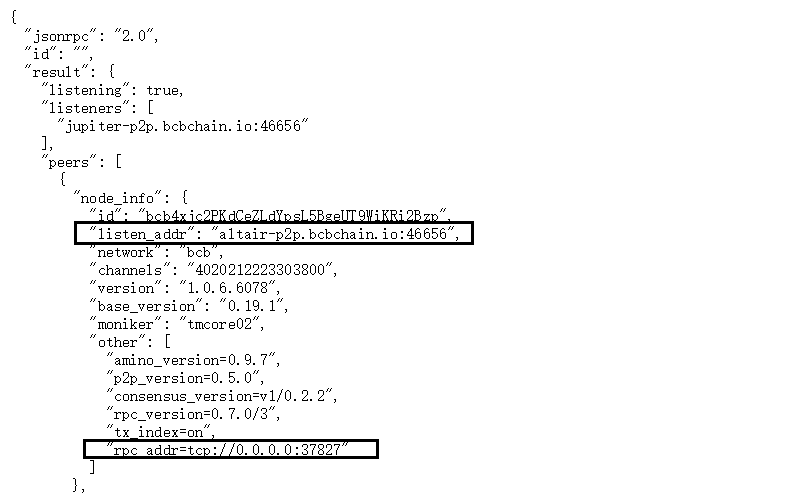

* 在本地安装BCBChain全节点核心钱包服务，向本地观察者节点发送交易请求即可将交易广播到BCBChain，不需要额外进行配置，本地节点访问端口为46657，协议默认为HTTP。


<div STYLE="page-break-after: always;"></div>
## 9.2 获取创世合约信息

获取BCBChain创世时部署的合约信息的方法如下：

* 通过知名节点或本地节点的genesis接口获取，例如知名节点的访问URL：

  ```
  https://jupiter.bcbchain.io/genesis
  ```

  在访问该URL返回的应答数据中查看“contracts”域，该数据域中列出了所有创世时部署的智能合约的详细信息，下图为BCBChain数字通证BCB所对应的智能合约“token-basic”的详细信息：

  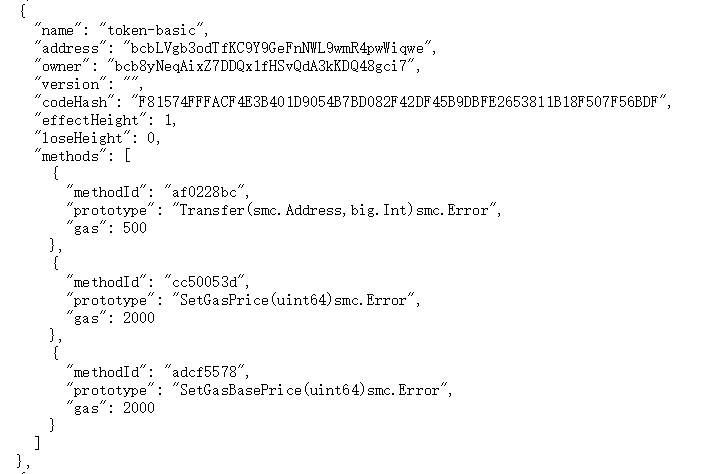

  下图为BCBChain提供的标准数字代币发行合约“token-issue”，通过这个智能合约，用户可以方便的创建属于自己的标准数字代币，新创建的数字代币的合约地址将会在创建新代币的方法调用结果中返回：

  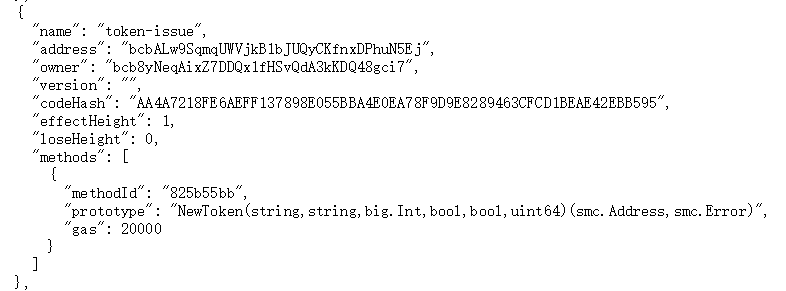

  下图为BCBChain提供的数字代币模板，用户所发行的标准数字代币全部遵循该智能合约提供的标准接口（数字代币的合约地址各不相同，由智能合约“token-issue”在创建数字代币的时候输出）：

  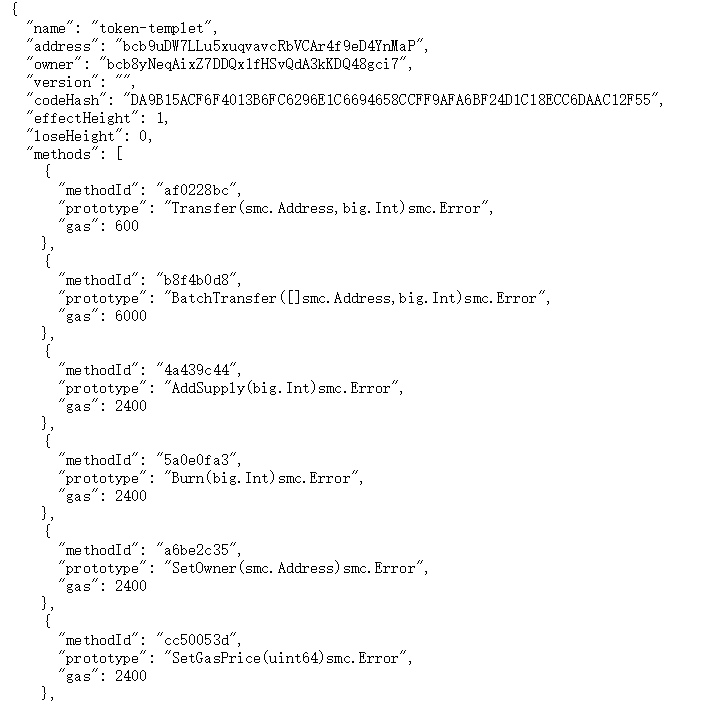


<div STYLE="page-break-after: always;"></div>
## 9.3 获取动态部署合约信息

BCBChain在创世的时候部署了一个名为“system”的智能合约，用于进行一些链上的管理操作，允许在BCBChain创世以后部署新的合约或者升级原有合约，智能合约“system”及其中关于合约部署与升级的方法如下图所示：

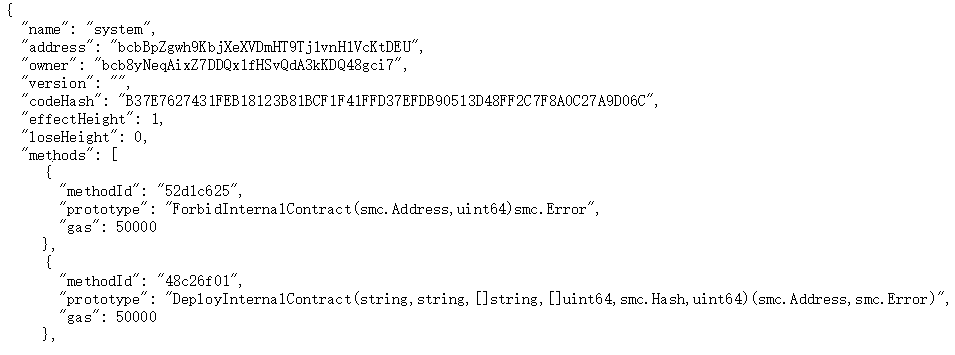

可以通过扫描BCBChain上的交易，查找智能合约“system”中对这两个方法进行调用的交易信息获得动态部署或升级以后的智能合约的合约地址及其方法信息。

此外，BCBChain官方提供的区块浏览网站https://www.bcbscan.io也可以查询所有智能合约的详细信息。


<div STYLE="page-break-after: always;"></div>
## 9.4 交易构造（交易格式-v1）

本章以BCBChain通证转账为例详细描述交易格式-v1的构造方式（交易格式-v1定义参见本文第5章）。
下面为调用BCB转账需要的各种参数（按交易中的排列顺序）：

```
Nonce：    1
GasLimit： 500
Note：     Hello, I’m BCBChain.
合约地址：  bcbLVgb3odTfKC9Y9GeFnNWL9wmR4pwWiqwe
合约名称：  token-basic
方法ID：   af0228bc   （十六进制）
方法原型：  Transfer(smc.Address,big.Int)smc.Error
收款地址：  bcbH3tQi44XLP7JnX74iUSJadcPGQsdNXS8D
转账金额：  1000000000  （1BCB）
签名私钥：  4A2C14697282E658B3ED7DD5324DE1A1
           02D216D6FA50D5937FFE89F35CBC12AA
           68EB9A09813BDF7C0869BF34A244CC54
           5711509FE70F978D121AFD3A4AE610E6
账户地址：  bcb6qsUWWVeGgdqqM43XV9bWnVhTjCD5Wa3p
```


构造交易各阶段数据如下表：

```
原始参数：
<==== raw params =======================================================>
nonce:         1
gasLimit:      500
note:          Hello, I’m BCBChain.
toContract:    bcbLVgb3odTfKC9Y9GeFnNWL9wmR4pwWiqwe
data{
  methodId:    0xaf0228bc
  items{
    toAccount: bcbH3tQi44XLP7JnX74iUSJadcPGQsdNXS8D
    value:     1000000000
  }
}

对原始数据每个字段进行RLP编码：
<==== rlp for params ===================================================>
nonce:         0x01
gasLimit:      0x8201f4
note:          0x9648656c6c6f2c2049e280996d20424342436861696e2e
toContract:    0xa46263624c566762336f6454664b433959394765466e4e574c39776d
                 523470775769717765
data{
  methodId:    0x84af0228bc
  items{
    toAccount: 0xa462636248337451693434584c50374a6e5837346955534a61646350
                475173644e58533844
    value:     0x843b9aca00
  }
}

将调用方法中的参数RLP编码顺序合并以后进行RLP编码：
<==== rlp for items ====================================================>
items: 0xeaa462636248337451693434584c50374a6e5837346955534a61646350475173
         644e58533844843b9aca00

将data字段中的参数RLP编码顺序合并以后进行RLP编码：
<==== rlp for data =====================================================>
data:  0xf184af0228bcabeaa462636248337451693434584c50374a6e5837346955534a
       61646350475173644e58533844843b9aca00

将交易消息的参数RLP编码顺序合并以后进行RLP编码：得到待签名的净荷数据
<==== rlp for tx data (payload for sign) ===============================>
payload: 0xf873018201f49648656c6c6f2c2049e280996d20424342436861696e2ea462
           63624c566762336f6454664b433959394765466e4e574c39776d5234707757
           69717765b2f184af0228bcabeaa462636248337451693434584c50374a6e58
           37346955534a61646350475173644e58533844843b9aca00

对净荷数据进行签名：
<==== raw sign data for payload ========================================>
sig:type:      ed25519
sig:pubkey:    0x68EB9A09813BDF7C0869BF34A244CC545711509FE70F978D121AFD3A
                 4AE610E6
sig:signdata:  0xebe75d2e79aea41b3a00b8c945eaaa210a896862e40485f1cfc1a829
                 2659e9f5edd9716a5b3f507fb3dfcc3ca5324fafd9b36121fd70ded5
                 086ee1619c2bfc01

对签名数据各字段进行RLP编码：
<==== rlp for raw sign data ============================================>
sig:type:      0x8765643235353139
sig:pubkey:    0xa068eb9a09813bdf7c0869bf34a244cc545711509fe70f978d121afd
                 3a4ae610e6
sig:signdata:  0xb840ebe75d2e79aea41b3a00b8c945eaaa210a896862e40485f1cfc1
                 a8292659e9f5edd9716a5b3f507fb3dfcc3ca5324fafd9b36121fd70
                 ded5086ee1619c2bfc01

对上述RLP编码的签名数据按顺序合并：
<==== merged sign data list ============================================>
sig:signdata:  0x8765643235353139a068eb9a09813bdf7c0869bf34a244cc54571150
                 9fe70f978d121afd3a4ae610e6b840ebe75d2e79aea41b3a00b8c945
                 eaaa210a896862e40485f1cfc1a8292659e9f5edd9716a5b3f507fb3
                 dfcc3ca5324fafd9b36121fd70ded5086ee1619c2bfc01

对合并后的编码签名数据再次进行RLP编码：得到最终的签名数据
<==== rlp for merged sign data list ====================================>
rlp:signdata:  0xf86b8765643235353139a068eb9a09813bdf7c0869bf34a244cc5457
                 11509fe70f978d121afd3a4ae610e6b840ebe75d2e79aea41b3a00b8
                 c945eaaa210a896862e40485f1cfc1a8292659e9f5edd9716a5b3f50
                 7fb3dfcc3ca5324fafd9b36121fd70ded5086ee1619c2bfc01

对净荷数据进行Base58编码：
<==== Base58 for payload ===============================================>
data:  QEFwr2U9XSxyLMYwwyDi71JTEF1rd6f3vCLjtr1qg8R55BSqm2S1ruYLNuZcYB7Vha
       RU9HJfV1iRmJxp2tt6dL1aL9xQ4J8zLEDRaA2BgRHi8inPQekh5x7Ah2NQHq8hSdGE
       VHeNZ24eiZZjWFypirysLHwzdd7d

对签名数据进行Base58编码：
<==== Base58 for sign data =============================================>
data:  YTgiA1gdDGi2L8hvDHobGcmYj6sXf1qQ8qdiHsHnZsaS4DDHcgvJj7rJvDkqvZuuqV
       H8Jq4fpaP8Pdm4hTBUD7Sr1S5h5qEsMxcmBAUJUnxptUFgkkNe3ihYAfiZcNNhgFrW
       KAp82y8LrDdnxzB1a

将经过Base58编码的净荷与签名数据按规范构造最终的交易数据：
<==== final tx data ====================================================>
bcb<tx>.v1.QEFwr2U9XSxyLMYwwyDi71JTEF1rd6f3vCLjtr1qg8R55BSqm2S1ruYLNuZcYB
7VhaRU9HJfV1iRmJxp2tt6dL1aL9xQ4J8zLEDRaA2BgRHi8inPQekh5x7Ah2NQHq8hSdGEVHe
NZ24eiZZjWFypirysLHwzdd7d.<1>.YTgiA1gdDGi2L8hvDHobGcmYj6sXf1qQ8qdiHsHnZsa
S4DDHcgvJj7rJvDkqvZuuqVH8Jq4fpaP8Pdm4hTBUD7Sr1S5h5qEsMxcmBAUJUnxptUFgkkNe3
ihYAfiZcNNhgFrWKAp82y8LrDdnxzB1a


计算交易数据的哈希：对交易数据直接进行SHA3-256计算
<==== final tx hash ====================================================>
BD89E2CD8B4D4F78A07965EE201D84751066FA6A1E4EE7D5AE3B795B9E18CB85
```


<div STYLE="page-break-after: always;"></div>

## 9.5 交易构造（交易格式-v2）

本章以BCBChain通证转账为例详细描述交易格式-v2的构造方式（交易格式-v2定义参见本文第5章）。
下面为调用某代币转账给指定合约注册游戏昵称的交易构造过程：

```
<==== sender ===========================================================>
privKey: 4a2c14697282e658b3ed7dd5324de1a102d216d6fa50d5937ffe89f35cbc12aa
         68eb9a09813bdf7c0869bf34a244cc545711509fe70f978d121afd3a4ae610e6
pubKey:  68EB9A09813BDF7C0869BF34A244CC545711509FE70F978D121AFD3A4AE610E6
address: bcb6qsUWWVeGgdqqM43XV9bWnVhTjCD5Wa3p

原始参数：
<==== raw params ========================================================>
nonce:               1
gasLimit:            500
note:                Example for cascade invoke smart contract.
msgs: [
  {
    toContract:      bcbMWedWqzzW8jkt5tntTomQQEN7fSwWFhw6
    methodID:        0x44d8ca60
    items{
      toAccount:     bcbCpeczqoSoxLxx1x3UyuKsaS4J8yamzWzz
      value:         1000000000
    }
  }
  {
    toContract:      bcbCpeczqoSoxLxx1x3UyuKsaS4J8yamzWzz
    methodID:        0x6457e648
    items{
      nickName:      mmmmhhhh
      referee:       bcb5rzgE1tSJbJuegEj4vbAkotmwRkxwiSyV
    }
  }
]

对原始数据中调用合约方法的每个参数单独进行RLP编码：
<==== raw params ========================================================>
nonce:               1
gasLimit:            500
note:                Example for cascade invoke smart contract.
msgs: [
  {
    toContract:      bcbMWedWqzzW8jkt5tntTomQQEN7fSwWFhw6
    methodID:        0x44d8ca60
    items{
      toAccount(RLP):0xa4626362437065637a716f536f784c78783178335579754b736
                       153344a3879616d7a577a7a
      value(RLP):    0x843b9aca00
    }
  }
  {
    toContract:      bcbCpeczqoSoxLxx1x3UyuKsaS4J8yamzWzz
    methodID:        0x6457e648
    items{
      nickName(RLP): 0x886d6d6d6d68686868
      referee(RLP):  0xa462636235727a67453174534a624a756567456a347662416b6
                       f746d77526b787769537956
    }
  }
]

对原始数据中调用合约方法的参数表进行RLP编码：
<==== raw params (partial rlp encoded) ==================================>
nonce:               1
gasLimit:            500
note:                Example for cascade invoke smart contract.
msgs: [
  {
    toContract(RLP): 0xa46263624d57656457717a7a57386a6b7435746e74546f6d515
                       1454e376653775746687736
    methodID(RLP):   0x8444d8ca60
    items(RLP):      0xeca5a4626362437065637a716f536f784c78783178335579754
                       b736153344a3879616d7a577a7a85843b9aca00
  },
  {
    toContract(RLP): 0xa4626362437065637a716f536f784c78783178335579754b736
                       153344a3879616d7a577a7a
    methodID(RLP):   0x846457e648
    items(RLP):      0xf089886d6d6d6d68686868a5a462636235727a67453174534a6
                       24a756567456a347662416b6f746d77526b787769537956
  }
]

对原始数据中调用合约方法的单个消息进行RLP编码：
<==== raw params (partial rlp encoded) ==================================>
nonce:               1
gasLimit:            500
note:                Example for cascade invoke smart contract.
msgs: [
  message1(RLP):     0xf857a46263624d57656457717a7a57386a6b7435746e74546f6
                       d5151454e3766537757466877368444d8ca60eca5a462636243
                       7065637a716f536f784c78783178335579754b736153344a387
                       9616d7a577a7a85843b9aca00
  message2(RLP):     0xf85ba4626362437065637a716f536f784c78783178335579754
                       b736153344a3879616d7a577a7a846457e648f089886d6d6d6d
                       68686868a5a462636235727a67453174534a624a756567456a3
                       47662416b6f746d77526b787769537956
]

对原始数据中调用合约方法的消息表进行RLP编码：
<==== raw params (partial rlp encoded) ==================================>
nonce:               1
gasLimit:            500
note:                Example for cascade invoke smart contract.
msgs:                0xf8b6f857a46263624d57656457717a7a57386a6b7435746e745
                       46f6d5151454e3766537757466877368444d8ca60eca5a46263
                       62437065637a716f536f784c78783178335579754b736153344
                       a3879616d7a577a7a85843b9aca00f85ba4626362437065637a
                       716f536f784c78783178335579754b736153344a3879616d7a5
                       77a7a846457e648f089886d6d6d6d68686868a5a46263623572
                       7a67453174534a624a756567456a347662416b6f746d77526b7
                       87769537956

对对交易数据进行RLP编码：得到待签名的净荷数据
<==== rlp for tx data (payload for sign) ================================>
payload:             0xf8e7018201f4aa4578616d706c6520666f72206361736361646
                       520696e766f6b6520736d61727420636f6e74726163742ef8b6
                       f857a46263624d57656457717a7a57386a6b7435746e74546f6
                       d5151454e3766537757466877368444d8ca60eca5a462636243
                       7065637a716f536f784c78783178335579754b736153344a387
                       9616d7a577a7a85843b9aca00f85ba4626362437065637a716f
                       536f784c78783178335579754b736153344a3879616d7a577a7
                       a846457e648f089886d6d6d6d68686868a5a462636235727a67
                       453174534a624a756567456a347662416b6f746d77526b78776
                       9537956

对净荷数据进行签名：
<==== raw sign data for payload =========================================>
sig:type:            ed25519
sig:pubkey:          0x68eb9a09813bdf7c0869bf34a244cc545711509fe70f978d121
afd3a4ae610e6
sig:signdata:        0x52adbea8b118cd0f62b286beaee37cdf2912f0a86ddbb398f27
                       bf3d468a4f764d981c0143427560322c75c3da1b3f4749501cb
                       d78a0341448742b4d41d3ab30f

对签名数据各字段进行RLP编码：
<==== rlp for raw sign data =============================================>
sig:type:            0x8765643235353139
sig:pubkey:          0xa068eb9a09813bdf7c0869bf34a244cc545711509fe70f978d1
                       21afd3a4ae610e6
sig:signdata:        0xb84052adbea8b118cd0f62b286beaee37cdf2912f0a86ddbb39
                       8f27bf3d468a4f764d981c0143427560322c75c3da1b3f47495
                       01cbd78a0341448742b4d41d3ab30f

对上述RLP编码的签名数据按顺序合并：
<==== merged sign data list =============================================>
sig:signdata:        0x8765643235353139a068eb9a09813bdf7c0869bf34a244cc545
                       711509fe70f978d121afd3a4ae610e6b84052adbea8b118cd0f
                       62b286beaee37cdf2912f0a86ddbb398f27bf3d468a4f764d98
                       1c0143427560322c75c3da1b3f4749501cbd78a0341448742b4
                       d41d3ab30f

对合并后的编码签名数据再次进行RLP编码：得到最终的签名数据
<==== rlp for merged sign data list =====================================>
rlp:signdata:        0xf86b8765643235353139a068eb9a09813bdf7c0869bf34a244c
                       c545711509fe70f978d121afd3a4ae610e6b84052adbea8b118
                       cd0f62b286beaee37cdf2912f0a86ddbb398f27bf3d468a4f76
                       4d981c0143427560322c75c3da1b3f4749501cbd78a03414487
                       42b4d41d3ab30f

对净荷数据进行Base58编码：
<==== Base58 for payload ================================================>
data:  3BC4C8dK8GJbcqLqBdyQTiFvnjoDjMZ82FrjiNkcTteF8Lfwy5goNCzwStbhP5QkBUv
       nqWwtQnF3Dyh6E33aBg3B5hsFvT2ukvehnycqfrG2jFQr3LqaSXu9odXGmKjMwgaejQ
       os7DZ4nDF1MF5F7f1vF4r2SzB9zugJf1LQApZvkiXv9mGKrhsALXXDvhJ9z2sC4wHt7
       PmeZVMjURW3Bfc6JM6bnUtmsA3hXTfZS4FWbyc3bCreRcJvjvq6tiNbhNi4BAfuV25F
       Guf3C2cjzRuF7mjt95pr3PJ5EuxhgWY8xzJArpHMGLeZ4yEB5fB

对签名数据进行Base58编码：
<==== Base58 for sign data ==============================================>
data:  YTgiA1gdDGi2L8hvDHobGcmYj6sXf1qQ8qdiHsHnZsaS4DDHcgvJj7rJvDkqvWrEMgA
       JRAttrc9YKyNWVH8tZ9gnTsFPiLLBBMp5hEsiFzEWBCny1NnFpt4TAwRNuV7r7YtLJQ
       euc4sJsRo9aLGia

将经过Base58编码的净荷与签名数据按规范构造最终的交易数据：
<==== final tx data =====================================================>
bcb<tx>.v2.3BC4C8dK8GJbcqLqBdyQTiFvnjoDjMZ82FrjiNkcTteF8Lfwy5goNCzwStbhP5Q
kBUvnqWwtQnF3Dyh6E33aBg3B5hsFvT2ukvehnycqfrG2jFQr3LqaSXu9odXGmKjMwgaejQos7
DZ4nDF1MF5F7f1vF4r2SzB9zugJf1LQApZvkiXv9mGKrhsALXXDvhJ9z2sC4wHt7PmeZVMjURW
3Bfc6JM6bnUtmsA3hXTfZS4FWbyc3bCreRcJvjvq6tiNbhNi4BAfuV25FGuf3C2cjzRuF7mjt9
5pr3PJ5EuxhgWY8xzJArpHMGLeZ4yEB5fB.<1>.YTgiA1gdDGi2L8hvDHobGcmYj6sXf1qQ8qd
iHsHnZsaS4DDHcgvJj7rJvDkqvWrEMgAJRAttrc9YKyNWVH8tZ9gnTsFPiLLBBMp5hEsiFzEWB
Cny1NnFpt4TAwRNuV7r7YtLJQeuc4sJsRo9aLGia

计算交易数据的哈希：
<==== final tx hash =====================================================>
366E331B53A92A64EFE2CD877B43F291EE56E8C710F0DC544599A2B875D55E01
```


<div STYLE="page-break-after: always;"></div>
## 9.6 交易广播

交易构造出来以后，可以通过知名节点或本地节点的 “broadcast_tx_async” / “broadcast_tx_sync” / “broadcast_commit” 接口向BCBChain提交交易，交易首先会在提交的节点进行校验，校验通过以后节点会自动向BCBChain网络进行广播，直到落入区块并进行确认。

"交易构造（交易格式-v1）"章节中示例生成的最终交易提交的URL是：

```
https://earth.bcbchain.io/broadcast_tx_commit?tx="bcb<tx>.v1.QEFwr2U9XSxyLMYwwyDi71JTE
F1rd6f3vCLjtr1qg8R55BSqm2S1ruYLNuZcYB7VhaRU9HJfV1iRmJxp2tt6dL1aL9xQ4J8zLEDRaA2BgRHi8in
PQekh5x7Ah2NQHq8hSdGEVHeNZ24eiZZjWFypirysLHwzdd7d.<1>.YTgiA1gdDGi2L8hvDHobGcmYj6sXf1qQ
8qdiHsHnZsaS4DDHcgvJj7rJvDkqvZuuqVH8Jq4fpaP8Pdm4hTBUD7Sr1S5h5qEsMxcmBAUJUnxptUFgkkNe3i
hYAfiZcNNhgFrWKAp82y8LrDdnxzB1a"
```


<div STYLE="page-break-after: always;"></div>
## 9.7 交易确认

BCBChain交易提交以后需要经过两个区块才能确认执行结果，第一个区块将交易取得共识后落入区块，第二个区块执行交易更新状态数据库并将交易执行结果落入第二个区块。

* 下面为"交易广播"章节提交交易的返回结果。

  ```
  {
    "jsonrpc": "2.0",
    "id": "",
    "result": {
      "check_tx": {
        "code": 200,
        "log": "Check tx succeed",
        "tx_hash": "BD89E2CD8B4D4F78A07965EE201D84751066FA6A1E4EE7D5AE3B795B9E18CB85"
      },
      "deliver_tx": {
        "code": 200,
        "log": "Deliver tx succeed",
        "gas_limit": 500,
        "gas_used": 500,
        "fee": 1250000,
        "tx_hash": "BD89E2CD8B4D4F78A07965EE201D84751066FA6A1E4EE7D5AE3B795B9E18CB85",
        "height": 72209
      },
      "hash": "BD89E2CD8B4D4F78A07965EE201D84751066FA6A1E4EE7D5AE3B795B9E18CB85",
      "height": 72209
    }
  }
  
  ```

* 交易执行结果也可以直接通过交易HASH进行查询，下面为示例URL：

  ```
  https://jupiter.bcbchain.io/tx?hash="BD89E2CD8B4D4F78A07965EE201D84751066FA6A1E4EE7
  D5AE3B795B9E18CB85"
  ```

* 下面为交易查询的返回结果。

  ```
  {
    "jsonrpc": "2.0",
    "id": "",
    "result": {
      "hash": "BD89E2CD8B4D4F78A07965EE201D84751066FA6A1E4EE7D5AE3B795B9E18CB85",
      "height": 72209,
      "index": 0,
      "deliver_tx": {
        "code": 200,
        "log": "Deliver tx succeed",
        "gas_limit": 500,
        "gas_used": 500,
        "fee": 1250000,
        "tx_hash": "BD89E2CD8B4D4F78A07965EE201D84751066FA6A1E4EE7D5AE3B795B9E18CB85",
        "height": 72209
      },
      "check_tx": {},
      "tx": null,
      "state_code": 3
    }
  }
  
  ```


* 交易执行结果也可以直接通过交易区块高度进行查询，下面为示例URL：

  ```
  https://jupiter.bcbchain.io/block_results?height=72209
  ```

* 下面为区块结果查询的返回结果。

  ```
  {
    "jsonrpc": "2.0",
    "id": "",
    "result": {
      "height": 72209,
      "results": {
        "DeliverTx": [
          {
            "code": 200,
            "log": "Deliver tx succeed",
            "gas_limit": 500,
            "gas_used": 500,
            "fee": 1250000,
            "tx_hash": "BD89E2CD8B4D4F78A07965EE201D84751066FA6A1E4EE7D5AE3B795B9E18CB85"
          }
        ],
        "EndBlock": {
          "validator_updates": null
        }
      }
    }
  }
  
  ```


交易执行结果查询可以通过任意节点进行。


<div STYLE="page-break-after: always;"></div>
# 10. 集成指南（bcbwallet_rpc）


## 10.1 获取BCB核心钱包服务

从BCBChain主链官网可以下载BCB全节点核心钱包服务的安装包（BCB Coind），下载页面URL如下：

```
https://www.bcbchain.io/wallet
```


## 10.2 注意事项

* BCB Coind – PC（Linux）版安装后自动以服务“bcbwallet”在后台运行；

* 本地核心节点服务监听的端口为46657，默认为HTTP协议；

* 本地核心钱包服务监听的端口为37653，默认为HTTPS协议；

* 本地核心钱包服务不提供钱包存储，钱包创建以后将会加密返回，有调用方自行对钱包进行存储区、备份与恢复等管理操作；

* 本地核心钱包服务提供的基本接口前缀为“bcb_”，随着BCB核心钱包服务的发展，新版本的核心钱包服务将会提供部分BCBChain上部署的Dapp的调用接口。


<div STYLE="page-break-after: always;"></div>
# 11. 附录


## 11.1 RLP

The purpose of RLP (Recursive Length Prefix) is to encode arbitrarily nested arrays of binary data, and RLP is the main encoding method used to serialize objects in Ethereum. The only purpose of RLP is to encode structure; encoding specific data types (eg. strings, floats) is left up to higher-order protocols; but positive RLP integers must be represented in big endian binary form with no leading zeroes (thus making the integer value zero be equivalent to the empty byte array). Deserialised positive integers with leading zeroes must be treated as invalid. The integer representation of string length must also be encoded this way, as well as integers in the payload. Additional information can be found in the Ethereum yellow paper Appendix B.

If one wishes to use RLP to encode a dictionary, the two suggested canonical forms are to either use [[k1,v1],[k2,v2]...] with keys in lexicographic order or to use the higher-level Patricia Tree encoding as Ethereum does.

 

**Definition**


 The RLP encoding function takes in an item. An item is defined as follows：

1. A string (ie. byte array) is an item

2. A list of items is an item


For example, an empty string is an item, as is the string containing the word "cat", a list containing any number of strings, as well as more complex data structures like ["cat",["puppy","cow"],"horse",[[]],"pig",[""],"sheep"]. Note that in the context of the rest of this article, "string" will be used as a synonym for "a certain number of bytes of binary data"; no special encodings are used and no knowledge about the content of the strings is implied.


RLP encoding is defined as follows:

1. For a single byte whose value is in the [0x00, 0x7f] range, that byte is its own RLP encoding.

2. Otherwise, if a string is 0-55 bytes long, the RLP encoding consists of a single byte with value 0x80 plus the length of the string followed by the string. The range of the first byte is thus [0x80, 0xb7].

3. If a string is more than 55 bytes long, the RLP encoding consists of a single byte with value 0xb7 plus the length in bytes of the length of the string in binary form, followed by the length of the string, followed by the string. For example, a length-1024 string would be encoded as \xb9\x04\x00 followed by the string. The range of the first byte is thus [0xb8, 0xbf].

4. If the total payload of a list (i.e. the combined length of all its items being RLP encoded) is 0-55 bytes long, the RLP encoding consists of a single byte with value 0xc0 plus the length of the list followed by the concatenation of the RLP encodings of the items. The range of the first byte is thus [0xc0, 0xf7].

5. If the total payload of a list is more than 55 bytes long, the RLP encoding consists of a single byte with value 0xf7 plus the length in bytes of the length of the payload in binary form, followed by the length of the payload, followed by the concatenation of the RLP encodings of the items. The range of the first byte is thus [0xf8, 0xff].


In code, this is:

  ```

def rlp_encode(input):
    if isinstance(input,str):
        if len(input) == 1 and ord(input) < 0x80: return input
        else: return encode_length(len(input), 0x80) + input
    elif isinstance(input,list):
        output = ''
        for item in input: output += rlp_encode(item)
        return encode_length(len(output), 0xc0) + output

def encode_length(L,offset):
    if L < 56:
         return chr(L + offset)
    elif L < 256**8:
         BL = to_binary(L)
         return chr(len(BL) + offset + 55) + BL
    else:
         raise Exception("input too long")

def to_binary(x):
    if x == 0:
        return ''
    else: 
        return to_binary(int(x / 256)) + chr(x % 256)

  ```

 

**Examples**

The string "dog" = [ 0x83, 'd', 'o', 'g' ]

The list [ "cat", "dog" ] = [ 0xc8, 0x83, 'c', 'a', 't', 0x83, 'd', 'o', 'g' ]

The empty string ('null') = [ 0x80 ]

The empty list = [ 0xc0 ]

The integer 0 = [ 0x80 ]

The encoded integer 0 ('\x00') = [ 0x00 ]

The encoded integer 15 ('\x0f') = [ 0x0f ]

The encoded integer 1024 ('\x04\x00') = [ 0x82, 0x04, 0x00 ]

The set theoretical representation of three, [ [], [[]], [ [], [[]] ] ] = [ 0xc7, 0xc0, 0xc1, 0xc0, 0xc3, 0xc0, 0xc1, 0xc0 ]

The string "Lorem ipsum dolor sit amet, consectetur adipisicing elit" = [ 0xb8, 0x38, 'L', 'o', 'r', 'e', 'm', ' ', ... , 'e', 'l', 'i', 't' ]

 

**RLP decoding**

 

According to rules and process of RLP encoding, the input of RLP decode shall be regarded as Arrayof binary data, the process is as follows:

1. According to the first byte(i.e. prefix) of input data, and decoding the data type, the length of the actual data and offset;

2. According to type and offset of data, decode data correspondingly;

3. Continue to decode the rest of the input;


Among them, the rules of decoding data types and offset is as follows:

1. the data is a string if the range of the first byte(i.e. prefix) is [0x00, 0x7f], and the string is the first byte itself exactly;

2. the data is a string if the range of the first byte is [0x80, 0xb7], and the string whose length is equal to the first byte minus 0x80 follows the first byte;

3. the data is a string if the range of the first byte is [0xb8, 0xbf], and the length of the string whose length in bytes is equal to the first byte minus 0xb7 follows the first byte, and the string follows the length of the string;

4. the data is a list if the range of the first byte is [0xc0, 0xf7], and the concatenation of the RLP encodings of all items of the list which the total payload is equal to the first byte minus 0xc0 follows the first byte;

5. the data is a list if the range of the first byte is [0xf8, 0xff], and the total payload of the list whose length is equal to the first byte minus 0xf7 follows the first byte, and the concatenation of the RLP encodings of all items of the list follows the total payload of the list;


In code, this is:

```

def rlp_decode(input):
    if len(input) == 0:
        return
    output = ''
    (offset, dataLen, type) = decode_length(input)
    if type is str:
        output = instantiate_str(substr(input, offset, dataLen))
    elif type is list:
        output = instantiate_list(substr(input, offset, dataLen))
    output + rlp_decode(substr(input, offset + dataLen))
    return output

def decode_length(input):
    length = len(input)
    if length == 0:
        raise Exception("input is null")
    prefix = ord(input[0])
    if prefix <= 0x7f:
        return (0, 1, str)
    elif prefix <= 0xb7 and length > prefix - 0x80:
        strLen = prefix - 0x80
        return (1, strLen, str)
    elif prefix <= 0xbf and length > prefix - 0xb7 and length > prefix - 0xb7 + to_integer(substr(input, 1, prefix - 0xb7)):
        lenOfStrLen = prefix - 0xb7
        strLen = to_integer(substr(input, 1, lenOfStrLen))
        return (1 + lenOfStrLen, strLen, str)
    elif prefix <= 0xf7 and length > prefix - 0xc0:
        listLen = prefix - 0xc0;
        return (1, listLen, list)
    elif prefix <= 0xff and length > prefix - 0xf7 and length > prefix - 0xf7 + to_integer(substr(input, 1, prefix - 0xf7)):
        lenOfListLen = prefix - 0xf7
        listLen = to_integer(substr(input, 1, lenOfListLen))
        return (1 + lenOfListLen, listLen, list)
    else:
        raise Exception("input don't conform RLP encoding form")

def to_integer(b):
    length = len(b)
    if length == 0:
        raise Exception("input is null")
    elif length == 1:
        return ord(b[0])
    else:
        return ord(substr(b, -1)) + to_integer(substr(b, 0, -1)) * 256

```


<div STYLE="page-break-after: always;"></div>
## 11.2 Base58

Base58 is a group of binary-to-text encoding schemes used to represent large integers as alphanumeric text. It is similar to Base64 but has been modified to avoid both non-alphanumeric characters and letters which might look ambiguous when printed. It is therefore designed for human users who manually enter the data, copying from some visual source, but also allows easy copy and paste because a double-click will usually select the whole string.

Compared to Base64, the following similar-looking letters are omitted: 0 (zero), O (capital o), I (capital i) and l (lower case L) as well as the non-alphanumeric characters + (plus) and / (slash). In contrast to Base64, the digits of the encoding do not line up well with byte boundaries of the original data. For this reason, the method is well-suited to encode large integers, but not designed to encode longer portions of binary data. The actual order of letters in the alphabet depends on the application, which is the reason why the term “Base58” alone is not enough to fully describe the format. A variant, Base56, excludes 1 (one) and o (lowercase o) compared to Base 58.


