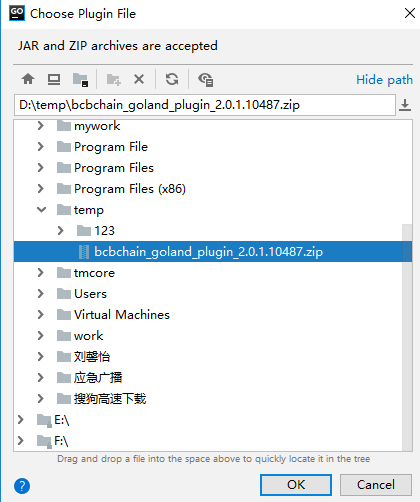
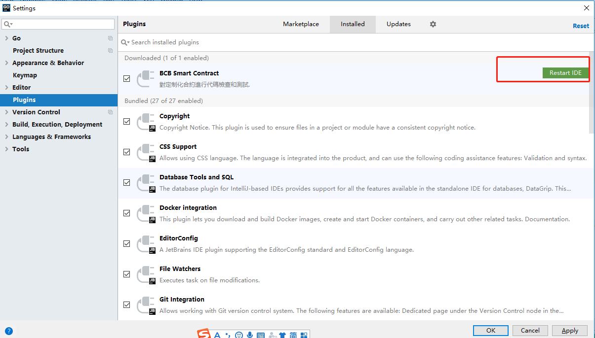

# BCBChain V2.0 Smart Contract Program Guide

**V2.0.4**


<div STYLE="page-break-after: always;"></div>

# 修订历史

| 版本&日期          | 修订内容&nbsp;&nbsp;&nbsp;&nbsp;&nbsp;&nbsp;&nbsp;&nbsp;&nbsp;&nbsp;&nbsp;&nbsp;&nbsp;&nbsp;&nbsp;&nbsp;&nbsp;&nbsp;&nbsp;&nbsp;&nbsp;&nbsp;&nbsp;&nbsp;&nbsp;&nbsp;&nbsp;&nbsp;&nbsp;&nbsp;&nbsp;&nbsp;&nbsp;&nbsp;&nbsp;&nbsp;&nbsp;&nbsp;&nbsp;&nbsp;&nbsp;&nbsp;&nbsp;&nbsp;&nbsp;&nbsp;&nbsp;&nbsp;&nbsp;&nbsp;&nbsp;&nbsp;&nbsp;&nbsp;&nbsp;&nbsp;&nbsp;&nbsp;&nbsp;&nbsp;&nbsp;&nbsp;&nbsp;&nbsp;&nbsp;&nbsp;&nbsp;&nbsp;&nbsp;&nbsp;&nbsp;&nbsp;&nbsp;&nbsp;&nbsp;&nbsp;&nbsp;&nbsp;&nbsp;&nbsp;&nbsp;&nbsp;&nbsp;&nbsp;&nbsp;&nbsp;&nbsp;&nbsp; |
| ------------------ | ------------------------------------------------------------ |
| V2.0.1：2018-12-7  | 初稿。                                                       |
| V2.0.2：2018-12-18 | 调整插件界面及功能。                                         |
| V2.0.3：2019-1-4   | 智能合约公开的方法和接口消耗的燃料现在支持负整数。           |
| V2.0.4：2019-3-5   | 1、goland要求安装2018.3.5版本<br>2、修改插件安装说明         |


<div STYLE="page-break-after: always;"></div>

[TOC]
<script src="./github/ltview.js"></script>

<div STYLE="page-break-after: always;"></div>
# 1 什么是BCBChain


BCBChain是以Tendermint为基础开发的区块链体系，以系统安全性为依归，进行技术创新，实现物与物、人与物之间高效的价值信息传递，打造快速应用，具备高性能及高扩展性的平台。

更详细的介绍参见《BCBChain_V2.0_Program_Reference》。


<div STYLE="page-break-after: always;"></div>
# 2 智能合约概述

BCBChain从V2.0版开始支持独立开发与部署智能合约，智能合约采用golang进行开发。


## 2.1 简单的智能合约

### 2.1.1 存储

让我们先看一个最简单的智能合约。

```
package mystorage

import (
	"blockchain/smcsdk/sdk"
)

//MyStorage a demo contract
//@:contract:mystorage
//@:version:1.0
//@:organization:orgNUjCm1i8RcoW2kVTbDw4vKW6jzfMxewJH
//@:author:b37e7627431feb18123b81bcf1f41ffd37efdb90513d48ff2c7f8a0c27a9d06c
type MyStorage struct {
	sdk sdk.ISmartContract

	//@:public:store
	stroedData uint64
}

//InitChain init when deployed on the blockchain first time
//@:constructor
func (ms *MyStorage) InitChain() {
}

//Set set a data to the stored data
//@:public:method:gas[100]
func (ms *MyStorage) Set(data uint64) {
	ms._setStoredData(data)
}

//Get get the stored data
//@:public:method:gas[100]
func (ms *MyStorage) Get() uint64 {
	return ms._storedData()
}
```

BCBChain的智能合约就是一组代码（合约的函数）和数据（合约的状态数据）以及一组标记（合约的元数据），它位于BCBChain的一个特定地址上。


代码行：

```package mystorage```

声明智能合约代码包的名称，同一个组织开发的不同智能合约的代码包不能相同，请智能合约的开发者进行合理的规划。


代码段：

```
import (
	"blockchain/smcsdk/sdk"
)
```

声明智能合约需要引入的代码包，上述代码引入了BCBChain发布的智能合约SDK的相关代码包。


代码段：
```
//MyStorage a demo contract
//@:contract:mystorage
//@:version:1.0
//@:organization:orgNUjCm1i8RcoW2kVTbDw4vKW6jzfMxewJH
//@:author:b37e7627431feb18123b81bcf1f41ffd37efdb90513d48ff2c7f8a0c27a9d06c
type MyStorage struct {
	sdk sdk.ISmartContract

	//@:public:store
	stroedData uint64
}
```

声明智能合约的元数据以及状态数据。

* 注释行  ```//MyStorage a demo contract```  对下面定义的合约进行注释。
* 标记行  ```//@:contract:mystorage```  声明下面定义的数据结构  ```MyStorage```  代表一个智能合约，同时声明该智能合约的名称为  ```mystorage```，合约名称是将智能合约代码部署到BCBChain主链上的时候需要提供的名称，同一个组织开发的不同智能合约的合约名称不能相同，请智能合约的开发者进行合理的规划。
* 标记行  ```//@:version:1.0```  声明智能合约的代码版本。
* 标记行  ```//@:organization:orgNUjCm1i8RcoW2kVTbDw4vKW6jzfMxewJH```  标识智能合约的所属的组织。
* 标记行  ```//@:author:b37e7627431feb18123b81bcf1f41ffd37efdb90513d48ff2c7f8a0c27a9d06c```  标识智能合约的开发者公钥。
	 代码行  ```type MyStorage struct {```  声明智能合约的数据结构开始，智能合约的函数与状态数据都是该数据结构下的成员。代码行  ```	sdk sdk.ISmartContract```  表示该数据结构是遵循BCBChain智能合约SDK的智能合约，将自动聚合SDK提供的智能合约访问上下文（变量名必须定义为sdk）。
* 标记行  ```    //@:public:store```  表示下一行代码将声明一个状态数据。
* 代码行  ```    stroedData uint64```  声明一个类型为```uint64```的状态变量，变量名为```stroedData```，你可以认为它是状态数据库里的一个位置，可以通过调用管理数据库的函数进行查询和变更，从外部访问状态数据库中的这个变量的KEY值为```    /mystorage/stroedData```。BCBChain提供的辅助工具将会为该状态变量自动封装并生成访问函数```_storeData() uint64```、```_setStoreData(uint64)```和```_chkStoreData() bool```。
* 代码行  ```}```  表示智能合约数据结构定义完成。


代码段：

```
//InitChain init when deployed on the blockchain first time
//@:constructor
func (ms *MyStorage) InitChain() {
}
```

声明智能合约的上链初始化代码。

- 标记行  ```//@:constructor```  声明下面定义的函数 ```InitChain()``` 是一个智能合约的标准区块链初始化函数，在BCBChain上第一次部署这个合约的时候自动进行唯一一次调用，以完成智能合约在区块链上的初始化工作，例如初始化某些全局状态变量的初始值。
- 代码行  ```func (ms *MyStorage) InitChain() {```  声明智能合约上链初始化的函数原型，函数名必须为```InitChain```，该函数没有输入参数。
- 代码行  ```}```  表示智能合约上链初始化的函数实现完成。


代码段：

```
//Set set a data to the stored data
//@:public:method:gas[100]
func (ms *MyStorage) Set(data uint64) {
	ms._setStoredData(data)
}
```

声明智能合约的代码。

* 标记行  ```//@:public:method:gas[100]```  声明下面定义的函数 ```Set()``` 是一个智能合约的公共函数，可以通过BCBChain交易广播的方式进行调用，并将调用信息及结果记录在区块链上，同时声明对该函数的调用将消耗的燃料为100。
* 代码行  ```func (ms *MyStorage) Set(data uint64) {```  声明一个智能合约的函数原型。代码行  ```    ms._setStoredData(data)```  为该函数的实现代码，表示将输入的参数保存到状态变量```stroedData```中。
* 代码行  ```}```  表示智能合约函数实现完成。


代码段：

```
//Get get the stored data
//@:public:method:gas[100]
func (ms *MyStorage) Get() uint64 {
	return ms._storedData()
}
```

声明智能合约的代码。

* 标记行  ```//@:public:method:gas[100]```  声明下面定义的函数  ```Get()```  是一个智能合约的公共函数，可以通过BCBChain交易广播的方式进行调用，并将调用信息及结果记录在区块链上，同时声明对该函数的调用将消耗的燃料为100。
* 代码行  ```func (ms *MyStorage) Get() uint64 {```  声明一个智能合约的函数原型。代码行  ```    return ms._storedData()```  为该函数的实现代码，表示将读取状态变量```stroedData```的值并返回给调用者。
* 代码行  ```}```  表示智能合约函数实现完成。


该合约能完成的事情并不多：它能允许任何人在合约中存储一个单独的数字，并且这个数字可以被世界上任何人访问，且没有可行的办法阻止你发布这个数字。当然，任何人都可以再次调用 Set ，传入不同的值，覆盖你的数字，但是这个数字仍会被存储在区块链的历史记录中。随后，我们会看到怎样施加访问限制，以确保只有你才能改变这个数字。


备注：

```
智能合约代码所有的标识符（合约名称，函数名称和变量名称）都只能使用ASCII字符集。尽量使用ASSCII或UTF-8编码的形式存储合约代码。
```


<div STYLE="page-break-after: always;"></div>

### 2.1.2 代币

下面的合约实现了一个最简单的加密代币。在这里，代币确实可以无中生有地产生，但是只有合约的拥有者才能做到，而且，任何人都可以给其他人转币，不需要注册用户名和密码 —— 所需要的只是符合BCBChain规范的密钥对。

```
package mycoin

import (
	"blockchain/smcsdk/sdk"
	"blockchain/smcsdk/sdk/bn"
	"blockchain/smcsdk/sdk/types"
)

//Mycoin a demo contract for digital coin
//@:contract:mycoin
//@:version:1.0
//@:organization:orgNUjCm1i8RcoW2kVTbDw4vKW6jzfMxewJH
//@:author:b37e7627431feb18123b81bcf1f41ffd37efdb90513d48ff2c7f8a0c27a9d06c
type Mycoin struct {
	sdk sdk.ISmartContract

	//@:public:store:cache
	totalSupply bn.Number

	//@:public:store
	balanceOf map[types.Address]bn.Number
}

const oneToken int64 = 1000000000

//InitChain init when deployed on the blockchain first time
//@:constructor
func (mc *Mycoin) InitChain() {
	owner := mc.sdk.Contract().Owner()
	totalSupply := bn.N1(1000000, oneToken)
	mc._setTotalSupply(totalSupply)
	mc._setBalanceOf(owner, totalSupply)
}

//@:public:receipt
type receipt interface {
	emitTransferMyCoin(token, from, to types.Address, value bn.Number)
}

//Transfer transfer coins from sender to another
//@:public:method:gas[500]
//@:public:interface:gas[450]
func (mc *Mycoin) Transfer(to types.Address, value bn.Number) {
	sender := mc.sdk.Message().Sender().Address()
	receiver := to
	newBalanceOfSender := mc._balanceOf(sender).Sub(value)
	newBalanceOfReceiver := mc._balanceOf(receiver).Add(value)

	sdk.Require(sender != receiver,
		types.ErrInvalidParameter, "cannot transfer coins to yourself")
	sdk.Require(value.IsPositive(),
		types.ErrInvalidParameter, "value must be positive")
	sdk.Require(newBalanceOfSender.IsGE_(0),
		types.ErrInsufficientBalance, "")

	mc._setBalanceOf(sender, newBalanceOfSender)
	mc._setBalanceOf(receiver, newBalanceOfReceiver)

	mc.emitTransferMyCoin(
		mc.sdk.Contract().Address(),
		sender,
		receiver,
		value)
}
```

这个合约引入了一些新的概念，下面逐一解读。


代码段：

```
	//@:public:store:cache
	totalSupply bn.Number
```

声明智能合约的状态数据。

- 标记行  ```    //@:public:store:cache```  表示下一行代码将声明一个状态数据，该状态数据将会在内存中进行缓存。
- 代码行  ```    totalSupply bn.Number```  声明一个类型为```bn.Number```的状态变量，变量名为```totalSupply ```，```bn.Number```类型表示一个带符号的大数，进行加减乘除操作时不必考虑溢出的问题，从外部访问状态数据库中的这个变量的KEY值为```    /mycoin/totalSupply ```。BCBChain提供的辅助工具将会为该变量自动封装并生成访问函数```_totalSupply() bn.Number```、```_setTotalSupply(bn.Number)```和```_chkTotalSupply() bool```，由于标记```cache```的影响，还会生成一个清除内存缓存的函数```_clrTotalSupply()```。


代码段：

```
	//@:public:store
	balanceOf map[types.Address]bn.Number
```

也声明了一个公共状态变量，但它是一个更复杂的数据类型。 该类型将地址映射为大数，用于存储拥有该种代币的账户地址对应的余额。 从外部访问状态数据库中的这个变量的KEY值为```    /mycoin/balanceOf/address```，其中```address```为实际要查询的账户地址。BCBChain提供的辅助工具将会为该变量自动封装并生成访问函数```_balanceOf(types.Address) bn.Number```、```_setBalanceOf(types.Address, bn.Number)```和```_chkBalanceOf(types.Address) bool```。


代码段：

```
//@:public:receipt
type receipt interface {
	emitTransferMyCoin(token, from, to types.Address, value bn.Number)
}
```

声明智能合约方法执行时发送的收据，收据将会被保存在BCBChain链中供人们查询。

* 标记行  ```//@:public:receipt```  声明下一行代码为收据接口定义。
* 代码行  ```type receipt interface {```  声明实际的收据接口类型开始，类型名称固定为 ```receipt```  。
* 代码行  ```    emitTransferMyCoin(token, from, to types.Address, value bn.Number)```  声明了一个所谓的“收据（receipt）”，它会在 Transfer函数的最后一行被发出。用户界面（当然也包括服务器应用程序）可以监听BCBChain链上正在发送的收据，而不会花费太多成本。一旦它被发出，监听该收据的```listener```都将收到通知，可方便追踪交易。
* 代码行  ```}```  表示收据接口定义完成。


代码段：

```
//Transfer transfer coins from sender to another
//@:public:method:gas[500]
//@:public:interface:gas[450]
func (mc *Mycoin) Transfer(to types.Address, value bn.Number) {
    .
    .
    .
}
```

声明智能合约的代码。

* 标记行  ```//@:public:interface:gas[450]```  声明下面定义的函数  ```Transfer()```  是一个智能合约的公共接口，可以通过智能合约之间相互进行跨合约调用的机制进行调用，并将调用信息及结果记录在BCBChain链上。同一组织在BCBChain上部署的智能合约之间可以进行相互调用，BCBChain基础组织部署的智能合约所提供的公共接口可以由任意智能合约进行调用。


代码段：

```
	sender := mc.sdk.Message().Sender().Address()
```

声明描述一段合约代码逻辑。函数 ```mc.sdk.Message().Sender().Address()``` 由SDK提供，用于获取消息发起者的账户地址。


代码段：

```
	newBalanceOfSender := mc._balanceOf(sender).Sub(value)
```

声明描述一段合约代码逻辑。```mc._balanceOf(sender).Sub(value)``` 用于获取发消息起者账户地址所拥有代币的余额并减去转账金额，计算出新的账户余额，函数```_balanceOf()```是由BCBChain提供的辅助工具自动生成的。


代码段：

```
	sdk.Require(sender != receiver,
		types.ErrInvalidParameter, "cannot transfer coins to yourself")
```

声明描述一段合约代码逻辑。函数 ```sdk.Require()```  由SDK提供，用于声明某个条件必须成立，否则自动结束合约的执行，并返回响应的错误信息。


代码段：

```
	mc._setBalanceOf(sender, newBalanceOfSender)
```

声明描述一段合约代码逻辑。用于将计算得出的新的账户余额写入状态数据库中，函数```_setBalanceOf()```是由BCBChain提供的辅助工具自动生成的。


代码段：

```
	mc.emitTransferMyCoin(
		mc.sdk.Contract().Address(),
		sender,
		receiver,
		value)
```

声明描述一段合约代码逻辑。用于向区块链发送本次转账的收据，函数```emitTransferMyCoin()```是由BCBChain提供的辅助工具自动生成的。


这个合约提供了两个函数，函数 ```InitChain()```是在部署合约之后由BCBChain链自动调用一次，用于对合约进行初始化。 真正被用户或其他合约所调用的，以完成本合约功能的函数是```Transfer()```。 函数```Transfer()```可被任何人用于向他人发送代币 (当然，前提是发送者拥有这些代币)。记住，如果你使用合约发送代币给一个地址，当你在BCBChain链浏览器上查看该地址时是看不到任何相关信息的。因为，实际上你发送代币和更改余额的信息仅仅存储在这个合约的数据存储器中（需要使用特殊的查询手段从状态数据库进行查询）。通过使用收据，你可以非常简单地为你的新代币创建一个“区块链浏览器”来追踪交易和余额。


<div STYLE="page-break-after: always;"></div>

## 2.2 区块链基础

程序员对于区块链这个概念应该并不难理解，这是因为大多数复杂的算法与协议 (哈希 ，椭圆曲线密码学 ，点对点网络（P2P） 等) 都只是用于提供特定的功能和承诺。对于智能合约开发程序员来说，只需接受这些既有的特性与功能，不必关心底层技术的实现方案。

### 2.2.1 交易/事务

区块链是一种全球共享的事务性数据库，这意味着每个人都可加入网络来阅读数据库中的记录。如果你想改变数据库中的某些东西，你必须创建一个被所有其他人所接受的事务（在区块链世界又被称为交易）。事务一词意味着你想做的（假设您想要同时更改两个值），要么一点没做，要么全部完成。此外，当你的事务被应用到数据库时，其他事务不能修改数据库。

举个例子，设想一张表，列出电子货币中所有账户的余额。如果你请求从一个账户转移到另一个账户，数据库的事务特性确保了如果从一个账户扣除金额，它总被添加到另一个账户。如果由于某些原因，无法添加金额到目标账户时，源账户也不会发生任何变化。

此外，交易总是由发送人（创建者）签名。这样，就可非常简单地为数据库的特定修改增加访问保护机制。在数字代币的例子中，一个简单的检查可以确保只有持有账户密钥的人才能从中转账。


<div STYLE="page-break-after: always;"></div>

### 2.2.2 状态

BCBChain参考了Ethereum、Fabric、Tendermint、Cosmos等开源区块链方案，借鉴了其中一些优秀思想。

BCBChain在本质上是一个基于交易的状态机(transaction-based state machine)。在计算机科学中，状态机是一个包含一组状态集（states）、一个起始状态（start state）、一组输入符号集（alphabet）、一个映射输入符号和当前状态到下一状态的转换函数（transition function）的计算模型。

在BCBChain其中状态集由状态数据库进行表达，起始状态被称为创世状态（genesis state），输入的符号集就是在区块链领域常说的交易（transaction，简称tx），状态转换函数就是智能合约。


根据BCBChain的状态机，我们从创世状态(genesis state)开始。这差不多类似于一片空白的石板，在网络中还没有任何交易产生的状态。当交易被执行后，这个创世纪状态就会转变成最终状态。在任何时刻，这个最终状态都代表着BCBChain当前的状态。


<div STYLE="page-break-after: always;"></div>

### 2.2.3 区块

BCBChain的状态由成千上万个交易达成。这些交易都被“组团”到一个个区块中。一个区块包含了一系列的交易，每个区块都与它的前一个区块链接起来，这正是“区块链”这个词的来源，每一个区块都会导致状态机达到一个新的状态。


为了让一个状态转换成下一个状态，交易必须是有效的（也就是促使采用区块链技术的不可抵赖特性需求）。为了让一个交易被认为是有效的，它必须要经过一个验证过程，每一个交易都必须由交易发起人通过自己的私钥进行签名，并且在BCBChain的智能合约中校验满足一定的条件，才能被认为是有效的。


<div STYLE="page-break-after: always;"></div>

### 2.2.4 调用

智能合约可以通过消息调用的方式来调用其它智能合约。

每个交易都可以包含多个按顺序执行的顶层消息调用，前一个消息调用的输出收据可以作为下一个顶层消息调用的

输入，在下一个顶层消息调用中执行一些逻辑处理代码。每一个顶层消息调用，这个消息调用会依次产生更多的跨合约的消息调用。

消息调用层数被限制为8，因此对于更加复杂的操作，我们应该使用循环而不是递归。


<div STYLE="page-break-after: always;"></div>

### 2.2.3 日志

每一个消息调用除了返回结果以外，还可以返回执行合约业务逻辑过程中的日志数据，这些日志数据保存在区块上，可以很方便的进行检索。BCBChain链的智能合约利用这个机制来实现针对智能合约方法调用的收据。


<div STYLE="page-break-after: always;"></div>

# 3 准备开发环境

## 3.1 golang

下载安装golang，请参考：https://golang.org/doc/install  或  https://studygolang.com/dl

<div STYLE="page-break-after: always;"></div>

## 3.2 goland

 1、下载安装使用goland，请参考：https://www.jetbrains.com/go/download

 2、软件注册请参考：https://www.jetbrains.tools/d/4-how-use-activation-code

说明：**要求安装goland 2018.3.5版本**。

<div STYLE="page-break-after: always;"></div>

## 3.3 BCBChain插件

1、Settings -> Plugins -> Install plugin from disk...


2、select the bcbchain_goland_plugin_2.0.1.10487.zip -> OK




3、Restart IDE



<div STYLE="page-break-after: always;"></div>

## 3.3 智能合约SDK

1、解压bcbchain_thirdparty_source_code.tar.gz、bcbchain_smcsdk_source_code.tar.gz到自定义目录，例如：./bcb/目录下；

2、启动goland，打开./bcb/bcbchain-sdk目录，在Settings界面中配置以上两个目录的GOPATH;

3、在goland中，找到/src/blockchain/smcsdk/example/code/mydice2win/v1.0/mydice2win/该目录下放置的为骰子合约的示例代码，拷贝dw_case_test.go到该目录下；

4、选择mydice2win目录，点击右键，选择BCB Smart Contract->Generate Code，生成框架代码；

5、执行：dw_case_test.go，即可进行单元测试。

<div STYLE="page-break-after: always;"></div>

# 4 智能合约编程实例

## 4.1 委托投票

以下的合约相当复杂，它实现了一个委托投票合约。 当然，电子投票的主要问题是如何将投票权分配给正确的人员以及如何防止被操纵。 我们不会在这里解决所有的问题，但至少我们会展示如何进行委托投票，同时，计票又是自动和完全透明的 。

我们的想法是为每个（投票）表决创建一份合约，为每个选项提供简称。 然后作为合约的创造者——即主席，将给予每个独立的地址以投票权。

地址后面的人可以选择自己投票，或者委托给他们信任的人来投票。

在投票时间结束时，```WinningProposal()```将返回获得最多投票的提案。

这个合约实现采用了两个文件，分别如下：

```myballot_types.go```

```
package myballot

import (
	"blockchain/smcsdk/sdk/types"
)

//Voter 这里声明了一个新的复合类型用于稍后的变量
//     它用来表示一个选民
type Voter struct {
	weight   uint          // 计票的权重
	voted    bool          // 若为真，代表该人已投票
	delegate types.Address // 被委托人
	vote     uint          // 投票提案的索引
}

//Proposal 提案的类型
type Proposal struct {
	name      string // 简称（最长32个字节）
	voteCount uint   // 得票数
}
```

```myballot.go```

```
package myballot

import (
	"blockchain/smcsdk/sdk"
	"blockchain/smcsdk/sdk/types"
)

//Ballot a demo contract
//@:contract:myballot
//@:version:1.0
//@:organization:orgNUjCm1i8RcoW2kVTbDw4vKW6jzfMxewJH
//@:author:b37e7627431feb18123b81bcf1f41ffd37efdb90513d48ff2c7f8a0c27a9d06c
type Ballot struct {
	sdk sdk.ISmartContract

	//chairperson 这声明了一个状态变量，为这个合约存储一个主席地址
	//@:public:store:cache
	chairperson string

	//voters 这声明了一个状态变量，为每个可能的地址存储一个 `Voter`
	//@:public:store
	voters map[types.Address]Voter

	//proposals 一个 `Proposal` 结构类型的动态数组
	//@:public:store:cache
	proposals []Proposal
}

//InitChain init when deployed on the blockchain first time
//@:constructor
func (ballot *Ballot) InitChain() {
}

//Init 为 `proposalNames` 中的每个提案，创建一个新的（投票）表决
//@:public:method:gas[500]
func (ballot *Ballot) Init(proposalNames []string) (error types.Error) {
	sender := ballot.sdk.Message().Sender().Address()
	owner := ballot.sdk.Contract().Owner()
	proposals := ballot._proposals()

	sdk.Require(sender == owner,
		types.ErrNoAuthorization, "Only cntract's owner can perform init")
	sdk.Require(len(proposals) == 0,
		types.ErrUserDefined, "Already inited")

	chairperson := sender
	ballot._setChairperson(chairperson)

	voter := ballot._voters(chairperson)
	voter.weight = 1
	ballot._setVoters(chairperson, voter)

	//对于提供的每个提案名称，
	//创建一个新的 Proposal 对象并把它添加到数组的末尾。
	for i := 0; i < len(proposalNames); i++ {
		proposals = append(proposals,
			Proposal{
				name:      proposalNames[i],
				voteCount: 0,
			})
	}
	ballot._setProposals(proposals)

	return
}

//GiveRightToVote 授权 `voterAddr` 对这个（投票）表决进行投票
//               只有 `chairperson` 可以调用该函数。
//@:public:method:gas[500]
func (ballot *Ballot) GiveRightToVote(voterAddr types.Address) (error types.Error) {
	sender := ballot.sdk.Message().Sender().Address()
	chairperson := ballot._chairperson()
	voter := ballot._voters(voterAddr)

	sdk.Require(sender == chairperson,
		types.ErrNoAuthorization, "Only chairperson can give right to vote.")
	sdk.Require(voter.voted == false,
		types.ErrUserDefined, "The voter already voted.")
	sdk.Require(voter.weight == 0,
		types.ErrUserDefined, "The voter's weight must be zero.")

	voter.weight = 1
	ballot._setVoters(voterAddr, voter)
	return
}

//Delegate 把你的投票委托到投票者 `to`。
//@:public:method:gas[1500]
func (ballot *Ballot) Delegate(to types.Address) (error types.Error) {
	sender := ballot.sdk.Message().Sender().Address()
	sendVoter := ballot._voters(sender)

	sdk.Require(sendVoter.voted == false,
		types.ErrUserDefined, "You already voted.")
	sdk.Require(to != sender,
		types.ErrUserDefined, "Self-delegation is disallowed.")

	// 委托是可以传递的，只要被委托者 `to` 也设置了委托。
	// 一般来说，这种循环委托是危险的。因为，如果传递的链条太长，
	// 则可能需消耗的gas要多于区块中剩余的（大于区块设置的gasLimit），
	// 这种情况下，委托不会被执行。
	// 而在另一些情况下，如果形成闭环，则会让合约完全卡住。
	toVoter := ballot._voters(to)
	for toVoter.delegate != "" {
		to = toVoter.delegate
		toVoter = ballot._voters(to)

		// 不允许闭环委托
		sdk.Require(to != sender,
			types.ErrUserDefined, "Found loop in delegation.")
	}

	sendVoter.voted = true
	sendVoter.delegate = to
	delegate := toVoter
	if delegate.voted {
		// 若被委托者已经投过票了，直接增加得票数
		proposals := ballot._proposals()
		proposals[int(delegate.vote)].voteCount += sendVoter.weight
		ballot._setProposals(proposals)
	} else {
		// 若被委托者还没投票，增加委托者的权重
		delegate.weight += sendVoter.weight
		ballot._setVoters(to, delegate)
	}
	return
}

//Vote 把你的票(包括委托给你的票)，
//     投给提案 `proposals[proposal].name`.
//@:public:method:gas[500]
func (ballot *Ballot) Vote(proposal uint) (error types.Error) {
	sender := ballot.sdk.Message().Sender().Address()
	sendVoter := ballot._voters(sender)
	proposals := ballot._proposals()

	sdk.Require(sendVoter.voted,
		types.ErrUserDefined, "You already voted.")
	sdk.Require(proposal < uint(len(proposals)),
		types.ErrUserDefined, "Proposal is out of index.")

	sendVoter.voted = true
	sendVoter.vote = proposal
	proposals[int(proposal)].voteCount += sendVoter.weight
	ballot._setProposals(proposals)
	return
}

//WinningProposal 结合之前所有的投票，计算出最终胜出的提案
//@:public:method:gas[500]
func (ballot *Ballot) WinningProposal() (winningProposal uint) {
	var winningVoteCount uint

	proposals := ballot._proposals()
	for p := 0; p < len(proposals); p++ {
		if proposals[p].voteCount > winningVoteCount {
			winningVoteCount = proposals[p].voteCount
			winningProposal = uint(p)
		}
	}
	return
}

//WinnerName 调用 WinningProposal() 函数以获取提案数组中获胜者
//           的索引，并以此返回获胜者的名称
//@:public:method:gas[500]
func (ballot *Ballot) WinnerName() (winnerName string) {
	proposals := ballot._proposals()
	if len(proposals) > 0 {
		winnerName = proposals[ballot.WinningProposal()].name
	}
	return
}
```


<div STYLE="page-break-after: always;"></div>

## 4.2 秘密竞价


<div STYLE="page-break-after: always;"></div>

# 5 深入理解智能合约

## 5.1 组织机构

为BCBChain主链开发的智能合约按照组织的架构进行组织，为同一个组织机构开发的所有智能合约都将被组织在一个合约进程中供用户进行调用。

在一个智能合约中可以调用其它智能合约提供的接口，在那个接口对应的智能合约代码中又可以调用另一个智能合约的接口，BCBChain最多支持8级嵌套的跨合约调用，嵌套调用不允许包含环形调用结构。

BCBChain设定了一个基础组织，为该基础组织开发的智能合约将被集成到所有组织的合约进程中供用户调用，这个组织的设定主要是为了提供一些可以随时被跨合约调用执行的基础合约，例如BCBChain主链的基础通证以及代币模板合约。


<div STYLE="page-break-after: always;"></div>

## 5.2 BNF范式

本章对合约规范的描述采用巴科斯(BNF)范式。

巴科斯范式的英文缩写为BNF，它是以美国人巴科斯(Backus)和丹麦人诺尔(Naur)的名字命名的一种形式化的语法表示方法，用来描述语法的一种形式体系，是一种典型的元语言。又称巴科斯-诺尔形式(Backus-Naur form)。它不仅能严格地表示语法规则，而且所描述的语法是与上下文无关的。它具有语法简单，表示明确，便于语法分析和编译的特点。

BNF范式表示语法规则的方式为：

- 非终结符用尖括号括起。
- 每条规则的左部是一个非终结符，右部是由非终结符和终结符组成的一个符号串，中间一般以::=分开。
- 具有相同左部的规则可以共用一个左部，各右部之间以竖线“|”隔开。

BNF范式中常用的元字符及其表示的意义如下：

```
在双引号中的字("word")代表着这些字符本身。而double_quote用来代表双引号本身。 
在双引号外的字(有可能有下划线)代表着语法部分。 
尖括号 < > 内包含的为必选项。 
方括号 [ ] 内包含的为可选项。 
大括号 { } 内包含的为可重复0至无数次的项。 
圆括号 ( ) 内包含的所有项为一组，用来控制表达式的优先级。
竖线 | 表示在其左右两边任选一项，相当于"OR"的意思。 
::= 是“被定义为”的意思。 
空白字符 BNF范式定义中出现的空白符间隔仅为排版需要，不作为规范的一部分。
```


## 5.3 合约标记

BCBChain智能合约代码采用标记法在合约代码的注释中对合约的元数据进行描述。

下面为BCBChain智能合约所使用的各种标记的详细语法描述。

### 5.3.1 contract

标记```contract```用于标识合约名称，同一组织之下的合约名称必须唯一，请智能合约的开发者进行合理的规划。

标记```contract```为必须标记，但在整个合约代码中只能出现一次。

标记```contract```的BNF范式定义如下：

```
<contract标记语法> ::= "//@:contract:" <合约名称>
<合约名称> ::= <字母> | <合约名称> <字母数字串>
<字母数字串> ::= <字母> | <十进制数字> | <字母数字串> <字母> | <字母数字串> <十进制数字> 
<字母> ::= "_" | "-" | "." | <小写字母> | <大写字母> 
<小写字母> ::= "a" | "b" | "c" | "d" | "e" | "f" | "g" | "h" | "i" | "j" | "k" | "l" | 
              "m" | "n" | "o" | "p" | "q" | "r" | "s" | "t" | "u" | "v" | "w" | "x" | 
              "y" | "z" 
<大写字母> ::= "A" | "B" | "C" | "D" | "E" | "F" | "G" | "H" | "I" | "J" | "K" | "L" | 
              "M" | "N" | "O" | "P" | "Q" | "R" | "S" | "T" | "U" | "V" | "W" | "X" | 
              "Y" | "Z" 
<十进制数字> ::= "0" | "1" | "2" | "3" | "4" | "5" | "6" | "7" | 8 | "9"
```

标记```contract```之后的有效代码必须紧跟一个从```sdk.ISmartContract```派生的合约类定义，这个合约类为智能合约的上下文环境，每次针对智能合约的消息调用都会自动创建这个类的一个实例，在这个实例上调用智能合约的方法。智能合约对外提供的方法必须属于这个类的成员函数。类名首字母必须大写。

示例如下：

```
//@:contract:mycoin
type Mycoin struct {
	sdk sdk.ISmartContract

	//@:public:store:cache
	totalSupply bn.Number

	//@:public:store
	balanceOf map[types.Address]bn.Number
}
```


### 5.3.2 version

标记```version```用于标识合约的版本，在整个合约代码中只能出现一次。

标记```version```为必须标记，但在整个合约代码中只能出现一次。

标记```version```的BNF范式定义如下：

```
<version标记语法> ::= "//@:version:" <合约版本>
<合约版本> ::= <十进制数> | <合约版本> "." <合约版本>
<十进制数> ::= <十进制数字> | <十进制数> <十进制数字>
<十进制数字> ::= "0" | "1" | "2" | "3" | "4" | "5" | "6" | "7" | 8 | "9"
```

示例如下：

```
//@:version:1.0
```

注：BCBChain链不要求智能合约版本的具体规则，即合约版本既可以采用一段式（例如1、2、3），也可以采用两段式（1.0、1.1、1.2）、三段式（1.0.1、1.0.2、1.0.3）、四段式（1.0.1.102、1.0.1.103）等，但是同一智能合约的不同版本需要保持版本格式段数的一致性。


### 5.3.3 organization

标记```organization```用于标识合约所属组织机构的ID。

标记```organization```为必须标记，但在整个合约代码中只能出现一次。

标记```organization```的BNF范式定义如下：

```
<organization标记语法> ::= "//@:organization:" <组织ID>
<组织ID> ::= <前缀码> <Base58字符串>
<前缀码> ::= "org"
<Base58字符串> ::= <Base58字符> | <Base58字符串> <Base58字符>
<Base58字符> ::= <十进制数字> | <大写字母> | <小写字母>
<十进制数字> ::= "1" | "2" | "3" | "4" | "5" | "6" | "7" | 8 | "9"
<大写字母> ::= "A" | "B" | "C" | "D" | "E" | "F" | "G" | "H" | "J" | "K" | "L" | "M" |
              "N" | "P" | "Q" | "R" | "S" | "T" | "U" | "V" | "W" | "X" | "Y" | "Z" 
<小写字母> ::= "a" | "b" | "c" | "d" | "e" | "f" | "g" | "h" | "i" | "j" | "k" | "m" |
              "n" | "o" | "p" | "q" | "r" | "s" | "t" | "u" | "v" | "w" | "x" | "y" |
              "z" 
```

示例如下：

```
//@:organization:orgNUjCm1i8RcoW2kVTbDw4vKW6jzfMxewJH
```


### 5.3.4 author

标记```author```用于标识合约作者的账户公钥。

标记```author```为必须标记，但在整个合约代码中只能出现一次。

标记```author```的BNF范式定义如下：

```
<author标记语法> ::= "//@:author:" <账户公钥>
<账户公钥> ::= <十六进制字符串>
<十六进制字符串> ::= <十六进制数字> | <十六进制字符串> <十六进制数字>
<十六进制数字> ::= "0" | 1" | "2" | "3" | "4" | "5" | "6" | "7" | 8 | "9" |
                 "A" | "B" | "C" | "D" | "E" | "F" |
                 "a" | "b" | "c" | "d" | "e" | "f"
```

示例如下：

```
//@:author:b37e7627431feb18123b81bcf1f41ffd37efdb90513d48ff2c7f8a0c27a9d06c
```

注：十六进制公钥字符串长度必须等于64。


### 5.3.5 constructor

标记```constructor```用于标识合约的上链初始化函数。

标记```constructor```之后的有效代码必须紧跟一个名为```InitChain```的无参数函数，该函数将在BCBChain链上第一次部署这个合约的时候自动进行唯一一次调用，以完成智能合约在区块链上的初始化工作，例如初始化某些全局状态数据的初始值，合约升级的时候不会被再次调用。

标记```constructor```为可选标记，但在整个合约代码中最多只能出现一次。

标记```constructor```的BNF范式定义如下：

```
<author标记语法> ::= "//@:constructor"
```

示例如下：

```
//@:constructor
func (mc *Mycoin) InitChain() {
	...
}
```


### 5.3.6 public:store

标记```public:store```用于标识一个状态数据变量，状态数据变量必须是通过标记```contract```标注的合约类的成员变量。

标记```public:store```之后的有效代码必须紧跟一个成员变量的定义。

标记```public:store```为可选标记，在合约类定义中可以出现多次，每次标识一个状态数据变量。

标记```public:store```的BNF范式定义如下：

```
<public:store标记语法> ::= "//@:public:store"
```

示例如下：

```
//@:contract:mycoin
type Mycoin struct {
	sdk sdk.ISmartContract
	...
	//@:public:store
	balanceOf map[types.Address]bn.Number
}
```

标记```public:store```标识的状态数据变量在合约代码中不能直接访问，根据BCBChain合约规范，BCBChain链提供的SDK配套工具会自动生成访问该状态变量的读写函数，示例如下：

```
//读取状态变量balanceOf的函数
func (mc *Mycoin) _balanceOf(k types.Address) bn.Number {
	return *mc.sdk.Helper().StateHelper().GetEx(
	    fmt.Sprintf("/balanceOf/%v", k), &bn.Number{V: big.NewInt(0)}).(*bn.Number)
}

//设置状态变量balanceOf的函数
func (mc *Mycoin) _setBalanceOf(k types.Address, v bn.Number) {
	mc.sdk.Helper().StateHelper().Set(fmt.Sprintf("/balanceOf/%v", k), &v)
}

//检测状态数据balanceOf是否存在的函数
func (mc *Mycoin) _chkBalanceOf(k types.Address) bool {
	return mc.sdk.Helper().StateHelper().Check(fmt.Sprintf("/balanceOf/%v", k))
}
```


### 5.3.7 public:store:cache

标记```public:store:cache```用于标识一个可缓存在内存的状态数据变量，状态数据变量必须是通过标记```contract```标注的合约类的成员变量。

标记```public:store:cache```之后的有效代码必须紧跟一个成员变量的定义。

标记```public:store:cache```为可选标记，在合约类定义中可以出现多次，每次标识一个状态数据变量。

标记```public:store:cache```的BNF范式定义如下：

```
<public:store:cache标记语法> ::= "//@:public:store:cache"
```

示例如下：

```
//@:contract:mycoin
type Mycoin struct {
	sdk sdk.ISmartContract
	...
	//@:public:store:cache
	totalSupply bn.Number
}
```


可缓存的状态数据变量在合约代码中不能直接访问，根据BCBChain合约规范，BCBChain提供的SDK配套工具会自动生成访问该状态变量的读写函数，示例如下：

```
//读取状态变量totalSupply的函数
func (mc *Mycoin) _totalSupply() bn.Number {
	return *mc.sdk.Helper().StateHelper().McGetEx(
	    "/totalSupply", &bn.Number{V: big.NewInt(0)}).(*bn.Number)
}

//设置状态变量totalSupply的函数
func (mc *Mycoin) _setTotalSupply(v bn.Number) {
	mc.sdk.Helper().StateHelper().McSet("/totalSupply", &v)
}

//检测状态数据totalSupply是否存在的函数
func (mc *Mycoin) _chkTotalSupply() bool {
	return mc.sdk.Helper().StateHelper().McCheck("/totalSupply")
}

//清除状态变量totalSupply的内存缓存
func (mc *Mycoin) _clrTotalSupply() {
	mc.sdk.Helper().StateHelper().McClear("/totalSupply")
}
```


### 5.3.8 public:receipt

标记```public:receipt```用于标识合约中所有收据的定义。

标记```public:receipt```之后的有效代码必须紧跟一个名为```receipt```的接口定义。

标记```public:receipt```为可选标记，在整个合约代码中最多只能出现一次。

标记```public:receipt```的BNF范式定义如下：

```
<public:receipt标记语法> ::= "//@:public:receipt"
```

示例如下：

```
//@:public:receipt
type receipt interface {
	emitTransferMyCoin(token, from, to types.Address, value bn.Number)
}
```

接口```receipt```之中定义的每一个发送收据的方法必须以```emit```开头。```emit```之后的第一个单词首字母转为小写后就是这个收据的名称，可以根据收据名称到BCBChain链上进行检索。根据BCBChain合约规范，BCBChain提供的SDK配套工具会自动生成发送收据函数的实现代码，示例如下：

```
//下面的函数是由配套工具自动生成的
func (mc *Mycoin) emitTransferMyCoin(token, from, to types.Address, value bn.Number) {
	type transferMyCoin struct {
		Token types.Address `json:"token"`
		From types.Address `json:"from"`
		To types.Address `json:"to"`
		Value bn.Number `json:"value"`
	}
	mc.sdk.Helper().ReceiptHelper().Emit(
	    transferMycoin{
		    Token:   token,
		    From:    from,
		    To:      to,
		    Value:   value,
	    })
}

//下面是发送收据的示例代码，位于Transfer函数的实现当中
func (mc *Mycoin) Transfer(to types.Address, value bn.Number) {

	//实现转账的业务逻辑代码
	...

	//发送转账收据
	mc.emitTransferMyCoin(
		mc.sdk.Contract().Address(),
		sender,
		to,
		value)
}
```


### 5.3.9 public:method

标记```public:method```用于标识合约的公开方法。

标记```public:method```之后的有效代码必须紧跟一个针对通过标记```contract```标注的合约类的成员函数定义（函数名称必须由大写字母开头），这个合约的成员函数可以通过BCBChain链的广播交易来执行。

标记```public:method```为必须标记，在整个合约代码中至少出现一次。

标记```public:method```的BNF范式定义如下：

```
<public:method标记语法> ::= "//@:public:method:gas[" <燃料数量> "]"
<燃料数量> ::= ["-"] <十进制数>
<十进制数> ::= <十进制数字> | <十进制数> <十进制数字>
<十进制数字> ::= "0" | "1" | "2" | "3" | "4" | "5" | "6" | "7" | 8 | "9"
```

注：

* 燃料数量为正整数表示该方法调用消耗的燃料费用由交易最初的发起者支付；
* 燃料数量为负整数表示该方法调用消耗的燃料费用由当前智能合约的账户进行支付。

示例如下：

```
//@:public:method:gas[500]
func (mc *Mycoin) Transfer(to types.Address, value bn.Number) {
	...
}
```


### 5.3.10 public:interface

标记```public:interface```用于标识合约的公开接口。

标记```public:interface```之后的有效代码必须紧跟一个针对通过标记```contract```标注的合约类的成员函数定义（函数名称必须由大写字母开头），这个合约的成员函数可以从别的合约通过跨合约调用机制来执行。

标记```public:interface```为可选标记，在整个合约代码中可以出现多次。

标记```public:interface```的BNF范式定义如下：

```
<public:interface标记语法> ::= "//@:public:interface:gas[" <燃料数量> "]"
<燃料数量> ::= ["-"] <十进制数>
<十进制数> ::= <十进制数字> | <十进制数> <十进制数字>
<十进制数字> ::= "0" | "1" | "2" | "3" | "4" | "5" | "6" | "7" | 8 | "9"
```

示例如下：

```
//@:public:interface:gas[450]
func (mc *Mycoin) Transfer(to types.Address, value bn.Number) {
	...
}
```

注：

- 燃料数量为正整数表示该方法调用消耗的燃料费用由交易最初的发起者支付；
- 燃料数量为负整数表示该方法调用消耗的燃料费用由当前智能合约的账户进行支付。

标记```public:interface```标记```public:method```可以同时标注合约类的同一个成员函数，上面的例子实际上应该定义如下：

```
//@:public:method:gas[500]
//@:public:interface:gas[450]
func (mc *Mycoin) Transfer(to types.Address, value bn.Number) {
	...
}
```


### 5.3.11 import

标记```import```用于导入一个外部合约的接口原型，方便在当前合约中调用外部合约，规范定义如下：

标记```import```为可选标记，在整个合约代码中可以出现多次，每次导入一个外部合约的跨合约调用接口。

标记```import```的BNF范式定义如下：

```
<import标记语法> ::= "//@:import:" <合约名称>
<合约名称> ::= <字母> | <合约名称> <字母数字串>
<字母数字串> ::= <字母> | <十进制数字> | <字母数字串> <字母> | <字母数字串> <十进制数字> 
<字母> ::= "_" | "-" | "." | <小写字母> | <大写字母> 
<小写字母> ::= "a" | "b" | "c" | "d" | "e" | "f" | "g" | "h" | "i" | "j" | "k" | "l" | 
              "m" | "n" | "o" | "p" | "q" | "r" | "s" | "t" | "u" | "v" | "w" | "x" | 
              "y" | "z" 
<大写字母> ::= "A" | "B" | "C" | "D" | "E" | "F" | "G" | "H" | "I" | "J" | "K" | "L" | 
              "M" | "N" | "O" | "P" | "Q" | "R" | "S" | "T" | "U" | "V" | "W" | "X" | 
              "Y" | "Z" 
<十进制数字> ::= "0" | "1" | "2" | "3" | "4" | "5" | "6" | "7" | 8 | "9"
```

以前面的```mycoin```代币合约为例，如果在其它合约中需要调用该合约，需要编写如下代码：

```
//本段代码在合约mycontract中

//@:import:mycoin
type mycoin interface {
	Transfer(to types.Address, value bn.Number)
}
```

外部合约的接口名称自定义，只要遵循golang语法规范即可。

外部合约的接口在合约代码中不能直接访问，根据BCBChain合约规范，BCBChain提供的SDK配套工具会自动生成访问该外部合约接口的实现函数。


## 5.4 合约规范

### 5.4.1 BNF范式定义

综合上面对合约标记的描述，下面定义合约规范的BNF范式：

```
<BCBChain智能合约> ::= <合约定义代码文件> {<合约实现代码文件>} {<合约测试代码文件>}

<合约定义代码文件> ::= <代码包定义> <合约定义代码>
<合约实现代码文件> ::= <代码包定义> <合约实现代码>
<合约测试代码文件> ::= <代码包定义> <合约测试代码>
<代码包定义> ::= "package" <合约包名>
<合约包名> ::= 遵循glang语法规范，同一组织内的包名不能重复
<合约定义代码> ::= "import ("
                     double_quote <合约SDK包根路径> double_quote
                     {[包别名] <合约支撑代码包路径>}
                 ")"
				 <合约类定义>
                 [<合约上链初始化函数定义>]
                 [<合约收据定义>]
                 {<跨合约调用接口定义>}
                 {<合约公开函数定义>}
                 {<合约实现代码>}
<合约SDK包根路径> ::= "blockchain/smcsdk/sdk"
<合约支撑代码包路径> ::= 遵循golang代码包路径规范，遵循BCBChain合约规范的白名单与灰名单规范
<包别名> ::= 遵循golang代码规范的代码包别名
<合约实现代码> ::= 遵循golang代码规范的合约实现代码（不需要BCBChain合约标记的代码）
<合约测试代码> ::= 遵循golang单元测试规范的测试代码

<合约类定义> ::= "//@:contract:" <合约名称>
               "//@:version:" <合约版本>
               "//@:organization:" <组织ID>
               "//@:author:" <账户公钥>
               "type " <合约类名> " struct {"
               "    sdk sdk.ISmartContract"
				   {<golang变量定义>}
                   {<状态数据变量定义>}
               "}"
<合约名称> ::= 参见<合约标记:contract>
<合约版本> ::= 参见<合约标记:version>
<组织ID> ::= 参见<合约标记:organization>
<账户公钥> ::= 参见<合约标记:author>
<合约类名> ::= <大写字母开头的标识符>
<大写字母开头的标识符> ::= <大写字母> | <大写字母开头的标识符> <标识符>
<golang变量定义> ::= 遵循golang代码规范的标准变量定义代码
<状态数据变量定义> ::= <基本状态数据变量定义> | <带缓存的状态数据变量定义>
<基本状态数据变量定义> ::= "//@:public:store"
                   	    <变量名称> ["*"] <变量类型>
<带缓存的状态数据变量定义> ::= "//@:public:store:cache"
                   	       <变量名称> ["*"] <变量类型>
<变量名称> ::= <标识符>
<变量类型> ::= <元数据类型> | <数组类型> | <映射表类型>

<合约上链初始化函数定义> ::= "//@:constructor"
                         "func (" <合约对象定义> ") InitChain() {"
                             <上链初始化代码>
                         "}"
<合约对象定义> ::= <变量名称> "*" <合约类名>
<上链初始化代码> ::= <golang函数体>
                   注：只允许访问状态数据变量
<golang函数体> ::= 遵循golang代码规范的函数体实现代码

<合约收据定义> ::= "//@:public:receipt"
                 "type receipt interface {"
                     <收据函数名称> <函数入口参数定义>
                 "}"
<收据函数名称> ::= "emit" <大写字母开头的标识符>
<函数入口参数定义> ::= "(" <参数表> ")"
<参数表> ::= <参数定义> | <参数表> "," <参数定义>
<参数定义> ::= <变量名称> ["*"] <变量类型>

<跨合约调用接口定义> ::= "//@:import:" <合约名称>
                      "type "<接口类名称>" interface {"
                      	   <接口函数名称> <函数入口参数定义> <函数返回定义>
                      "}"
<接口类名称> ::= <大写字母开头的标识符>
<接口函数名称> ::= <大写字母开头的标识符>
<函数返回定义> ::= ["*"] <变量类型> | "(" <返回表> ")"
<返回表> ::= <返回定义> | <返回表> "," <返回定义>
<返回定义> ::= [<变量名称>] ["*"] <变量类型>

<合约公开函数定义> ::= <合约公开方法标记> 
                   [<合约公开接口标记>]
                "func (" <合约对象定义> ")" <公开函数名称> <函数入口参数定义> <函数返回定义> "{"
                     <golang函数体>
                "}"                    
<合约公开方法标记> ::= "//@:public:method:gas[ "<燃料数量> "]"
<合约公开接口标记> ::= "//@:public:interface:gas[ "<燃料数量> "]"
<燃料数量> ::= 参见<合约标记:public:method>
<公开函数名称> ::= <大写字母开头的标识符>

<标识符> ::= <字母> | <标识符> <字母数字串>
<字母数字串> ::= <字母> | <十进制数字> | <字母数字串> <字母> | <字母数字串> <十进制数字> 
<字母> ::= "_" | <小写字母> | <大写字母> 
<小写字母> ::= "a" | "b" | "c" | "d" | "e" | "f" | "g" | "h" | "i" | "j" | "k" | "l" | 
              "m" | "n" | "o" | "p" | "q" | "r" | "s" | "t" | "u" | "v" | "w" | "x" | 
              "y" | "z" 
<大写字母> ::= "A" | "B" | "C" | "D" | "E" | "F" | "G" | "H" | "I" | "J" | "K" | "L" | 
              "M" | "N" | "O" | "P" | "Q" | "R" | "S" | "T" | "U" | "V" | "W" | "X" | 
              "Y" | "Z" 
<十进制数字> ::= "0" | "1" | "2" | "3" | "4" | "5" | "6" | "7" | 8 | "9"

<元数据类型> := <golang内置类型> | <SDK内置类型> | <自定义数据结构>
<golang内置类型> ::= "int" | "int8" | "int16" | "int32" | "int64" |
                    "uint" | "uint8" | "uint16" | "uint32" | "uint64" |
                    "float32" | "float64" | "bool" | "string" | "byte"
<SDK内置类型> ::= <Address> | <Hash> | <HexBytes> | <PubKey> | <Number>
<Address> ::= "types.Address"
<Hash> ::= "types.Hash"
<HexBytes> ::= "types.HexBytes"
<PubKey> ::= "types.PubKey"
<Number> ::= "bn.Number"
<自定义数据结构> ::= "type " <标识符> " struct {"
                      {<变量名称> ["*"] <变量类型>}
                  "}"
<数组类型> ::= <数组维度定义> [<数组维度定义>] <元数据类型>
<数组维度定义> ::= "[" [<十进制数>] "]"
<十进制数> ::= <十进制数字> | <十进制数> <十进制数字>
<映射表类型> ::= <映射表类型1> | <映射表类型2>
<映射表类型1> ::= <映射表定义> [<映射表定义>] <元数据类型>
<映射表类型2> ::= <映射表定义> [<映射表定义>] <数组类型>
<映射表定义> ::= "map<" <元数据类型> ">"
```


### 5.4.2 包结构规范

下面定义合约包结构的BNF范式：

```
<智能合约包结构> ::= <合约定义代码文件> {<合约实现代码文件>} {<合约测试代码文件>}
<合约定义代码文件> ::= <合约代码目录> "/" <golang实现代码文件名>
<合约实现代码文件> ::= <合约代码目录> "/" <golang实现代码文件名>
<合约测试代码文件> ::= <合约代码目录> "/" <golang测试代码文件名>
<合约代码目录> ::= <GOPATH> "/" <合约根目录> "/" <合约名称> "/v" <合约版本> "/" <合约名称>
<GOPATH> ::= golang标准环境变量GOPATH指向的目录
<合约根目录> ::= "src/contract/" <组织ID> "/code"
<组织ID> ::= 参见<合约标记:organization>
<golang实现代码文件名> ::= <合法文件名> ".go"
<golang测试代码文件名> ::= <合法文件名> "_test.go"
<任意文件名> ::= <合法文件名>|<非法文件名>
<非法文件名> ::= [<合法文件名>] "autogen" [<合法文件名>] | <任意文件名> "_test"
<合法文件名> ::= 排除<非法文件名>以后所有操作系统认可作为文件名的字符串
```

注：规范定义中出现的空白符间隔仅为排版需要，不作为规范的一部分。


### 5.4.3 白名单与灰名单

出于安全考虑，BCBChain智能合约限制为只允许导入行为明确且不会导致不同节点运行结果不一致的代码支撑包。这样的包分为白名单与灰名单两个列表。

白名单列表中支持的代码包在智能合约中可以放心的使用。

灰名单列表中支持的代码包中部分内容被限制使用。

白名单与灰名单的具体内容随智能合约SDK及配套的BCBChain插件版本升级将会有所不同，详细信息请参见智能合约SDK及配套的BCBChain插件的相关文件。


<div STYLE="page-break-after: always;"></div>

## 5.5 BRC20代币

本指南第2.1.2节发布的智能合约“代币”是一个演示性的代币合约，不是符合BCBChain标准的BRC20代币。

BCBChain的用户可以自己编写智能合约发行符合BRC20代币规范的代币。本节定义符合BRC20代币规范的智能合约。

规范描述如下：

* 合约必须明确调用智能合约SDK提供的接口```ITokenHelper::RegisterToken(...)```向BCBChain注册一个新的代币（每个智能合约能且只能注册一个代币）；

* 合约注册代币会自动在BCBChain上记录一条标准的代币生成收据，收据定义如下：

  ```
  import (
      "blockchain/smcsdk/sdk/bn"
      "blockchain/smcsdk/sdk/types"
  )
  
  // Name of receipt: std::newToken
  type NewToken struct {
      TokenAddress     types.Address `json:"tokenAddr"`     // 代币地址
      ContractAddress  types.Address `json:"contractAddr"`  // 代币的合约地址
      Owner            types.Address `json:"owner"`         // 代币拥有者的外部账户地址
      Name             string      `json:"name"`            // 代币名称
      Symbol           string      `json:"symbol"`          // 代币符号
      TotalSupply      bn.Number   `json:"totalSupply"`     // 代币总供应量（单位：cong）
      AddSupplyEnabled bool        `json:"addSupplyEnabled"`// 代币是否支持增发
      BurnEnabled      bool        `json:"burnEnabled"`     // 代币是否支持燃烧
      GasPrice         int64       `json:"gasPrice"`        // 代币燃料价格（单位：cong）
  }
  ```

* 合约必须实现本章定义的方法与接口。


<div STYLE="page-break-after: always;"></div>
### 5.5.1 Transfer

**方法原型**

```
import (
    "blockchain/smcsdk/sdk/bn"
    "blockchain/smcsdk/sdk/types"
)

//@:public:method:gas[500]
//@:public:interface:gas[450]
Transfer(types.Address,bn.Number)
```

**功能说明**

- 执行代币转移功能。

**实现说明**

- 必须实现；
- 必须标记为```public:method```；
- 必须标记为```public:interface```。

**调用说明**

- 允许任何人通过广播交易进行调用；
- 允许同组织的其它智能合约进行跨合约调用；
- 允许同组织的其它智能合约通过SDK提供的接口```IAccount::Transfer```直接调用（SDK底层自动进行跨合约调用）。

**输入参数**

- _to		types.Address		代币接收方地址（可以是外部账户地址、合约账户地址、合约地址）

	 _value	bn.Number			转移的代币数额（单位：cong）

  注：如果接收方地址是合约地址，会自动将接收到的代币转入该合约的账户地址。

**输出收据**

- BRC20代币Transfer() 方法会自动在BCBChain上记录一条标准的代币转移收据，收据定义如下：

  ```
  import (
      "blockchain/smcsdk/sdk/bn"
      "blockchain/smcsdk/sdk/types"
  )
  
  // Name of receipt: std::transfer
  type Transfer struct {
      Token      smc.Address  `json:"token"`      // 代币地址
      From       smc.Address  `json:"from"`       // 转出方地址
      To         smc.Address  `json:"to"`         // 代币接收方地址
      Value      bn.Number    `json:"value"`      // 转移的代币数额（（单位：cong）
  }
  ```

<div STYLE="page-break-after: always;"></div>
### 5.5.2 AddSupply

**方法原型**

```
import (
    "blockchain/smcsdk/sdk/bn"
)

//@:public:method:gas[2400]
AddSupply(bn.Number)
```

**功能说明**

- 为代币增加供应量。

**实现说明**

- 可选实现；
- 如果实现，必须标记为```public:method```。

**调用说明**

- 只有代币拥有者才能通过广播交易进行调用。

**输入参数**

- _value	bn.Number	新增加的供应量（单位：cong）。

**输出收据**

- BRC20代币AddSupply() 方法会自动在BCBChain上记录一条标准的代币增发收据，收据定义如下：

  ```
  import (
      "blockchain/smcsdk/sdk/bn"
      "blockchain/smcsdk/sdk/types"
  )
  
  // Name of receipt: std::addSupply
  type AddSupply struct {
      Token       types.Address `json:"token"`       // 代币地址
      Value       bn.Number     `json:"value"`       // 增发的供应量（单位：cong）
      TotalSupply bn.Number     `json:"totalSupply"` // 新的总供应量（单位：cong）
  }
  ```
- BRC20代币AddSupply() 方法还会自动在BCBChain上记录一条标准的```std::transfer```收据。


<div STYLE="page-break-after: always;"></div>
### 5.5.3 Burn

**方法原型**

```
import (
    "blockchain/smcsdk/sdk/bn"
)

//@:public:method:gas[2400]
Burn(bn.Number)
```

**功能说明**

- 燃烧代币的供应量。

**实现说明**

- 可选实现；
- 如果实现，必须标记为```public:method```。

**调用说明**

- 只有代币拥有者才能通过广播交易进行调用。

**输入参数**

- _value	bn.Number	燃烧掉的供应量（单位：cong）。

**输出收据**

- BRC20代币Burn() 方法会自动在BCBChain上记录一条标准的代币燃烧收据，收据定义如下：

  ```
  import (
      "blockchain/smcsdk/sdk/bn"
      "blockchain/smcsdk/sdk/types"
  )
  
  // Name of receipt: std::burn
  type Burn struct {
      Token       types.Address `json:"token"`       // 代币地址
      Value       bn.Number     `json:"value"`       // 燃烧的供应量（单位：cong）
      TotalSupply bn.Number     `json:"totalSupply"` // 新的总供应量（单位：cong）
  }
  ```
- BRC20代币Burn() 方法还会自动在BCBChain上记录一条标准的```std::transfer```收据。


<div STYLE="page-break-after: always;"></div>
### 5.5.4 SetGasPrice

**方法原型**

```
//@:public:method:gas[2400]
SetGasPrice(int64)
```

**功能说明**

- 设置燃料价格。

**实现说明**

- 可选实现；
- 如果实现，必须标记为```public:method```。

**调用说明**

- 只有代币拥有者才能通过广播交易进行调用。

**输入参数**

- _value	int64		新的燃料价格（单位：cong）。

**输出收据**

- BRC20代币SetGasPrice() 方法会自动在BCBChain上记录一条标准的设置燃料价格收据，收据定义如下：

  ```
  import (
      "blockchain/smcsdk/sdk/types"
  )
  
  // Name of receipt: std::setGasPrice
  type SetGasPrice struct {
      Token    types.Address `json:"token"`    // 代币地址
      GasPrice int64         `json:"gasPrice"` // 燃料价格（单位：cong）
  }
  ```

<div STYLE="page-break-after: always;"></div>
### 5.5.6 SetOwner

**方法原型**

```
import (
    "blockchain/smcsdk/sdk/types"
)

//@:public:method:gas[2400]
SetOwner(types.Address)
```

**功能说明**

- 转移智能合约及代币的所有权。

**实现说明**

- 可选实现；
- 如果实现，必须标记为```public:method```。

**调用说明**

- 只有代币拥有者才能通过广播交易进行调用。

**输入参数**

- _newOwner	types.Address	合约新的拥有者的外部账户地址。

**输出收据**

- BRC20代币SetOwner() 方法会自动在BCBChain上记录一条标准的转移所有权收据，收据定义如下：

  ```
  import (
      "blockchain/smcsdk/sdk/types"
  )
  
  // Name of receipt: std::setOwner
  type SetOwner struct {
      ContractAddr types.Address `json:"contractAddr"` // 智能合约地址
      NewOwner     types.Address `json:"newOwner"`     // 合约新的拥有者的外部账户地址
  }
  ```
- BRC20代币SetOwner() 方法还会自动在BCBChain上记录一条标准的```std::transfer```收据。


<div STYLE="page-break-after: always;"></div>

## 5.6 安全考虑


<div STYLE="page-break-after: always;"></div>

# 6 开发智能合约

## 6.1 IDE配置

强烈建议代码使用```goland IDE```时使用如下的代码风格配置，开发小组使用相同的代码风格配置：


**制表符与代码缩进**：


**import格式**：


注：保持import按不同类型的包进行分组是一个非常好的习惯。


**其它**：


注：不能勾选```"Add leading space to comments"```,否则会破坏BCBChain的合约标记。


强烈建议在goland IDE配置在文件发生变化时自动对代码进行格式化并对代码进行静态分析，配置界面如下：


上图中配置了三个工具，均采用默认配置即可，```gometalinter```用于对代码进行静态分析，默认针对目录中所有代码文件进行静态分析，需要修改为针对当前保存的文件进行代码静态分析。

```go fmt```是```golang```自带的工具。

```goimports``` 是第三方开源工具，对代码中导入包的格式进行优化。

```gometalinter```是第三方开源工具，用于对代码进行静态分析。

BCBChain提供的智能合约开发SDK提供的第三方包已经包含了这些工具的源码以及安装脚本。


## 6.2 使用插件

1、在code目录上点击右键，生成合约框架


2、在生成的合约代码中定义变量及方法

3、生成合约代码


4、实现合约方法

5、代码规范检查


6、settings

配置私钥文件存储的位置；

配置打包和签名文件的存储位置；

配置提交uri（http和ftp）不填写默认只打包不提交。


7、私钥管理


生成私钥，输入要保存的私钥文件名和加密的密码，可以刷新私钥


导入私要，输入私钥串、要保存的私钥文件名和加密的密码


导出私要，输入私钥文件的加密密码


删除私钥，点击ok并输入私钥文件的加密密码


<div STYLE="page-break-after: always;"></div>

## 6.3 单元测试

1、找到_case_test.go文件，右键Run


<div STYLE="page-break-after: always;"></div>

## 6.4 合约部署