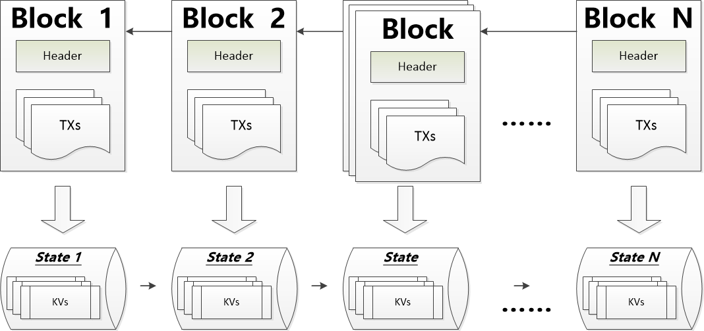

# BCBChain V2.0 Smart Contract Program Guide

**V2.0.4**

<div STYLE="page-break-after: always;"></div>
[TOC]
<script src="./github/ltview.js"></script>
<div STYLE="page-break-after: always;"></div>

# 1 **What is BCB**

BCBChain is a blockchain system based on Tendermint. It is a scalable platform with high stability, based on system security, technological innovation, fast and easy to use, and efficient data transmissions between object to object, and human to object.

For more details, please view 《BCBChain_V1.0_Program_Reference》.


<div STYLE="page-break-after: always;"></div>
# 2 **Smart Contract Overview**

Since V2.0, BCBChain supports independent development and deployment of smart contracts, developed using golang.


## 2.1 **Simple smart contract**

### 2.1.1 **Storage**

Let us first take a look at the simplest form of a smart contract

```
package mystorage

import (
	"blockchain/smcsdk/sdk"
)

//MyStorage a demo contract
//@:contract:mystorage
//@:version:1.0
//@:organization:orgBtjfCSPCAJ84uQWcpNr74NLMWYm5SXzer
//@:author:b37e7627431feb18123b81bcf1f41ffd37efdb90513d48ff2c7f8a0c27a9d06c
type MyStorage struct {
	sdk sdk.ISmartContract

	//@:public:store
	storedData uint64
}

//InitChain init when deployed on the blockchain first time
//@:constructor
func (ms *MyStorage) InitChain() {
}

//Set set a data to the stored data
//@:public:method:gas[100]
func (ms *MyStorage) Set(data uint64) {
	ms._setStoredData(data)
}

//Get get the stored data
//@:public:method:gas[100]
func (ms *MyStorage) Get() uint64 {
	return ms._storedData()
}
```

BBCBChain's smart contract is a combination of code (functions of the contract) and data (data types in the contract) and a set of tags (metadata of the contract), and is located at a specific address of the BCBChain.

Code line:

```package mystorage```

Declare the name of the smart contract code package, this can be set by the developer, so long it conforms to golang standards.

Code segment:

```
import (
	"blockchain/smcsdk/sdk"
)
```

Declaration of the library to import, it is a smart contract SDK released by BCBChain. When creating the smart contract, you will need to configure the sdk path in GOPATH.

Code segment:

```
//MyStorage a demo contract
//@:contract:mystorage
//@:version:1.0
//@:organization:orgBtjfCSPCAJ84uQWcpNr74NLMWYm5SXzer
//@:author:b37e7627431feb18123b81bcf1f41ffd37efdb90513d48ff2c7f8a0c27a9d06c
type MyStorage struct {
	sdk sdk.ISmartContract

	//@:public:store
	storedData uint64
}
```

Declare the metadata and status of the smart contract.

* Comment line *```//MyStorage a demo contract```* A comment defining the smart contract below.

* Markup```//@:contract:mystorage``` Declares the struct ```MyStorage``` that will be defined below represents a smart contract, and also declares the name of the smart contract as mystorage. This is the contract name to be sent to the BCBChain main chain during deployment. As an organization may develop multiple different smart contracts, the names of each smart contract will need to be unique, so the authors have to plan around this restriction.

* Markup   ```//@:version:1.0``` Declares the code version of the smart contract. 

* Markup  ```//@:organization:orgBtjfCSPCAJ84uQWcpNr74NLMWYm5SXzer```  Identifies the organization to which the smart contract belongs. The organization name in this example is: example.

* Markup ```//@:author:b37e7627431feb18123b81bcf1f41ffd37efdb90513d48ff2c7f8a0c27a9d06c``` 

   Author’s public key. The code line ```type MyStorage struct {```  declares the opening of the smart contract data structure, its members and its data type. The code line  ```	sdk sdk.ISmartContract```   indicates that the data structure is a BCBChain Smart Contract SDK and will automatically possess the smart contract access context provided by the SDK (variable names must be defined as sdk).

* Markup  ```    //@:public:store```  indicates that the next line of code will declare a data type.

* Code line  ```    storedData uint64```  Declares a state data variable of type```uint64``` with the name ```storedData```. You can view it as a member in the state database, and access or mutate its values by calling the database management functions, as well as access its KEY value (```    /orgBtjfCSPCAJ84uQWcpNr74NLMWYm5SXzer/mystorage/storedData```) externally.
   The helper tools provided by BCBChain will automatically encapsulate the state variables and generate access functions```_storeData() uint64```, ```_setStoreData(uint64)```、```_chkStoreData() bool```和```_delStoreData() bool```.

* Code line  ```}```  marks the end of this data structure’s declaration.


Code segment:

```
//InitChain init when deployed on the blockchain first time
//@:constructor
func (ms *MyStorage) InitChain() {
}
```

Declares the initialization code for the smart contract when it first joins the chain (executed only on the first time,another initialization code ```UpdateChain```will be executed when the contract is
upgraded, this does not need to be defined in this contract).

- Markup ```//@:constructor``` indicates that the function  ```InitChain()``` defined below is an initialization function that is to be used once, when a smart contract is first deployed to BCBChain in order to complete the initialization of the smart contract on the blockchain. A part of the initialization, for example, includes the initialization of certain values in the global state variables.
- Code line  ```func (ms *MyStorage) InitChain() {```  A function prototype that declares the initialization of a smart contract. The function name must be ```InitChain```, which has no input parameters.
- The code line  ```}```  completes the function.


Code segment:

```
//Set set a data to the stored data
//@:public:method:gas[100]
func (ms *MyStorage) Set(data uint64) {
	ms._setStoredData(data)
}
```

Declares the code for the smart contract

* Markup  ```//@:public:method:gas[100]```  declares that the function  ```Set()```  defined below is a public function of a smart contract, which can be called by BCBChain transaction broadcast, whereby the call information and result will be recorded in the blockchain. In doing so, the calling function will consume 100 gas.
* Code line  ```func (ms *MyStorage) Set(data uint64) {```  Declares a function for a smart contract. The line```    ms._setStoredData(data)``` is the implementation code for the function, which means that the input parameters are saved to the state variable ```storedData```.
* The code line   ```}```  completes the smart contract function.


Code segment:

```
//Get get the stored data
//@:public:method:gas[100]
func (ms *MyStorage) Get() uint64 {
	return ms._storedData()
}
```

Declares the code for the smart contract

* Markup  ```//@:public:method:gas[100]``` declares that the function   ```Get()```  defined below is a public function of a smart contract, which can be called by BCBChain transaction broadcast, whereby the call information and result will be recorded in the blockchain. In doing so, the calling function will consume 100 gas.
* Code line  ```func (ms *MyStorage) Get() uint64 {```  Declare a function prototype for a smart contract. The code line  ```    return ms._storedData()```   is the implementation code for the function, indicating that the value of the state variable ```storedData```will be read and returned to the caller.
* The code line  ```}```  completes the smart contract function.


There aren't many things that can be done with this contract: it allows anyone to store a single number in the contract, and that number can be accessed by anyone in the world, and there is no viable way to prevent you from publishing this number. Of course, anyone can call the Set() function again, passing in different values, overwriting your number, but this number will still be stored in the history of the blockchain. Later, we will see how to impose access restrictions to ensure that only you can change this number.


Note:

* All identifiers (contract name, function name, and variable name) of the smart contract code can only use the ASCII character set.
* Smart contract codes require storage in the form of ASCII or UTF-8 encoding.


<div STYLE="page-break-after: always;"></div>

### 2.1.2 **Token**

The following contract implements one of the simplest encryption tokens. Here, the token can indeed be produced out of nothing, but only the owner of the contract can do it, and anyone can transfer the currency to others without registering the username and password - all that is required is a BCBChain-compliant encrypted key pair.

```
package mycoin

import (
	"blockchain/smcsdk/sdk"
	"blockchain/smcsdk/sdk/bn"
	"blockchain/smcsdk/sdk/types"
)

//Mycoin a demo contract for digital coin
//@:contract:mycoin
//@:version:1.0
//@:organization:orgBtjfCSPCAJ84uQWcpNr74NLMWYm5SXzer
//@:author:b37e7627431feb18123b81bcf1f41ffd37efdb90513d48ff2c7f8a0c27a9d06c
type Mycoin struct {
	sdk sdk.ISmartContract

	//@:public:store:cache
	totalSupply bn.Number

	//@:public:store
	balanceOf map[types.Address]bn.Number
}

const oneToken int64 = 1000000000

//InitChain init when deployed on the blockchain first time
//@:constructor
func (mc *Mycoin) InitChain() {
  thisContract := mc.sdk.Helper().ContractHelper().ContractOfName("mycoin")
  totalSupply := bn.N1(1000000, oneToken)
  mc._setTotalSupply(totalSupply)
  mc._setBalanceOf(thisContract.Owner().Address(), totalSupply)
}

//@:public:receipt
type receipt interface {
	emitTransferMyCoin(token, from, to types.Address, value bn.Number)
}

//Transfer transfer coins from sender to another
//@:public:method:gas[500]
//@:public:interface:gas[450]
func (mc *Mycoin) Transfer(to types.Address, value bn.Number) {
	sdk.Require(value.IsPositive(),
		types.ErrInvalidParameter, "value must be positive")

	sender := mc.sdk.Message().Sender().Address()
	newBalanceOfSender := mc._balanceOf(sender).Sub(value)
	sdk.Require(newBalanceOfSender.IsGEI(0),
		types.ErrInsufficientBalance, "")

	receiver := to
	newBalanceOfReceiver := mc._balanceOf(receiver).Add(value)

	mc._setBalanceOf(sender, newBalanceOfSender)
	mc._setBalanceOf(receiver, newBalanceOfReceiver)

	mc.emitTransferMyCoin(
		mc.sdk.Message().Contract().Address(),
		sender,
		receiver,
		value)
}
```

This contract introduces some new concepts, which will be explained one-by-one in detail below

Code segment:

```
	//@:public:store:cache
	totalSupply bn.Number
```

Declare state data for smart contracts.

- Markup  ```    //@:public:store:cache``` means that the next line of code will declare a state data that will be cached in memory.
- Code line  ```    totalSupply bn.Number``` declares a state variable of type ```bn.Number```. The variable name is ```totalSupply ```. The```bn.Number``` type represents a signed large number. The addition, subtraction,
  multiplication, and division operations do not need to consider the overflow problem. The KEY value of this variable in the database is ```    /orgBtjfCSPCAJ84uQWcpNr74NLMWYm5SXzer/mycoin/totalSupply ```. The helper tool provided by BCBChain will automatically encapsulate the variable and generate access functions ```_totalSupply() bn.Number```,```_setTotalSupply(bn.Number)```, ```_chkTotalSupply() bool``` and```_delTotalSupply() ```, which will also be generated due to the influence of the tag ```cache```. A function to clear the memory cache ```_clrTotalSupply()```.


Code segment:

```
	//@:public:store
	balanceOf map[types.Address]bn.Number
```

A public state variable is also declared, but it is a more complex data type. This type maps the address to a large number and is used to store the balance corresponding to the account address that owns the token. The KEY value of this variable from the external access state database is ```    /orgBtjfCSPCAJ84uQWcpNr74NLMWYm5SXzer/mycoin/balanceOf/address```, where ```address``` is the actual account address to be queried. The helper tool provided by BCBChain will automatically encapsulate and generate access functions for this variable```_balanceOf(types.Address) bn.Number```,```_setBalanceOf(types.Address, bn.Number)```,```_chkBalanceOf(types.Address) bool```and ```_delBalanceOf(types.Address) ```.


Code segment:

```
//@:public:receipt
type receipt interface {
	emitTransferMyCoin(token, from, to types.Address, value bn.Number)
}
```

Declares the receipt of the smart contract transaction, which be stored in the BCBChain chain for later access.

* Markup  ```//@:public:receipt```  declares the next line of code as the receipt interface.
* Code line  ```type receipt interface {``` 
  declares the start of the receipt type, with the type name as ```receipt```.
* Code line ```    emitTransferMyCoin(token, from, to types.Address, value bn.Number)```declares a so-called receipt (receipt) that will be emitted on the last line of the Transfer function. The user
  interface (including the server application) can listen for the receipt being sent on the BCBChain chain at no cost. Once it is sent, the receipt ```listener``` will will be notified to facilitate tracking of the transaction.
* Code line ```}``` marks the end of the interface definition.


Code segment:

```
//Transfer transfer coins from sender to another
//@:public:method:gas[500]
//@:public:interface:gas[450]
func (mc *Mycoin) Transfer(to types.Address, value bn.Number) {
    .
    .
    .
}
```

Declares the code for the smart contract

* Markup  ```//@:public:interface:gas[450]```  declares that the function```Transfer()``` defined below is a public interface of a smart contract, which can be called between multiple smart contracts, and its use and results will be written into the BCBChain chain. The smart contracts from the same organization can call each other on the BCBChain. The public interface provided by BCBChain-based organization’s smart contracts can be called by any smart contract.


Code segment:

```
  sdk.RequireAddress(to)
  sdk.Require(value.IsPositive(),
		types.ErrInvalidParameter, "value must be positive")
```

Declares a part of the code logic in the contract. The function ```sdk.RequireAddress()```  is provided by the
SDK to validate if input parameter ``` to```is an account address. If not, it will terminate the contract excecution and return an error message in the response. The function```sdk.Require()``` is provided by the SDK to detect that a certain condition must be met (in this case, the input parameter ```value```must be greater than 0), otherwise, it will terminate the contract excecution and return an error message in the response.


Code segment:

```
  sender := mc.sdk.Message().Sender().Address()
  newBalanceOfSender := mc._balanceOf(sender).Sub(value)
  sdk.Require(newBalanceOfSender.IsGEI(0),
		types.ErrInsufficientBalance, "")
```

Declares a part of the code logic in the contract. The function ```mc.sdk.Message().Sender().Address()``` is
provided by the SDK to retrieve the account address of the sender ```mc._balanceOf(sender).Sub(value)``` is
used to obtain the balance of the tokens in the sender's account address after subtracting the transfer amount. The function ```_balanceOf()```is automatically generated by a support tool in BCBChain. The function ```sdk.Require()``` is provided by the SDK to detect that a certain condition must be met (in this
case, the balance of the sender is must be sufficient for the transfer), otherwise, it will terminate the contract excecution and return an error message in the response.


Code segment:

```
  receiver := to
  newBalanceOfReceiver := mc._balanceOf(receiver).Add(value)
```

Declares a part of the code logic in the contract. ```mc._balanceOf(receiver).Add(value)```  calculates the new account balance of the transfer recipient’s account address.


Code segment:

```
  mc._setBalanceOf(sender, newBalanceOfSender)
  mc._setBalanceOf(receiver, newBalanceOfReceiver)
```

Declares a part of the code logic in the contract. Used to write the calculated new account balance to the state database, the function```_setBalanceOf()```is automatically generated by the supporting tool provided by BCBChain


Code segment:

```
  mc.emitTransferMyCoin(
		mc.sdk.Message().Contract().Address(),
		sender,
		receiver,
		value)
```

Declares a part of the code logic in the contract. It is to be used for updating the receipt of the current transfer transaction into the blockchain. The function ```emitTransferMyCoin()``` is automatically generated by the support tool provided by BCBChain.


This contract provides two functions. The function ```InitChain()``` is automatically called once by the BCBChain chain after contract creation to initialize the contract. The function for actual use
by the user or other contract, and for completing the contract, is ```Transfer()```. This function can be used by
anyone to send tokens to others (provided, of course, that the sender owns these tokens). Remember, if you use a contract to send tokens to an address, you will not see any relevant information when you view the address on the BCBChain chain browser. This is because the detailed information of the transfer and changes in balances is only stored in the data store of this contract (requires special means to query from the state database). By using receipts, you can easily create a “blockchain browser” for your new token to track transactions and balances.


<div STYLE="page-break-after: always;"></div>

## 2.2 **Blockchain foundation**

Programmers should not find the concept of blockchain difficult to understand, because most of the complex algorithms and protocols (hash, elliptic curve cryptography, peer-to-peer networking (P2P), etc.) are only used to fulfill special-case functionality and promise. Smart contract development programmers only need to accept these existing features and functions, and not care about the implementation of the underlying technology.

### 2.2.1 **Transaction**

A blockchain is a globally shared transactional database, which means that everyone can join the network to read the records in the database. If you want to change something in the database, you must create a transaction that is accepted by everyone else (also known as a transaction in the blockchain world). The word “transaction” means that for whatever that you want to do (assuming you want to change two values at the same time), it either occurs all at once, or not at all. In addition, when your transaction is saved to the
database, it cannot be modified.

For example, imagine a table listing the balances of all accounts in an digital currency. If you send a request to transfer from one account to another, the transactional nature of the database ensures that if the amount is deducted from one account, it is always added to another account. If for some reason it is not possible to add an amount to the target account, the source account will not change.

In addition, the transaction is always signed by the sender (creator). This makes it very easy to add access protection mechanisms for specific modifications to the database. In the case of digital tokens, a simple check ensures that only the person holding the account key can transfer money from it.


<div STYLE="page-break-after: always;"></div>

### 2.2.2 **States**

BCBChain studied open source blockchain solutions such as Ethereum, Fabric, Tendermint, and Cosmos, and draws on some of their excellent ideas.

BCBChain is essentially a transaction-based state machine. In computer science, a state machine is a calculation model that contains a set of states, a start state, a set of input symbols (alphabet), and
a A conversion function that maps the input symbol from current state to the next state (transition function). 

In BCBChain, the state set is expressed by the state database. The initial state is called the genesis state. The input symbol set is the transaction (transaction, tx for short) in the blockchain field. The state transition function is the Smart contract.


According to the state machine of BCBChain, we start with the genesis state. This is almost similar to a blank slate, and there is no state of any transaction in the network. When the transaction is executed, the Genesis status will be transformed into the final state. At any time, this final state represents the current state of BCBChain.


<div STYLE="page-break-after: always;"></div>

### 2.2.3 **Blocks**

The state of BCBChain is composed of thousands of transactions. These transactions are "grouped" into blocks. A block contains a series of transactions, each block is linked to its previous block, and each block causes the state machine to reach a new state.



For the state transition to happen, the transaction must be valid (ie, to promote the non-repudiation characteristics of the blockchain technique). For a transaction to be considered valid, it must go through a verification process. Each transaction must be signed by the sender using its own private key, and the BCBChain's smart contract must be verified to meet certain conditions. Only then can the validation be
successful.


<div STYLE="page-break-after: always;"></div>

### 2.2.4 **Message Calls**

Smart contracts can communicate with each other via message calls.

Each transaction can contain multiple top-level message calls that are executed in sequence. The receipt generated from the previous message call can be used as input for the next top-level message call for some logical processing.

Each top-level message called, will in turn generate more message calls across multiple contracts.

The number of message call layers is limited to 8. In order to prevent infinite loops, each layer of message calls are prohibited from forming a loop.


<div STYLE="page-break-after: always;"></div>

### 2.2.3 **Receipt**

On top of transaction result, message calls can also return the log data of the transaction execution process. Here, we call it the receipt, which is stored on the block and very easy to retrieve.

<div STYLE="page-break-after: always;"></div>

# 3 **Examples of Smart Contract Implementation**

## 3.1 **Voting**

The following contract is quite complex and it implements a commissioned voting contract. Of course, the main problems with electronic voting is how to assign voting rights to the right people and how to prevent them from being manipulated. We will not resolve all the problems here, but at least we will show how to conduct a proxy vote that is automatic and completely transparent at the same time.

Our idea is to create a contract for each (vote) vote, with an abbreviation for each option. Then, as the creator of the contract - the chairman, each independent address will be given the right to vote.

Address owners can choose to vote on their own, or delegate to someone they trust to vote.

At the end of the voting period, ```WinningProposal()```will return the proposal that receives the most votes.

This contract implementation uses two files, as follows:

```myballot_types.go```

```
package myballot

import (
	"blockchain/smcsdk/sdk/types"
)

// Voter this declares a new complex type which will
//       be used for variables later.
//       it will represent a single voter.
type Voter struct {
	weight   uint          // weight is accumulated by delegation
	voted    bool          // if true, that person already voted
	delegate types.Address // person delegated to
	vote     uint          // index of the voted proposal
}

//Proposal this is a type for a single proposal.
type Proposal struct {
	name      string // short name (up to 32 bytes)
	voteCount uint   // number of accumulated votes
}
```

```myballot.go```

```
package myballot

import (
	"blockchain/smcsdk/sdk"
	"blockchain/smcsdk/sdk/forx"
	"blockchain/smcsdk/sdk/types"
)

//Ballot a demo smart contract for voting with delegation.
//@:contract:myballot
//@:version:1.0
//@:organization:orgBtjfCSPCAJ84uQWcpNr74NLMWYm5SXzer
//@:author:b37e7627431feb18123b81bcf1f41ffd37efdb90513d48ff2c7f8a0c27a9d06c
type Ballot struct {
	sdk sdk.ISmartContract

	//chairperson this declares a state variable that stores a chairperson's 
	//            address for the contract
	//@:public:store:cache
	chairperson string

	//voters this declares a state variable that stores a 'Voter' struct for
	//       each possible address
	//@:public:store
	voters map[types.Address]Voter

	//proposals a dynamically-sized array of 'Proposal' structs
	//@:public:store:cache
	proposals []Proposal
}

//InitChain init when deployed on the blockChain first time
//@:constructor
func (ballot *Ballot) InitChain() {
}

//Init create a new (voting) vote for each proposal in 'proposal Names'
//@:public:method:gas[500]
func (ballot *Ballot) Init(proposalNames []string) {
	sender := ballot.sdk.Message().Sender().Address()

	// Only cntract's owner can perform init
	sdk.RequireOwner()

	proposals := ballot._proposals()
	sdk.Require(len(proposals) <= 0,
		types.ErrUserDefined, "Already inited")

	chairperson := sender
	ballot._setChairperson(chairperson)

	voter := ballot._voters(chairperson)
	voter.weight = 1
	ballot._setVoters(chairperson, voter)

	// For each of the provided proposal names,
	// create a new 'Proposal' object and add it to the end of the array
	forx.Range(proposalNames, func(i int, pName string) {
		proposals = append(proposals,
			Proposal{
				name:      pName,
				voteCount: 0,
			})
	})
	ballot._setProposals(proposals)
}

//GiveRightToVote give `voter` the right to vote on this ballot.
//                may only be called by 'chairperson'.
//@:public:method:gas[500]
func (ballot *Ballot) GiveRightToVote(voterAddr types.Address) {
	sender := ballot.sdk.Message().Sender().Address()
	chairperson := ballot._chairperson()
	sdk.Require(sender == chairperson,
		types.ErrNoAuthorization, "Only chairperson can give right to vote.")

	voter := ballot._voters(voterAddr)
	sdk.Require(voter.voted == false,
		types.ErrUserDefined, "The voter already voted.")
	sdk.Require(voter.weight == 0,
		types.ErrUserDefined, "The voter's weight must be zero.")

	voter.weight = 1
	ballot._setVoters(voterAddr, voter)
}

//Delegate Delegate your vote to the voter 'to'
//@:public:method:gas[1500]
func (ballot *Ballot) Delegate(to types.Address) {
	sender := ballot.sdk.Message().Sender().Address()
	sendVoter := ballot._voters(sender)
	
	sdk.Require(sendVoter.voted == false,
		types.ErrUserDefined, "You already voted.")
	sdk.Require(to != sender,
		types.ErrUserDefined, "Self-delegation is disallowed.")

  // Forward the delegation as long as 'to' also delegated.
  // In general, such loops are very dangerous, because if they run too 
  // long, they might need more gas than is available in a block.
  // In this case, the delegation will not be executed, but in other 
  // situations, such loops might cause a contract to get "stuck" completely.
	toVoter := ballot._voters(to)
	forx.Range( func() bool {
	              return toVoter.delegate != ""
	            },
	            func(i int) {
							  to = toVoter.delegate
							  toVoter = ballot._voters(to)
					
							  // We found a loop in the delegation, not allowed.
							  sdk.Require(to != sender,
								  types.ErrUserDefined, "Found loop in delegation.")
						  })

	sendVoter.voted = true
	sendVoter.delegate = to
	delegate := toVoter
	if delegate.voted {
    // If the delegate already voted,
    // directly add to the number of votes
		proposals := ballot._proposals()
		proposals[int(delegate.vote)].voteCount += sendVoter.weight
		ballot._setProposals(proposals)
	} else {
    // If the delegate did not vote yet,
    // add to her weight.
		delegate.weight += sendVoter.weight
		ballot._setVoters(to, delegate)
	}
	return
}

//Vote give your vote (including votes delegated to you)
//     to proposal `proposals[proposal].name`.
//@:public:method:gas[500]
func (ballot *Ballot) Vote(proposal uint) {
	sender := ballot.sdk.Message().Sender().Address()
	sendVoter := ballot._voters(sender)
	
	sdk.Require(sendVoter.voted == false,
		types.ErrUserDefined, "You already voted.")

	proposals := ballot._proposals()
	sdk.Require(proposal < uint(len(proposals)),
		types.ErrUserDefined, "Proposal is out of index.")

	sendVoter.voted = true
	sendVoter.vote = proposal
	proposals[int(proposal)].voteCount += sendVoter.weight
	ballot._setProposals(proposals)
}

//WinningProposal computes the winning proposal taking all
//                previous votes into account.
//@:public:method:gas[500]
func (ballot *Ballot) WinningProposal() (winningProposal uint) {
	var winningVoteCount uint
	
	proposals := ballot._proposals()
	forx.Range(proposals, func(i int, proposal Proposal) {
		if proposal.voteCount > winningVoteCount {
			winningVoteCount = proposal.voteCount
			winningProposal = uint(i)
		}
	})
	return
}

//WinnerName calls winningProposal() function to get the index
//           of the winner contained in the proposals array and then
//           returns the name of the winner
//@:public:method:gas[500]
func (ballot *Ballot) WinnerName() (winnerName string) {
	proposals := ballot._proposals()
	if len(proposals) > 0 {
		winnerName = proposals[ballot.WinningProposal()].name
	}
	return
}
```


<div STYLE="page-break-after: always;"></div>

## 3.2 **Charity Donations**

The following contract implements a simple charitable donation function. The contract code are as follows:

```
package mydonation

import (
	"blockchain/smcsdk/sdk"
	"blockchain/smcsdk/sdk/bn"
	"blockchain/smcsdk/sdk/forx"
	"blockchain/smcsdk/sdk/std"
	"blockchain/smcsdk/sdk/types"
)

//Mydonation This is struct of contract
//@:contract:mydonation
//@:version:1.0
//@:organization:orgBtjfCSPCAJ84uQWcpNr74NLMWYm5SXzer
//@:author:b37e7627431feb18123b81bcf1f41ffd37efdb90513d48ff2c7f8a0c27a9d06c
type Mydonation struct {
	sdk sdk.ISmartContract

	//Total donations received by donees
	//@:public:store
	donations map[types.Address]bn.Number // key=address of donee
}

const (
	errDoneeCannotBeOwner = 55000 + iota
	errDoneeCannotBeSmc
	errDoneeAlreadyExist
	errDoneeNotExist
	errDonationExist
	errDonationNotEnough
)

//@:public:receipt
type receipt interface {
	emitAddDonee(donee types.Address)
	emitDelDonee(donee types.Address)
	emitDonate(from, donee types.Address, value, balance bn.Number)
	emitTransferDonation(donee types.Address, value, balance bn.Number)
}

//InitChain Constructor of this Mydonation
//@:constructor
func (d *Mydonation) InitChain() {
}

//AddDonee Add a new donee
//@:public:method:gas[500]
func (d *Mydonation) AddDonee(donee types.Address) {
	sdk.RequireOwner()
	sdk.RequireAddress(donee)
	sdk.Require(donee != d.sdk.Message().Sender().Address(),
		errDoneeCannotBeOwner, "Donee can not be owner")
	sdk.Require(donee != d.sdk.Message().Contract().Address(),
		errDoneeCannotBeSmc, "Donee can not be this smart contract")
	sdk.Require(donee != d.sdk.Message().Contract().Account().Address(),
		errDoneeCannotBeSmc, "Donee can not be account of this smart contract")
	sdk.Require(!d._chkDonations(donee),
		errDoneeAlreadyExist, "Donee already exists")

	d._setDonations(donee, bn.N(0))

	//emit receipt
	d.emitAddDonee(donee)
}

//Donate delete a donee
//@:public:method:gas[500]
func (d *Mydonation) DelDonee(donee types.Address) {
	sdk.RequireOwner()
	sdk.RequireAddress(donee)
	sdk.Require(d._chkDonations(donee),
		errDoneeNotExist, "Donee does not exist")
	sdk.Require(d._donations(donee).IsEqualI(0),
		errDonationExist, "Donation exists")

	d._delDonations(donee)

	//emit receipt
	d.emitDelDonee(donee)
}

//Donate Charitable donors donate money to smart contract
//@:public:method:gas[500]
func (d *Mydonation) Donate(donee types.Address) {
	sdk.RequireAddress(donee)
	sdk.Require(d._chkDonations(donee),
		errDoneeNotExist, "Donee does not exist")

	var valTome *std.Transfer
	token := d.sdk.Helper().GenesisHelper().Token()
	forx.Range(d.sdk.Message().GetTransferToMe(), func(i int, receipt *std.Transfer) {
		sdk.Require(receipt.Token == token.Address(),
			types.ErrInvalidParameter, "Accept donations in genesis token only")
		sdk.Require(valTome == nil,
			types.ErrInvalidParameter, "Accept only one donation at a time")
		valTome = receipt
	})
	sdk.Require(valTome != nil,
		types.ErrInvalidParameter, "Please transfer token to me first")

	balance := d._donations(donee).Add(valTome.Value)
	d._setDonations(donee, balance)

	//emit receipt
	d.emitDonate(
		d.sdk.Message().Sender().Address(),
		donee,
		valTome.Value,
		balance,
	)
}

//Withdraw To transfer donations to donee
//@:public:method:gas[500]
func (d *Mydonation) Transfer(donee types.Address, value bn.Number) {
	sdk.RequireOwner()
	sdk.RequireAddress(donee)
	sdk.Require(d._chkDonations(donee),
		errDoneeNotExist, "Donee does not exist")
	sdk.Require(value.IsGreaterThanI(0),
		types.ErrInvalidParameter, "Parameter \"value\" must be greater than 0")
	sdk.Require(d._donations(donee).IsGE(value),
		errDonationNotEnough, "Donation is not enough")

	token := d.sdk.Helper().GenesisHelper().Token()
	account := d.sdk.Message().Contract().Account()
	account.TransferByToken(token.Address(), donee, value)
	balance := d._donations(donee).Sub(value)
	d._setDonations(donee, balance)

	//emit receipt
	d.emitTransferDonation(
		donee,
		value,
		balance,
	)
}
```


<div STYLE="page-break-after: always;"></div>

# 4 **Deeper Understanding of Smart Contracts**

## 4.1 **Organization**

The smart contracts developed for the BCBChain backbone are organized according to the organization's architecture, and all smart contracts developed for the same organization will be integrated into a contract process for users to call.

In a smart contract, you can call the interface that is implemented by other smart contracts. Through the interface in the called smart contract, you can call another smart contract interface. BCBChain supports up to 8 levels of such nested cross-contract calls, but they are not allowed to form a loop.

BCBChain has set up a base organization, and the smart contracts developed for this base organization will be integrated into the contract process of all organizations for users to call. The organization is mainly set up to provide some cross-contract calls that can be executed by any organization at any time, such as the basic validators for the BCBChain main chain and the token template contract.


<div STYLE="page-break-after: always;"></div>

## 4.2 **BNF Paradigm**

This section describes the contract specifications using the BNF paradigm.

The English abbreviation for the Backus paradigm is BNF, a formal grammatical representation of the American name Backus and the Danish name Naur, used to describe a formal system of grammar. A
typical meta language. Also known as the Backus-Naur form. Not only does it strictly represent grammatical rules, but the described grammar is context-independent. It has the characteristics of simple syntax, clear
definition, and easy parsing and compilation.

The way the BNF paradigm represents grammar rules is:

- Nonterminals are enclosed in angle brackets.
- The left part of each rule is a non-terminal character, and the right part is a symbol string consisting of non-terminal symbols and terminators. The middle is usually separated by ::=.
- Rules with the same left part can share one left part, with the right parts separated by a vertical line "|".

The metacharacters commonly used in the BNF paradigm and their meanings are as follows:

```
1. Characters in double quotes (such as "word") represent the characters themselves.  
   Double_quote is used to represent double quotes themselves.
2. Words outside the double quotes (possibly underlined) represent the grammar part.
3. The angle brackets < > are mandatory.
4. The square brackets [ ] contain optional items.
5. The braces { } contain items that can be repeated from 0 to innumerable.
6. A set of all the items contained in parentheses ( ) is used to control the priority of
   the expression.
7. Vertical line | means that you can choose one of the left and right sides, which is
   equivalent to "OR".
8. ::= means "defined as".
9. Blank Characters The blank character spacing that appears in the BNF paradigm
   definition is only required for typesetting and is not part of the specification.
```


## 4.3 **Contract Markups**

The BCBChain smart contract code uses the notation to describe the contract's metadata in the contract code's comments.

Below is a detailed syntax description of the various tags used by the BCBChain Smart Contract.

### 4.3.1 contract

The markup ```contract``` is used to identify the contract name, which must be unique within the  organization. Please ask the developer of the smart contract to design the contract names accordingly.

The markup ```contract```is mandatory, but can only appear once in the entire contract code.

The BNF paradigm for ```contract``` markup is defined as follows:

```
<contract markup syntax> ::= "//@:contract:" <contract name>
<contract name> ::= <letter> | <contract name> <alphanumeric string>
<alphanumeric string> ::= <letter> | 
                          <decimal number> | 
                          <alphanumeric string> <letter> | 
                          <alphanumeric string> <decimal number>
<let> ::= "_" | "-" | "." | <lowercase> | <uppercase>
<lowercase letter> ::= "a" | "b" | "c" | "d" | "e" | "f" | "g" | "h" | "i" | "j" |
                       "k" | "l" | "m" | "n" | "o" | "p" | "q" | "r" | "s" | "t" |
                       "u" | "v" | "w" | "x" | "y" | "z"
<Capital letter> ::= "A" | "B" | "C" | "D" | "E" | "F" | "G" | "H" | "I" | "J" |
                     "K" | "L" | "M" | "N" | "O" | "P" | "Q" | "R" | "S" | "T" |
                     "U" | "V" | "W" | "X" | "Y" | "Z"
<decimal number> ::= "0" | "1" | "2" | "3" | "4" | "5" | "6" | "7" | 8 | "9"
```

The code after the ```contract```markup must be strictly followed by a contract class definition containing the ```sdk.ISmartContract``` member. This contract class follows the context of the smart contract. Each time there is a message call to a smart contract, an instance of the contract class will be automatically created, and its smart contract method will be called. The methods that it provide for the outside to call, must be a member function of its class. The first letter of the class name must be capitalized.

Example below：

```
//@:contract:mycoin
type Mycoin struct {
	sdk sdk.ISmartContract

	//@:public:store:cache
	totalSupply bn.Number

	//@:public:store
	balanceOf map[types.Address]bn.Number
}
```


### 4.3.2 version

The markup```version```is used to identify the version of the contract and can only appear once in the entire contract code.

```version```is mandatory, but can only appear once in the entire contract code.

The BNF paradigm for ```version```is defined as follows:

```
<version markup syntax> ::= "//@:version:" <contract version>
<Contract version> ::= <decimal number> |
          	<decimal number> "." <decimal number> |
          	<decimal number> "." <decimal number> "." <decimal number> |
          	<decimal number> "." <decimal number> "." <decimal number> "." <decimal number>
<decimal number> ::= <decimal number> | <decimal number> <decimal number>
<decimal number> ::= "0" | "1" | "2" | "3" | "4" | "5" | "6" | "7" | 8 | "9"
```

Example below:

```
//@:version:1.0
```

Note: The BCBChain chain does not require specific rules for smart contract versions, ie the contract version can be either a one-segment (eg 1, 2, 3) or a two-segment (1.0, 1.1, 1.2), three-segment (1.0. 1, 1.0.2, 1.0.3), four-segment (1.0.1.102, 1.0.1.103), but different versions of the same smart contract need to maintain the consistency of the number of version format segments.


### 4.3.3 organization

The markup```organization```is used to identify the ID of the organization to which the contract belongs.

```organization```is mandatory, but can only appear once in the entire contract code.

The BNF paradigm for ```organization```is defined as follows:

```
<organization markup syntax> ::= "//@:organization:" <organization ID>
<Organization ID> ::= <prefix code> <Base58 string>
<prefix code> ::= "org"
<Base58 string> ::= <Base58 character> | <Base58 string> <Base58 character>
<Base58 characters> ::= <decimal numbers> | <uppercase letters> | <lowercase letters>
<decimal number> ::= "1" | "2" | "3" | "4" | "5" | "6" | "7" | 8 | "9"
<Capital Letters> ::= "A" | "B" | "C" | "D" | "E" | "F" | "G" | "H" | "J" | "K" | 
                      "L" | "M" | "N" | "P" | "Q" | "R" | "S" | "T" | "U" | "V" | 
                      "W" | "X" | "Y" | "Z"
<lowercase letter> ::= "a" | "b" | "c" | "d" | "e" | "f" | "g" | "h" | "i" | "j" |
                       "k" | "m" | "n" | "o" | "p" | "q" | "r" | "s" | "t" | "u" |
                       "v" | "w" | "x" | "y" | "z"
```

An example is as follows:

```
//@:organization:orgBtjfCSPCAJ84uQWcpNr74NLMWYm5SXzer
```


### 4.3.4 author

The markup```author```is used to identify the account public key of the contract author.

```author```is a mandatory markup, but can only appear once in the entire contract code.

The BNF paradigm for```author```is defined as follows:

```
<author markup syntax> ::= "//@:author:" <account public key>
<account public key> ::= <hex string>
<hexadecimal string> ::= <hexadecimal number> | <hexadecimal string> <hexadecimal number>
<hexadecimal number> ::= "0" | 1" | "2" | "3" | "4" | "5" | "6" | "7" | 8 | "9" |
              	         "A" | "B" | "C" | "D" | "E" | "F" |
              	         "a" | "b" | "c" | "d" | "e" | "f"
```

Example below:

```
//@:author:b37e7627431feb18123b81bcf1f41ffd37efdb90513d48ff2c7f8a0c27a9d06c
```

Note: The hexadecimal public key string length
must be equal to 64.


### 4.3.5 constructor

The markup ```constructor```is used to identify the chain's *initialization* function.

The valid code that follows the ```constructor``` must be a no-argument function called ```InitChain```or ```UpdateChain``` , which will automatically make the only call when the first created (```InitChain```) or upgrade
(```UpdateChain```) of the contract on the BCBChain chain, in order to complete its initialization work in the block, such as initializing the initial values of some global state data.

```constructor```is optional, but can only appear up to two times in the entire contract code, once for the ```InitChain```function, and once for the ```UpdateChain```function.

The BNF paradigm for```constructor``` is defined as follows:

```
<author markup syntax> ::= "//@:constructor"
```

Example below:

```
//@:constructor
func (mc *Mycoin) InitChain() {
	...
}

//@:constructor
func (mc *Mycoin) UpdateChain() {
	...
}
```


### 4.3.6 public:store

The markup ```public:store``` is used to identify a state variable, which must be a valid member variable
of the contract class (one with the ```contract``` markup).

The valid code that follows```public:store``` must be the definition of a member variable.

```public:store```is an optional markup that can appear multiple times in the contract class definition, each time identifying a different state variable.

The BNF paradigm for ```public:store```is defined as follows:

```
<public:store markup syntax> ::= "//@:public:store"
```

Example below:

```
//@:contract:mycoin
type Mycoin struct {
	sdk sdk.ISmartContract
	...
	//@:public:store
	balanceOf map[types.Address]bn.Number
}
```

The state variable with the ```public:store``` markup cannot be directly accessed in the contract code. According to the BCBChain contract specification, the SDK matching tool provided by BCBChain automatically generates a read/write function for the state variable. Example below:

```
//Read the function of balanceOf
func (mc *Mycoin) _balanceOf(k types.Address) bn.Number {
	return *mc.sdk.Helper().StateHelper().GetEx(
	    fmt.Sprintf("/balanceOf/%v", k), &bn.Number{V: big.NewInt(0)}).(*bn.Number)
}

//A function that detects whether balanceOf exists
func (mc *Mycoin) _chkBalanceOf(k types.Address) bool {
	return mc.sdk.Helper().StateHelper().Check(fmt.Sprintf("/balanceOf/%v", k))
}

//Configures the function of balanceOf
func (mc *Mycoin) _setBalanceOf(k types.Address, v bn.Number) {
	mc.sdk.Helper().StateHelper().Set(fmt.Sprintf("/balanceOf/%v", k), &v)
}

//Function to remove the key value of balanceOf from the state database
func (mc *Mycoin) _delBalanceOf(k types.Address) {
	mc.sdk.Helper().StateHelper().Delete(fmt.Sprintf("/balanceOf/%v", k))
} 
```


### 4.3.7 public:store:cache

The markup ```public:store:cache```is used to identify a state variable that can be cached in memory, which must be a valid member variable of the contract class (one with the ```contract``` markup).

The valid code that follows```public:store:cache``` must be the definition of a member variable.

```public:store:cache``` is an optional markup that can appear multiple times in the contract class definition, each time identifying a state variable.

The BNF paradigm for ```public:store:cache```is defined as follows:

```
<public:store:cache markup syntax> ::= "//@:public:store:cache"
```

Example below:

```
//@:contract:mycoin
type Mycoin struct {
	sdk sdk.ISmartContract
	...
	//@:public:store:cache
	totalSupply bn.Number
}
```

The cacheable state variable cannot be directly accessed in the contract code. According to the BCBChain contract specification, the SDK matching tool provided by BCBChain automatically generates a read/write function for the state variable. Example below:

```
//Read the function of the state variable totalSupply
func (mc *Mycoin) _totalSupply() bn.Number {
	return *mc.sdk.Helper().StateHelper().McGetEx(
	    "/totalSupply", &bn.Number{V: big.NewInt(0)}).(*bn.Number)
}

//A function that detects whether totalSupply exists
func (mc *Mycoin) _chkTotalSupply() bool {
	return mc.sdk.Helper().StateHelper().McCheck("/totalSupply")
}

//Sets the function of totalSupply
func (mc *Mycoin) _setTotalSupply(v bn.Number) {
	mc.sdk.Helper().StateHelper().McSet("/totalSupply", &v)
}

//Clears the function of totalSupply
func (mc *Mycoin) _clrTotalSupply() {
	mc.sdk.Helper().StateHelper().McClear("/totalSupply")
}

//Remove totalSupply from the state database
func (m *Mycoin) _delTotalSupply() {
	m.sdk.Helper().StateHelper().McDelete("/totalSupply")
} 
```


### 4.3.8 public:receipt

The markup```public:receipt```
is used to identify the definition of all receipts in the contract.

The valid code following ```public:receipt``` must be an interface definition called ```receipt```.

```public:receipt```is optional and can only appear at most once in the entire contract
code.

The BNF paradigm for ```public:receipt```is defined as follows:

```
<public:receipt markup syntax> ::= "//@:public:receipt"
```

Example below:

```
//@:public:receipt
type receipt interface {
	emitTransferMyCoin(token, from, to types.Address, value bn.Number)
}
```

Every method that sends a ```receipt```must start with the word “```emit```”, as defined in the *Receipt* interface. The first word after the word “```emit```” is converted to lowercase and must be the name of the receipt struct, which can be used to retrieve from the BCBChain chain. Based on BCBChain contract specification, the SDK supporting tool provided by BCBChain will automatically generate the implementation code for the sending receipt function. Example below:

```
//The following functions are automatically generated by the BCBChain tool.
func (mc *Mycoin) emitTransferMyCoin(token, from, to types.Address, value bn.Number) {
	type transferMyCoin struct {
		Token types.Address `json:"token"`
		From types.Address `json:"from"`
		To types.Address `json:"to"`
		Value bn.Number `json:"value"`
	}
	mc.sdk.Helper().ReceiptHelper().Emit(
	    transferMycoin{
		    Token:   token,
		    From:    from,
		    To:      to,
		    Value:   value,
	    })
}

//The following is a sample code for sending a receipt, located in the implementation of the Transfer function.
func (mc *Mycoin) Transfer(to types.Address, value bn.Number) {

	//Business logic code that implements the transfer
	...

	//Send a transfer receipt
	mc.emitTransferMyCoin(
		mc.sdk.Message().Contract().Address(),
		sender,
		to,
		value)
}
```


### 4.3.9 public:method

The markup```public:method``` is used to identify a public method of the contract.

The valid code following ```public:method``` must be a member function definition of the contract class (one with the ```contract```markup) The function name must start with an uppercase letter, and it can be executed
from BCBChain transaction broadcasts.

```public:method```is optional and can appear zero, one or more times throughout the contract code.

The BNF paradigm for ```public:method``` is defined as follows:

```
<public:method markup syntax> ::= "//@:public:method:gas[" <gas quantity> "]"
<number of gas> ::= ["-"] <decimal number>
<decimal number> ::= <decimal number> | <decimal number> <decimal number>
<decimal number> ::= "0" | "1" | "2" | "3" | "4" | "5" | "6" | "7" | 8 | "9"
```

Note:

* A positive integer number indicates that the gas cost consumed by the method call is paid by the original sender of the transaction;
* A gas quantity of 0 means no payment is required;
* A negative integer number indicates that the gas cost consumed by the method call is paid by the current smart contract account.

Example below

```
//@:public:method:gas[500]
func (mc *Mycoin) Transfer(to types.Address, value bn.Number) {
	...
}
```


### 4.3.10 public:interface

The markup```public:interface``` is used to identify the public interface of the contract.

The valid code following ```public:interface``` must be a member function definition for the contract class (one with the ```contract``` markup). The function name must start with an uppercase letter, and can be
cross-called from other contracts.

```public:interface``` is optional and can appear zero, one or more times throughout the contract code.

The BNF paradigm for```public:interface``` is defined as follows:

```
<public:interface markup syntax> ::= "//@:public:interface:gas[" <gas quantity> "]"
<number of gas> ::= <decimal number>
<decimal number> ::= <decimal number> | <decimal number> <decimal number>
<decimal number> ::= "0" | "1" | "2" | "3" | "4" | "5" | "6" | "7" | 8 | "9"
```

Example below:

```
//@:public:interface:gas[450]
func (mc *Mycoin) Transfer(to types.Address, value bn.Number) {
	...
}
```

Note:

- The amount of gas must be greater than or equal to zero.

Markups ```public:interface```and ```public:method```can be used simultaneously on same member function of the contract class. The example above can be written as belows:

```
//@:public:method:gas[500]
//@:public:interface:gas[450]
func (mc *Mycoin) Transfer(to types.Address, value bn.Number) {
	...
}
```


### 4.3.11 public:mine

The markup ```public:mine``` is used to identify the mining interface exposed by the contract.

The valid code following ```public:mine```must be a member function definition for the contract
class (one with the ```contract``` markup).
The mining function prototype must be:```func Mine() int64```, and it will automatically execute after BCBChain block reaches a consensus.

```public:mine``` is optional and can appear zero or one time throughout the contract code. Only the smart contract of the underlying organization of BCBChain is allowed to use this mining interface.

The BNF paradigm for ```public:mine``` is defined as follows:

```
<public:interface tag syntax> ::= "//@:public:mine"
```

Example below:

```
//@:public:mine
func (mc *Mycoin) Mine() int64 {
	...
}
```

Note:

- The mining function  ```Mine()``` can only be used with the markup```public:mine```.


### 4.3.12 import

The markup ```import``` is used to import an interface prototype for an external contract, making it easy to call external contracts from the current contract.

```import```is optional, and can appear multiple times in the entire contract code. Each time you import a cross-contract call interface of an external contract, the external contract can only be imported once.

The BNF paradigm for ```import``` is defined as follows:

```
<import tag syntax> ::= "//@:import:" <contract name>
<contract name> ::= <letter> | <contract name> <alphanumeric string>
<alphanumeric string> ::= <letter> | <decimal number> | <alphanumeric string> <letter> | <alphanumeric string> <decimal number>
<let> ::= "_" | "-" | "." | <lowercase> | <uppercase>
<lowercase letter> ::= "a" | "b" | "c" | "d" | "e" | "f" | "g" | "h" | "i" | "j" |
                       "k" | "l" | "m" | "n" | "o" | "p" | "q" | "r" | "s" | "t" |
                       "u" | "v" | "w" | "x" | "y" | "z"
<Capital letter> ::= "A" | "B" | "C" | "D" | "E" | "F" | "G" | "H" | "I" | "J" | 
                     "K" | "L" | "M" | "N" | "O" | "P" | "Q" | "R" | "S" | "T" |
                     "U" | "V" | "W" | "X" | "Y" | "Z"
<decimal number> ::= "0" | "1" | "2" | "3" | "4" | "5" | "6" | "7" | 8 | "9"
```

Using the previous ```mycoin```token contract as an example, if you need to call the contract from other contracts, you need to write the following code:

```
//This code is in the contract mycontract

//@:import:mycoin
type mycoin interface {
	Transfer(to types.Address, value bn.Number)
}
```

The interface name of the external contract is customizable, so long it follows the golang syntax specification.

The interface of the external contract cannot be directly accessed from the contract. According to the BCBChain contract specification, the SDK supporting tool provided by BCBChain will automatically
generate an implementation function to access the external contract interface. The generated code example is as follows:

```
// This code is automatically generated by the SDK supporting tools

//mycoin This is method of MyContract 
func (m *MyContract) mycoin() *InterfacemycoinStub {
	return &InterfacemycoinStub{}
}

//Transfer This is a method of InterfacemycoinStub
func (is *InterfacemycoinStub) Transfer(to types.Address, value bn.Number) {
	return
}

//run Transfer some receipts to destination contract
func (is *InterfacemycoinStub) run(f func()) (*InterfacemycoinStub) {
	...
	f()
	...
	return is
}

//contract Wrap the destination contract information
func (is *InterfacemycoinStub) contract() IContract {
	...
	return contract
}
```

Below is a sample code that calls an external contract in the contract code:

```
//This code is in the contract mycontract

func (m *MyContract)TransferTest(to types.Address, value bn.Number) {
	m.mycoin().Transfer(to, value)
}
```

cross-contract calling support transmit receipts to conntract that it's called, example code in below(from contract2 to call contract1's interface):

> contract1, supply cross-contract interface service:
>
> ```
> //@:contract:contract1
> type C1 struct {
> sdk sdk.ISmartContract
> ...
> }
> 
> //@:public:interface:gas[450]
> func (c *C1) Register() {
> 
> //I need receipt from caller
> transfers := dw.sdk.Message().GetTransferToMe()
> sdk.Require(transfers!=nil && len(transfers)==1,
>  types.ErrInvalidParameter, "Please transfer to me first")
> 
> token := transfers[0].Token
> value := transfers[0].Value
> 
> ...
> }
> ```
>
> contract2, cross-contract invoker:
>
> ```
> //@:contract:contract2
> type C2 struct {
> sdk sdk.ISmartContract
> ...
> }
> 
> //@:import:contract1
> type mycoin interface {
> 	Register()
> }
> 
> //@:public:method:gas[450]
> func (c *C2) Register() {
> ...
> c.contract1().run(func(){
>  c.sdk.Message().Contract().Account.TransferByName(
>    "bcb",
>    c.contract1().contract().Account().Address(),
>    bn.N(1000000000),
>  )
> }).Register()
> ...
> }
> ```


## 4.4 **Contract Specification**

### 4.4.1 **BNF Paradigm Definition**

Combining the above description of the contract mark, the following defines the BNF paradigm of the contract specification:

```
<BCBChain Smart Contract> ::= <Contract Definition Code File> {<Contract Implementation Code File>} {<Contract Test Code File>}

<Contract Definition Code File> ::= <Code Package Definition> <Contract Definition Code>
<contract implementation code file> ::= <code package definition> <contract implementation code>
<Contract Test Code File> ::= <Code Package Definition> <Contract Test Code>
<code package definition> ::= "package" <contract package name>
<contract package name> ::= follows the glang syntax specification
<contract definition code> ::= "import ("
                 	<Contract SDK root path>
                 	{[package alias] <contract support code package path>}
             	")"
 <contract class definition>
             	[<Contracting chain initialization function definition>]
             	[<mining definition>]
             	[<Contract Receipt Definition>]
             	{<Cross-contract call interface definition>}
             	{<Contract public function definition>}
             	{<contract implementation code>}
<contract SDK root path> ::= double_quote "blockchain/smcsdk/sdk" double_quote
<Contract Support Code Package Path> ::= Follow the golang code package path specification, follow the whitelist and graylist specifications of the BCBChain contract specification
<package alias> ::= Code package alias that follows the golang code specification, cannot use '.'
<contract implementation code> ::= Contract implementation code that follows the golang code specification (code that does not require BCBChain contract tags), including type definitions,
             	Constant definition, function definition (Note: can not contain global variable definition, do not allow the use of the for keyword, does not allow recursion
             	transfer)
<contract test code> ::= Test code that follows the golang unit test specification

<contract class definition> ::= "//@:contract:" <contract name>
           	"//@:version:" <contract version>
           	"//@:organization:" <organization ID>
           	"//@:author:" <account public key>
           	"type" <contract class name> " struct {"
           	" sdk sdk.ISmartContract"
               	{<state variable definition>}
   {<golang variable definition>}
           	"}"
<contract name> ::= See <contract mark: contract>
<contract version> ::= See <contract mark: version>
<Organization ID> ::= See <Contract Mark: organization>
<account public key> ::= See <contract mark: author>
<contract class name> ::= <identifier at the beginning of uppercase letter>
<golang variable definition> ::= Standard variable definition code that follows the golang code specification
<state variable definition> ::= <basic state variable definition> | <state variable definition with cache>
<Basic state variable definition> ::= "//@:public:store"
                    	<variable name> ["*"] <variable type>
<state variable definition with cache> ::= "//@:public:store:cache"
                       	<variable name> ["*"] <variable type>
<variable name> ::= <identifier>
<variable type> ::= <metadata type> | <array type> | <map table type>

<Contracting chain initialization function definition> ::= <deployment function> | <upgrade function>
<deployment function> ::= "//@:constructor"
          	"func (" <contract object definition> ") InitChain() {"
            	<winding code>
          	"}"
<upgrade function> ::= "//@:constructor"
          	"func (" <contract object definition> ") UpdateChain() {"
            	<winding code>
          	"}"
< Mining definition> ::= "//@:public:mine"
          	"func (" <contract object definition> ") Mine() {"
            	<mining code>
          	"}"
<contract object definition> ::= <variable name> "*" <contract class name>
<winding code> ::= <golang function body>
          	Note 1: Only access to state variables is allowed
          	Note 2: Access to Message() and Tx() is not allowed in sdk
<mining code> ::= <golang function body>
          	Note 1: Access to Message() and Tx() is not allowed in sdk
<golang function body> ::= Following the implementation of the body of the golang code specification, see the definition of <contract implementation code>

<Contract Receipt Definition> ::= "//@:public:receipt"
             	"type receipt interface {"
                 	<receipt function name> <function entry parameter definition>
             	"}"
<receipt function name> ::= "emit" <identifier at the beginning of uppercase letters>
<function entry parameter definition> ::= "(" <parameter table> ")"
<Parameter Table> ::= <Parameter Definition> | <Parameter Table> "," <Parameter Definition>
<parameter definition> ::= <variable name> ["*"] <variable type>

<Cross-contract call interface definition> ::= "//@:import:" <contract name>
                  	"type "<interface class name>" interface {"
                         	<interface function name> <function entry parameter definition> <function return definition>
                  	"}"
<interface class name> ::= <identifier at the beginning of uppercase letters>
<interface function name> ::= <identifier at the beginning of uppercase letter>
<function return definition> ::= <empty> | ["*"] <variable type> | "(" <return table> ")"
<empty> ::= blank
<back to table> ::= <return definition> | <return table> "," <return definition>
<return definition> ::= [<variable name>] ["*"] <variable type>

<Contract public function definition> ::=[<contract public method tag>]
               	[<Contract Public Interface Tag>]
            	"func (" <contract object definition> ")" <public function name> <function entry parameter definition> <function return definition> "{"
                 	<golang function body>
            	"}"
<Contract public method tag> ::= "//@:public:method:gas[ "<gas quantity> "]"
<Contract public interface tag> ::= "//@:public:interface:gas[ "<gas quantity> "]"
<number of gas> ::= See <contract mark: public:method>
<public function name> ::= <identifier at the beginning of uppercase letter>

<identifier> ::= <letter> | <identifier> <alphanumeric string>
<identifier at the beginning of uppercase letters> ::= <capital letter> | <identifier at the beginning of uppercase letter> <alphanumeric string>
<alphanumeric string> ::= <letter> | <decimal number> | <alphanumeric string> <letter> | <alphanumeric string> <decimal number>
<letter> ::= "_" | <lowercase> | <uppercase letter>
<lowercase letter> ::= "a" | "b" | "c" | "d" | "e" | "f" | "g" | "h" | "i" | "j" | "k" | "l" |
          	"m" | "n" | "o" | "p" | "q" | "r" | "s" | "t" | "u" | "v" | "w" | "x" |
          	"y" | "z"
<Capital letter> ::= "A" | "B" | "C" | "D" | "E" | "F" | "G" | "H" | "I" | "J" | "K" | "L" |
          	"M" | "N" | "O" | "P" | "Q" | "R" | "S" | "T" | "U" | "V" | "W" | "X" |
          	"Y" | "Z"
<decimal number> ::= "0" | "1" | "2" | "3" | "4" | "5" | "6" | "7" | 8 | "9"
<decimal number> ::= <decimal number> | <decimal number> <decimal number>

<metadata type> := <golang built-in type> | <SDK built-in type> | <custom data structure>
<golang built-in type> ::= "int" | "int8" | "int16" | "int32" | "int64" |
                	"uint" | "uint8" | "uint16" | "uint32" | "uint64" |
                	"bool" | "string" | "byte"
<SDK built-in type> ::= <Address> | <HexBytes> | <Hash> | <PubKey> | <Number>
<Address> ::= "types.Address"
<HexBytes> ::= "types.HexBytes"
<Hash> ::= "types.Hash"
<PubKey> ::= "types.PubKey"
<Number> ::= "bn.Number"
<custom data structure> ::= "type" <identifier> " struct {"
                  	{<variable name> ["*"] <variable type>}
              	"}"
<array type> ::= <array dimension definition> [<array dimension definition>] <metadata type>
<array dimension definition> ::= "[" [<decimal number>] "]"
<map table type> ::= <map table type 1> | <map table type 2>
<map table type 1> ::= <map table definition> [<map table definition>] <metadata type>
<map table type 2> ::= <map table definition> [<map table definition>] <array type>
<map table definition> ::= "map[" <metadata type> "]"

```


### 4.4.2 **Package Specification**

The BNF paradigm for defining the contract package structure is as follows:

```
<Smart Contract Package Structure> ::= <Contract Definition Code File> {<Contract Implementation Code File>} {<Contract Test Code File>}
<Contract Definition Code File> ::= <Contract Code Directory> "/" <golang Implementation Code File Name>
<contract implementation code file> ::= <contract code directory> "/" <golang implementation code file name>
<Contract Test Code File> ::= <Contract Code Directory> "/" <golang test code file name>
<contract code directory> ::= <GOPATH> "/" <contract root directory> "/" <contract name> "/v" <contract version> "/" <contract name>
<GOPATH> ::= golang standard environment variable GOPATH points to the directory
<contract root directory> ::= "src/contract/" <organization ID> "/code"
<Organization ID> ::= See <Contract Mark: organization>
<golang implementation code file name> ::= <legal file name> ".go"
<golang test code file name> ::= <legal file name> "_test.go"
<arbitrary file name> ::= <legal file name>|<illegal file name>
<Illegal file name> ::= [<legal file name>] "autogen" [<legal file name>] | <arbitrary file name> "_test"
<legal file name> ::= Exclude <illegal file name> after all operating systems recognize the string as the file name
```

Note: The white space interval that appears in the specification definition is only required for typesetting and is not part of the specification.


### 4.4.3 **Whitelist**

For security reasons, the BCBChain Smart Contract is limited to allow only packages that follow explicit import behavior and do not produce inconsistent results for different nodes. Such packages are included in the whitelist.

The code packages supported in the whitelist are safe to use in smart contracts.

The specific contents of the whitelist and graylist will be different with the upgrade of the smart contract SDK and the matching BCBChain plugin version. For details, please refer to the related documents of the smart contract SDK and the matching BCBChain plugin.

Below is the first version of the whitelist:

```
//The following are available golang ID packages
bytes
container/heap
container/list
container/ring
crypto
crypto/aes
crypto/cipher
crypto/des
crypto/hmac
crypto/md5
crypto/rc4
crypto/sha1
crypto/sha256
crypto/sha512
encoding
encoding/ascii85
encoding/asn1
encoding/base32
encoding/base64
encoding/binary
encoding/csv
encoding/gob
encoding/hex
encoding/json
encoding/pem
encoding/xml
errors
fmt
hash
hash/adler32
hash/crc32
hash/crc64
hash/fnv
index/suffixarray
math
math/big
math/bits
math/cmplx
reflect
regexp
regexp/syntax
sort
strconv
strings
unicode
unicode/utf16
unicode/utf8

//Below is standard package for the SDK
blockchain/smcsdk/sdk
```


<div STYLE="page-break-after: always;"></div>

## 4.5 **BRC20Token**

The smart contract “Token” issued in Section 2.1.2 of this guide is a sample token contract, not a BRC20 token that complies with the BCBChain standard.

Users of BCBChain can write their own smart contracts to issue tokens that comply with the BRC20 token specification. This section defines smart contracts that comply with the BRC20 token specification.

The specification is described as follows:

* The contract must explicitly call the interface provided by the Smart Contract SDK ```ITokenHelper::RegisterToken(...)``` to register a new token with BCBChain (each smart contract can only register one token);

* The contract registration token will automatically record a standard token generation receipt on BCBChain. The receipt is defined as follows:

* ```
  import (
      "blockchain/smcsdk/sdk/bn"
      "blockchain/smcsdk/sdk/types"
  )
  
  // Name of receipt: std::newToken
  type NewToken struct {
      TokenAddress     types.Address `json:"tokenAddr"`     // Token Address
      ContractAddress  types.Address `json:"contractAddr"`  // Coin Contract Address
      Owner            types.Address `json:"owner"`         // Token Owner’s external
                                                            // account address
      Name             string      `json:"name"`            // Token Name
      Symbol           string      `json:"symbol"`          // Token Symbol
      TotalSupply      bn.Number   `json:"totalSupply"`     // Total Token Supply
                                                            // (Unit: Cong)
      AddSupplyEnabled bool        `json:"addSupplyEnabled"`// Whether additional 
                                                            // issuance is supported
      BurnEnabled      bool        `json:"burnEnabled"`     // Whether burn is enabled
    GasPrice         int64       `json:"gasPrice"`        // Gas Price (Unit: Cong)
  }
  ```
  
* The contract must implement the methods and interfaces defined in this section


<div STYLE="page-break-after: always;"></div>
### 4.5.1 Transfer

**Method Prototype**

```
import (
    "blockchain/smcsdk/sdk/bn"
    "blockchain/smcsdk/sdk/types"
)

//@:public:method:gas[500]
//@:public:interface:gas[450]
Transfer(types.Address,bn.Number)
```

**Function Description**

- Execute the token transfer

**Implementation note**

- Must be implemented
- Must be marked with markup ```public:method```；
- Must be marked with markup ```public:interface```

**Usage**

- Allows calls from transaction broadcasts;
- Allows cross-contract calls with other smart contracts of the organization;
- Allows other smart contracts with the organization to be called directly via the interface provided by the SDK,```IAccount::Transfer``` (the underlying SDK automatically performs cross-contract
  calls).

**Input Parameters**

- _to		  types.Address 	Token recipient address (can be external account address, contract account address, contract address)


  _value	bn.Number			Token transfer amount (Unit: Cong)

  Note: If the recipient address is a contract address, the received token will be automatically transferred to the account address of the contract.

**Receipt Output**

- The BRC20 Token Transfer() method automatically records a standard token transfer receipt on BCBChain. The receipt is defined as follows：

  ```
  import (
      "blockchain/smcsdk/sdk/bn"
      "blockchain/smcsdk/sdk/types"
  )
  
  // Name of receipt: std::transfer
  type Transfer struct {
      Token      smc.Address  `json:"token"` //Token address
      From       smc.Address  `json:"from"`  //From address
      To         smc.Address  `json:"to"`    //Token recipient address
      Value      bn.Number    `json:"value"` //The amount of token transferred(unit: 
                                             //cong)
  }
  ```

<div STYLE="page-break-after: always;"></div>
### 4.5.2 AddSupply

**Method Prototype**

```
import (
    "blockchain/smcsdk/sdk/bn"
)

//@:public:method:gas[2400]
AddSupply(bn.Number)
```

**Function Description**

- Increase supply of tokens

**Implementation Note**

- Optional
- If implemented, requires markup ```public:method```.

**Usage**

- Only token owners can make calls through transaction broadcasts

**Input Parameters**

- _value	bn.Number	Newly added supply (Unit: Cong).


**Receipt Output**

- The BRC20 Token *AddSupply()* method automatically records a standard token extension receipt on BCBChain. The receipt is defined as follows:

  ```
  import (
      "blockchain/smcsdk/sdk/bn"
      "blockchain/smcsdk/sdk/types"
  )
  
  // Name of receipt: std::addSupply
  type AddSupply struct {
      Token       types.Address `json:"token"`       //Token address
      Value       bn.Number     `json:"value"`       //Additional supply (Unit: Cong)
      TotalSupply bn.Number     `json:"totalSupply"` // New total supply (Unit: Cong)
  }
  ```

- The BRC20 Token AddSupply() method also automatically records a standard ```std::transfer```receipt on BCBChain


<div STYLE="page-break-after: always;"></div>
### 4.5.3 Burn

**Method Prototype**

```
import (
    "blockchain/smcsdk/sdk/bn"
)

//@:public:method:gas[2400]
Burn(bn.Number)
```

**Function Description**

- Burns the amount supplied

**Implementation Note**

- Optional
- If implemented, requires markup```public:method```.

**Usage**

- Only token owners can make calls through transaction broadcasts

**Input Parameters**

- _value	bn.Number	Burn the amount supplied (Unit: Cong)


**Receipt Output**

- The BRC20 Token () method automatically records a standard token burning receipt on BCBChain. The receipt is defined as follows:

  ```
  import (
      "blockchain/smcsdk/sdk/bn"
      "blockchain/smcsdk/sdk/types"
  )
  
  // Name of receipt: std::burn
  type Burn struct {
      Token       types.Address `json:"token"`       //Token address
      Value       bn.Number     `json:"value"`       //Amount to be burnt (Unit: Cong)
      TotalSupply bn.Number     `json:"totalSupply"` //New total amount (Unit: Cong)
  }
  ```

- The BRC20 Token Burn() method also automatically records a standard
  ```std::transfer``` receipt on BCBChain.


<div STYLE="page-break-after: always;"></div>
### 4.5.4 SetGasPrice

**Method Prototype**

```
//@:public:method:gas[2400]
SetGasPrice(int64)
```

**Function Description**

- Sets the price for Gas

**Implementation Note**

- Optional
- If implemented, requires markup ```public:method```.

**Usage**

- Only token owners can make calls through transaction broadcasts

**Input Parameters**

- _value	int64		New gas price (Unit: Cong)


**Receipt Output**

- The BRC20 Token SetGasPrice() method automatically records a standard set gas price receipt on BCBChain. The receipt is defined as follows:

  ```
  import (
      "blockchain/smcsdk/sdk/types"
  )
  
  // Name of receipt: std::setGasPrice
  type SetGasPrice struct {
      Token    types.Address `json:"token"`    //Token address
      GasPrice int64         `json:"gasPrice"` //Gas Price (Unit: Cong)
  }
  ```

<div STYLE="page-break-after: always;"></div>
### 4.5.6 SetOwner

**Method Prototype**

```
import (
    "blockchain/smcsdk/sdk/types"
)

//@:public:method:gas[2400]
SetOwner(types.Address)
```

**Function Description**

- Transfer ownership of smart contracts and tokens.

**Implementation Note**

- Optional
- If implemented, requires markup ```public:method```.

**Usage**

- Only token owners can make calls through transaction broadcasts

**Input Parameters**

- _newOwner	types.Address	Address of the new owner of the contract


**Receipt Output**

- The BRC20 Token SetOwner() method automatically records a standard transfer ownership receipt on BCBChain. The receipt is defined as follows:

  ```
  import (
      "blockchain/smcsdk/sdk/types"
  )
  
  // Name of receipt: std::setOwner
  type SetOwner struct {
      ContractAddr types.Address `json:"contractAddr"` //Address of the smart contract
      NewOwner     types.Address `json:"newOwner"`     //The external account address
                                                       //of the new owner
  }
  ```

- The BRC20 Token SetOwner() method also automatically records a standard
  ```std::transfer``` receipt on BCBChain.

<div STYLE="page-break-after: always;"></div>

# 5 **Developing Smart Contracts**

Detailed instructions for preparing the development environment, developing, testing, and deploying smart contracts can be found in the document BCBChain_V2.0_Quick_Start.
